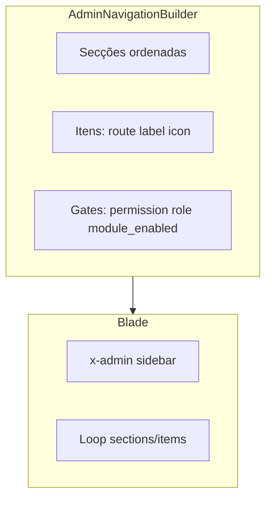

# Plano: Painel Admin (módulo) + HyperUI + navegação por permissões

## Convenção de nomes (decisão do produto)

- No JUBAF, o utilizador com papel Spatie **`super-admin`** é o **administrador do painel** em **`/admin`**, definido em [`routes/admin.php`](routes/admin.php) com nomes de rota **`admin.*`**.
- **Não** se deve criar nem fixar como destino final pastas ou namespaces Blade chamados **`superadmin`** — isso duplica o conceito. O **representante do painel admin** no código é o módulo **[`Modules/Admin`](Modules/Admin)** e o namespace Blade **`admin::`** (já registado pelo módulo via nwidart `loadViewsFrom`).
- Estado legado actual: views **`superadmin::*`** em [`resources/views/panels/superadmin/`](resources/views/panels/superadmin/) + rotas **`superadmin.bible.*`**. **Decisão: migração completa num único passo** — todas as referências passam a **`admin::`** / **`admin.bible.*`** no mesmo changeset (sem período intermédio com ambos os nomes). **PR maior** e risco de regressão maior, mitigado com `rg`/PHPStorm, `route:list`, e testes de feature nos fluxos Bíblia e links do painel.

## Contexto real do repositório

- **[`Modules/Admin`](Modules/Admin)** hoje é um stub: [`resources/views/index.blade.php`](Modules/Admin/resources/views/index.blade.php) (“Hello World”), [`components/layouts/master.blade.php`](Modules/Admin/resources/views/components/layouts/master.blade.php) sem Vite ativo, e [`routes/web.php`](Modules/Admin/routes/web.php) com `Route::resource('admins', ...)->names('admin')`, o que **colide semanticamente** com o prefixo global `admin.*` definido em [`routes/admin.php`](routes/admin.php) (mesmo padrão de nomes `admin.*`).
- O painel em produção (legado) ainda usa **`superadmin::*`** em [`resources/views/panels/superadmin/`](resources/views/panels/superadmin/), com sidebar em [`sidebar-admin.blade.php`](resources/views/panels/superadmin/layouts/sidebar-admin.blade.php) — **meta**: absorver isto em **`Modules/Admin`** com **`admin::layouts.*`**.
- **Bíblia** tem submenu reutilizável em [`Modules/Bible/resources/views/components/superadmin/nav.blade.php`](Modules/Bible/resources/views/components/superadmin/nav.blade.php) — **meta**: renomear para caminho semântico `components/admin/` (ou manter include mas apontar rotas `admin.bible.*`).
- **Tailwind 4.2 + Vite** já estão no projeto ([`package.json`](package.json)); **HyperUI não é pacote npm** — o fluxo é **adaptar o HTML/CSS dos exemplos** ([HyperUI Application](https://www.hyperui.dev/components/application)) para Blade + classes Tailwind existentes, como referência visual/estrutural (vertical/side menu, accordions para secções).
- **Ícones**: manter [`resources/views/components/icon.blade.php`](resources/views/components/icon.blade.php) (FA duotone) + [`x-module-icon`](resources/views/components/module-icon.blade.php) conforme [.cursor/skills/jubaf-module-icons/SKILL.md](.cursor/skills/jubaf-module-icons/SKILL.md) e assets em `public/modules/icons`.

## Direção arquititectónica (alinhada a boas práticas Laravel)

Inspirado no artigo JetBrains sobre produtividade Laravel/IDE ([PhpStorm + rotas/Eloquent/Blade](https://blog.jetbrains.com/pt-br/phpstorm/2023/07/melhores-praticas-com-o-laravel-como-automatizar-sua-rotina/)):

1. **Navegação como dados + política única**: em PHP (config ou serviço), não espalhar `@can`/`hasRole` em dezenas de linhas de Blade.
2. **Contrato de módulos**: cada módulo (Bible, Blog, …) **regista** entradas de menu (listener `AdminNavigationRegistered` ou `AdminNavigation::extend`) para não acoplar o core a listas gigantes.
3. **Views**: componentes Blade pequenos (`<x-admin::sidebar.section>`, `<x-admin::sidebar.link>`, etc.) com um único sítio para estado activo (`request()->routeIs`, `Route::has`).
4. **Rotas do módulo Admin**: corrigir o conflito de naming — por exemplo prefixo `admin-module` + nomes `admin-module.*` **ou** desactivar/remover o `resource('admins')` se for legado não usado (confirmar com grep/`route:list` antes de apagar).

## Proposta em fases (evita um PR impossível de rever)

### Fase 0 — Correcção de rotas e boundaries

- Auditar onde `admin::` / nomes `admin.*` do módulo são referenciados (provavelmente zero).
- Ajustar [`Modules/Admin/routes/web.php`](Modules/Admin/routes/web.php) para **não colidir** com `routes/admin.php` (prefixo dedicado ou remoção se morto).

### Fase 1 — Shell HyperUI + composição no módulo **Admin**

- **Layouts e partials** do painel passam a viver em **`Modules/Admin/resources/views/`** e referem-se como **`admin::layouts.admin`**, **`admin::layouts.navbar-admin`**, etc. (sem pasta `superadmin` no módulo).
- Remover dependência de `View::addNamespace('superadmin', ...)` em [`AppServiceProvider`](app/Providers/AppServiceProvider.php) quando as views legadas em [`resources/views/panels/superadmin/`](resources/views/panels/superadmin/) deixarem de ser usadas (redirect de namespace ou substituição global de `@extends` / `view()`).
- Substituir gradualmente o markup de sidebar/navbar por padrões **Vertical menu / Side menu** HyperUI (estrutura `nav` + grupos + estado activo), mantendo tokens de cor JUBAF (emerald/indigo/slate já usados).
- Garantir um único `@vite([...])` no layout mestre do módulo Admin (equivalente ao actual [`panels/superadmin/layouts/admin.blade.php`](resources/views/panels/superadmin/layouts/admin.blade.php)).

### Fase 2 — Registo de navegação + permissões

- Criar **`AdminNavigationBuilder`** (ou `config/admin_navigation.php` inicial + merge) em `Modules/Admin/app/Support/` que produce uma árvore:

- Cada item: `route`, `label`, `icon` / `module_icon`, `active` patterns (`routeIs`), `permission` (Spatie), `roles` opcionais, `children` opcionais.
- Registar **View composer** no layout admin para injectar `$adminMenu` já filtrado (`Gate::check`, `auth()->user()?->can`, `module_enabled`).

### Fase 3 — Integração Bible / Blog / outros

- **Bible (único passo)**:
    - Em [`routes/admin.php`](routes/admin.php): o grupo que hoje usa `->name('superadmin.bible.')` passa a `->name('admin.bible.')` (mantendo prefixo URL `/admin/biblia-digital` salvo decisão explícita de alterar path).
    - Substituição global de `superadmin.bible` em strings (`route()`, `routeIs`, redirects, `ModuleService`, módulo Bible, testes).
    - [`app/helpers.php`](app/helpers.php): `bible_admin_route()` e `bible_route_is()` usam prefixo **`admin.bible`** por omissão (remover ramos duplicados `superadmin.bible`/`diretoria.bible` só onde ainda fizer sentido para diretoria).
    - Renomear [`components/superadmin/nav.blade.php`](Modules/Bible/resources/views/components/superadmin/nav.blade.php) → **`components/admin/nav.blade.php`** e actualizar includes.
    - Accordion HyperUI no shell para o submenu quando `request()->routeIs('admin.bible.*')`.
- **Blog / Avisos / Homepage**: itens já são principalmente `admin.*`; continuam a vir do registo de navegação; subitens como `children` ou partial `blog::admin.sidebar` se necessário.
- Reusar [`app/Services/Admin/ModuleService::getModuleAdminShortcuts`](app/Services/Admin/ModuleService.php) e alinhar chaves `route` para **`admin.*`** unicamente.

### Fase 4 — Qualidade e DX (JetBrains / Laravel)

- Documentar no módulo (comentário curto no `README` do módulo, não obrigatoriamente README raiz) convenções: naming de rotas, como registar menu, como testar com `route()` autocomplete (Laravel Idea).
- Opcional: **Feature tests** mínimos que asseguram que utilizador sem papel não vê entrada de menu — secções críticas apontadas para rotas `admin.bible.*` (ou equivalente após migração).

## Fora de escopo imediato (para não explodir o trabalho)

- Reescrever **todas** as vistas internas de cada módulo com **todos** os blocos HyperUI listados (tables, modals, stats…). Isso deve ser **incremental por área** depois do shell.
- Introduzar **Neobrutalism** em paralelo ao design system actual (Flowbite/HyperUI “application”); manter **um** estilo dominante (JUBAF já é slate/emerald/indigo).

## Riscos e mitigação

| Risco                                                     | Mitigação                                                                                                 |
| --------------------------------------------------------- | --------------------------------------------------------------------------------------------------------- |
| PR grande (rename `superadmin.bible.*` → `admin.bible.*`) | Um único passo documentado; grep em todo o repo; `route:list`; testes Feature nos URLs críticos da Bíblia |
| Regressões de rotas / nomes                               | Fase 0 + `php artisan route:list` + testes smoke                                                          |
| Performance do menu                                       | Menu construído uma vez por request; sem queries N+1 (eager n/a)                                          |
| Conflito Flowbite vs HyperUI                              | Usar HyperUI como **markup**, não adicionar lib JS extra sem necessidade                                  |

## Ficheiros principais a tocar (indicativos)

- [`Modules/Admin/`](Modules/Admin/) — layouts shell, `Support/AdminNavigationBuilder.php`, `View/Composers/AdminLayoutComposer.php`, `resources/views/components/sidebar/*.blade.php`, tudo servido como **`admin::`**.
- [`routes/admin.php`](routes/admin.php) — grupo Bíblia com nomes **`admin.bible.*`** (substituição atómica de `superadmin.bible.*`).
- [`app/Providers/AppServiceProvider.php`](app/Providers/AppServiceProvider.php) — remover namespace legado `superadmin` quando deixar de ser necessário.
- Legado [`resources/views/panels/superadmin/`](resources/views/panels/superadmin/) — substituído pelo módulo Admin; decompor lógica antiga [`sidebar-admin.blade.php`](resources/views/panels/superadmin/layouts/sidebar-admin.blade.php) para componentes `admin::`.
- [`Modules/Bible/resources/views/components/superadmin/nav.blade.php`](Modules/Bible/resources/views/components/superadmin/nav.blade.php) — renomear/relocalizar para **admin** + actualizar includes.
