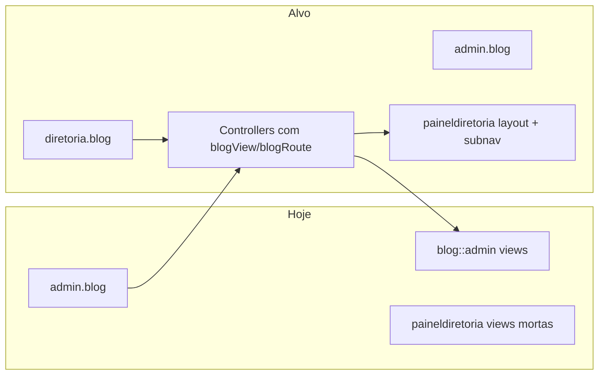

# Plano: Blog JUBAF — upgrade e integração

## Estado atual (descobertas)

- **Branding legado**: [`Modules/Blog/module.json`](Modules/Blog/module.json) menciona “prefeitura” e “Vertex Solutions LTDA”; [`BlogIntegrationController`](Modules/Blog/app/Http/Controllers/BlogIntegrationController.php) gera textos de “Secretaria Municipal de Agricultura”, “Prefeitura”, “demandas”, “poços”, etc. — incompatível com o ecossistema JUBAF descrito em [`PLANOJUBAF/Plano1-Estrutura.md`](PLANOJUBAF/Plano1-Estrutura.md).
- **Painel diretoria desalinhado**: Rotas do blog estão só em [`routes/admin.php`](routes/admin.php) (`admin.blog.*`). Existem vistas em [`Modules/Blog/resources/views/paineldiretoria/`](Modules/Blog/resources/views/paineldiretoria/) mas [`BlogAdminController`](Modules/Blog/app/Http/Controllers/Admin/BlogAdminController.php) **sempre** devolve `blog::admin.*` e o índice de paineldiretoria estende [`admin.layouts.admin`](Modules/Blog/resources/views/paineldiretoria/index.blade.php) em vez de [`paineldiretoria::components.layouts.app`](Modules/PainelDiretoria/resources/views/components/layouts/app.blade.php) como [Avisos](Modules/Avisos/app/Http/Controllers/Admin/AvisosAdminController.php) (`avisosView()` / `avisosRoute()`).
- **Dependências quebradas / risco de erro**: `create()` e `edit()` em `BlogAdminController` referenciam `Modules\Pessoas` e `Modules\Demandas` — **não há** pastas `Modules/Pessoas` ou `Modules/Demandas` no projeto; isso pode gerar falha ao abrir formulários. O modelo [`BlogPost`](Modules/Blog/app/Models/BlogPost.php) mantém `demanda()` e `related_demand_id` (legado).
- **API incorreta**: [`Modules/Blog/routes/api.php`](Modules/Blog/routes/api.php) faz `apiResource('blogs', BlogController::class)` sobre o [`BlogController`](Modules/Blog/app/Http/Controllers/BlogController.php) **público** (devolve HTML), não um recurso JSON — precisa controlador API dedicado e rotas coerentes.
- **UX pública**: [`show.blade.php`](Modules/Blog/resources/views/public/show.blade.php) já tem WhatsApp e “Copiar link”; o autor usa **iniciais**, não a foto (`User` tem [`photo`](app/Models/User.php)). SEO base existe em [`blog.blade.php`](Modules/Blog/resources/views/layouts/blog.blade.php); pode completar-se com JSON-LD (`BlogPosting`), `og:image` absoluta, `article:author`, etc.
- **Navegação**: [`sidebar.blade.php`](Modules/PainelDiretoria/resources/views/components/layouts/sidebar.blade.php) tem grupo comunicação (Avisos, …) mas **não inclui Blog** — mesmo com módulo ativo, a diretoria não tem entrada coerente.
- **Outros**: [`resources/js/blog-editor.js`](resources/js/blog-editor.js) usa URL fixa `/admin/blog/upload-image` — ao registar rotas `diretoria.blog.*`, o upload do editor deve usar URL dinâmica (meta `data-upload-url` ou `route()` injetada). Testes em [`BlogFullSuiteTest`](Modules/Blog/tests/Feature/BlogFullSuiteTest.php) usam e-mail `@vertex.com` (legado).

## Diretrizes de produto (alinhamento PLANOJUBAF)

- Posicionar o blog como **“Comunicação institucional JUBAF”** (notícias, comunicados editoriais, CONJUBAF, vida das igrejas), não como portal municipal.
- Integrações automáticas: **ou** métricas reais dos módulos JUBAF (Avisos, Calendário/Eventos, Igrejas, etc.) com `module_enabled()` / `class_exists()`, **ou** remover o “relatório mensal” automático até haver especificação clara — evitar manter texto de agricultura/prefeitura.

## Plano de implementação

### 1. Rotas e paridade admin / diretoria

- Em [`routes/diretoria.php`](routes/diretoria.php), dentro do grupo `diretoria.*` e `module_enabled('Blog')`, registar espelho das rotas de [`routes/admin.php`](routes/admin.php) (posts, categorias, tags, comentários, upload de imagem, redact) com prefixo `blog` e nomes `diretoria.blog.*` — **mesmo padrão** de [`Avisos`](routes/diretoria.php) (`diretoria.avisos.*`).
- Refatorar `BlogAdminController`, `BlogCategoriesAdminController`, `BlogTagsAdminController`, `BlogCommentsAdminController` para:
  - `blogView(string $name)` → `blog::admin.*` **ou** `blog::paineldiretoria.*` conforme `request()->routeIs('diretoria.*')`.
  - `blogRoute(string $suffix)` → `admin.blog.{suffix}` ou `diretoria.blog.{suffix}`.
  - Redirecionamentos e `redirect()->route(...)` após store/update usarem o helper.
- Atualizar **todas** as vistas em `blog::admin` e `blog::paineldiretoria` para usar `route($prefix.'...')` ou helper partilhado (evitar hardcode `admin.blog`).

### 2. Layout e UI do painel diretoria

- Trocar `@extends('admin.layouts.admin')` nas vistas `paineldiretoria` para **`@extends('paineldiretoria::components.layouts.app')`** (com variável `$layout` injetada pelo controlador se seguirem o padrão Secretaria/Financeiro).
- Adicionar [`blog::paineldiretoria.partials.subnav`](Modules/Blog/resources/views/paineldiretoria/partials/subnav.blade.php) (Posts | Categorias | Tags | Comentários | Ver blog público), espelhando [Avisos subnav](Modules/Avisos/resources/views/paineldiretoria/partials/subnav.blade.php).
- Usar **`<x-module-icon module="blog" />`** (ou slug correto em [`config/module_icons.php`](config/module_icons.php) / documentação em [`.cursor/skills/jubaf-module-icons/SKILL.md`](.cursor/skills/jubaf-module-icons/SKILL.md)) no hero — substituir `<x-icon module="Blog" />` onde for identidade do módulo.

### 3. Remover legado “projeto antigo” e código morto

- **`module.json`**: descrição JUBAF; autor/empresa alinhados à organização do projeto (remover Vertex se for legado).
- **`BlogIntegrationController`**: reescrever ou **eliminar** geração mensal baseada em Demandas/Ordens/Poços; se mantiver “resumo mensal”, conteúdo e métricas devem refletir apenas dados JUBAF disponíveis (ex.: contagens condicionais). Remover strings “Prefeitura”, “Secretaria Municipal de Agricultura”, etc.
- **`BlogPost`**: tornar `demanda()` opcional (sem type-hint quebrado) ou remover relação se `Demandas` não existir; avaliar migração para apagar `related_demand_id` ou deixar coluna ignorada.
- **`BlogAdminController`**: remover carregamento de `PessoaCad` / `Demanda`; para “equipa” ou autor, usar **`User`** (diretoria) ou listagem de utilizadores com papel adequado.
- **Seeder** [`BlogSeeder`](Modules/Blog/database/seeders/BlogSeeder.php): textos 100% JUBAF.
- **Comando** [`TranslatePublishedReportsCommand`](Modules/Blog/app/Console/Commands/TranslatePublishedReportsCommand.php): remover ou reduzir a substituição de frases se o relatório automático for descontinuado.
- **`BlogFullSuiteTest`**: atualizar dados de teste (domínios de email, expectativas de rotas diretoria se aplicável).

### 4. UI/UX público (blog oficial)

- **Autor**: mostrar foto se `Storage::url($post->author->photo)` ou avatar com iniciais; opcionalmente cargo da diretoria via `Homepage` BoardMember se existir vínculo por `user_id` (só se for simples de modelar).
- **Partilha**: manter WhatsApp + copiar; garantir `copyToClipboard` acessível e feedback visual; considerar partilha nativa (`navigator.share`) em mobile.
- **SEO**: JSON-LD `BlogPosting` + `BreadcrumbList`; meta `og:url`/`og:image` com URL absoluta; `twitter:card`; revisar [`sitemap.blade.php`](Modules/Blog/resources/views/public/sitemap.blade.php) e [`rss.blade.php`](Modules/Blog/resources/views/public/rss.blade.php) para títulos/descrições JUBAF.
- **Consistência**: rever [`index.blade.php`](Modules/Blog/resources/views/public/index.blade.php), `category`, `tag`, `search` — mesma linguagem visual (cards, tipografia, fotos de capa).

### 5. API / criação rápida de posts

- Substituir `apiResource` em [`Modules/Blog/routes/api.php`](Modules/Blog/routes/api.php) por controlador dedicado (ex.: `Api\BlogPostApiController`) com:
  - `index`/`show` públicos ou autenticados conforme política;
  - `store`/`update`/`destroy` com Sanctum + política (`blog.posts.manage` ou permissões Spatie alinhadas ao resto do JUBAF).
- Documentar no OpenAPI interno se existir ([`DocumentationController`](app/Http/Controllers/Api/DocumentationController.php)).

### 6. Painéis Jovens e Líderes (opcional mas recomendado)

- Em [`routes/jovens.php`](routes/jovens.php) e [`routes/lideres.php`](routes/lideres.php), com `module_enabled('Blog')`, adicionar rotas `jovens.blog.*` / `lideres.blog.*` que listam posts publicados (reutilizar query de `BlogController@index` com paginação) e **abrir o post** em iframe ou layout embutido (view-only, sem duplicar editor).
- Menu lateral dos respetivos módulos PainelJovens/PainelLider: entrada “Blog” que aponta para essas rotas.

### 7. Menu PainelDiretoria

- Em [`sidebar.blade.php`](Modules/PainelDiretoria/resources/views/components/layouts/sidebar.blade.php), no grupo comunicações: `$hasBlogMenu` com `module_enabled('Blog')`, `Route::has('diretoria.blog.index')` e permissão (ex.: mesma do admin do blog ou `homepage.edit` / nova permissão `blog.manage` — a definir de forma consistente com políticas).

### 8. Políticas e segurança

- Introduzir **Policies** ou gates para `BlogPost`, comentários e categorias (hoje `BlogAdminController` não usa `authorize` — gap de segurança).
- Alinhar com [`laravel-best-practices`](.cursor/skills/laravel-best-practices/SKILL.md): validação em Form Requests, N+1 nas listagens (`with()` já parcialmente usado).

### 9. Frontend do editor

- Ajustar [`blog-editor.js`](resources/js/blog-editor.js) / Vite para URL de upload derivada da rota atual (`admin` vs `diretoria`).

---

## Ordem sugerida de trabalho

1. Corrigir referências quebradas (Pessoas/Demandas) e limpar `BlogIntegrationController` / seeders.
2. Implementar helpers de vista/rota + rotas `diretoria` + subnav + sidebar.
3. Revisão completa das blades `paineldiretoria` e alinhamento visual com Secretaria/Avisos.
4. Público: autor com foto + SEO + polimento partilha.
5. API Sanctum + testes.
6. Rotas opcionais jovens/líderes + ícones módulo.

## Riscos / decisões

- **Relatório automático**: substituir por métricas JUBAF reais ou remover — evita manter “código morto” com texto errado.
- **Coluna `related_demand_id`**: só remover com migração se a BD de produção não depender dela; caso contrário, ignorar no código.
