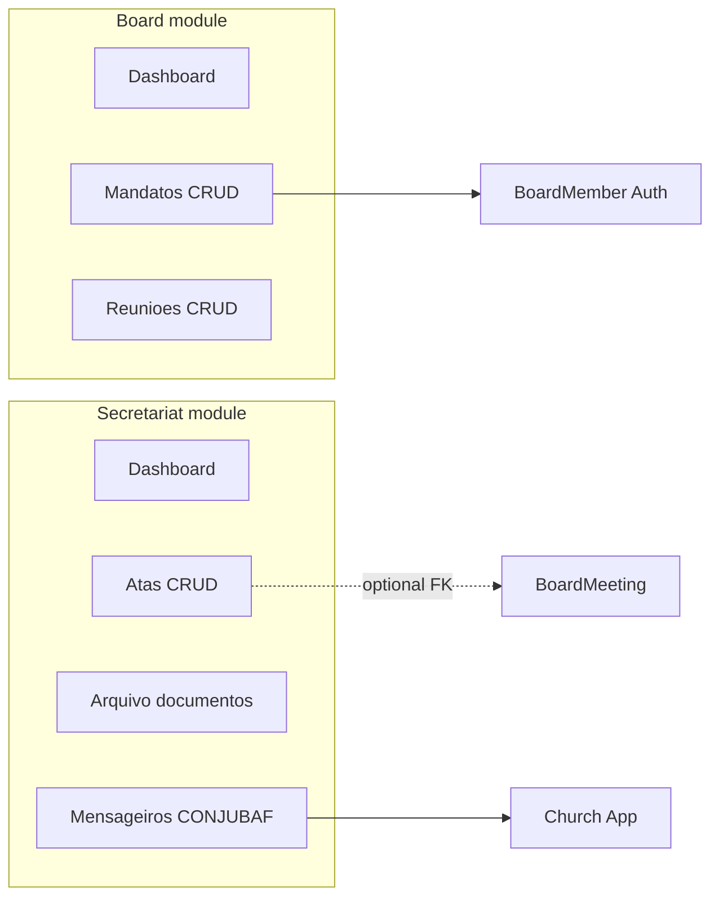

# Plano: módulos Board e Secretariat (bloco completo)

## Objetivo

Implementar **Board** e **Secretariat** de ponta a ponta: CRUD, fluxos, painéis, integração Spatie/`church_id`, **README** por módulo e **CHANGLOG.md**, alinhados a Auth, Bible, Churches, Core e HomePage (Tailwind v4, Flowbite, Vite na raiz, sem CDN).

---

## Estado atual no repositório

- `**[routes/board.php](routes/board.php)`** — `painel.diretoria.dashboard` + resource `mandatos`; controladores em `**Modules\Auth\Http\Controllers\Board\`**, vistas em `**Modules\Auth\resources\views\diretoria\*\`. O módulo `**[Modules/Board](Modules/Board)` tem stub (`BoardController`+ resource em`[Modules/Board/routes/web.php](Modules/Board/routes/web.php)`) redundante face ao padrão Churches.
- `**Modules/Secretariat`** — apenas scaffold; **sem grupo em `[bootstrap/app.php](bootstrap/app.php)`.
- **Spatie** — `[JubafRolesAndPermissionsSeeder](Modules/Auth/database/seeders/JubafRolesAndPermissionsSeeder.php)`: `board.dashboard`, `board.meetings`, `secretariat.minutes`, `secretariat.census`. Painel diretoria: `permission:board.meetings` em `[bootstrap/app.php](bootstrap/app.php)`. **Secretário** tem `secretariat.` + `churches.manage`.
- `**[PostLoginRedirect](Modules/Auth/app/Support/PostLoginRedirect.php)`** — não trata `secretariat.minutes`; Secretário cai primeiro em `churches.manage`. **Inserir** destino secretaria **antes de `churches.manage` e atualizar `navbarPanel()`.
- **Modelo** `[BoardMember](Modules/Auth/app/Models/BoardMember.php)` em Auth — manter (menos churn) ou migrar para `App\Models` numa fase opcional.

---

## Arquitetura alvo

---

## Parte A — Board

### A1. Consolidar painel diretoria no módulo Board

| Ação          | Detalhe                                                                                                                     |
| ------------- | --------------------------------------------------------------------------------------------------------------------------- |
| Controladores | `BoardDashboardController`, `BoardMemberController` → `Modules\Board\Http\Controllers\`                                     |
| Form Requests | `StoreBoardMemberRequest`, `UpdateBoardMemberRequest` → `Modules\Board\Http\Requests\`                                      |
| Policy        | `BoardMemberPolicy` → `Modules\Board\Policies\`; `Gate::policy` em `BoardServiceProvider`; remover de `AuthServiceProvider` |
| Vistas        | `Modules/Auth/resources/views/diretoria/**` → `Modules/Board/resources/views/diretoria/**`; views `board::diretoria.*`      |
| Rotas         | `[routes/board.php](routes/board.php)` com novos namespaces; **manter nomes** `painel.diretoria.`                           |
| Stub          | `[Modules/Board/routes/web.php](Modules/Board/routes/web.php)` só comentário (como Churches)                                |

### A2. Reuniões / assembleias (Plano2)

- **Migração** `board_meetings`: `title`, `meeting_type` (ordinary, extraordinary, council, other), `scheduled_at`, `location`, `agenda` (text), `status` (draft, published, held, cancelled), `convocation_sent_at`, `created_by`, `meta` (json).
- **Model** `Modules\Board\Models\BoardMeeting` + `BoardMeetingPolicy` (`board.meetings`).
- **CRUD** + Form Requests + vistas com `auth::layouts.panel` e nav breadcrumb como mandatos atuais.
- **Dashboard**: resumo + link para reuniões.

### A3. Permissões `board.dashboard`

Documentar no README: ou usar `board.dashboard` só leitura e `board.meetings` para escrita, ou manter tudo sob `board.meetings` (evitar permissão “morta”).

### A4. Frontend do módulo

Remover Vite duplicado do módulo Board (`package.json`, `vite.config.js`, `resources/css|js` do módulo) se existirem — UI com Vite da raiz.

### A5. Testes Board

- Ajustar `[tests/Feature/Auth/AuthPanelsTest.php](tests/Feature/Auth/AuthPanelsTest.php)` se necessário.
- Novo `tests/Feature/Board/BoardMeetingTest.php` (CRUD, 403).

---

## Parte B — Secretariat

### B1. Bootstrap

- Criar `[routes/secretariat.php](routes/secretariat.php)`: prefixo URL `/painel/secretaria`, nomes `painel.secretaria.`.
- `[bootstrap/app.php](bootstrap/app.php)`: `web` + `auth` + `permission:secretariat.minutes` para o grupo principal; rotas de **mensageiros/censo** com `permission:secretariat.census`.
- `[Modules/Secretariat/routes/web.php](Modules/Secretariat/routes/web.php)`: só comentário.

### B2. Dados (Plano1 / Escopo)

| Tabela                  | Campos principais                                                                                                                                               |
| ----------------------- | --------------------------------------------------------------------------------------------------------------------------------------------------------------- |
| `assembly_minutes`      | `title`, `body`, `assembly_date`, `status` (draft, finalized, published), `signed_at`, `signed_by`, `board_meeting_id` nullable; imutabilidade após `finalized` |
| `secretariat_documents` | `title`, tipo/categoria, `file_path`, `church_id` nullable, `uploaded_by`, `notes`                                                                              |
| `messenger_credentials` | `church_id`, nome, documento opcional, `valid_from`/`valid_until`, `is_active`, `notes`, `created_by`                                                           |

### B3. HTTP

- `SecretariatDashboardController`, `AssemblyMinuteController`, `SecretariatDocumentController` (upload + download seguro), `MessengerCredentialController`.
- Policies: `secretariat.minutes` (atas + arquivo); `secretariat.census` (mensageiros).

### B4. UI e navegação

- `auth::layouts.panel`, dark mode, `<x-module-icon module="secretariat" />` onde aplicável.
- **Nav cruzada**: Secretário com `churches.manage` + secretaria — links explícitos Secretaria Igrejas (breadcrumb/partial).

### B5. PostLoginRedirect

- Após SuperAdmin (e ordem acordada face a `board.meetings`), `secretariat.minutes` → dashboard secretaria.
- `navbarPanel()`: módulo `secretariat`, `active` em `painel.secretaria.`.

### B6. Testes

- `tests/Feature/Secretariat/SecretariatPanelTest.php` (acesso, 403).
- Fluxos: ata draft → finalized; upload; mensageiros com `secretariat.census`.

---

## Documentação e qualidade

- `**[Modules/Board/README.md](Modules/Board/README.md)`** e `**[Modules/Secretariat/README.md](Modules/Secretariat/README.md)\*\` — estilo [Churches README](Modules/Churches/README.md).
- `**[CHANGLOG.md](CHANGLOG.md)` — entrada datada (alterações transversais).
- `**@source` em `[resources/css/app.css](resources/css/app.css)` — cobrir views novas nos módulos.
- **Pint** em PHP alterado; `php artisan test --compact` nos testes tocados.

---

## Riscos / decisões

- **Rotas nomeadas** `painel.diretoria.` mantidas para não partir testes/bookmarks.
- **Presidente** sem `secretariat.` no seeder — painel secretaria só para quem tem permissões; leitura para Presidente seria mudança de produto separada.

---

## Checklist de execução (todos)

1. Mover HTTP diretoria Auth → Board; limpar AuthServiceProvider; stub `Board/routes/web.php`; atualizar `routes/board.php`.
2. Migração `board_meetings`, model, policy, CRUD, dashboard.
3. README Board; remover Vite duplicado Board; testes Board.
4. `secretariat.php` + bootstrap; migrações atas/arquivo/mensageiros; controllers/policies/views.
5. PostLoginRedirect + navbarPanel + nav cruzada.
6. README Secretariat; CHANGLOG; testes Secretariat; Pint.
