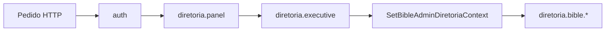

# Plano: Bíblia digital no Painel da Diretoria — UI e papéis

## Contexto técnico (já existente)

- **Rotas:** Em [`routes/diretoria.php`](routes/diretoria.php), o grupo `biblia-digital` usa `middleware(['diretoria.executive', SetBibleAdminDiretoriaContext::class])`. O middleware [`EnsureUserIsDiretoriaExecutive`](Modules/PainelDiretoria/app/Http/Middleware/EnsureUserIsDiretoriaExecutive.php) restringe a **presidente** e **vice-presidentes** (nomes em [`config/jubaf_roles.php`](config/jubaf_roles.php) → `directorate_executive`).
- **Menu lateral:** O bloco “Bíblia digital” no [`sidebar.blade.php`](Modules/PainelDiretoria/resources/views/components/layouts/sidebar.blade.php) já está dentro de `@if(user_is_diretoria_executive())`.
- **Layout das vistas:** Todas as vistas em [`Modules/Bible/resources/views/paineldiretoria/`](Modules/Bible/resources/views/paineldiretoria/) estendem `paineldiretoria::components.layouts.app` e encapsulam conteúdo em [`x-bible::superadmin.layout`](Modules/Bible/resources/views/components/superadmin/layout.blade.php).

## Problemas a resolver

1. **Visual incoerente:** O componente `superadmin.layout` usa herói azul em gradiente, classes tipo `border-border` / `bg-background` / `text-text-muted`, e um **segundo menu lateral** (“Navegação”), enquanto o resto do painel (ex.: [`dashboard.blade.php`](Modules/PainelDiretoria/resources/views/dashboard.blade.php), [`devotionals/index.blade.php`](Modules/PainelDiretoria/resources/views/devotionals/index.blade.php), [`Secretaria/.../dashboard.blade.php`](Modules/Secretaria/resources/views/paineldiretoria/dashboard.blade.php)) usa cabeçalho simples com `border-b`, `gray/slate`, cartões `rounded-xl border border-gray-200 dark:border-slate-700`.
2. **Redundância:** Flash messages duplicados (ex.: [`bible/index.blade.php`](Modules/Bible/resources/views/paineldiretoria/bible/index.blade.php)) — o layout [`app.blade.php`](Modules/PainelDiretoria/resources/views/components/layouts/app.blade.php) já trata `success` / `error` / `warning` / `$errors`.
3. **Papéis vs UI:** `@can('bible.study.resources.manage')` aparece no sidebar e em [`nav.blade.php`](Modules/Bible/resources/views/components/superadmin/nav.blade.php) / índice da Bíblia, mas essa permissão **não é criada** em [`database/seeders/RolesPermissionsSeeder.php`](database/seeders/RolesPermissionsSeeder.php). Na prática o `@can` tende a falhar para todos, **escondendo** “Estudo avançado” mesmo quem já pode aceder às rotas por `diretoria.executive` — comportamento confuso e falso sentido de segurança.

## Direção de implementação

### A) Um único layout “inteligente” para diretoria (sem duplicar 22 includes)

Alterar [`Modules/Bible/resources/views/components/superadmin/layout.blade.php`](Modules/Bible/resources/views/components/superadmin/layout.blade.php) para, quando `request()->attributes->get('bible_admin_route_prefix') === 'diretoria.bible'` (já definido pelo middleware):

- **Cabeçalho de página** alinhado ao painel: `flex` + `border-b border-gray-200 dark:border-slate-700`, título `text-2xl font-bold`, subtítulo `text-sm text-gray-600 dark:text-gray-400`.
- **Ícone do módulo:** usar `<x-module-icon module="Bible" … />` no herói/cabeçalho (regra em [`.cursor/skills/jubaf-module-icons/SKILL.md`](.cursor/skills/jubaf-module-icons/SKILL.md)); ícones Font Awesome só para ações.
- **`showNav` por defeito no contexto diretoria:** não mostrar o aside “Navegação” (o [`sidebar.blade.php`](Modules/PainelDiretoria/resources/views/components/layouts/sidebar.blade.php) já cobre versões, importação, planos, estudo, relatórios). Manter `showNav` para `/admin` (superadmin) para não regressar o fluxo admin.
- **Substituir** tokens genéricos (`border-border`, `bg-background`, etc.) por utilitários explícitos `gray`/`slate` coerentes com o painel.
- **Ações:** slot `actions` em linha com o cabeçalho (como em devocionais), botões primários harmonizados (ex. `rounded-xl`, `bg-amber-600` ou `indigo` alinhado ao padrão escolhido para a secção — uma linha de estilo, não misturar três variantes por página).

### B) Passar pelas 22 vistas em `paineldiretoria`

Ficheiros: pasta [`Modules/Bible/resources/views/paineldiretoria/`](Modules/Bible/resources/views/paineldiretoria/) (bible, plans, reports, study/…).

- Remover blocos locais de `session('success')` / mensagens que duplicam o layout app (após confirmar que o controlador só usa esses flashes).
- Uniformizar **cartões, tabelas, formulários** aos padrões do painel (`rounded-xl`, `border-gray-200` / `dark:border-slate-700`, `bg-white` / `dark:bg-slate-800`, cabeçalhos de tabela em `text-xs font-bold uppercase text-gray-500` onde fizer sentido).
- Pequenos ajustes de **copy** (subtítulos nas `x-bible::superadmin.layout` ou títulos `@section('title')`) para explicar em uma linha o propósito de cada ecrã (importação, áudio, planos, Strong, comentários, refs., relatório).

### C) Papéis e permissão “Estudo avançado”

Objetivo alinhado ao pedido (**só presidente e vices** na área Bíblia no `/diretoria`): já está garantido à **rota**.

- **Remover** os `@can('bible.study.resources.manage')` que envolvem apenas links/menus neste contexto, em:
    - [`sidebar.blade.php`](Modules/PainelDiretoria/resources/views/components/layouts/sidebar.blade.php) (secção estudo dentro do menu Bíblia),
    - [`components/superadmin/nav.blade.php`](Modules/Bible/resources/views/components/superadmin/nav.blade.php) (ajustar para superadmin: ou manter gate só quando fizer sentido com permissão real, ou mostrar sempre no admin se super-admin tem acesso total por Spatie),
    - [`paineldiretoria/bible/index.blade.php`](Modules/Bible/resources/views/paineldiretoria/bible/index.blade.php) (botão Léxico Strong).

**Alternativa** (se quiserem manter gate explícito no futuro): criar permissão `bible.study.resources.manage` no seeder, atribuí-la a `super-admin`, `presidente`, `vice-presidente-*`, e aplicar `->middleware('can:bible.study.resources.manage')` ao `Route::prefix('estudo')` em [`admin-superadmin.php`](Modules/Bible/routes/admin-superadmin.php) — com cuidado para não bloquear super-admin sem a permissão na base. A opção **remover `@can` morto** é mais simples e alinha UI com o middleware de papel já existente.

### D) Verificação manual

- Navegar como utilizador **não** executivo da diretoria: confirmar **403** em URLs `diretoria.bible.*` (não só ausência de menu).
- Navegar como presidente/vice: todas as secções visíveis no sidebar e páginas carregam; dark mode legível.
- Smoke test **superadmin** `/admin/biblia-digital`: layout com navegação interna continua utilizável (não regressão por `showNav` condicional).

## Ficheiros principais

| Área                    | Ficheiros                                                                                                                                                                  |
| ----------------------- | -------------------------------------------------------------------------------------------------------------------------------------------------------------------------- |
| Layout base diretoria   | [`Modules/PainelDiretoria/resources/views/components/layouts/app.blade.php`](Modules/PainelDiretoria/resources/views/components/layouts/app.blade.php) (referência apenas) |
| Layout secção Bíblia    | [`Modules/Bible/resources/views/components/superadmin/layout.blade.php`](Modules/Bible/resources/views/components/superadmin/layout.blade.php)                             |
| Navegação interna admin | [`Modules/Bible/resources/views/components/superadmin/nav.blade.php`](Modules/Bible/resources/views/components/superadmin/nav.blade.php)                                   |
| Sidebar                 | [`Modules/PainelDiretoria/resources/views/components/layouts/sidebar.blade.php`](Modules/PainelDiretoria/resources/views/components/layouts/sidebar.blade.php)             |
| Vistas                  | Todos os `.blade.php` sob [`Modules/Bible/resources/views/paineldiretoria/`](Modules/Bible/resources/views/paineldiretoria/)                                               |
| Rotas / papéis          | [`routes/diretoria.php`](routes/diretoria.php), [`config/jubaf_roles.php`](config/jubaf_roles.php)                                                                         |

Não é necessário alterar [`routes/diretoria.php`](routes/diretoria.php) para cumprir “só presidente e vices” — já está correto; o trabalho é **UI + remover gate fantasma** (ou formalizar permissão se escolherem a alternativa).
