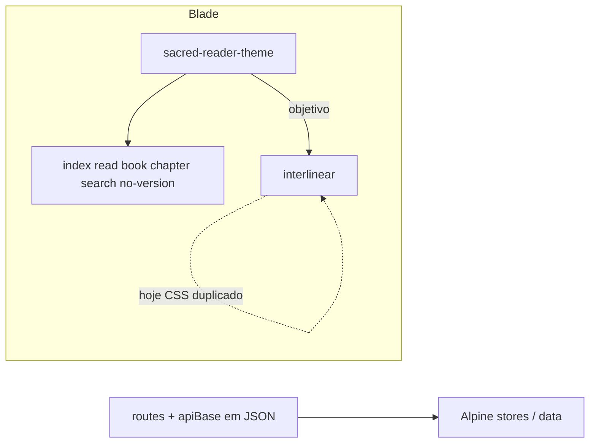

# Plano: Bíblia pública — design coerente, leitura e responsividade

## Estado atual (resumo)

- **Tema partilhado:** [Modules/Bible/resources/views/public/partials/sacred-reader-theme.blade.php](c:\laragon\www\JUBAF\Modules\Bible\resources\views\public\partials\sacred-reader-theme.blade.php) define variáveis CSS (`--sacred-`), papel, cabeçalho, modo leitura (`body.bible-reading-mode`) e folha de leitura. Está incluído em `index`, `read`, `book`, `chapter`, `search`, `no-version`.
- **Exceção:** [Modules/Bible/resources/views/public/interlinear.blade.php](c:\laragon\www\JUBAF\Modules\Bible\resources\views\public\interlinear.blade.php) **não** usa o partial e redefine `--parchment`, `--ink`, classes `.interlinear-paper`, etc. — paleta e textura divergem do resto.
- **Tipografia:** o partial usa `'Merriweather'` no stack; [resources/css/app.css](c:\laragon\www\JUBAF\resources\css\app.css) (linhas 42–45) indica **sem CDN** e fontes sistema até haver ficheiros em `public/fonts` — Merriweather não está servido localmente (o browser cai para Georgia).
- **JavaScript:** [chapter.blade.php](c:\laragon\www\JUBAF\Modules\Bible\resources\views\public\chapter.blade.php) tem ~90 linhas de `Alpine.data('bibleChapter')` inline; links de busca usam paths literais `/biblia-online/versao/...` em vez de rotas nomeadas injetadas (o prefixo está em [routes/web.php](c:\laragon\www\JUBAF\routes\web.php) `biblia-online`).
- **Testes:** [tests/Feature/PublicSiteTest.php](c:\laragon\www\JUBAF\tests\Feature\PublicSiteTest.php) cobre `bible.public.index` e `bible.public.interlinear`; não há asserts para `search`, `read`, `book`, `chapter` (dependem de dados).

## Princípios a respeitar (projeto)

- **Sem CDN:** qualquer fonte de leitura “premium” deve ser ficheiro em `public/fonts` + `@font-face` (ou remover Merriweather do stack e usar apenas sistema/Georgia até haver ficheiros).
- **Tailwind v4 + Flowbite v4:** preferir utilitários e componentes documentados (modais/drawers com foco e `aria-`); manter `@source` já definido em `app.css` para `Modules/`.
- **Dark mode:** continuar com `.dark` no `<html>` e variantes `dark:` onde faltar (alertas em `book`/`read` já misturam `dark:bg-red-900/20` — alinhar ao pergaminho quando estiver dentro de `.bible-sacred-root`).
- **Alteração transversal:** atualizar [CHANGLOG.md](c:\laragon\www\JUBAF\CHANGLOG.md) ao fechar o trabalho.

## Fase A — Fundação visual e tokens (antes de “página a página”)

1. **Estender o partial sagrado** (`sacred-reader-theme.blade.php`):

- Adicionar **presets de pergaminho** opcionais, p.ex. `data-bible-palette="classic|sepia|contrast"` (ou classe utilitária) que redefinem apenas as variáveis `--sacred-` (claro/escuro), sem quebrar o resto do site.
- Incluir utilitários reutilizáveis para interlinear: ou **aliases CSS** (`.bible-sacred-paper` espelhado como `.interlinear-paper` com as mesmas variáveis) para migrar markup gradualmente, ou documentar mapeamento `--parchment` → `--sacred-parchment` num único bloco.
- **Corrigir tipografia:** ou adicionar Merriweather (ou “Literata”/Noto Serif) local em `public/fonts` + `@font-face` no partial, ou **remover** Merriweather do `font-family` e alinhar ao comentário de `app.css`.

1. **Persistência de preferências (capítulo + opcional interlinear):** `localStorage` para `bible_public_font_scale`, `bible_public_palette` (e, na interlinear, escala do texto original), lidos no `x-init` para coerência entre visitas.

## Fase B — Rotas e JS (Laravel best practices)

1. **Objeto de URLs gerado no servidor** (em `chapter` e `search`, e onde hoje há strings JS):

- Passar no JSON de config algo como `urls.chapter: @json(route('bible.public.chapter', ['versionAbbr' => '__V__', 'bookNumber' => '__B__', 'chapterNumber' => '__C__']))` com placeholders substituídos em JS, **ou** função gerada a partir de um template único — evita divergência se o prefixo mudar.

1. **Extrair Alpine pesado do Blade:**

- Criar ficheiro em [resources/js](c:\laragon\www\JUBAF\resources\js) (p.ex. `bible-public-chapter.js`) que regista `Alpine.data('bibleChapter', ...)` no `alpine:init`, e incluir o módulo a partir de [resources/js/app.js](c:\laragon\www\JUBAF\resources\js\app.js) **condicionalmente** só em rotas Bible **ou** via `@vite` extra no layout apenas nas páginas Bible (preferir import lazy/`import()` se quiserem bundle menor — decisão na implementação).
- O mesmo padrão pode aplicar-se à busca (`bibleSearch`) para reduzir inline em [search.blade.php](c:\laragon\www\JUBAF\Modules\Bible\resources\views\public\search.blade.php).

1. **Interlinear:** substituir `url('/biblia-online/interlinear/strong')` por `route('bible.public.interlinear.strong', ['number' => 'PLACEHOLDER'])` no Blade ao construir fetch (já existe rota nomeada em `web.php`).

## Fase C — Página a página (entregáveis visuais e UX)

| Página                                                                                                   | Foco principal                                                                                                                                                                                                                                                                                                                                           |
| -------------------------------------------------------------------------------------------------------- | -------------------------------------------------------------------------------------------------------------------------------------------------------------------------------------------------------------------------------------------------------------------------------------------------------------------------------------------------------- |
| [index.blade.php](c:\laragon\www\JUBAF\Modules\Bible\resources\views\public\index.blade.php)             | Hero e lista de versões; **CTA secundário** para interlinear e busca; grid responsivo; opcional bloco “Como usar” (Foco, busca).                                                                                                                                                                                                                         |
| [read.blade.php](c:\laragon\www\JUBAF\Modules\Bible\resources\views\public\read.blade.php)               | Cabeçalho alinhado às outras páginas; grelha de livros com melhor `touch-target` em mobile; select de versão com estilo Flowbite-like.                                                                                                                                                                                                                   |
| [book.blade.php](c:\laragon\www\JUBAF\Modules\Bible\resources\views\public\book.blade.php)               | Grelha de capítulos: consistência de sombras/bordas com `read`; mensagens de erro com cores derivadas de `--sacred-` (menos “Tailwind genérico” solto).                                                                                                                                                                                                  |
| [chapter.blade.php](c:\laragon\www\JUBAF\Modules\Bible\resources\views\public\chapter.blade.php)         | **Toolbar:** preset de tema + A-/A+ com persistência; modo Foco e fullscreen já existentes — rever `sticky`/`scroll-margin` em mobile; **modal livros** e **drawer busca** com padrão Flowbite (foco preso, Escape); opcional **copiar versículo** / link direto `#vN`.                                                                                  |
| [search.blade.php](c:\laragon\www\JUBAF\Modules\Bible\resources\views\public\search.blade.php)           | Mesmo cabeçalho/cartão que capítulo; resultados com skeleton/empty states; URLs via config injetada.                                                                                                                                                                                                                                                     |
| [no-version.blade.php](c:\laragon\www\JUBAF\Modules\Bible\resources\views\public\no-version.blade.php)   | Pequeno alinhamento tipográfico e link para home/interlinear se aplicável.                                                                                                                                                                                                                                                                               |
| [interlinear.blade.php](c:\laragon\www\JUBAF\Modules\Bible\resources\views\public\interlinear.blade.php) | Envolver em `.bible-sacred-root` (ou equivalente); **remover CSS duplicado** substituindo por classes/tokens do partial; barra superior responsiva (overflow horizontal com `scrollbar` discreto); painel Strong com mesma “papel” que o resto; corrigir `style="display: none;"` no contentor dos versículos se estiver a lutar com `x-show` do Alpine. |

## Fase D — Flowbite v4 (pontos concretos)

- Substituir modais/drawers **ad hoc** onde fizer ganho de acessibilidade: atributos `data-modal-target` / `data-drawer-target` conforme documentação Flowbite v4 já usada no projeto ([resources/js/app.js](c:\laragon\www\JUBAF\resources\js\app.js) importa Flowbite).
- Manter Alpine para estado complexo (comparar versões, interlinear); Flowbite para comportamento de overlay/foco quando não exigir reescrita total.

## Fase E — Qualidade

1. **PHPUnit:** alargar testes em `PublicSiteTest` (ou novo `BiblePublicViewsTest`) para `route('bible.public.search')` **assertOk**; para `read`/`book`/`chapter` usar factories/seed mínimo de `BibleVersion` + livro/capítulo **se** o projeto já tiver factories — caso contrário, testar apenas rotas que respondem 404/redirect documentados ou criar dataset mínimo no teste.
2. **Pint** em ficheiros PHP tocados (controllers se passarem mais dados à view).
3. `**npm run build` para validar Vite após mudanças em JS/CSS.

## Ordem de execução recomendada

1. Partial sagrado + presets + tipografia (A).
2. Interlinear alinhado ao tema (C interlinear + remoção duplicação).
3. Config de URLs + extração JS capítulo/busca (B).
4. Refino visual página a página (C restantes).
5. Flowbite nos overlays (D).
6. Testes + CHANGLOG (E).

## Riscos / notas

- **Bundle size:** import global de `bible-public-chapter.js` em `app.js` aumenta JS em todo o site — mitigar com import dinâmico ou stack `@vite` só no layout público quando `View::share` indicar rota Bible (decisão na implementação).
- **PLANOJUBAF / Escopo:** manter papéis e áreas admin intactos; alterações só em views públicas do módulo e assets partilhados acordados.
