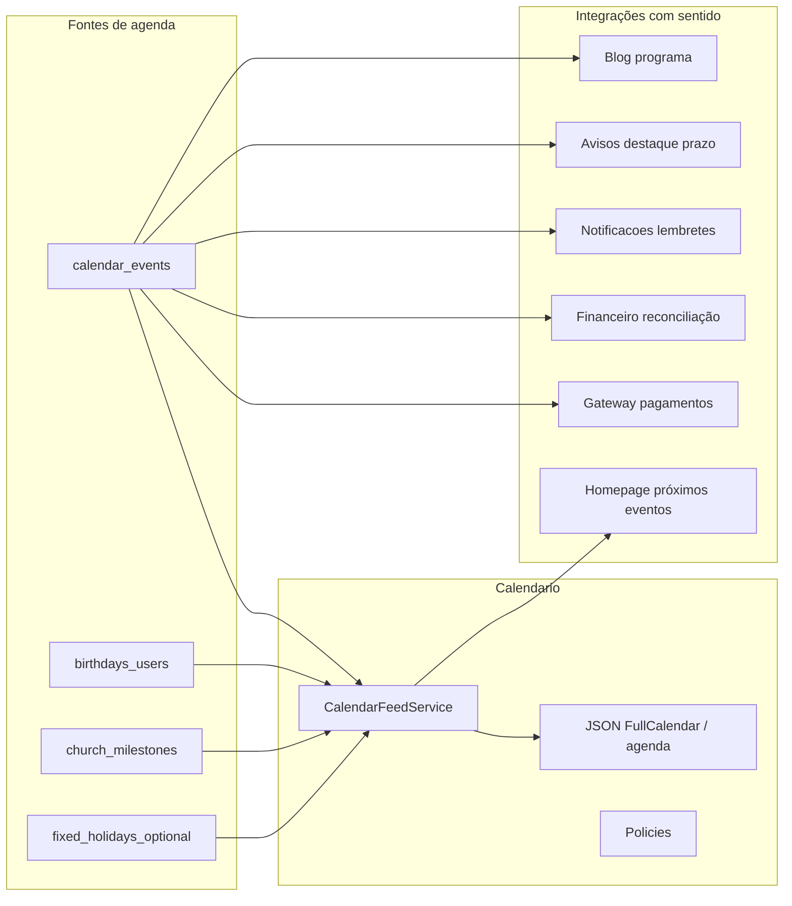

# Upgrade completo: Calendário / Agenda institucional JUBAF

## Estado atual (baseline)

- **[`Modules/Calendario`](c:\laragon\www\JUBAF\Modules\Calendario)**: já existe `CalendarEvent` + `CalendarRegistration`, CRUD diretoria, `CalendarioController` público **stub** (sem feed JSON real), dashboard simples.
- **Dados úteis no core**: [`User`](c:\laragon\www\JUBAF\app\Models\User.php) com `birth_date`; [`Church`](c:\laragon\www\JUBAF\app\Models\Church.php) com `foundation_date` (base para aniversário de congregação).
- **Referência Vertex** ([`VertexCBAV/Modules/Events`](c:\xampp\htdocs\VertexCBAV\Modules\Events)): usar como **lista de verificação de paridade**, não como código a colar. Vertex cobre: `EventService` (cálculo de total com regras/lotes), `EventPriceRule` / `EventBatch`, `EventRegistration` + `Participant`, temas públicos (`minimal`, `corporate`, `modern`), checkout, check-in, QR, `BadgePdfService` / `TicketPdfService` / `CertificatePdfService`, cupons, lembretes por comando, aprovação de conselho, `theme_config`, capacidade e notificações.
- **Meta explícita**: o produto JUBAF deve ser **mais completo e profissional** que o Vertex no contexto desta base — ou seja, **paridade nas capacidades de evento pago + UX admin/público + operação (check-in, PDFs)** e **superioridade** na **agenda institucional unificada**, integrações **Gateway + Financeiro** nativas, e **marca JUBAF** consistente (cores do logo, não genérico Indigo).

## Benchmark Vertex Events — paridade e “além”

| Área Vertex | Paridade (implementar no Calendario JUBAF)                                                                                                 | Além do Vertex (JUBAF)                                                                                                                        |
| ----------- | ------------------------------------------------------------------------------------------------------------------------------------------ | --------------------------------------------------------------------------------------------------------------------------------------------- |
| Modelo rico | `slug`, soft deletes opcional, `form_fields`/`schedule` JSON, contactos, restrições idade, `registration_deadline`, `max_per_registration` | `church_id` + visibilidade multi-congregação; feed único com aniversários/igreja                                                              |
| Preços      | Lotes (`EventBatch`), segmentos, regras priorizadas, cupom, early bird                                                                     | Cálculo único via serviço testado; valor final sempre espelhado na intenção Gateway/Financeiro                                                |
| Público     | 3+ temas Blade, landing hero, modal inscrição                                                                                              | Temas com tokens JUBAF (`theme_config` derivado da paleta oficial); secção “dicas / dress code / programa”                                    |
| Pagamento   | Checkout + confirmação                                                                                                                     | **Gateway** já do projeto (Cora etc.); reconciliação com **Financeiro**                                                                       |
| Operação    | Check-in admin, exportações                                                                                                                | Lista + scanner QR opcional; **badge/bilhete PDF** com logo [`public/images/logo/logo.png`](c:\laragon\www\JUBAF\public\images\logo\logo.png) |
| Automação   | Lembretes e-mail, release de reservas expiradas                                                                                            | Fila + **Notificacoes**; jobs idempotentes; opcional certificado pós-evento se `metadata` ativar                                              |
| Governança  | `requires_council_approval`                                                                                                                | Equivalente via `status = waiting_approval` + policy **PainelDiretoria** (sem duplicar módulo conselho se não existir)                        |

**Princípio de implementação**: extrair **padrões** (serviço de preço único, eventos de domínio `RegistrationConfirmed`, policies finas) das melhores partes do Vertex; **reescrever** em `Modules\Calendario` com namespaces, migrações e testes JUBAF.

## Arquitetura alvo

## 1. Modelo de dados e domínio

**Estender `calendar_events`** (migrations incrementais, sem quebrar registros):

| Campo / conceito                                      | Finalidade                                                                                           |
| ----------------------------------------------------- | ---------------------------------------------------------------------------------------------------- |
| `status`                                              | `draft`, `published`, `cancelled`, opcional `waiting_approval` (paridade Vertex)                     |
| `cover_path` / `banner_path`                          | capa institucional (storage `calendario/covers`)                                                     |
| `theme_config` JSON                                   | primária JUBAF (azul logo), secundária, variante layout público (`minimal` / `corporate` / `modern`) |
| `is_featured`                                         | destaque homepage / painéis                                                                          |
| `registration_deadline`, `max_participants` refinados | alinhar com lotes e fila de espera                                                                   |
| `form_fields` JSON                                    | campos dinâmicos do formulário público (paridade Vertex)                                             |
| `schedule` JSON                                       | cronograma por blocos (opcional)                                                                     |
| `requires_council_approval` bool                      | se fluxo diretoria exigir aprovação antes de `published`                                             |
| `blog_post_id` nullable                               | FK opcional para post de programa / reflexão                                                         |
| `aviso_id` nullable                                   | FK opcional para aviso de última hora / lembrete institucional                                       |
| `metadata` JSON                                       | dicas, dress code, público-alvo, flags certificado/badge                                             |

**Inscrições — evoluir além do modelo atual** ([`CalendarRegistration`](c:\laragon\www\JUBAF\Modules\Calendario\app\Models\CalendarRegistration.php) hoje 1 utilizador + gateway):

- Tabela **`calendar_event_batches`** (lote, preço, `starts_at`/`ends_at`, vagas) — equivalente `EventBatch`.
- Tabela **`calendar_price_rules`** (tipo regra, prioridade, condições JSON) — subconjunto das capacidades Vertex (cupom, early bird, idade, data inscrição) para não explodir escopo na primeira sprint; expandir iterativamente.
- Opcional **participantes por inscrição** (`calendar_registration_participants`) quando o evento exigir nome de acompanhantes/família; caso contrário manter inscrição única com `custom_responses` JSON na própria `calendar_registrations`.
- Serviço **`CalendarPricingService`** (nome final a definir) espelhando a responsabilidade de [`EventService::calculateRegistrationTotal`](c:\xampp\htdocs\VertexCBAV\Modules\Events\app\Services\EventService.php) com testes unitários.

**Tipos de entrada na agenda** (campo `type` ou `subtype` coerente com o existente):

- `evento`, `reuniao`, `culto_especial`, `campanha`, `formacao` (manter e alinhar labels).
- **Gerados (não duplicar linhas infinitas)**: serviço que projeta **aniversários de jovens** (a partir de `birth_date`) e **aniversário de igreja** (a partir de `foundation_date`) no intervalo consultado, com `id` sintético estável (`birthday:user:123:2026`) para o calendário.

**Privacidade aniversários**: política explícita — ex.: diretoria vê nome completo; jovens veem só “Aniversariante do dia” ou primeiro nome conforme `User`/config (definir regra única no `CalendarFeedService` + policy).

**Datas litúrgicas / feriados** (opcional fase 2): tabela pequena `calendar_fixed_entries` (título, mês/dia, escopo `geral|batista`) ou seed anual — evita dependência externa no MVP.

## 2. Serviço central: `CalendarFeedService`

- **Entrada**: `Carbon` range, `church_id` opcional, `context` (`diretoria|jovens|lider|public`).
- **Saída**: coleção normalizada para **FullCalendar** (title, start, end, allDay, backgroundColor por tipo, extendedProps).
- **Regras**: mesclar eventos persistidos + virtuais; respeitar `CalendarEventPolicy` e escopo de igreja (`church_id` / `visibility` já existentes).
- **Testes**: PHPUnit/Pest para intervalos, IDs sintéticos, e filtro por papel.

## 3. API e eliminação do stub

- Substituir o stub em [`CalendarioController`](c:\laragon\www\JUBAF\Modules\Calendario\app\Http\Controllers\CalendarioController.php) por endpoints reais ou mover para `Api\CalendarFeedController`.
- Rotas dedicadas em [`routes/diretoria.php`](c:\laragon\www\JUBAF\Modules\Calendario\routes\diretoria.php) / `api.php`: `GET .../feed?start=&end=&church_id=`.
- Autorização: middleware + policy por rota.

## 4. UI Diretoria (paridade com Financeiro)

- Refatorar [`dashboard.blade.php`](c:\laragon\www\JUBAF\Modules\Calendario\resources\views\paineldiretoria\dashboard.blade.php): hero com logo JUBAF, KPIs (eventos no mês, inscrições abertas, receita Gateway pendente/contabilizada se aplicável), **calendário mensal** (FullCalendar OSS + tema Tailwind v4.2), lista “próximos 7 dias”, filtros por tipo/igreja.
- Formulários create/edit em **secções** (como partials Vertex: básico, datas/local, aparência, inscrição, contactos, regras de preço) para sensação “produto SaaS”.
- Seguir [`tailwindcss-development`](c:\laragon\www\JUBAF.cursor\skills\tailwindcss-development\SKILL.md) e [`laravel-best-practices`](c:\laragon\www\JUBAF.cursor\skills\laravel-best-practices\SKILL.md).

## 5. Páginas públicas e inscrição

- **Múltiplos temas Blade** (derivados de [`VertexCBAV/.../public/themes`](c:\xampp\htdocs\VertexCBAV\Modules\Events\resources\views\public\themes)) com identidade JUBAF: hero, tipografia consistente, CTAs claros.
- Landing por evento: capa, data/hora, local, programa (`schedule`), CTA inscrição, modal ou página de checkout, confirmação pós-pagamento.
- **Preview** para diretoria antes de publicar (URL com token ou policy `draft`).
- Reutilizar e **endurecer** fluxo Gateway existente; total calculado apenas por `CalendarPricingService` + validação server-side (nunca confiar no cliente).

## 6. Integrações (apenas onde faz sentido)

| Módulo                           | Integração concreta                                                                                                                                                                                                                             |
| -------------------------------- | ----------------------------------------------------------------------------------------------------------------------------------------------------------------------------------------------------------------------------------------------- |
| **Notificacoes**                 | Job agendado: lembrete X dias antes (e-mail/push se já existir canal); reutilizar padrão de filas do projeto.                                                                                                                                   |
| **Avisos**                       | Ao publicar evento com `aviso_id` ou ação “criar aviso”: sincronizar título/prazo; ou campo opcional já ligado.                                                                                                                                 |
| **Blog**                         | `blog_post_id`: secção “Leia também” na página pública do evento.                                                                                                                                                                               |
| **Homepage**                     | Bloco “Próximos eventos” alimentado por `CalendarFeedService` + `is_featured` (estender [`HomepagePublicApiController`](c:\laragon\www\JUBAF\Modules\Homepage\app\Http\Controllers\Api\HomepagePublicApiController.php) ou secção equivalente). |
| **Financeiro / Gateway**         | Manter vínculo transação ↔ inscrição; dashboard calendário mostra totais (read-only).                                                                                                                                                           |
| **Igrejas**                      | Filtro e escopo por `church_id` (já alinhado ao modelo).                                                                                                                                                                                        |
| **Chat / Talentos / Secretaria** | **Não forçar** na v1; apenas se surgir FK útil (ex. `event_id` em talento) em iteracão posterior.                                                                                                                                               |

## 7. Escopo deliberadamente fora ou fase posterior

- Duplicar **Treasury/Campaign** do Vertex — JUBAF usa **Financeiro + Gateway**; campanhas = tipo de evento + categorização financeira.
- “Links úteis” sem entidade (evitar).
- Integrações **Chat / Talentos** até haver FK ou regra de negócio clara.

**Nota**: PDFs (badge, bilhete, certificado) passam de “opcional” para **entregáveis de paridade Vertex**, com prioridade após preço + checkout estável.

## 8. Ordem de implementação sugerida

1. Migrations (evento estendido + batches + regras mínimas) + `CalendarPricingService` com testes.
2. `CalendarFeedService` + API JSON + políticas.
3. UI diretoria (calendário + wizard + gestão inscrições/check-in).
4. Landings multi-tema + fluxo Gateway end-to-end.
5. PDFs operação + lembretes + integrações Homepage/Notificações/Avisos/Blog.
6. Aniversários + igreja + feriados fixos + privacidade.

## Ficheiros principais a tocar

- [`Modules/Calendario/database/migrations/`](c:\laragon\www\JUBAF\Modules\Calendario\database\migrations\) — novas colunas / índices.
- [`Modules/Calendario/app/Models/CalendarEvent.php`](c:\laragon\www\JUBAF\Modules\Calendario\app\Models\CalendarEvent.php) — casts, scopes `published`, `upcoming`.
- Novo: `app/Services/CalendarFeedService.php`, `app/Http/Controllers/Api/CalendarFeedController.php` (ou equivalente).
- Views painel: [`resources/views/paineldiretoria/`](c:\laragon\www\JUBAF\Modules\Calendario\resources\views\paineldiretoria\).
- [`Modules/Homepage`](c:\laragon\www\JUBAF\Modules\Homepage) — apenas o necessário para bloco de eventos.
