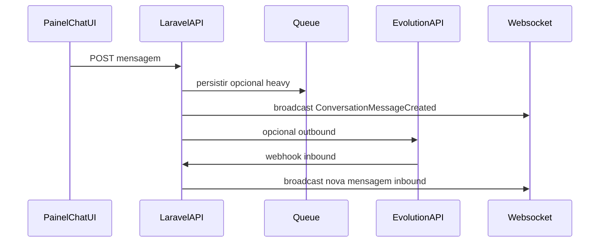

# Plano: Comunicação institucional (Avisos + Chat interno + WhatsApp + tempo real)

## Estado atual (repo)

- **[`Modules/Avisos/app/Models/Aviso.php`](Modules/Avisos/app/Models/Aviso.php)** — campos `titulo`, `conteudo`, `tipo`, `data_fim`, `church_ids`, etc.; sem pivot de leitura por utilizador.
- **[`Modules/Avisos/app/Services/AvisoService.php`](Modules/Avisos/app/Services/AvisoService.php)** — listagem e contadores de visualização globais; não há “ciente” por user.
- **Chat legado (visitantes)** — [`ChatSession`](Modules/Chat/app/Models/ChatSession.php) / `ChatMessage`, eventos [`ChatMessageSent`](Modules/Chat/app/Events/ChatMessageSent.php), canais em [`routes/channels.php`](routes/channels.php).
- **WhatsApp outbound** — [`WhatsappChannel`](Modules/Notificacoes/app/Notifications/Channels/WhatsappChannel.php) (Evolution `sendText`).
- **Broadcasting** — [`config/broadcasting.php`](config/broadcasting.php) só com `pusher`/log; [`package.json`](package.json) já tem `pusher-js`; variáveis em layouts (ex. Painel Líder).
- **RBAC** — [`config/jubaf_roles.php`](config/jubaf_roles.php), [`user_can_publish_avisos()`](app/helpers.php), [`jubaf_chat_agent_role_names()`](app/helpers.php), [`JubafRoleRegistry`](app/Support/JubafRoleRegistry.php). Papéis reais do projeto: `presidente`, `vice-presidente-1`, `vice-presidente-2`, `secretario-1`, `secretario-2`, `tesoureiro-*`, `lider`, `pastor` (não há slug genérico `vps`/`secretario` — mapear semântica para estes slugs).

Decisão confirmada: **estender a tabela `avisos`** (migrations aditivas), preservando usos existentes (homepage/banners) através de **flags/valores por omissão** para o novo modo “quadro institucional ERP”.

---

## 1) Camada de dados — Avisos

### Migrations (aditivas)

1. **`avisos`**
    - `uuid` (nullable → backfill único, depois unique).
    - `classificacao` (enum/string): `urgente` | `informativo` | `evento` (novo eixo; manter `tipo` atual para estilos legados onde necessário).
    - `target_role` (string nullable): ex. `lider`, `pastor`, `all`, ou lista JSON se precisarem vários papéis _numa fase posterior_ — MVP: **um slug Spatie por aviso**.
    - `expires_at` (timestamp nullable): para novos fluxos; **migrar `data_fim` → `expires_at` onde fizer sentido** (script one-shot na migration) e, na app, preferir `expires_at` com fallback para `data_fim` durante a transição.
    - Opcional: `escopo_erp` (boolean) ou `modo_quadro` para filtrar só avisos “institucionais” no painel sem quebrar avisos de site.

2. **`aviso_user_read`** (pivot / recibo)
    - `aviso_id`, `user_id`, `read_at`, unique (`aviso_id`, `user_id`).
    - Índices para “avisos não lidos do utilizador atual”.

### Modelo e relações

- Em [`Aviso`](Modules/Avisos/app/Models/Aviso.php): `HasUuids` ou trait próprio para `uuid`; relação `belongsToMany(User::class, 'aviso_user_read')->withTimestamps()` com `pivot read_at` (ou só `read_at` na pivot).
- Scopes: `forPainelInstitucional()`, `ativos()` respeitando `expires_at`/`data_fim`, `forTargetRole(User $viewer)`.

### API de leitura (“Ciente”)

- Rota POST autenticada (ex. `diretoria/avisos/{uuid}/ciente`, `lideres/...`) que faz `syncWithoutDetaching` / `attach` com `read_at = now()`.
- Retorno JSON ou redirect; o banner some quando não houver aviso aplicável **sem** linha em `aviso_user_read`.

---

## 2) Camada de dados — Chat interno (novo)

Tabelas novas (não substituir `chat_sessions` do widget público):

| Tabela                   | Campos principais                                                                                                     |
| ------------------------ | --------------------------------------------------------------------------------------------------------------------- |
| `chat_conversations`     | `id`, `uuid`, `is_group`, `name`, `created_by`, `whatsapp_remote_jid` (nullable, para correlação inbound), timestamps |
| `chat_conversation_user` | `conversation_id`, `user_id`, `last_read_at` (participantes; obrigatório para DM e grupos pequenos)                   |
| `chat_messages`          | `conversation_id`, `sender_id`, `body` (text), `attachment_path` (nullable), `created_at`                             |

- Foreign keys e índices em `conversation_id`, `sender_id`.
- Mensagens: evento de domínio separado dos nomes legados (`ChatMessage` do módulo atual) — preferir **novos models** `Conversation`, `ConversationMessage` (ou prefixo claro) para evitar colisão com [`ChatMessage`](Modules/Chat/app/Models/ChatMessage.php) existente.

---

## 3) Lógica de negócio — Avisos urgentes + WhatsApp

- **Estender** [`AvisoService`](Modules/Avisos/app/Services/AvisoService.php):
    - `criarParaInstitucional(...)` com transação, disparo condicional.
    - `avisosPendentesParaBanner(User)` — query eficiente (where not in read pivot + target_role + datas).

- **Job** `DispatchUrgentAvisoWhatsAppJob` (queue):
    - Disparado quando `classificacao === 'urgente'`.
    - Resolver destinatários: utilizadores com telefone válido e papel alvo (`target_role` / `all` com filtros).
    - Enviar via **`Notification` + `WhatsappChannel`**: criar `UrgentAvisoWhatsAppNotification` com `toWhatsapp()` devolvendo `phone` + `message` (texto curto + link para o painel), alinhado ao contrato em [`WhatsappChannel`](Modules/Notificacoes/app/Notifications/Channels/WhatsappChannel.php).

- **Throttle / idempotência**: guardar em `configuracoes` JSON ou coluna `whatsapp_dispatched_at` no `aviso` para não reenviar em reedições acidentais.

---

## 4) Webhook WhatsApp → Chat interno (Evolution)

- **Rota** dedicada no módulo Chat (ex. `POST /api/chat/whatsapp/webhook` ou prefixo alinhado a Notificações) — nome livre; o importante é **registar em [`bootstrap/app.php`](bootstrap/app.php) exceção CSRF** (como `gateway/webhooks/*`).
- **Controller** fino (`ChatWhatsAppWebhookController`) que:
    - Valida assinatura/token (config `notificacoes.evolution.webhook_secret` ou chave em `system_configs`).
    - Normaliza payload Evolution (versão documentada no vosso servidor) para: `from` (telefone/JID), `body`, `media_url` opcional.
    - Resolve `User` por telefone (mesma normalização que `WhatsappChannel`).
    - Localiza ou cria **conversa DM** entre esse utilizador e a “caixa diretoria” (ex. conversa sistema com participantes: user + um utilizador “suporte” ou pool via `last_message` e `jubaf_chat_agent_role_names()`).
    - Persiste `ConversationMessage` e despacha **evento broadcast** (ver abaixo).

- **Ligação com Notificações**: manter Evolution HTTP **no Chat**; `Notificacoes` continua a ser a fonte de config `notificacoes.evolution.*` (reutilizar `config/notificacoes.php`). Opcional: _listener_ interno se preferirem uma única entrada HTTP no módulo Notificações que delega ao Chat (desacoblar duplicação).

---

## 5) Broadcasting em tempo real

- **Recomendação operacional**: instalar e publicar **`laravel/reverb`** (Laravel 13), adicionar connection `reverb` em [`config/broadcasting.php`](config/broadcasting.php) e variáveis em `.env` / Admin runtime se aplicável. O cliente **Echo + pusher-js** fala com Reverb via driver `pusher` (protocolo compatível).
- Alternativa já alinhada ao código: **Pusher SaaS** — menos ops, usa o mesmo frontend; basta `BROADCAST_DRIVER=pusher` e credenciais.

- **Evento** `ConversationMessageCreated` implementando `ShouldBroadcast`:
    - `broadcastOn`: `PrivateChannel('conversation.'.$id)` ou presença se precisarem de “typing”.
- **[`routes/channels.php`](routes/channels.php)**:
    - `Broadcast::channel('conversation.{conversationId}', ...)` — apenas participantes em `chat_conversation_user` (e diretoria se política exigir auditoria).

- **Frontend**: novo bundle Alpine/Vite no layout do chat (painéis) subscrito ao canal privado com Echo; reutilizar `window.PUSHER_*` / acrescentar `VITE_*` para Reverb host/port se necessário.

---

## 6) RBAC (regras pedidas)

- **Criar avisos institucionais globais**: alinhar a [`user_can_publish_avisos()`](app/helpers.php) — já inclui presidente, VPs, secretários; **incluir tesoureiros** só se o produto quiser paridade “diretoria completa”; caso contrário manter lista atual e documentar.
- **Iniciar conversas**:
    - Utilizador com **qualquer papel em [`JubafRoleRegistry::directorateRoleNames()`](app/Support/JubafRoleRegistry.php)** ou `super-admin`: pode abrir conversa com `pastor` ou `lider` (lista pesquisável).
    - `pastor` / `lider`: **só** podem criar/obter conversa com utilizadores em `jubaf_chat_agent_role_names()` (diretoria + admin), ou política equivalente “só suporte institucional”.
- **`ChatConversationPolicy`** + validação ao `POST` criar conversa / adicionar participante.

---

## 7) UI/UX (Tailwind v4 + Flowbite v4.1)

- **Banner institucional** (Flowbite Alert fixo no topo):
    - Incluir partial/component no layout app da diretoria e do líder — candidatos: [`Modules/PainelDiretoria/resources/views/components/layouts/app.blade.php`](Modules/PainelDiretoria/resources/views/components/layouts/app.blade.php) e equivalente Painel Líder, **acima** do conteúdo principal, condicionado a `avisosPendentesParaBanner`.
    - Botão “Ciente” chama a rota de leitura; sem dismiss temporário que volte no refresh (persistência só na pivot).

- **Chat CRM**:
    - Nova view em `Modules/Chat/resources/views/paineldiretoria/chat-interno/` (e espelho `painellider/`), grid **sidebar + thread** (Tailwind: `grid`/`flex`, altura `min-h-[calc(100vh-...)]`), balões minimalistas, classes `dark:` consistentes com [`dashboard.blade.php`](Modules/PainelDiretoria/resources/views/dashboard.blade.php).

- **Rotas**: extensão de [`Modules/Chat/routes/web.php`](Modules/Chat/routes/web.php) (agrupamentos `diretoria.` / `lideres.` com middleware já usados noutros módulos) — seguir padrão de routes do projeto.

---

## 8) Testes e observabilidade

- Feature tests (padrão [`Modules/Avisos/tests`](Modules/Avisos/tests), [`Modules/Chat/tests`](Modules/Chat/tests)): criação de aviso urgente enfileira job; recibo de leitura; política de conversa; webhook com token inválido → 403.

---

## Riscos e mitigação

- **Colisão de nomes de models** `ChatMessage` — mitigar com novos nomes de classes/tabelas (`ConversationMessage`).
- **Telefone duplicado ou ausente** — webhook e job devem falhar silenciosamente com log (`NotificacaoLog` já existe para WhatsApp outbound).
- **Carga WhatsApp em “urgente”** — job em fila + chunk de destinatários.
