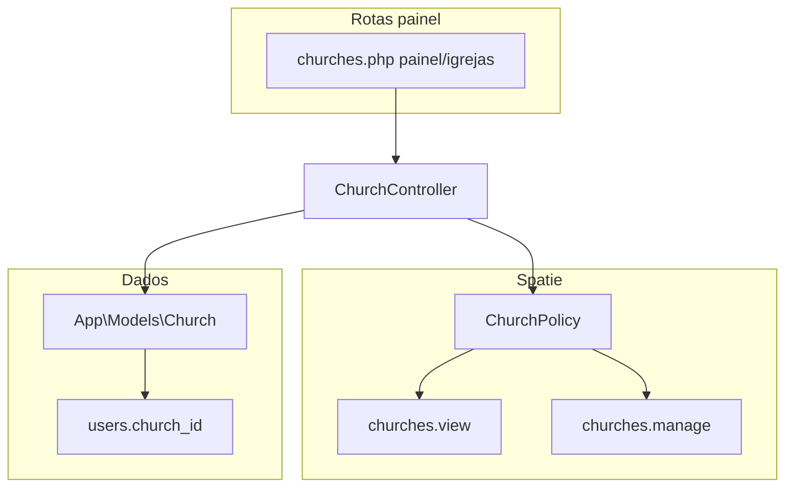

# Plano: Core (verificação) + Módulo Churches completo

## Fase 1 — Core: confirmação “ponta a ponta” (sem skeleton)

O plano original do Core já está materializado no repositório:

- CRUD `module_integration_settings` em `[routes/admin.php](routes/admin.php)` (`superadmin.core.integration-settings.*`), controlador e vistas em `[Modules/Core](Modules/Core)`.
- Política + permissão `core.integration.manage` no seeder (`[JubafRolesAndPermissionsSeeder](Modules/Auth/database/seeders/JubafRolesAndPermissionsSeeder.php)`).
- Helper `[Modules/Core/app/Support/ModuleIntegration.php](Modules/Core/app/Support/ModuleIntegration.php)` e `[Modules/Core/README.md](Modules/Core/README.md)`.
- Rotas stub removidas de `[Modules/Core/routes/web.php](Modules/Core/routes/web.php)` / `[api.php](Modules/Core/routes/api.php)`; sem segundo Vite no módulo.
- Testes em `[tests/Feature/Core/ModuleIntegrationSettingTest.php](tests/Feature/Core/ModuleIntegrationSettingTest.php)`.

**Ações desta fase (leves):**

1. Executar a suíte de testes completa (`php artisan test --compact`) e corrigir apenas regressões diretas.
2. Acrescentar no `[Modules/Core/README.md](Modules/Core/README.md)` uma secção curta **“Verificação”** com referência ao ficheiro de testes e checklist (rotas admin, permissão, sem CDN no módulo).
3. **Não** reintroduzir `package.json`/`vite.config.js` no Core (alinhado a AGENTS).

_(Opcional e só se quiserem “nice to have”: classe `EnabledModules` para listar módulos nwidart — não bloqueia Churches.)_

---

## Fase 2 — Módulo Churches (domínio completo)

### Contexto técnico atual

- Modelo `[App\Models\Church](app/Models/Church.php)` e tabela `churches` na migração `[Modules/Auth/database/migrations/2025_01_20_000000_create_churches_users_and_auth_tables.php](Modules/Auth/database/migrations/2025_01_20_000000_create_churches_users_and_auth_tables.php)`: `name`, `code`, `sector`, `city`, `address_line`, `pastor_name`, `unijovem_representative_name`, `pastor_user_id`.
- Permissões já existem: `churches.view`, `churches.manage` (`[JubafRolesAndPermissionsSeeder](Modules/Auth/database/seeders/JubafRolesAndPermissionsSeeder.php)`) — Secretário e Presidente mapeados; SuperAdmin tem todas.
- `[Modules/Churches](Modules/Churches)` está em **scaffold** (`[ChurchesController](Modules/Churches/app/Http/Controllers/ChurchesController.php)` vazio, `[routes/web.php](Modules/Churches/routes/web.php)` expõe `/churches` a qualquer autenticado, layout com **CDN Bunny Fonts** — a corrigir).

### Decisões de desenho

| Tópico             | Decisão                                                                                                                                                                                                                 |
| ------------------ | ----------------------------------------------------------------------------------------------------------------------------------------------------------------------------------------------------------------------- |
| Onde fica o modelo | Manter `App\Models\Church` (já referenciado por `User`, `BoardMember`, etc.). O módulo Churches contém controladores, policies, views, requests.                                                                        |
| Rotas              | **Não** usar apenas `role:SuperAdmin`. Secretário e Presidente precisam de `painel/igrejas` com **política** baseada em `churches.view` / `churches.manage`. SuperAdmin acede pelo mesmo sítio (tem `churches.manage`). |
| URLs               | Prefixo `painel/igrejas` alinhado a `painel/diretoria` — nomes `painel.igrejas.`.                                                                                                                                       |
| UI                 | Reutilizar `[auth::layouts.panel](Modules/Auth/resources/views/layouts/panel.blade.php)` (Vite raiz, tema, sem CDN), padrão já usado na diretoria.                                                                      |
| Ícone de módulo    | `<x-module-icon module="churches" />` em nav conforme `[config/module_icons.php](config/module_icons.php)`.                                                                                                             |

### Dados e migração

Nova migração em `Modules/Churches/database/migrations/` (não editar a migração Auth já aplicada em produções sem cuidado) para acrescentar campos úteis ao **cadastro institucional** (PLANO: 70+ igrejas, setores, contactos):

- `is_active` (boolean, default true)
- Contacto: `phone`, `email` (nullable)
- Morada: `state`, `postal_code` (nullable) — complementar `address_line`/`city`
- `notes` (text, nullable) — observações internas
- Opcional: `leader_user_id` (nullable FK `users.id`) para representante Unijovem como utilizador, mantendo `unijovem_representative_name` para legado/backup

Atualizar `[database/factories/ChurchFactory.php](database/factories/ChurchFactory.php)` e `$fillable` / relações em `Church` (ex.: `leaderUser()`).

### Autorização

- `ChurchPolicy` com: `viewAny`/`view` → `churches.view` **ou** `churches.manage` **ou** `admin.full`; `create`/`update`/`delete` → `churches.manage` (e SuperAdmin via permissões).
- Registar política em `[ChurchesServiceProvider](Modules/Churches/app/Providers/ChurchesServiceProvider.php)` com `Gate::policy(Church::class, ChurchPolicy::class)`.
- Form Requests (`StoreChurchRequest`, `UpdateChurchRequest`) com regras explícitas e `authorize()` alinhado à política.

### HTTP

- Substituir o scaffold por `ChurchController` (resource: index, create, store, show, edit, update, destroy) com `authorizeResource` ou `$this->authorize()` por ação.
- `index`: listagem com **pesquisa** (nome, código, cidade), **filtro por setor**, ordenação, paginação; contadores úteis (ex.: n.º de utilizadores ligados) via `withCount('users')` quando fizer sentido.
- `show`: dados da igreja + ligação ao pastor (`pastorUser`) e lista resumida de utilizadores da igreja (limite/paginação) — leitura conforme política.
- `pastor_user_id`: select de utilizadores elegíveis (ex.: papel Pastor Local ou filtro por `can('localchurch.view')` + validação `exists:users,id`); documentar regra no README.

### Rotas e bootstrap

- Ficheiro novo `[routes/churches.php](routes/churches.php)`: `Route::prefix('painel')->name('painel.')->group(...)` com `Route::resource('igrejas', ChurchController::class)` (parâmetro singular `church`).
- Registar o grupo em `[bootstrap/app.php](bootstrap/app.php)` dentro de `then`, com middleware `web` + `auth` (autorização fina na policy).
- Limpar `[Modules/Churches/routes/web.php](Modules/Churches/routes/web.php)` (comentário ou vazio como no Core); remover referências a resource público.
- `[Modules/Churches/routes/api.php](Modules/Churches/routes/api.php)`: placeholder sem `apiResource` incorreto.

### UX global

- `[PostLoginRedirect::defaultUrl](Modules/Auth/app/Support/PostLoginRedirect.php)`: utilizador com `churches.manage` (ex.: Secretário) e **sem** destino mais prioritário (SuperAdmin / diretoria) deve ir para `route('painel.igrejas.index')` — inserir regra **na ordem correta** relativamente a `board.meetings` e painéis locais.
- Barra do painel: secção `nav-brand` nas vistas Churches com links (lista, criar se `@can`), ícone do módulo; opcionalmente um link “Igrejas” no menu SuperAdmin para a **mesma** rota `painel.igrejas.` (evita duplicar CRUD só em SuperAdmin).

### Limpeza do módulo Churches

- Remover CDN de `[Modules/Churches/resources/views/components/layouts/master.blade.php](Modules/Churches/resources/views/components/layouts/master.blade.php)` e views stub que dependam dele **ou** eliminar ficheiros mortos se tudo passar a `auth::layouts.panel` + `churches::`.
- Remover duplicado de frontend no módulo (`[package.json](Modules/Churches/package.json)`, `vite.config.js`, `resources/css|js` locais) como no Core, documentado no README do módulo.

### Testes e qualidade

- Feature tests: Secretário (ou utilizador com `churches.manage`) CRUD; Presidente só index/show (403 em create/update/delete); utilizador sem permissão 403; validação mínima.
- `vendor/bin/pint --dirty`.
- `[Modules/Churches/README.md](Modules/Churches/README.md)`: propósito (PLANOJUBAF), rotas nomeadas, permissões, modelo de dados, como escolher pastor/representante, integração com Auth/Core.
- Entrada em `[CHANGLOG.md](CHANGLOG.md)`.

---

## Ordem de execução sugerida

1. Fase 1 (Core): testes globais + README tweak.
2. Migração + modelo + factory.
3. Policy + requests + controller + `routes/churches.php` + `bootstrap/app.php`.
4. Views Blade + `PostLoginRedirect` + links de navegação.
5. Limpeza stub/CDN/Vite duplicado no módulo Churches.
6. Testes + Pint + CHANGLOG + README Churches.
