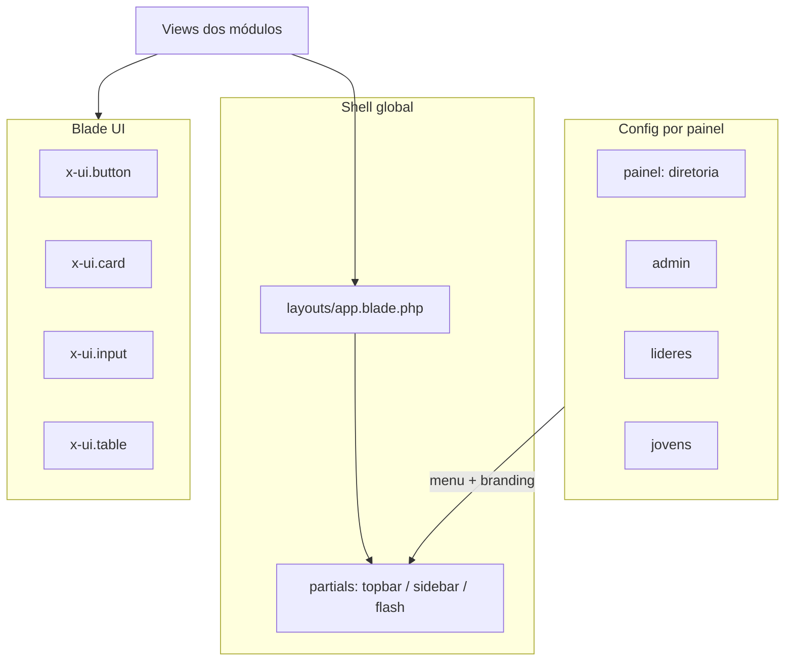

# Plano: Design System global (layouts + `x-ui.*` + painéis)

## Diagnóstico do estado atual

- **Vários “apps” paralelos:** o shell logado não é único.
  - [`resources/views/components/layouts/app.blade.php`](resources/views/components/layouts/app.blade.php) usa Alpine (`darkMode`, `sidebarCollapsed`) e [`x-sidebar`](resources/views/components/sidebar.blade.php) (lista de módulos por `Module::allEnabled()`).
  - **Diretoria** usa [`Modules/PainelDiretoria/.../layouts/app.blade.php`](Modules/PainelDiretoria/resources/views/components/layouts/app.blade.php) com includes pesados ([`navbar.blade.php`](Modules/PainelDiretoria/resources/views/components/layouts/navbar.blade.php), [`sidebar.blade.php`](Modules/PainelDiretoria/resources/views/components/layouts/sidebar.blade.php)), flash inline, script vanilla para menu do utilizador, e tema via [`resources/js/dark-mode.js`](resources/js/dark-mode.js) + `themeChanged`.
  - **Admin** usa [`Modules/Admin/.../layouts/admin.blade.php`](Modules/Admin/resources/views/layouts/admin.blade.php) + [`navbar-admin.blade.php`](Modules/Admin/resources/views/layouts/navbar-admin.blade.php) (Flowbite `data-drawer-*`, notificações com SQL direto no Blade).
  - **Líderes / Jovens** partilham padrão “glass” + Alpine `sidebarOpen` em [`PainelLider/.../layouts/app.blade.php`](Modules/PainelLider/resources/views/components/layouts/app.blade.php) e [equivalente Jovens](Modules/PainelJovens/resources/views/components/layouts/app.blade.php), com acentos distintos (esmeralda vs violeta).
- **Módulos “feature”** (ex.: Financeiro, Secretaria) têm [`components/layouts/master.blade.php`](Modules/Financeiro/resources/views/components/layouts/master.blade.php) mínimo (só `{{ $slot }}`); **não** são o shell real — o tráfego de Diretoria usa ` @extends($layout)` com `'paineldiretoria::components.layouts.app'` passado pelos controladores (ex.: [ExpenseRequestController](Modules/Financeiro/app/Http/Controllers/Diretoria/ExpenseRequestController.php)).
- **Duplicação de padrões de página:** hero + filtros + tabelas repetem classes; exemplo: [`igrejas/.../churches/index.blade.php`](Modules/Igrejas/resources/views/paineldiretoria/churches/index.blade.php) (ciano), [`financeiro/.../transactions/index.blade.php`](Modules/Financeiro/resources/views/paineldiretoria/transactions/index.blade.php) e [`secretaria/.../minutes/index.blade.php`](Modules/Secretaria/resources/views/paineldiretoria/minutes/index.blade.php) (emerald) — tipografia alinhada por convenção, mas **acentos e tokens inline** divergem.
- **Stack frontend:** [`package.json`](package.json) — Tailwind `^4.2`, `flowbite` `^4.0.1`, Alpine `^3.15`; [`resources/js/app.js`](resources/js/app.js) importa **Flowbite** e **Preline** — convém evitar dois sistemas de dropdown/drawer no mesmo shell; o plano assume **Flowbite como base do layout** e Preline só onde já for indispensável.
- **Componentes existentes a reutilizar:** [`x-notifications-dropdown`](resources/views/components/notifications-dropdown.blade.php) (já adapta rotas `admin.*` / `diretoria.*` / `jovens.*` / `lideres.*`), [`x-user-avatar`](resources/views/components/user-avatar.blade.php), [`x-icon`](resources/views/components/icon.blade.php), [`x-toast`](resources/views/components/toast.blade.php), [`x-loading-overlay`](resources/views/components/loading-overlay.blade.php). **Identidade de módulo:** manter [`x-module-icon`](resources/views/components/module-icon.blade.php) em heróis/menus conforme [`.cursor/skills/jubaf-module-icons/SKILL.md`](.cursor/skills/jubaf-module-icons/SKILL.md).

## Arquitetura alvo

1. **`resources/views/layouts/app.blade.php` (master único)**
   - Contrato: `@extends('layouts.app')` com `@section('title')`, `@section('content')`, `@stack('styles')`, `@stack('scripts')`.
   - Conteúdo: anti-FOUC de tema (mesma lógica que Diretoria/Admin — classe `dark` em `<html>`), CSRF, Vite, broadcasting, banner de impersonação (extrair bloco partilhado), **main scroll** e content wrapper com `max-w-7xl` / padding já alinhados aos dashboards atuais.
   - **Variáveis de contexto do painel** (uma abordagem objetiva):
     - **Opção A (recomendada):** `View::composer` que regista `panel` = `diretoria|admin|lideres|jovens` e `panelMenuView` (nome da partial do menu) com base em prefixo de rota / guard.
     - **Opção B:** manter includes por módulo (`paineldiretoria::...sidebar`) mas **todos** incluídos a partir do mesmo `layouts.app` via `@include($panelMenuView)`.
   - Evitar copiar 400 linhas por painel: extrair **partials globais** em `resources/views/layouts/partials/` (`topbar.blade.php`, `sidebar-shell.blade.php`, `impersonation-banner.blade.php`, `flash-messages.blade.php`).

2. **Sidebar retrátil + dropdowns (Flowbite v4)**
   - Desktop: sidebar com largura total vs. ícones (retrátil), usando padrão Flowbite (`data-collapse-toggle` / componentes de sidebar documentados para v4) + **Alpine** só para animação (`x-transition`) se o data-API não cobrir transição desejada.
   - Itens simples + **submenus** (accordion ou botão que abre lista) — espelhar a estrutura já existente em [sidebar Diretoria](Modules/PainelDiretoria/resources/views/components/layouts/sidebar.blade.php) (grupos “Site”, “Org”, etc.).
   - Mobile: um único drawer/offcanvas (alinhado ao que Admin já faz com `data-drawer-target`).

3. **Topbar**
   - Logo + título do painel (usar `SiteBranding` onde já existe).
   - **Busca global (design):** campo com estilo final e `name="q"` opcional; se não existir rota unificada, `form` aponta para pesquisa contextual (ex.: `GET` dashboard atual) ou fica `disabled` com `title` explicando — evita prometer backend inexistente.
   - Notificações: **preferir** unificar Admin em [`x-notifications-dropdown`](resources/views/components/notifications-dropdown.blade.php) ou serviço partilhado para remover SQL do Blade em [`navbar-admin`](Modules/Admin/resources/views/layouts/navbar-admin.blade.php).
   - Perfil: dropdown com itens + **toggle de tema movido para dentro do menu** (requisito) + `handleLogout` já usado na Diretoria (reutilizar script ou extrair para `resources/js/auth-ui.js` incluído uma vez).
   - Dark mode: **uma** fonte de verdade — continuar [`dark-mode.js`](resources/js/dark-mode.js) (`toggleTheme`, `themeChanged`) e remover duplicação de `toggleTheme` inline na Diretoria onde possível.

4. **Biblioteca `resources/views/components/ui/`**
   Namespace Laravel: `x-ui.button`, etc. (pastas `components/ui/`). Props típicas:
   - `button`: `variant` (`primary|secondary|danger|ghost`), `size` (`sm|md|lg`), `type`, `href` opcional (render `<a>` vs `<button>`).
   - `card`: `title`, slots `header` / default / `footer`.
   - `input` / `select`: `label`, `name`, `value`, `error` (nome do campo para `@error`), `icon` opcional slot ou prop.
   - `table`: wrapper com `<table class="...">`, slots `head` / `body` ou columns (manter flexível para `forelse` nas views).
   - `badge`: `tone` para estados (sucesso, alerta, neutro) — mapear para cores discretas “corporativas”.
   - `modal`: Flowbite modal (`data-modal-*`) **ou** Alpine (`x-show` + foco com `@alpinejs/focus` já no projeto); documentar um padrão no código.
   - **Tokens:** centralizar classes repetidas em `@php` no componente ou num único ficheiro PHP de classes (ex.: `App\View\UiClass`) se o Blade ficar pesado — objetivo é **um** conjunto de classes para cabeçalho de tabela, zebra e células.

5. **Alinhamento visual “data-heavy”**
   - Normalizar **uma** escala tipográfica para títulos de página (`text-xs` label, `text-2xl/3xl` título), espaçamento vertical (`space-y-8`, `pb-10`), cartões de filtro (`x-ui.card` ou variante `.dense`).
   - **Unificar acentos:** hoje Igrejas usa **cyan** e Financeiro/Secretaria **emerald** ([`churches/index`](Modules/Igrejas/resources/views/paineldiretoria/churches/index.blade.php) vs [`transactions/index`](Modules/Financeiro/resources/views/paineldiretoria/transactions/index.blade.php)). Decisão de produto:
     - **Recomendado:** shell neutro (slate/gray) + **acento único institucional** (ex.: indigo ou slate-900) para CTAs e links; **OU** prop `accent="emerald"` nos heróis apenas se quiserem manter “cor por módulo” sem refazer branding.

## Migração por fases (entregáveis)

| Fase  | O quê                                                                                                                                                                                                                                                                                                                                                                                                       |
| ----- | ----------------------------------------------------------------------------------------------------------------------------------------------------------------------------------------------------------------------------------------------------------------------------------------------------------------------------------------------------------------------------------------------------------- |
| **1** | Criar `layouts/app.blade.php` + partials (topbar/sidebar/flash/impersonation); registrar view composers; manter compatibilidade `@yield('content')`.                                                                                                                                                                                                                                                        |
| **2** | Implementar componentes `x-ui.*` mínimos (button, card, input, select, table, badge, modal).                                                                                                                                                                                                                                                                                                                |
| **3** | **Diretoria:** apontar `paineldiretoria::components.layouts.app` para `@extends('layouts.app')` com thin wrapper **ou** substituir o ficheiro do módulo por `@extends('layouts.app')` e mover includes para partials globais; atualizar controladores que passam `'layout' => 'paineldiretoria::components.layouts.app'` para `'layouts.app'` (string única).                                               |
| **4** | **Financeiro + Secretaria (Diretoria):** refatorar listagens/extratos priorizados — [`transactions/index`](Modules/Financeiro/resources/views/paineldiretoria/transactions/index.blade.php), dashboard financeiro, [`minutes/index`](Modules/Secretaria/resources/views/paineldiretoria/minutes/index.blade.php) e timeline/show se existir HTML repetido — para `x-ui.table`, `x-ui.input`, `x-ui.button`. |
| **5** | **Igrejas:** [`paineldiretoria/churches/index.blade.php`](Modules/Igrejas/resources/views/paineldiretoria/churches/index.blade.php) — mesma tabela e filtros que as acima; substituir `$filterClass` por componentes.                                                                                                                                                                                       |
| **6** | **PainelLider:** dashboard + 1–2 formulários representativos; alinhar sidebar ao shell (retirar duplicação de loading global se possível).                                                                                                                                                                                                                                                                  |
| **7** | **Admin:** reduzir divergência — `admin.blade.php` estende ou compõe o mesmo `layouts.app` com `panel=admin` e sidebar Admin; unificar notificações e tema.                                                                                                                                                                                                                                                 |
| **8** | **Polimento Alpine:** garantir `x-transition` em dropdown do perfil, modal e sidebar mobile onde aplicável; rever conflitos Flowbite/Preline no mesmo elemento.                                                                                                                                                                                                                                             |

## Ficheiros principais a tocar (referência)

- Novo: [`resources/views/layouts/app.blade.php`](resources/views/layouts/app.blade.php), `resources/views/layouts/partials/*`, `resources/views/components/ui/*`.
- Possível registo: [`app/Providers/AppServiceProvider.php`](app/Providers/AppServiceProvider.php) ou provider dedicado `ViewServiceProvider` para composers.
- Atualizar: módulos listados [PainelDiretoria `app.blade.php`](Modules/PainelDiretoria/resources/views/components/layouts/app.blade.php), [Admin `admin.blade.php`](Modules/Admin/resources/views/layouts/admin.blade.php), [PainelLider `app.blade.php`](Modules/PainelLider/resources/views/components/layouts/app.blade.php); controladores Financeiro/Secretaria que passam `$layout`; views citadas de Igrejas/Financeiro/Secretaria.
- JS: eventual extração de trechos inline de [PainelDiretoria `app.blade.php`](Modules/PainelDiretoria/resources/views/components/layouts/app.blade.php) para `resources/js/`.

## Riscos e mitigação

- **Quebra de `@extends($layout)`:** atualizar todas as strings `'paineldiretoria::components.layouts.app'` e testar rotas Diretoria (Financeiro, Secretaria, Igrejas, etc.).
- **Dois sistemas UI (Flowbite vs Preline):** no shell novo, preferir atributos Flowbite; não misturar `data-hs-*` com `data-dropdown-toggle` no mesmo controlo.
- **Performance Blade:** componentes muitos aninhados — manter props simples; usar slots só quando necessário.

## Verificação manual sugerida

- Alternar tema (perfil + persistência `localStorage`), sidebar desktop retrátil, drawer mobile em `admin` e `diretoria`, páginas listadas com **mesmo** espaçamento de tabela em Igrejas / Financeiro / Secretaria, e regressão em [`x-notifications-dropdown`](resources/views/components/notifications-dropdown.blade.php).
