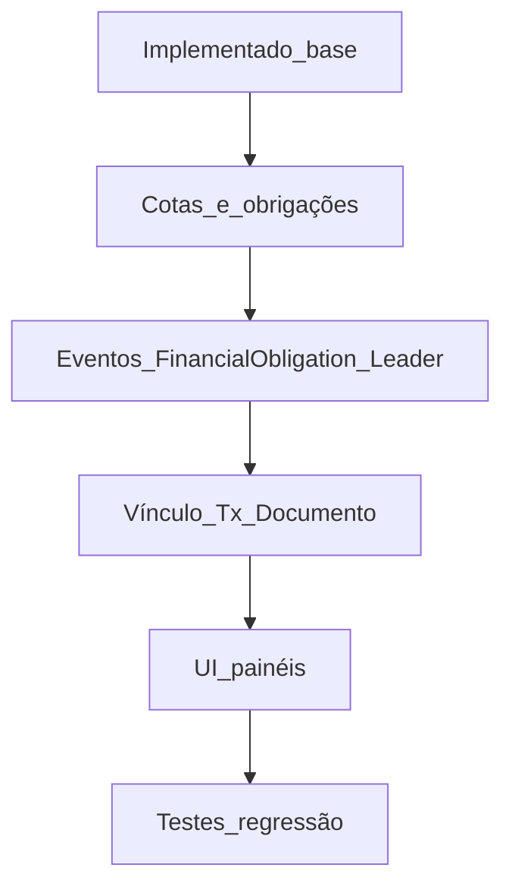

# Estado atual vs plano (síntese)

**Já alinhado com o plano (evidência no código):**

- Modelo canónico descrito em [`docs/erp-canonical-model.md`](c:/laragon/www/JUBAF/docs/erp-canonical-model.md) (JubafSector, Church, User, Minute, FinTransaction).
- Filtros por setor via [`app/Support/ErpChurchScope.php`](c:/laragon/www/JUBAF/app/Support/ErpChurchScope.php) em consultas de igrejas, atas e lançamentos; dashboards/relatórios financeiros e lista de transacções com o mesmo padrão.
- Eventos e listeners: `MinutePublished` + [`DispatchMinutePublishedIntegrations`](c:/laragon/www/JUBAF/Modules/Secretaria/app/Listeners/DispatchMinutePublishedIntegrations.php); `ChurchSectorAssigned` + auditoria (equivalente funcional a “igreja atribuída a setor” do plano).
- Runbook de hospedagem partilhada: [`docs/runbook-shared-hosting.md`](c:/laragon/www/JUBAF/docs/runbook-shared-hosting.md).
- Admin de utilizadores com `jubaf_sector_id` para VPs (módulo Permisao).

**Lacunas relevantes face ao plano anexo e ao [`update_projeto/1.md`](c:/laragon/www/JUBAF/update_projeto/1.md):**

| Área                                            | Situação                                                                                                                                                                                                                                                                                                            |
| ----------------------------------------------- | ------------------------------------------------------------------------------------------------------------------------------------------------------------------------------------------------------------------------------------------------------------------------------------------------------------------- |
| **Eventos canónicos do plano**                  | `LeaderAssignedToChurch`, `FinancialObligationGenerated`, `FinancialObligationPaid` **não aparecem** no código; não há substituição directa além de `MinutePublished` / `ChurchSectorAssigned`.                                                                                                                     |
| **Cotas / obrigações financeiras**              | O plano e o `update_projeto` pedem geração e acompanhamento de cotas por igreja; o modelo actual centra-se em `FinTransaction` + `FinExpenseRequest` sem entidade de “obrigação” nem job de geração em massa.                                                                                                       |
| **Vínculo financeiro ↔ documento (ata/ofício)** | Existe `document_ref` livre em [`FinTransaction`](c:/laragon/www/JUBAF/Modules/Financeiro/app/Models/FinTransaction.php); **não há** FK opcional para `Minute` ou modelo de ofício como “evidência” estruturada.                                                                                                    |
| **Gateway → igreja/setor**                      | [`ReconcilePaymentToFinTransactionJob`](c:/laragon/www/JUBAF/Modules/Gateway/app/Jobs/ReconcilePaymentToFinTransactionJob.php) cria receitas com `scope` regional e `church_id` null; isso é coerente com receita associacional, mas **não** cobre “cota por igreja” nem eventos `FinancialObligationPaid`.         |
| **Workflow secretaria**                         | Estados actuais incluem `draft` → `pending_approval` → `approved` → `published` (ver [`MinuteController` diretoria](c:/laragon/www/JUBAF/Modules/Secretaria/app/Http/Controllers/Diretoria/MinuteController.php)); **estado “arquivado”** e regras formais de todas as transições do plano podem estar incompletos. |
| **Pessoa / membro único (SSOT)**                | O plano e o `update_projeto` falam em membro global; o sistema continua **centrado em `User`** + igrejas; não há modelo `Member` partilhado entre Talentos/Secretaria.                                                                                                                                              |
| **UI/UX painéis (Fase 5 do plano)**             | Não há evidência de uma passagem sistemática por [`PainelDiretoria` / `PainelLider` / `PainelJovens`](c:/laragon/www/JUBAF/Modules) para padronizar layout; é trabalho maioritariamente de front.                                                                                                                   |
| **Testes**                                      | Além de um teste unitário mínimo em [`tests/Unit/ErpChurchScopeTest.php`](c:/laragon/www/JUBAF/tests/Unit/ErpChurchScopeTest.php), **falta** suíte de regressão para fluxos críticos (publicar ata, VP não ver outro setor, lançamento por igreja).                                                                 |

---

## Próximos passos recomendados (por ordem)

1. **Operacional (antes de mais código)**
    - Correr migrações ERP em produção/staging; completar **backfill** de `igrejas_churches.jubaf_sector_id` e `users.jubaf_sector_id` (VPs), conforme ondas em [`docs/erp-canonical-model.md`](c:/laragon/www/JUBAF/docs/erp-canonical-model.md).
    - Validar com utilizadores reais: VP só vê setor; tesoureiro/secretário veem o esperado.

2. **Produto financeiro: cotas e obrigações (maior gap vs plano)**
    - Desenhar entidade `FinObligation` (ou nome alinhado ao domínio): igreja, período, valor, estado, vínculo opcional a pagamento/Gateway.
    - Comando ou job agendado para **gerar** obrigações (cron + fila `database`).
    - Disparar eventos canónicos `FinancialObligationGenerated` / `FinancialObligationPaid` e listeners (Notificacoes, relatórios).
    - Alinhar reconciliação Gateway: quando o pagamento for “cota da igreja X”, preencher `church_id` e associar à obrigação.

3. **Governança documental**
    - Opcional: `minute_id` ou `secretaria_document_id` em `fin_transactions` (além de `document_ref` texto) para relatórios e auditoria.
    - Completar workflow (ex.: `archived`) e políticas por transição, se ainda faltarem no [`MinutePolicy`](c:/laragon/www/JUBAF/Modules/Secretaria/app/Policies/MinutePolicy.php).

4. **Eventos de pessoas**
    - Ao sincronizar `user_churches` / congregação principal do líder, disparar `LeaderAssignedToChurch` e listeners (notificações, caches), em vez de só persistir pivot.

5. **UI Fase 5**
    - Componentes partilhados e revisão de dashboards/sidebars em PainelDiretoria, PainelLider, PainelJovens (Tailwind v4 já no projeto).

6. **Qualidade**
    - Feature tests para: publicação de ata (evento + notificação), escopo VP em rota de igrejas/financeiro, validação de igreja fora do setor em lançamentos.
    - Documentar catálogo de eventos/listeners em `docs/` (extensão natural do parágrafo “Eventos de integração” em [`erp-canonical-model.md`](c:/laragon/www/JUBAF/docs/erp-canonical-model.md)).

---

## Nota sobre o pedido “implementar o plano completo”

A sessão anterior marcou entregas como concluídas; **este inventário** separa o que está efectivamente no repositório do que o plano de longo prazo (cotas, SSOT de membros, UI total, eventos financeiros nomeados) ainda exige. O **próximo passo único mais impactante** para fechar a visão ERP do documento anexo é: **dados em produção + desenho/implementação do módulo de cotas/obrigações financeiras com eventos e Gateway**, em sequência ao que já existe.
