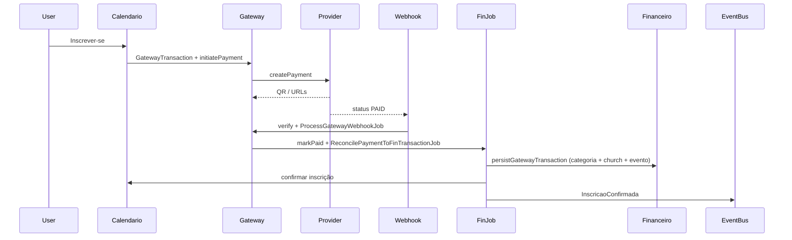

# Plano: Sistema de Eventos e Inscrições Regional (Calendário + Gateway)

## Estado actual (base já existente)

- **Eventos e inscrições:** [`CalendarEvent`](Modules/Calendario/app/Models/CalendarEvent.php) em `calendar_events`, [`CalendarRegistration`](Modules/Calendario/app/Models/CalendarRegistration.php) em `calendar_registrations`, com `gateway_payment_id`, lotes (`calendar_event_batches`) e preços (`calendar_price_rules`).
- **Checkout:** [`ParticipationController::register`](Modules/Calendario/app/Http/Controllers/ParticipationController.php) cria `GatewayPayment` morfado na inscrição e redirecciona para [`gateway.public.checkout`](Modules/Gateway/routes/web.php).
- **Gateway:** [`PaymentOrchestrator`](Modules/Gateway/app/Services/PaymentOrchestrator.php) + [`PaymentProviderContract`](Modules/Gateway/app/Services/Contracts/PaymentProviderContract.php) (drivers MercadoPago, Stripe, etc.), webhooks em [`GatewayWebhookController`](Modules/Gateway/app/Http/Controllers/Webhooks/GatewayWebhookController.php) com assinatura + fila [`ProcessGatewayWebhookJob`](Modules/Gateway/app/Jobs/ProcessGatewayWebhookJob.php).
- **Financeiro:** [`ReconcilePaymentToFinTransactionJob`](Modules/Gateway/app/Jobs/ReconcilePaymentToFinTransactionJob.php) cria `FinTransaction` com `source = gateway`, categoria [`FinCategory::CODE_REC_INSCRICOES_EVENTOS`](Modules/Financeiro/app/Models/FinCategory.php) para fluxos sem obrigação/cota, e confirma inscrição quando o _payable_ é `CalendarRegistration`. **Gap:** `church_id` e `calendar_event_id` não são preenchidos sistematicamente para inscrições — deve vir do **comprador** (igreja do utilizador) e do evento.
- **UI checkout:** [`checkout.blade.php`](Modules/Gateway/resources/views/public/checkout.blade.php) é mínima (link externo); [`CreatePaymentResult`](Modules/Gateway/app/Services/Dto/CreatePaymentResult.php) não expõe campos dedicados a PIX (QR/base64).
- **Notificações:** [`NotificacaoService`](Modules/Notificacoes/app/Services/NotificacaoService.php) — in-app + e-mail opcional; **não há integração WhatsApp server-side** no repositório. O requisito de voucher por WhatsApp implica **novo contrato + implementação** (ou stub com log).

Decisão tua (confirmada): **renomear tabelas** para `eventos`, `evento_inscricoes`, `gateway_transactions` e alinhar FKs/campos onde fizer sentido — impacto transversal (ver secção “Superfície de impacto”).

---

## 1. Modelo de dados (migrações)

### 1.1 Renomeação de tabelas (ordem sugerida)

Ordem para respeitar FKs (ajustar conforme schema real ao correr `Schema::getColumnListing`):

1. Tabelas satélite do calendário: `calendar_event_batches` → `evento_batches`, `calendar_price_rules` → `evento_price_rules` (se existirem FKs para `calendar_events`, renomear depois do passo 2 ou com `Schema::disableForeignKeyConstraints()` em ambiente controlado).
2. `calendar_registrations` → `evento_inscricoes`; renomear colunas conforme spec:
    - `event_id` mantém significado (FK `eventos.id`).
    - `gateway_payment_id` → `payment_id` (FK para `gateway_transactions.id`).
3. `calendar_events` → `eventos`.
4. `gateway_payments` → `gateway_transactions`.

### 1.2 Colunas alinhadas ao spec (sobre `eventos`)

| Conceito spec             | Mapeamento sugerido                                                                                                                                                                                   |
| ------------------------- | ----------------------------------------------------------------------------------------------------------------------------------------------------------------------------------------------------- |
| `uuid`                    | Nova coluna `uuid` (UUID), backfill em migração; índice único.                                                                                                                                        |
| `start_date` / `end_date` | Renomear `starts_at` → `start_date`, `ends_at` → `end_date` (manter `datetime`).                                                                                                                      |
| `capacity`                | Renomear `max_participants` → `capacity` (nullable).                                                                                                                                                  |
| `ticket_price`            | Renomear `registration_fee` → `ticket_price` (decimal).                                                                                                                                               |
| `is_paid`                 | Nova coluna boolean (ou gerada: `ticket_price > 0`); usar para UI e regras.                                                                                                                           |
| `status`                  | Incluir `finished` além de `draft` / `published`; migrar `cancelled` existente ou manter valor legado com documentação. Comando agendado ou observer: marcar `finished` quando `end_date` &lt; now(). |

Manter campos úteis já existentes (slug, `cover_path`, visibilidade, `theme_config`, etc.) para não regressar a vitrine e integrações — o spec é o núcleo administrativo, não precisa apagar metadados.

### 1.3 `gateway_transactions` (ex-`gateway_payments`)

| Spec                 | Implementação                                                                                                                                            |
| -------------------- | -------------------------------------------------------------------------------------------------------------------------------------------------------- |
| `uuid`               | Já existe em [`GatewayPayment`](Modules/Gateway/app/Models/GatewayPayment.php).                                                                          |
| `external_reference` | Renomear `provider_reference` → `external_reference` (ou manter nome e expor accessor `externalReference` — preferir rename para consistência com spec). |
| `payment_method`     | Nova coluna (`pix`, `boleto`, `credit_card`, …).                                                                                                         |
| `qr_code_base64`     | Nova coluna texto/longText.                                                                                                                              |
| `ticket_url`         | Nova coluna string nullable (URL do boleto/comprovante ou link do provedor).                                                                             |

Actualizar `payable_type` / `payable_id` (morph) para apontar para o novo nome de modelo se renomeares classes (opcional; ver secção 2).

### 1.4 FKs noutros módulos

- [`FinTransaction`](Modules/Financeiro/app/Models/FinTransaction.php): `calendar_event_id` → `evento_id` (FK `eventos.id`). Actualizar [`FinanceiroService`](Modules/Financeiro/app/Services/FinanceiroService.php) e qualquer migração baseline que referencie o nome antigo.
- [`TalentAssignment`](Modules/Talentos/app/Models/TalAssignment.php): `calendar_event_id` → `evento_id`; validações [`exists:eventos,id`](Modules/Talentos/app/Http/Requests/StoreTalentAssignmentRequest.php).
- [`Meeting`](Modules/Secretaria/app/Models/Meeting.php): mesmo padrão; actualizar [`SecretariaIntegrationBus`](Modules/Secretaria/app/Services/SecretariaIntegrationBus.php) (`Schema::hasTable('eventos')`).
- [`ManagesChurches`](Modules/Igrejas/app/Http/Controllers/Concerns/ManagesChurches.php): `hasTable('eventos')`.

---

## 2. Camada de domínio (Models e serviços)

### 2.1 Models

- **Opção A (menos difusão):** manter nomes de classes `CalendarEvent` / `CalendarRegistration` / `GatewayPayment` e apenas definir `protected $table = 'eventos'` (etc.) + `$fillable` actualizado. **Opção B:** renomear para `Evento`, `EventoInscricao`, `GatewayTransaction` e actualizar imports em todo o monólito (inclui policies, requests, testes).

Recomendação pragmática: **Opção A** para a primeira entrega estável; renomear classes numa fase 2 se quiseres simetria total com o spec.

### 2.2 `EventService` (Calendário)

Novo serviço (ex.: `Modules\Calendario\App\Services\EventService`) que concentra:

- Capacidade global do evento (`capacity`) + lotes (`evento_batches.capacity` se aplicável).
- Estados de inscrição: `pending` (equiv. actual `pending_payment`), `confirmed`, `cancelled` — migrar valores na BD ou manter constantes PHP e mapear labels na UI.
- Orquestração com [`CalendarPricingService`](Modules/Calendario/app/Services/CalendarPricingService.php) (preço efectivo, descontos).

### 2.3 Gateway: `PaymentGatewayInterface` e `GatewayService`

- Introduzir **`PaymentGatewayInterface`** como alias semântico de [`PaymentProviderContract`](Modules/Gateway/app/Services/Contracts/PaymentProviderContract.php) (`interface PaymentGatewayInterface extends PaymentProviderContract {}`) e registar no [`GatewayServiceProvider`](Modules/Gateway/app/Providers/GatewayServiceProvider.php) para injecção por interface — sem duplicar métodos.
- Opcional: classe `GatewayService` como fachada fina sobre `PaymentOrchestrator` + `ProviderRegistry` para chamadas desde Calendário (nome alinhado ao teu spec).

### 2.4 DTO de criação de pagamento

- Estender [`CreatePaymentResult`](Modules/Gateway/app/Services/Dto/CreatePaymentResult.php) com `?string $qrCodeBase64`, `?string $ticketUrl`, `?string $paymentMethod`, `?\DateTimeInterface $expiresAt` (para timer no modal).
- Actualizar drivers (prioridade **MercadoPago** e **PIX**) para preencher estes campos a partir da resposta da API; persistir em `gateway_transactions` após `initiatePayment`.

### 2.5 Reconciliação financeira “impenetrável”

No [`ReconcilePaymentToFinTransactionJob`](Modules/Gateway/app/Jobs/ReconcilePaymentToFinTransactionJob.php):

- Quando `payable` for inscrição de evento: resolver **`church_id`** a partir de `User` (ex.: `church_id` principal ou primeiro de `affiliatedChurchIds()` em [`User`](app/Models/User.php)), **`evento_id`** a partir do evento da inscrição.
- Definir `scope = FinTransaction::SCOPE_CHURCH` quando houver igreja; caso contrário regional (regra de negócio explícita).
- Passar `evento_id` para `persistGatewayTransaction` (campo renomeado no model `FinTransaction`).
- Garantir categoria **“Eventos regionais”**: usar `CODE_REC_INSCRICOES_EVENTOS` ou novo código dedicado + seeder; alinhar nome em [`FinanceiroDatabaseSeeder`](Modules/Financeiro/database/seeders/FinanceiroDatabaseSeeder.php) se quiseres o rótulo exacto “Eventos Regionais”.
- Manter idempotência: não criar segunda `FinTransaction` se `fin_transaction_id` já preenchido; `FinTransaction::isLocked()` continua a impedir edição manual indevida.

---

## 3. UI/UX

### 3.1 Vitrine Painel Jovens

- Evoluir [`paineljovens/index.blade.php`](Modules/Calendario/resources/views/paineljovens/index.blade.php) para **grelha de cards** minimalistas: imagem (`cover_path` / placeholder), data, local, CTA “Inscrever-se”.
- Seguir [jubaf-module-icons](.cursor/skills/jubaf-module-icons/SKILL.md) para ícones de módulo onde aplicável.

### 3.2 Checkout transparente (Flowbite + Tailwind v4)

- Duas abordagens possíveis: (1) **Modal** na página do evento (`paineljovens/show`) que carrega estado via rota JSON ou componente Livewire/Volt se existir; (2) **Melhorar** [`checkout.blade.php`](Modules/Gateway/resources/views/public/checkout.blade.php) com modal Flowbite, QR em base64, countdown — mantendo rota pública para regressão e partilha de link.
- Incluir timer de expiração baseado em `expiresAt` do provedor ou política fixa (ex.: 30 min) documentada.

### 3.3 Painel Diretoria — evento

Nova rota + view (ex.: `diretoria.calendario.events.monitor` ou extensão de [`RegistrationsController`](Modules/Calendario/app/Http/Controllers/Diretoria/RegistrationsController.php)):

- **Arrecadação total:** soma de `FinTransaction` com `evento_id` e `source = gateway` (ou join via metadata `gateway_payment_id`).
- **Gráfico de vagas:** ocupação vs `capacity` (Chart.js/Apex se já existir no projecto; senão SVG + Alpine).
- **Lista de inscritos + credenciamento:** reutilizar `checkin_token` e fluxo existente de export/badge; acções de check-in rápido.

---

## 4. Eventos, webhooks e notificações

### 4.1 Webhooks

- Manter [`POST gateway/webhooks/{driver}/{account?}`](Modules/Gateway/routes/web.php) com throttle; opcional: **middleware** com secret por conta (`GatewayProviderAccount`) além da assinatura do provedor.
- Garantir que `ProcessGatewayWebhookJob` continua a resolver pagamento por `uuid` / `external_reference` após rename da coluna.

### 4.2 `InscricaoConfirmada`

- Criar evento de domínio `Modules\Calendario\App\Events\InscricaoConfirmada` (payload: inscrição, utilizador, evento, `GatewayTransaction`).
- Disparar a partir de `ReconcilePaymentToFinTransactionJob` (ou `PaymentOrchestrator::markPaid` quando payable é inscrição) **apenas** quando status final for confirmado e pagamento `PAID` (inscrições gratuitas: disparar no fluxo de confirmação sem gateway).

### 4.3 WhatsApp (Notificações)

- Adicionar contrato `WhatsAppMessageSender` (ou similar) em `Modules/Notificacoes` com método `send(User $user, string $template, array $data)`.
- Implementação inicial: **HTTP** para API escolhida (Evolution, Meta Cloud API, etc.) via `config/notificacoes.php`; se não configurado, **log** + notificação in-app existente.
- **Listener** `EnviarVoucherInscricaoWhatsApp`: ao receber `InscricaoConfirmada`, montar mensagem com link/QR do ingresso (URL assinada para o `checkin_token` ou imagem gerada server-side se necessário).

Actualizar [`docs/erp-events-catalog.md`](docs/erp-events-catalog.md) com o novo evento.

---

## 5. Testes e validação

- Actualizar testes em [`tests/Feature/Modules/FinanceCalendarTalentosTest.php`](tests/Feature/Modules/FinanceCalendarTalentosTest.php) e [`CalendarFeedServiceTest`](tests/Feature/Modules/CalendarFeedServiceTest.php).
- Testes de feature: inscrição paga → webhook simulado → `FinTransaction` com `evento_id` + `church_id`; evento `InscricaoConfirmada` disparado uma vez (idempotência).

---

## Superfície de impacto (ficheiros principais)

| Área         | Ficheiros / pastas                                                                                                                                                        |
| ------------ | ------------------------------------------------------------------------------------------------------------------------------------------------------------------------- |
| Migrações    | `Modules/Calendario/database/migrations`, `Modules/Gateway/database/migrations`, `Modules/Financeiro/database/migrations` (FK `evento_id`)                                |
| Calendário   | Models, [`ParticipationController`](Modules/Calendario/app/Http/Controllers/ParticipationController.php), Diretoria controllers, views `paineljovens` / `paineldiretoria` |
| Gateway      | [`GatewayPayment` model](Modules/Gateway/app/Models/GatewayPayment.php), orchestrator, drivers, DTO, checkout view                                                        |
| Financeiro   | `FinTransaction`, `FinanceiroService`, dashboard se filtrar por `calendar_event_id`                                                                                       |
| Integrações  | Talentos, Secretaria, Igrejas, Homepage API se referenciar eventos                                                                                                        |
| Notificações | Novo contrato + listener                                                                                                                                                  |

---

## Riscos e mitigação

- **Rename em produção:** janela de manutenção, backup, migrações reversíveis ou duplicar tabelas + cutover se o volume for crítico.
- **Whatsapp:** dependência externa; entregar **contrato + fallback** in-app para não bloquear o merge.
- **Scope creep litúrgico:** validar conteúdos de `type` / metadados para não misturar com culto; filtrar listagens regionais por `type` ou flag `is_associational_event` se necessário.
