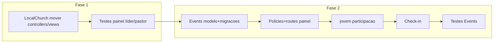

# Plano: Events + LocalChurch completos e integrados

## Estado atual (levantamento)

| Área           | Events                                                                                                                                                                                                                                                                                                                                                                              | LocalChurch                                                                                                                                                                                                                                                                                    |
| -------------- | ----------------------------------------------------------------------------------------------------------------------------------------------------------------------------------------------------------------------------------------------------------------------------------------------------------------------------------------------------------------------------------- | ---------------------------------------------------------------------------------------------------------------------------------------------------------------------------------------------------------------------------------------------------------------------------------------------- |
| **Código**     | Stub: `[EventsController](Modules/Events/app/Http/Controllers/EventsController.php)` sem persistência; `[index.blade.php](Modules/Events/resources/views/index.blade.php)` placeholder; **sem** migrations/models. Rotas do módulo em `[Modules/Events/routes/web.php](Modules/Events/routes/web.php)` registam `resource` em `/events` (fora do padrão “painel” usado em Finance). | Stub `[LocalChurchController](Modules/LocalChurch/app/Http/Controllers/LocalChurchController.php)`; funcionalidade real está em **Auth**: `[routes/lider.php](routes/lider.php)`, `[routes/pastor.php](routes/pastor.php)`, controladores em `Modules\Auth\Http\Controllers\Lider` e `Pastor`. |
| **Permissões** | Já definidas: `events.manage`, `events.participate` em `[JubafRolesAndPermissionsSeeder](Modules/Auth/database/seeders/JubafRolesAndPermissionsSeeder.php)` (Presidente + SuperAdmin `manage`; Líder/Pastor/Jovem `participate`).                                                                                                                                                   | `localchurch.manage` / `localchurch.view` já usadas no `[bootstrap/app.php](bootstrap/app.php)` e `[PostLoginRedirect](Modules/Auth/app/Support/PostLoginRedirect.php)`.                                                                                                                       |

**Decisão de roteamento (alinhar a Finance):** registar as rotas web “reais” em ficheiros na raiz `[routes/](routes/)` carregados por `[bootstrap/app.php](bootstrap/app.php)`, com prefixos `painel/eventos` (gestão) e extensão de `jovem/` (participação). Deixar `[Modules/Events/routes/web.php](Modules/Events/routes/web.php)` **vazio ou só com comentário** (como `[Modules/Finance/routes/web.php](Modules/Finance/routes/web.php)`) para evitar duplicar `/events`.

---

## Parte A — `Modules/Events` (domínio completo)

### Princípio: catálogo de eventos **maleável** (não “só CONJUBAF”)

- O módulo serve **todo o calendário operacional da JUBAF**: CONJUBAF, Start JUBAF, Congresso de Líderes, encontros de setor, JUBAF na Estrada, reuniões locais, retiros, formações, eventos pontuais de comunicação, etc. — **hoje e no futuro**, sem o produto ficar **atrelado ou truncado** ao CONJUBAF.
- **CONJUBAF** permanece como **caso de uso prioritário** no Plano1/Escopo, mas na implementação é apenas **um valor de `type` (ou etiqueta)** entre muitos; fluxos de inscrição, check-in e (mais tarde) pagamento são **os mesmos** para qualquer tipo.
- **Extensibilidade:** preferir `type` como **string** (ou enum aberto a novos valores sem reescrever regras de negócio) e/ou campo auxiliar `category`/`tags` se no futuro quiserem filtros finos sem migração pesada. Evitar lógica “if conjubaf then …” espalhada; quando houver regras específicas (ex.: quórum do estatuto), isolar em **serviço ou policy** por tipo, não no modelo core.
- UI de gestão: filtros por tipo, calendário agregado, formulários que não assumem um único cenário (títulos e ajudas genéricos “Evento”, com exemplos incluindo CONJUBAF).

### 1. Modelo de dados e migrações (no módulo)

Criar tabelas mínimas **extensíveis** para calendário 2026+ e integração futura com tesouraria:

- `**events`**: identificação (título, slug único, descrição), `type` (string livre ou conjunto extensível: exemplos iniciais `conjubaf`, `start_jubaf`, `leaders_congress`, `sector_meeting`, `estrada`, `local`, `formation`, `other` — **lista não fechada na documentação de código), janelas temporais (`starts_at`, `ends_at`), `location`, `church_id` nullable (eventos locais filtrados por igreja), janelas de inscrição (`registration_opens_at`, `registration_closes_at`), `max_participants` nullable, `is_published`, `created_by` (FK `users`), campos opcionais para check-in (ex.: `check_in_opens_at` / `check_in_closes_at` ou reutilizar `starts_at`/`ends_at` na política).
- `**event_registrations`**: `event_id`, `user_id`, `status` (`pending`, `confirmed`, `cancelled`, `waitlist`), timestamps de registo; **preparação Finance: `payment_status` (`not_required`, `pending`, `paid`, `waived`) e `finance_entry_id` nullable (FK para `[finance_entries](Modules/Finance/database/migrations/2026_03_31_140000_create_finance_entries_table.php)` quando existir fluxo de pagamento).
- Índices compostos para listagens (por evento + estado) e unicidade `(event_id, user_id)` para uma inscrição ativa por utilizador.

Factories + seeders de demonstração (opcional, só dados de dev) no `[Modules/Events/database/](Modules/Events/database/)`.

### 2. Políticas e gates

- Registrar em `[EventsServiceProvider](Modules/Events/app/Providers/EventsServiceProvider.php)` (padrão `[FinanceServiceProvider](Modules/Finance/app/Providers/FinanceServiceProvider.php)`): `Gate::policy` para `Event` e `EventRegistration`.
- **Regras sugeridas:**
    - `events.manage`: CRUD eventos, listar todas as inscrições, operar check-in em nome de terceiros, exportar lista.
    - `events.participate` + `admin.full`: ver eventos publicados; inscrever-se / cancelar (dentro das janelas); ver o “bilhete” próprio; check-in **próprio** se o fluxo for self-service.
    - Eventos com `church_id`: utilizadores com `events.participate` só veem/inscrevem se `user.church_id` coincide (Pastor/Líder/Jovem); eventos estaduais (`church_id` null) visíveis a todos com `events.participate`.
    - **SuperAdmin**: `admin.full` em todas as operações de gestão (espelhar `[FinanceEntryPolicy](Modules/Finance/app/Policies/FinanceEntryPolicy.php)`).

### 3. Camada HTTP

- **Form requests** para criar/atualizar evento e para inscrição.
- **Controladores** (nomes ilustrativos):
    - Gestão (`events.manage`): dashboard + CRUD (index/create/store/show/edit/update/destroy), gestão de inscrições do evento, export CSV simples.
    - Participação (`jovem` / quem tem `events.participate`): listagem de eventos publicados, detalhe, inscrever/cancelar, página “meu bilhete” com **token** de check-in (ver abaixo).
    - Check-in: ação POST autenticada (staff com `events.manage`) que marca `checked_in_at` na inscrição; validação de janela de tempo e duplicados.

### 4. QR Code / token de check-in (sem CDN)

- **Sem nova dependência Composer obrigatória no primeiro incremento:** persistir `check_in_token` (hash/id opaco) por inscrição; staff introduz token manualmente ou gera página com QR **via pacote npm** (ex. `qrcode`) no bundle Vite do app — alinhado a [AGENTS.md](AGENTS.md) (assets locais). Alternativa posterior: pacote PHP de QR se a equipe aprovar dependência.
- Rotas nomeadas estáveis: `painel.eventos.`_ (gestão), `jovem.eventos.`_ (participação).

### 5. UI/UX (Blade + Tailwind v4 + Flowbite)

- Layout de painel reutilizando o padrão visual dos outros módulos (sidebar/nav semelhante a `[Modules/Finance/resources/views/nav.blade.php](Modules/Finance/resources/views/nav.blade.php)`); dark mode (`dark:`) coerente com o projeto.
- Vistas completas: listas com filtros, formulários create/edit, show do evento (gestão), fluxo jovem em `jovem/eventos/`.
- Garantir `@source` em `[resources/css/app.css](resources/css/app.css)` se surgirem classes só em ficheiros novos do módulo (já costuma haver `Modules/`).

### 6. Integração com outros módulos

- **Board / Presidente:** adicionar entrada “Eventos” na nav da diretoria (ex. `[Modules/Board/resources/views/diretoria/nav.blade.php](Modules/Board/resources/views/diretoria/nav.blade.php)`) com `@can('events.manage')`, apontando para `route('painel.eventos.index')` (ou nome final acordado).
- **HomePage:** opcional nesta fase — bloco “Próximos eventos” pode consumir query pública ou só eventos publicados (decisão: só utilizadores autenticados vs teaser estático; mínimo viável: link para login/`jovem` quando existir evento publicado).
- **Finance:** apenas modelo preparado (`payment_status`, FK opcional); não exigir fluxo de pagamento completo agora.
- **Auth / Youth:** rotas em `[routes/youth.php](routes/youth.php)` para listagem e inscrição; manter `[PostLoginRedirect](Modules/Auth/app/Support/PostLoginRedirect.php)` coerente (Jovem continua a cair em `jovem.dashboard`; eventos como subsecção).

### 7. Testes

- Criar testes em `tests/Feature/Events/` (padrão `[tests/Feature/Finance/FinancePanelTest.php](tests/Feature/Finance/FinancePanelTest.php)`): seed `JubafRolesAndPermissionsSeeder`, cobrir Presidente CRUD, Jovem inscrição, negação de acesso cruzado entre igrejas em eventos locais, check-in.

### 8. Documentação operacional

- Atualizar `[CHANGLOG.md](CHANGLOG.md)` com data ISO, rotas novas, tabelas e convenção “rotas em `routes/events.php`”.

---

## Parte B — `Modules/LocalChurch` (consolidação + completar)

### 1. Mover fronteira do módulo para dentro de `LocalChurch`

- **Controladores:** migrar de `Modules\Auth\Http\Controllers\Lider\` e `Pastor\` para `Modules\LocalChurch\Http\Controllers\...` (ou namespaces `Lider`/`Pastor` dentro do módulo), mantendo injeção de `[MemberEnrollmentService](Modules/Auth/app/Services/MemberEnrollmentService.php)` e requests/policies em Auth onde fizer sentido.
- **Views:** mover templates de `auth::lider.`_ / `auth::pastor.`para`localchurch::lider.`_/`localchurch::pastor.\` (ou estrutura única com variante), atualizando referências.
- **Rotas:** em `[routes/lider.php](routes/lider.php)` e `[routes/pastor.php](routes/pastor.php)`, apontar para os novos controladores; **preservar nomes de rotas** `lider.` e `pastor.`para não partir links,`PostLoginRedirect` e testes existentes.

### 2. “Completo” além do CRUD atual

- **Dashboards:** enriquecer `[LiderDashboardController](Modules/Auth/app/Http/Controllers/Lider/LiderDashboardController.php)` / Pastor com métricas simples: total de jovens na igreja, últimos registos (usando `User` + role `Jovem` + `church_id`).
- **Nav unificada** do módulo (componente Blade partilhado em `Modules/LocalChurch/resources/views/`) para líder e pastor, com `<x-module-icon module="localchurch" />` conforme [docs/module-icons.md](docs/module-icons.md).
- **Remover ou redirecionar** o resource genérico `localchurches` do `[Modules/LocalChurch/routes/web.php](Modules/LocalChurch/routes/web.php)` se não fizer sentido no domínio (evitar “CRUD de igreja” duplicado com Churches); substituir por documentação no comentário do route file ou rotas vazias como Finance.

### 3. Políticas

- Garantir que `[UserPolicy](Modules/Auth/app/Policies/UserPolicy.php)` e fluxos de jovem continuam corretos após mudança de namespace; ajustar apenas imports e testes.

### 4. Testes

- `tests/Feature/LocalChurch/` (ou renomear existentes): líder acede `lider.dashboard` e CRUD jovens; pastor só leitura; `403` fora do `church_id`.

### 5. Changelog

- Entrada em `[CHANGLOG.md](CHANGLOG.md)` descrevendo migração Auth → LocalChurch e rotas inalteradas.

---

## Ordem de execução recomendada

**Motivo:** consolidar o “terreno local” reduz risco de conflitos de rotas/views enquanto se constrói Events; Events depende sobretudo de `User`, `church_id` e permissões já estáveis.

---

## Fora de âmbito (explícito)

- **Communication** (convocações push/e-mail) — terceiro na fila lógica; não bloqueia Events.
- **Pagamentos online** — apenas hooks de dados; implementação financeira completa fase posterior.

---

## Riscos / decisões já fechadas no plano

- **Presidente vs Secretário:** matriz atual dá `events.manage` ao Presidente (e SuperAdmin), não ao Secretário; manter até decisão institucional de alargar permissões.
- **Dependência QR PHP:** evitar no primeiro incremento; preferir token + QR via Vite/npm ou entrada manual do token.
