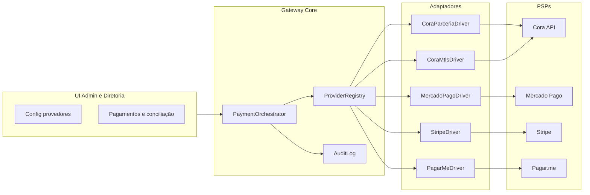

# Plano: módulo Gateway de pagamentos (JUBAF)

## Estado actual

- [`Modules/Gateway`](c:\laragon\www\JUBAF\Modules\Gateway) está mínimo: [`GatewayController`](c:\laragon\www\JUBAF\Modules\Gateway\app\Http\Controllers\GatewayController.php) referencia views inexistentes (`gateway::index`, etc.); [`routes/web.php`](c:\laragon\www\JUBAF\Modules\Gateway\routes\web.php) não está incluído em [`routes/diretoria.php`](c:\laragon\www\JUBAF\routes\diretoria.php) nem [`routes/admin.php`](c:\laragon\www\JUBAF\routes\admin.php).
- As views em `resources/views/paineldiretoria/` são cópias do Financeiro (incluem `financeiro::paineldiretoria.partials.subnav` e rotas `diretoria.financeiro.*`) — não são um painel Gateway real.
- [`Modules/Financeiro`](c:\laragon\www\JUBAF\Modules\Financeiro) já modela tesouraria: [`FinTransaction`](c:\laragon\www\JUBAF\Modules\Financeiro\app\Models\FinTransaction.php) com `metadata` JSON; reembolsos em [`ExpenseRequestController::pay`](c:\laragon\www\JUBAF\Modules\Financeiro\app\Http\Controllers\Diretoria\ExpenseRequestController.php) criam lançamento manual (não há PSP).
- Permissões seguem o padrão em [`database/seeders/RolesPermissionsSeeder.php`](c:\laragon\www\JUBAF\database\seeders\RolesPermissionsSeeder.php) (`financeiro.*`, etc.).

## Referências externas (requisitos de produto)

- **Cora**: ambientes Stage/Produção, paginação (`page` inicia em 0), datas em requisição `YYYY-MM-DD`, respostas ISO, erros padronizados, idempotência via header `Idempotency-Key` (UUID). Duas modalidades: **Parceria** (base `https://api.stage.cora.com.br/`) vs **Integração Direta** (mTLS, base `https://matls-clients.api.stage.cora.com.br/`). Ver [Instruções iniciais — Cora](https://developers.cora.com.br/docs/instrucoes-iniciais).
- **Mercado Pago / Stripe / Pagar.me**: integrar via SDKs oficiais ou HTTP + webhooks assinados; fluxos típicos: criar intenção/cobrança → redirecionar ou checkout embutido → confirmar por webhook/IPN.

## Arquitectura alvo (dentro do módulo Gateway)

- **Contrato único** (`PaymentProviderContract` ou similar em `Modules/Gateway/app/Services/Providers/`): métodos como `createCharge`, `getCharge`, `refund` (onde aplicável), `parseWebhook`, `verifyWebhookSignature`.
- **Configuração por ambiente**: tabela `gateway_provider_accounts` (ou `gateway_settings`) com `driver` (`cora_parceria`, `cora_mtls`, `mercadopago`, `stripe`, `pagarme`), `is_default`, `is_enabled`, **credenciais encriptadas** (casts `encrypted` / `encrypted:array` no Laravel), URLs de webhook, `metadata` JSON para IDs de conta Cora, etc.
- **Pedidos de pagamento**: tabela `gateway_payments` com `uuid` público, `provider`, `provider_reference`, `amount`, `currency` (BRL), `status` (`pending`, `paid`, `failed`, `refunded`, `cancelled`), `payable_type` / `payable_id` (polimorfismo), `idempotency_key`, `raw_provider_payload` (JSON opcional para auditoria), `paid_at`, `failure_reason`.
- **Webhooks**: tabela `gateway_webhook_events` (payload bruto, headers, assinatura verificada ou não, `processing_status`, erro); processamento em **queue** (`ShouldQueue`) para idempotência e retries.
- **Auditoria**: reutilizar ou alinhar com `audit.view` se existir modelo de auditoria global; no mínimo, eventos append-only em `gateway_audit_logs` (actor, action, `payment_id`, diff).

## Integração com Financeiro (tesouraria)

- **Regra**: pagamento confirmado no Gateway dispara **reconciliação**: criar ou associar um [`FinTransaction`](c:\laragon\www\JUBAF\Modules\Financeiro\app\Models\FinTransaction.php) de direção `in`, `scope` regional (ou por `church_id` quando o produto suportar), categoria configurável (“Receitas online” / “Inscrições”), `reference`/`metadata` com `gateway_payment_id` e `provider`.
- **Reembolsos** (`ExpenseRequest`): manter fluxo manual actual; opcional fase 2: “marcar pago via transferência Cora” se a API expuser iniciação de pagamento (escopo separado, não bloquear MVP).
- **UI Financeiro**: secção “Pagamentos online” / link para Gateway no dashboard e relatórios; evitar duplicar balancete no Gateway — o Gateway mostra **lista técnica de cobranças PSP**; o Financeiro continua **livro razão**.

## Integração por módulo (o que “faz sentido”)

| Módulo                           | Integração proposta                                                                                                                                                                                                                                     |
| -------------------------------- | ------------------------------------------------------------------------------------------------------------------------------------------------------------------------------------------------------------------------------------------------------- |
| **Financeiro**                   | Fonte de verdade contabilística; criação automática de lançamentos; filtros por origem gateway.                                                                                                                                                         |
| **Calendario**                   | Eventos já têm `registration_fee` ([`CalendarEvent`](c:\laragon\www\JUBAF\Modules\Calendario\app\Models\CalendarEvent.php)): fluxo público ou painel jovens/líderes → criar `gateway_payment` ao inscrever com taxa → confirmar inscrição após webhook. |
| **Permisao**                     | Novas permissões `gateway.*` (ver configuração, gerir credenciais, ver pagamentos, reprocessar webhook).                                                                                                                                                |
| **PainelDiretoria**              | Entrada no menu lateral (padrão existente para `diretoria.financeiro.*`) para `diretoria.gateway.*`.                                                                                                                                                    |
| **Notificacoes**                 | Notificar estado do pagamento (opcional, filas) para utilizadores relevantes.                                                                                                                                                                           |
| **Homepage / Blog / Avisos**     | Apenas se houver CTAs de doação ou “pagar taxa”: links para rotas `gateway::public.checkout` com `payable` definido; não forçar pagamento em conteúdo só informativo.                                                                                   |
| **Secretaria / Bible / Igrejas** | Sem cobrança directa no modelo actual; integração só se surgir requisito (ex.: taxa de documento) — fora do MVP.                                                                                                                                        |

## Frontend e rotas (pastas que referiu)

- Criar rotas reais em [`routes/diretoria.php`](c:\laragon\www\JUBAF\routes\diretoria.php) (ex.: `require module_path('Gateway', 'routes/diretoria.php')` com prefixo `gateway` e `middleware can:`) e em [`routes/admin.php`](c:\laragon\www\JUBAF\routes\admin.php) para **super-admin / sistema**.
- Substituir views actuais que apontam para Financeiro por:
    - `resources/views/admin/` — CRUD de contas de provedor, teste de ligação, logs de webhook.
    - `resources/views/paineldiretoria/` — dashboard de pagamentos, detalhe, reenvio/reconciliação (sem duplicar balancete do Financeiro).
    - `resources/views/paineljovens/` e `painellider/` — apenas páginas necessárias (ex.: “Minhas inscrições pagas” / estado do pagamento do calendário).
    - `resources/views/public/` — página de checkout/retorno genérica (sucesso/erro/pending).
- **Ícones**: seguir [`jubaf-module-icons`](c:\laragon\www\JUBAF.cursor\skills\jubaf-module-icons\SKILL.md) para o módulo Gateway nos menus.

## Segurança e operações

- Credenciais só em DB encriptado + `.env` para segredos globais se necessário.
- Rotas de webhook **sem CSRF** (excluir em `VerifyCsrfToken`), com verificação de assinatura por driver.
- Rate limiting em webhooks e endpoints públicos de checkout.
- `Idempotency-Key` em todos os POST que criam cobrança (exigência Cora e boa prática geral).

## Entregas em fases (realista para “completo” sem atropelo)

1. **Fundação**: migrations, models, policies, seed de permissões, registo de rotas, limpeza das views duplicadas, serviço `PaymentOrchestrator`, UI mínima admin+diretoria (lista vazia + config).
2. **Cora (duas variantes de config)**: drivers `cora_parceria` e `cora_mtls` (Guzzle com `cert`/`ssl_key` para mTLS), obter token OAuth onde aplicável, criar cobrança de teste em Stage, webhook + job.
3. **Financeiro**: job `ReconcilePaymentToFinTransaction` ao `paid`, categorias seed ou config.
4. **Calendario**: fluxo pagamento taxa inscrição (o maior ganho de negócio já preparado no modelo).
5. **Alternativas**: Mercado Pago, Stripe, Pagar.me como drivers adicionais na mesma interface; checkout unificado na camada `gateway_payments`.
6. **Polimento**: relatórios export CSV, notificações, testes automatizados (webhook fake, idempotência).

## Ficheiros-chave a criar/alterar

- Novo: `Modules/Gateway/routes/diretoria.php`, `routes/admin.php` (ou includes), controladores em `Http/Controllers/Admin/` e `Diretoria/`, `Services/`, migrations em `database/migrations/`.
- Alterar: [`routes/diretoria.php`](c:\laragon\www\JUBAF\routes\diretoria.php), [`routes/admin.php`](c:\laragon\www\JUBAF\routes\admin.php), [`RolesPermissionsSeeder`](c:\laragon\www\JUBAF\database\seeders\RolesPermissionsSeeder.php), layout/menu do Painel Diretoria (onde hoje só aparece Financeiro), [`composer.json`](c:\laragon\www\JUBAF\composer.json) para SDKs (ex.: `stripe/stripe-php`, SDK MP/Pagar.me conforme escolha).

## Riscos e transparência

- **“100% completo”** com quatro PSPs e todos os módulos é um programa grande; o plano acima entrega **núcleo único + Cora configurável (Parceria ou mTLS) + Financeiro + Calendário** como critério de “produto mínimo excelente”; os outros módulos entram só onde há fluxo de dinheiro real.
- **Cora Pro / contratos**: a página pública da Cora menciona plano para APIs em integração directa; validar com a conta JUBAF antes de produção ([Integrações Cora](https://www.cora.com.br/integracoes/)).
