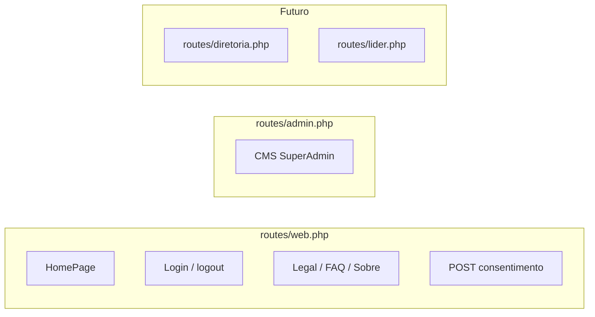

# Plano: Homepage JUBAF, rotas centralizadas e CMS SuperAdmin

## Situação atual (relevante)

- `[routes/web.php](c:\laragon\www\JUBAF\routes\web.php)` devolve `welcome`; não existem rotas nomeadas `login` / recuperação.
- Módulos `[HomePage](c:\laragon\www\JUBAF\Modules\HomePage\routes\web.php)`, `[Auth](c:\laragon\www\JUBAF\Modules\Auth\routes\web.php)`, `[SuperAdmin](c:\laragon\www\JUBAF\Modules\SuperAdmin\routes\web.php)` registam apenas stubs `Route::resource` com `auth` — inadequado para site público e duplica o objetivo de “rotas na raiz”.
- `[bootstrap/app.php](c:\laragon\www\JUBAF\bootstrap\app.php)` só carrega `web.php`; `[routes/admin.php](c:\laragon\www\JUBAF\routes\admin.php)`, `[diretoria.php](c:\laragon\www\JUBAF\routes\diretoria.php)`, `[lider.php](c:\laragon\www\JUBAF\routes\lider.php)` estão vazios.
- `[Modules/HomePage/.../master.blade.php](c:\laragon\www\JUBAF\Modules\HomePage\resources\views\components\layouts\master.blade.php)` usa CDN de fontes — **não conforme** com `[AGENTS.md](c:\laragon\www\JUBAF\AGENTS.md)` (sem CDN).
- `[App\Models\User](c:\laragon\www\JUBAF\app\Models\User.php)`: `document_id` (CPF), `birth_date`, `email` — base para login alternativo e recuperação.

## Arquitetura de rotas (organização na raiz)

1. **Atualizar `[bootstrap/app.php](c:\laragon\www\JUBAF\bootstrap\app.php)`**

- Usar `web` como **array** de ficheiros para tudo com middleware `web` igual, por exemplo: `web.php`, `admin.php`, `diretoria.php`, `lider.php` (últimos dois podem ficar só com comentários ou `Route::` vazios até haver controladores).
- **Prefixo e middleware por ficheiro**: o `buildRoutingCallback` do Laravel aplica o mesmo `middleware('web')` a todos os ficheiros do array. Para `admin.php` com prefixo `superadmin` (ou `admin`) + `auth` + papel `SuperAdmin`, a opção mais limpa é:
  - **Opção A (recomendada):** `web` = apenas `[routes/web.php](c:\laragon\www\JUBAF\routes\web.php)` e usar o callback `**then` de `withRouting` para carregar `admin.php`/`diretoria.php`/`lider.php` com `Route::middleware(...)->prefix(...)->group(...)`.
  - **Opção B:** um único `web.php` que faz `require`/`require` de ficheiros `routes/includes/*.php` (menos explícito no `bootstrap`).

1. **Desativar rotas duplicadas nos módulos**

- Remover `[RouteServiceProvider](c:\laragon\www\JUBAF\Modules\HomePage\app\Providers\RouteServiceProvider.php)` da lista `providers` em `HomePageServiceProvider` / `SuperAdminServiceProvider` / `AuthServiceProvider` **ou** esvaziar `Modules/*/routes/web.php` para não registar rotas em duplicado.
- Manter **views, controladores e serviços** nos módulos; **definições de rotas** só na raiz, como pedido.

1. **Convenção de nomes**

- Rotas nomeadas: `home`, `login`, `logout`, `password.request`, `password.email`, `password.reset`, `password.update`, `legal.show`, `faq`, `about`, `cookie-consent.store`, `admin.` (CMS).

## Camada de dados (CMS e consentimento)

Nova migração (raiz `database/migrations/` ou módulo HomePage — preferir **raiz** se for transversal ao produto):

| Tabela                                    | Finalidade                                                                                                                        |
| ----------------------------------------- | --------------------------------------------------------------------------------------------------------------------------------- |
| `site_settings` (ou `home_site_settings`) | Chave/valor JSON: hero copy, CTA, ordem de secções, meta SEO, `cookie_policy_version`                                             |
| `home_slides`                             | Carrossel: título, subtítulo, imagem (`storage`), link opcional, `starts_at`/`ends_at`, `sort_order`, `is_published`              |
| `faq_items`                               | pergunta, resposta (texto), `sort_order`, `is_active`                                                                             |
| `site_pages`                              | `slug` (sobre, privacidade, termos, cookies), título, corpo (HTML sanitizado ou Markdown), `updated_at`                           |
| `cookie_consent_logs`                     | Auditoria: `user_id` nullable, IP hash ou IP, `preferences` JSON, `policy_version`, `action` (accept/reject/custom), `created_at` |

**Regra dos 90 dias:** cookie HTTP (nome configurável, ex. `jubaf_cookie_consent`) com `max-age` 90 dias, valor assinado/encriptado ( `[Cookie::encrypt](https://laravel.com/docs/encryption)` ou `Crypt`) contendo versão da política + categorias. Ao rejeitar ou reconfigurar, novo registo em `cookie_consent_logs` + atualização do cookie.

**Serviço:** `App\Services\CookieConsentService` (ou equivalente em módulo) para que outros módulos consultem `hasAnalytics()` / `hasMarketing()` sem acoplar à Blade.

## Módulo HomePage — UI pública

- **Layout principal:** `[resources/views/layouts/public.blade.php](c:\laragon\www\JUBAF\resources\views)` (novo) ou layout em `homepage::components.layouts` que **estende** o padrão global: `@vite(['resources/css/app.css','resources/js/app.js'])`, sem CDN; cor primária **Royal Blue** (~`#0047AB`) via`resources/css/app.css ``@theme`(`--color-brand`ou`brand-500`).
- **Logo:** `[public/image/logo/logo.png](c:\laragon\www\JUBAF\public\image\logo\logo.png)` — navbar e login; **favicon** (novo ícone simplificado em `public/` + `<link rel="icon">` no layout).
- **Componentes em** `[Modules/HomePage/resources/views/components/](c:\laragon\www\JUBAF\Modules\HomePage\resources\views\components)`: `navbar`, `footer`, `hero`, `carousel` (Flowbite carousel + imagens dinâmicas), `section-` (missão, números, CTA), `back-to-top`, `scroll-down` (anchor para `#conteudo`), `cookie-banner` (modal preferências + audit trail no submit).
- **Página:** `[homepage.blade.php](c:\laragon\www\JUBAF\Modules\HomePage\resources\views\homepage.blade.php)` compõe secções a partir de dados do serviço/repositório (Eloquent `SiteSetting` + `HomeSlide` + `FaqItem`).
- **Páginas estáticas dinâmicas:** `about`, `faq` (lista), `legal` (show por `slug`).

## SuperAdmin — CMS completo (Blade + Tailwind + Flowbite)

- **Rotas** em `[routes/admin.php](c:\laragon\www\JUBAF\routes\admin.php)`: prefixo `superadmin` (ou `admin`), middleware `web`, `auth`, `role:SuperAdmin` (registar middleware Spatie em `[bootstrap/app.php](c:\laragon\www\JUBAF\bootstrap\app.php)` `alias` se ainda não existir).
- **Controladores** em `[Modules/SuperAdmin](c:\laragon\www\JUBAF\Modules\SuperAdmin)`: `DashboardController`, `HomeSlideController`, `SiteSettingController`, `FaqItemController`, `SitePageController`, `CookiePolicyController` (versão + texto).
- **Uploads:** `store` em `storage/app/public/home-slides`, `php artisan storage:link`, validação MIME/tamanho, política de autorização.
- **Layout admin:** `superadmin::layouts.app` (sidebar + topbar, navegação para cada recurso), reutilizando Vite global.

## Autenticação pública (split-div + recuperação)

- **Controladores** em `app/Http/Controllers/Auth/` (ou `Modules\Auth` com rotas só na raiz): `LoginController`, `LogoutController`, `ForgotPasswordController`, `ResetPasswordController`, `CpfPasswordResetController` (fluxo alternativo).
- **Login** (`GET/POST`): vista split (coluna esquerda: marca + logo com `<a href="{{ route('home') }}">`) + direita: formulário; **abas** Alpine.js: “E-mail” vs “CPF” (password comum); `Auth::attempt` com `email` ou `document_id` normalizado (apenas dígitos para CPF).
- **Esqueceu a senha:**
  - Via **e-mail:** fluxo Laravel padrão (`Password::sendResetLink` + tabela `password_reset_tokens` já existente).
  - Via **CPF + data de nascimento:** `POST` valida `document_id` + `birth_date` contra `User`; se match, gera token e envia e-mail **ou** mostra formulário de nova palavra-passe (escolher uma abordagem e documentar — recomendação: **sempre enviar e-mail com link** se o utilizador tiver email; se não tiver email, mensagem de contacto suporte — evitar expor reset só por CPF sem canal seguro).
- **Registo público:** não incluir na primeira entrega salvo `Route::has('register')` existir; alinhar com produto (provavelmente não há registo público).

## `routes/console.php` e comandos

- Manter `[routes/console.php](c:\laragon\www\JUBAF\routes\console.php)` para comandos; adicionar (se necessário) comando Artisan `jubaf:prune-cookie-consent-logs` ou `schedule` em `[AppServiceProvider](c:\laragon\www\JUBAF\app\Providers\AppServiceProvider.php)` para limpeza de logs antigos (opcional, RGPD).
- **Não** misturar comandos de aplicação com definições de rotas — apenas referência cruzada na documentação interna se necessário.

## Testes e qualidade

- Feature tests: rotas públicas 200, `home` renderiza slides publicados, POST consentimento grava log, login email e CPF, middleware SuperAdmin bloqueia não-admin.
- `vendor/bin/pint --dirty` após PHP.

## Documentação obrigatória do projeto

- Atualizar `[CHANGLOG.md](c:\laragon\www\JUBAF\CHANGLOG.md)` com data, rotas centralizadas, tabelas CMS, consentimento e política sem CDN.

## Ordem de implementação sugerida

1. Migrações + models + seed mínimo (settings + páginas legais placeholder + 1 slide demo).
2. `bootstrap/app.php` + ficheiros de rotas + remoção de rotas duplicadas dos módulos.
3. Layout público + componentes HomePage + `homepage.blade.php` + carrossel.
4. Cookie banner + endpoint + log + serviço.
5. Páginas sobre / FAQ / legais.
6. Auth (login split + forgot + reset + CPF).
7. Painel SuperAdmin CRUD completo (Tailwind/Flowbite).
8. Favicon, testes, Pint, CHANGELOG.
