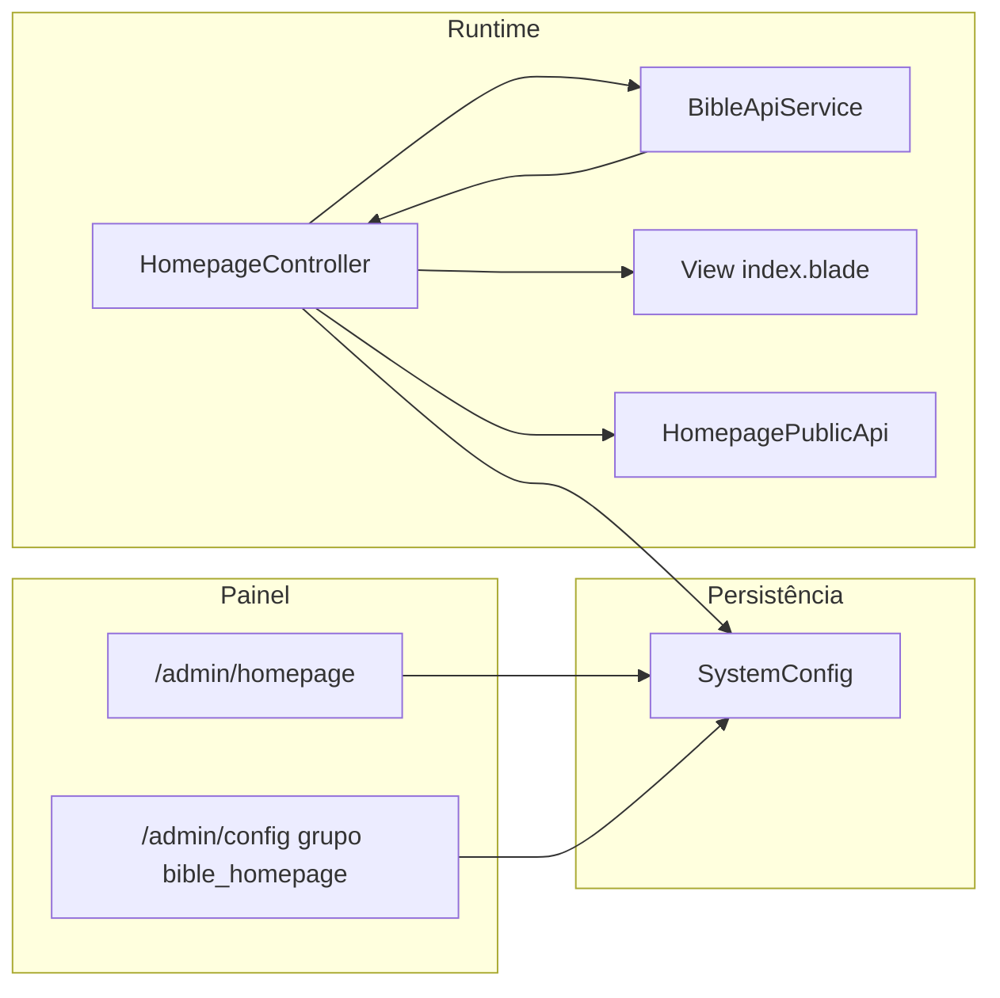

# Plano: Versículo do dia, Bíblia na homepage e alinhamento JUBAF

## Contexto técnico (estado atual)

- A homepage é renderizada em [`Modules/Homepage/app/Http/Controllers/HomepageController.php`](Modules/Homepage/app/Http/Controllers/HomepageController.php) e [`Modules/Homepage/resources/views/index.blade.php`](Modules/Homepage/resources/views/index.blade.php); **não** há hoje bloco de versículo diário.
- O rádio já usa `BibleApiService::getRandomVerse()` em [`Modules/Homepage/app/Http/Controllers/HomepageController.php`](Modules/Homepage/app/Http/Controllers/HomepageController.php) (ramo `radio`) — é aleatório por pedido, **não** “um por dia” estável.
- [`Modules/Bible/app/Services/BibleApiService.php`](Modules/Bible/app/Services/BibleApiService.php) expõe `getRandomVerse()`; será necessário um método novo, por exemplo `getDailyVerseForDate(Carbon $date, ?int $versionId, ?string $siteSalt): ?Verse`, com **cache até meia-noite (timezone da app)** ou índice determinístico `hash(data + salt) % count` para o mesmo dia em todos os visitantes (preferível a `inRandomOrder()` se o cache for limpo).
- [`database/seeders/RolesPermissionsSeeder.php`](database/seeders/RolesPermissionsSeeder.php) já atribui `homepage.*` a **presidente**, **vice-presidente** e **secretario**, mas **todo** o prefixo `/admin` em [`routes/admin.php`](routes/admin.php) está sob `middleware(['auth', 'role:super-admin'])`, pelo que esses perfis **não entram** em `/admin/homepage` hoje — isto é um bloqueio real para o que pediu (direção com controlo total sem código).

Referência de missão/identidade: JUBAF no estatuto em [`PLANOJUBAF/ESTATUTOJUBAF.md`](PLANOJUBAF/ESTATUTOJUBAF.md); tom institucional juventade batista alinhável ao conteúdo descritivo da [JBB](https://www.juventudebatista.com.br/a-jbb/) (sobre/missão/valores como inspiração de texto, não cópia automática).

---

## Fase 1 — Versículo do dia + Bíblia na homepage (núcleo)

### 1.1 Chaves `SystemConfig` (grupo `homepage`, descrições claras)

Definir e garantir criação na primeira visita ao painel ou via `SystemConfigService::initializeDefaultConfigs` / helper dedicado (ex.: `ensureHomepageBibleConfigs()`):

| Chave (exemplo)                           | Tipo             | Função                                                                                                               |
| ----------------------------------------- | ---------------- | -------------------------------------------------------------------------------------------------------------------- |
| `homepage_bible_daily_enabled`            | boolean          | Liga/desliga o bloco                                                                                                 |
| `homepage_bible_daily_version_id`         | integer nullable | Versão da Bíblia (vazio = versão padrão do módulo)                                                                   |
| `homepage_bible_daily_title`              | string           | Título da secção (ex.: “Versículo do dia”)                                                                           |
| `homepage_bible_daily_subtitle`           | string           | Texto curto opcional                                                                                                 |
| `homepage_bible_daily_position`           | string           | `after_hero` \| `before_servicos` \| `before_contato` (valores fixos documentados no painel)                         |
| `homepage_bible_daily_show_reference`     | boolean          | Mostrar referência (livro capítulo versículo)                                                                        |
| `homepage_bible_daily_show_version_label` | boolean          | Mostrar sigla/nome da versão                                                                                         |
| `homepage_bible_daily_link_enabled`       | boolean          | CTA “Abrir na Bíblia”                                                                                                |
| `homepage_bible_daily_override_reference` | string nullable  | **Opcional**: referência fixa (ex. `João 3:16`) quando a direção quiser substituir o automático; vazio = modo diário |
| `homepage_bible_navbar_enabled`           | boolean          | Link “Bíblia” na navbar pública (se `module_enabled('Bible')` e rota existir)                                        |
| `homepage_bible_navbar_label`             | string           | Rótulo do link                                                                                                       |

Opcional de robustez: `homepage_bible_daily_salt` (string) para variar o hash entre instalações sem código.

### 1.2 Serviço Bible

- Em [`BibleApiService`](Modules/Bible/app/Services/BibleApiService.php): implementar resolução do versículo do dia:
    - Se `override_reference` preenchido: resolver referência via livro/capítulo/versículo já usados noutros fluxos (reutilizar parsers existentes no módulo, se houver; caso contrário parser restrito e validado).
    - Senão: versículo **único por dia** por versão, com cache TTL até fim do dia ou offset determinístico sobre conjunto de versículos da versão (documentar limitação de performance se `COUNT`+`OFFSET` for pesado; para base típica aceitável; cache do `count` por versão ajuda).
- Cobrir com teste de feature (mesmo dia → mesmo texto; dia seguinte → pode mudar; override → ignora sorteio).

### 1.3 Homepage pública

- [`HomepageController@index`](Modules/Homepage/app/Http/Controllers/HomepageController.php): se `module_enabled('Bible')` e `homepage_bible_daily_enabled`, injetar DTO/array seguro para a view (`text`, `reference`, `version`, `public_url` para capítulo/versículo se existir rota/helper).
- [`index.blade.php`](Modules/Homepage/resources/views/index.blade.php): incluir **partial** minimalista (coerente com o herói atual da homepage), posicionada conforme `homepage_bible_daily_position` (includes condicionais ou `@switch` em pontos estáveis do layout).
- [`HomepagePublicApiController`](Modules/Homepage/app/Http/Controllers/Api/HomepagePublicApiController.php): acrescentar objeto `bible_daily` na resposta JSON para consumo futuro / apps (respeitando o mesmo flag e módulo).

### 1.4 Painel `/admin/homepage`

- [`HomepageAdminController`](Modules/Homepage/app/Http/Controllers/Admin/HomepageAdminController.php): ler/gravar as novas chaves; validação explícita; lista de versões ativas do Bible para o select (`BibleApiService::getVersions()` ou `BibleVersion::where('is_active')`).
- [`Modules/Homepage/resources/views/admin/index.blade.php`](Modules/Homepage/resources/views/admin/index.blade.php): nova secção **“Bíblia na homepage”** (campos agrupados, ajudas curtas, sem jargão técnico).

### 1.5 Painel `/admin/config`

- Em [`SystemConfigController`](app/Http/Controllers/Admin/SystemConfigController.php): incluir grupo novo na lista `$groups` (ex.: `bible_homepage`) e ícone no switch da view [`resources/views/admin/config/index.blade.php`](resources/views/admin/config/index.blade.php).
- Garantir que `initializeDefaultConfigs` / helper cria linhas na BD para essas chaves (super-admin usa “Inicializar padrões”).
- **Mesmas chaves** que o painel da homepage (sem segunda fonte de verdade).

---

## Fase 2 — Acesso: Super Admin vs Direção (Presidente / Vice / Secretário)

- Refatorar [`routes/admin.php`](routes/admin.php) em **dois blocos** dentro de `prefix('admin')` + `auth`:
    - **Núcleo sistema** (permanece `role:super-admin`): `config`, `modules`, `users`, `roles`, `audit`, `backup`, `updates`, API keys sensíveis, etc.
    - **Conteúdo / JUBAF** (novo middleware): permitir utilizadores com permissão adequada, por exemplo `permission:homepage.edit` **ou** roles `presidente`, `vice-presidente`, `secretario`, **e** sempre `super-admin`.
- Garantir que o **layout admin** ([`resources/views/admin/layouts/admin.blade.php`](resources/views/admin/layouts/admin.blade.php) ou partial de menu) só mostra links para rotas que o utilizador pode usar (evitar 403 em massa).
- **Co-admin** ([`routes/co-admin.php`](routes/co-admin.php)): em vez de um “ecrã reduzido”, alinhar com a sua resposta: **não duplicar** formulários — a direção com papel `presidente`/`vice-presidente` passa a usar `/admin/homepage` com a mesma UI completa, desde que o middleware o permita. O painel `/co-admin` mantém o que já tem (diretoria/devocionais) e o menu pode passar a **linkar** para `/admin/homepage` quando o utilizador tiver permissão (evitar dois sítios de edição divergentes).

**Nota:** `/admin/config` continua restrito a quem tem `sistema.config` (tipicamente super-admin), como hoje — direção edita Bíblia/versículo pela homepage; super-admin edita também pelo config genérico se quiser.

---

## Fase 3 — Alinhamento VERTEX / SEMAGRI → JUBAF

- Remover ou renomear campos `footer_vertex_*` em [`Modules/Homepage/resources/views/admin/index.blade.php`](Modules/Homepage/resources/views/admin/index.blade.php) e no controller para algo neutro (`homepage_footer_credits_*` / “Créditos técnicos” opcional) ou eliminar secção se não fizer sentido para JUBAF; migrar valores existentes na BD com comando único ou fallback no `SystemConfig::get`.
- Corrigir defaults e meta em ficheiros ainda com VERTEX/SEMAGRI (ex.: [`.env.example`](.env.example), layouts do **Blog** público se ainda referenciarem VERTEXSEMAGRI — grep alvo em `resources/views`, `Modules/Blog`, **excluindo** `storage/framework/views` compilados).
- Rever [`resources/views/campo/layouts/app.blade.php`](resources/views/campo/layouts/app.blade.php) apenas se o projeto JUBAF ainda expuser “Campo SEMAGRI”; caso contrário marcar como legado ou renomear labels para JUBAF (decisão mínima: títulos/meta).

---

## Fase 4 — Upgrades transversais (backlog priorizado, fora do núcleo do versículo)

Implementação incremental após Fases 1–3, sempre com flags em `SystemConfig` ou configs de módulo já existentes:

- **Notificacoes**: eventos opcionais (ex.: novo devocional publicado → notificar perfis com `notificacoes.view`) usando [`Modules/Notificacoes`](Modules/Notificacoes) sem acoplar a HTTP da homepage.
- **Chat**: já integra notificações internas; opcional — toggle em config para “mostrar widget só na homepage” (se ainda não existir em `ChatConfig`).
- **Blog**: meta title/OG default com `SiteBranding` / JUBAF; RSS title.
- **Avisos**: posições já usadas na homepage (`topo`); opcional — respeitar ordem/prioridade configurável no módulo Avisos.
- **Bible**: painel super-admin já rico; na homepage só exposição pública + versão escolhida; evitar duplicar settings do módulo Bible no Homepage além do que é “apresentação na landing”.

Cada item: uma issue/PR com teste mínimo.

---

## Diagrama (fluxo do versículo do dia)

---

## Riscos e mitigação

- **Performance** na escolha do versículo: usar cache diário + eventual cache de `COUNT` por versão.
- **Duplicar UI** entre config e homepage: aceite como pedido explícito; documentar no painel que é a mesma chave.
- **Rotas admin**: refatoração exige rever **todas** as rotas dentro de `admin.php` para não abrir acidentalmente `presidente` a `users`/`backup`.

---

## Critérios de aceitação

- Com Bible ativo e versão com dados, a homepage mostra **um** versículo **constante durante o dia civil** (timezone app), configurável/desligável.
- Presidente (ou vice/secretário conforme middleware) consegue **alterar todos os campos** da secção Bíblia em `/admin/homepage` sem código.
- Super-admin vê as mesmas chaves em `/admin/config` no grupo dedicado.
- API pública da homepage inclui o bloco `bible_daily` coerente com o HTML.
- Testes automatizados cobrem serviço/página principal (Feature existente em [`Modules/Homepage/Tests`](Modules/Homepage/Tests)).
