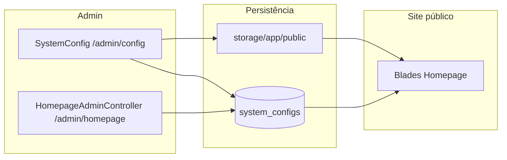

# Plano: Upgrade Homepage JUBAF (SOMOS UM)

## Contexto técnico atual

- **Público**: [`Modules/Homepage/resources/views/index.blade.php`](c:\laragon\www\JUB\Modules\Homepage\resources\views\index.blade.php) (~800+ linhas), [`navbar-homepage.blade.php`](c:\laragon\www\JUB\Modules\Homepage\resources\views\layouts\navbar-homepage.blade.php), [`footer-homepage.blade.php`](c:\laragon\www\JUB\Modules\Homepage\resources\views\layouts\footer-homepage.blade.php), [`homepage.blade.php`](c:\laragon\www\JUB\Modules\Homepage\resources\views\layouts\homepage.blade.php) — logos fixos `images/logo-vertex-*.svg`, tema verde/teal, textos SEMAGRI/prefeitura.
- **Admin homepage**: [`HomepageAdminController`](c:\laragon\www\JUB\Modules\Homepage\app\Http\Controllers\Admin\HomepageAdminController.php) + [`homepage::admin.index`](c:\laragon\www\JUB\Modules\Homepage\resources\views\admin\index.blade.php) — toggles de seções, hero, contato, navbar, footer; carrossel continua em [`routes/admin.php`](c:\laragon\www\JUB\routes\admin.php) (`admin.carousel.*`).
- **Config global**: [`SystemConfigController`](c:\laragon\www\JUB\app\Http\Controllers\Admin\SystemConfigController.php) + [`SystemConfigService::getDefaultConfigs()`](c:\laragon\www\JUB\app\Services\Admin\SystemConfigService.php) — já existe `system.name` (hoje default `VERTEXSEMAGRI`); **sync com `.env`** só para prefixos `pix.`, `mail.`, `recaptcha.`, etc. (não para `system.name`).
- **API**: [`Modules/Homepage/routes/api.php`](c:\laragon\www\JUB\Modules\Homepage\routes\api.php) registra `apiResource('homepages', HomepageController::class)` com o **mesmo** [`HomepageController`](c:\laragon\www\JUB\Modules\Homepage\app\Http\Controllers\HomepageController.php) web — não implementa `store/update/destroy` REST; é código morto ou quebradiço.
- **Referência de produto**: [`PLANOJUBAF/Plano1-Estrutura.md`](c:\laragon\www\JUB\PLANOJUBAF\Plano1-Estrutura.md) — UI Flowbite + Tailwind, tom profissional para diretoria/juventude.

## 1. Camada de marca (logos + nome + meta)

- **Novas chaves `SystemConfig`** (grupo sugerido `branding` ou `general`):
    - `branding.logo_default` — caminho público ou URL relativa (default `images/logo/logo.png`).
    - `branding.logo_light` — “claro” para fundo escuro (default `images/logo/logo-claro.png`).
    - `branding.logo_dark` — “escuro” para fundo claro (default `images/logo/logo-escuro.png`).
    - Opcional: `branding.site_tagline` ou reutilizar descrição para `<meta name="description">` se ainda não existir chave adequada.
- **Helper único** (ex.: [`app/Support/SiteBranding.php`](c:\laragon\www\JUB\app\Support\SiteBranding.php) ou service já existente): `logoUrl('default'|'light'|'dark')`, `siteName()` lendo `system.name` com fallback `config('app.name')`, `asset()` correto para paths em `public/` vs `storage/`.
- **Upload no admin**: POST dedicado em [`routes/admin.php`](c:\laragon\www\JUB\routes\admin.php) (ex. `POST /admin/config/branding` ou `POST /admin/branding/logos`) validando imagem (png/webp/svg), gravando em `storage/app/public/branding/` com nomes estáveis, atualizando as três chaves com `storage/...` e **removendo arquivo antigo** se for upload anterior em storage (não apagar os defaults em `public/images/logo/`).
- **Onde editar na UI (sem redundância)**:
    - Implementar o bloco de **logos + pré-visualização + botão “Restaurar padrões oficiais”** em [`resources/views/admin/config/index.blade.php`](c:\laragon\www\JUB\resources\views\admin\config\index.blade.php) (nova aba **Marca** ou secção no **Geral**), porque é configuração global (login/admin podem reutilizar depois).
    - Em [`homepage::admin.index`](c:\laragon\www\JUB\Modules\Homepage\resources\views\admin\index.blade.php), apenas um **card compacto** com link: “Logos e nome do site” → `route('admin.config.index')` com âncora/query de tab, sem segundo formulário de upload.
- **Nome / descrição e `.env`**: atualizar defaults em `getDefaultConfigs()` para JUBAF; **opcional** estender [`batchUpdateConfigsWithEnvSync`](c:\laragon\www\JUB\app\Services\Admin\SystemConfigService.php) para que `system.name` sincronize `APP_NAME` no `.env` (com cuidado com aspas e caracteres especiais), se quiser paridade literal com o que pediu; documentar que o runtime continua vindo da DB após login.

## 2. Views públicas: trocar SEMAGRI por JUBAF + tema visual

- **Substituir** referências a `logo-vertex-*.svg` por helper de marca em: navbar, footer, hero (`index.blade.php`), telas de auth do módulo ([`login.blade.php`](c:\laragon\www\JUB\Modules\Homepage\resources\views\auth\login.blade.php), forgot/reset).
- **Navbar**: fundo claro → usar logo **dark** (`logo-escuro`); modo escuro (`html.dark`) → logo **light** (`logo-claro`). Mesma lógica no footer.
- **Paleta**: trocar gradientes `emerald/teal/green` dominantes por **azul institucional** (~`#0047AB` / variações) + preto/branco/cinza, mantendo hierarquia e componentes Flowbite/Tailwind já usados (ver skill do projeto para utilitários).
- **Hero**:
    - Badge superior hoje fixo “Prefeitura...” → campos em `SystemConfig` (ex.: `homepage_hero_badge`, default alinhado a JUBAF / “SOMOS UM”).
    - Título/subtítulo já vêm de config; ajustar **defaults** no controller e seeds para Juventude Batista Feirense e tema do ano.
    - CTAs: manter `Route::has` / `module_enabled` para Blog, Demandas, Programas, etc.; renomear rótulos padrão para linguagem jovem/institucional (ex.: “Transparência” só se fizer sentido com rota real).
- **Secção Serviços**: manter **todos** os blocos condicionais existentes (Demandas, ProgramasAgricultura, links de blog, etc.). Refatorar o grid para:
    - Cabeçalho da secção **editável** (título + subtítulo via novas chaves).
    - Cartões “genéricos” com copy JUBAF por default e **textos administráveis** (abordagem recomendada: array em JSON em uma chave `homepage_servicos_cards` tipo `json`, ou 3–4 slots com título/descrição/link opcional — escolher uma e documentar no admin). Assim a página fica “mais completa” e não só cosmética.
- **Secção Sobre**: missão/visão/valores e parágrafos hoje fixos → chaves `SystemConfig` (textos) + stats (números/labels editáveis ou removíveis se não fizerem sentido para JUBAF).
- **Serviços públicos / contato / carrossel**: manter estrutura e toggles; ajustar textos padrão e cores; links condicionais intactos.
- **Páginas legais e estáticas** ([`termos.blade.php`](c:\laragon\www\JUB\Modules\Homepage\resources\views\termos.blade.php), [`privacidade.blade.php`](c:\laragon\www\JUB\Modules\Homepage\resources\views\privacidade.blade.php), [`sobre.blade.php`](c:\laragon\www\JUB\Modules\Homepage\resources\views\sobre.blade.php), [`desenvolvedor.blade.php`](c:\laragon\www\JUB\Modules\Homepage\resources\views\desenvolvedor.blade.php)): substituir menções SEMAGRI/prefeitura por texto **JUBAF** neutro e, onde fizer sentido, `system.name` / configs; títulos `@section('title')` alinhados.
- **Portais em `public/`** do módulo: atualizar apenas `@section('title')` e logos se usarem os SVG antigos — funcionalidade preservada.

## 3. Admin Homepage: mais campos, mesma arquitetura

- Estender validação e `update()` em [`HomepageAdminController`](c:\laragon\www\JUB\Modules\Homepage\app\Http\Controllers\Admin\HomepageAdminController.php) para as novas chaves (hero badge, serviços intro, sobre, JSON de cards se aplicável).
- Reorganizar tabs em [`homepage::admin.index`](c:\laragon\www\JUB\Modules\Homepage\resources\views\admin\index.blade.php): agrupar “Conteúdo” (hero + tema ano + serviços + sobre) para reduzir fragmentação; manter Carrossel como atalho para `admin.carousel.*`; acento visual **azul JUBAF** em vez de verde só na página de homepage admin.
- Atualizar labels “SEMAGRI”, “Prefeitura”, “Vertex” no footer do admin para textos JUBAF ou genéricos **mantendo** os campos técnicos (créditos desenvolvedor) se ainda desejados.

## 4. Rotas

- [`routes/admin.php`](c:\laragon\www\JUB\routes\admin.php): adicionar rota(s) de upload de marca (super-admin já aplicado no grupo).
- [`routes/web.php`](c:\laragon\www\JUB\routes\web.php): sem mudança estrutural necessária (já inclui o `routes/web.php` do módulo).
- [`routes/api.php`](c:\laragon\www\JUB\routes\api.php) (raiz): nada obrigatório além de coerência; o problema está no módulo.
- [`Modules/Homepage/routes/api.php`](c:\laragon\www\JUB\Modules\Homepage\routes\api.php): **remover** o `apiResource` incorreto **ou** substituir por um controller API mínimo (ex.: `GET /api/v1/homepage/settings` só leitura pública de `is_public` configs) — evitar deixar rotas que disparam 500 nos verbos REST.

## 5. Dados iniciais e testes

- [`HomepageDatabaseSeeder`](c:\laragon\www\JUB\Modules\Homepage\database\seeders\HomepageDatabaseSeeder.php): popular defaults JUBAF (hero, footer, novas chaves de marca/conteúdo) para ambientes novos.
- Ajustar [`HomepageFullSuiteTest`](c:\laragon\www\JUB\Modules\Homepage\tests\Feature\HomepageFullSuiteTest.php): asserts que hoje esperam “Secretaria Municipal de Agricultura” devem refletir os **novos defaults** ou conteúdo injetado via `SystemConfig`.

## 6. Critérios de aceite

- Logos no site respondem a uploads (e a “restaurar padrão”) para as três variantes; navbar escolhe claro/escuro conforme tema.
- `/admin/homepage` e `/admin/config` organizados: **um** lugar para arquivo de logo, **sem** dois formulários de upload.
- Homepage mantém carrossel, toggles, Avisos, Blog, Demandas, Programas, Portal Morador, etc., quando módulos/rotas existem.
- Visual alinhado a JUBAF + **SOMOS UM**; textos padrão em português adequado à juventude batista.
- Rota API do módulo não expõe `apiResource` inválido sobre o controller web.
