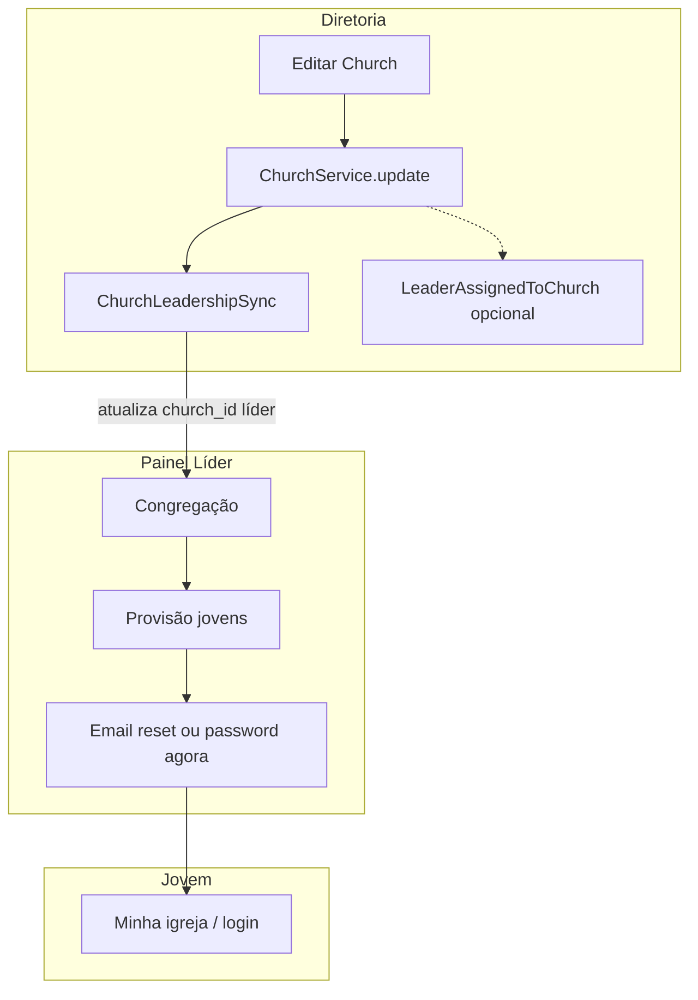

# Plano: Módulo Igrejas completo e exposto em todos os painéis

## Diagnóstico (estado actual)

**Dados e domínio:** [`Modules/Igrejas/app/Models/Church.php`](Modules/Igrejas/app/Models/Church.php) em `igrejas_churches`, com `pastor_user_id`, `unijovem_leader_user_id`, `kind`/congregação, CRM, etc. Sincronização de liderança em [`ChurchLeadershipSync`](Modules/Igrejas/app/Services/ChurchLeadershipSync.php) chamada por [`ChurchService`](Modules/Igrejas/app/Services/ChurchService.php) (create/update) e pelo processador de pedidos de alteração.

**Painel Líder** ([`routes/lideres.php`](routes/lideres.php)): `lideres.congregacao.index` → [`CongregacaoController`](Modules/Igrejas/app/Http/Controllers/PainelLider/CongregacaoController.php); provisão de jovens com `permission:igrejas.jovens.provision` → [`CongregacaoJovensController`](Modules/Igrejas/app/Http/Controllers/PainelLider/CongregacaoJovensController.php) + [`LeaderYouthProvisioningService`](Modules/Igrejas/app/Services/LeaderYouthProvisioningService.php). Gates em [`app/Providers/AppServiceProvider.php`](app/Providers/AppServiceProvider.php): `igrejasProvisionYouth` exige **permissão + `church_id`**. O role `lider` recebe `igrejas.jovens.provision` em [`database/seeders/RolesPermissionsSeeder.php`](database/seeders/RolesPermissionsSeeder.php).

**Painel Diretoria:** rotas `diretoria.igrejas.*` via [`routes/diretoria.php`](routes/diretoria.php) + [`Modules/Igrejas/routes/diretoria.php`](Modules/Igrejas/routes/diretoria.php); dashboard com KPIs e listagens em [`DiretoriaIgrejasDashboardController`](Modules/Igrejas/app/Http/Controllers/DiretoriaIgrejasDashboardController.php); navegação já na [sidebar da Diretoria](Modules/PainelDiretoria/resources/views/components/layouts/sidebar.blade.php).

**Painel Jovens:** [`MinhaIgrejaController`](Modules/Igrejas/app/Http/Controllers/PainelJovens/MinhaIgrejaController.php) + entrada no [sidebar Jovens](Modules/PainelJovens/resources/views/components/layouts/sidebar.blade.php).

**Pastor:** [`routes/pastor.php`](routes/pastor.php) + [`Modules/Igrejas/routes/pastor.php`](Modules/Igrejas/routes/pastor.php) — diretório de leitura com `igrejas.view`, **sem** fluxo de “congregação / jovens” como no líder.

**Permissão:** módulo [`Modules/Permisao`](Modules/Permisao) gere roles/permissions na admin e diretoria; permissões `igrejas.*` já seedadas (incl. `igrejas.jovens.provision`).

---

## Lacunas vs planos `.cursor` e docs internos

| Fonte                                                                                                                                                | O que o plano pedia                               | Situação / lacuna                                                                                                                                                                                                                                                                                                                             |
| ---------------------------------------------------------------------------------------------------------------------------------------------------- | ------------------------------------------------- | --------------------------------------------------------------------------------------------------------------------------------------------------------------------------------------------------------------------------------------------------------------------------------------------------------------------------------------------- |
| [upgrade_módulo_igrejas](.cursor/plans/upgrade_módulo_igrejas_48dbbcf5.plan.md)                                                                      | CRM, repositório/serviço, diretoria, eventos      | Largamente materializado; **perfil em abas no painel do líder** (mencionado no plano) pode ficar como refinamento opcional se ainda não estiver espelhado ao da diretoria                                                                                                                                                                     |
| [permisão + integração](.cursor/plans/permisão_views_+_integração_4f2c9b92.plan.md)                                                                  | User–Church–Roles documentado                     | Verificar se [`Modules/README.md`](Modules/README.md) (ou doc única acordada) descreve o fluxo **líder local ↔ `unijovem_leader_user_id` ↔ `church_id`**                                                                                                                                                                                      |
| [erp_jubaf_próximos_passos](.cursor/plans/erp_jubaf_próximos_passos_b88fe496.plan.md) (e [`docs/erp-events-catalog.md`](docs/erp-events-catalog.md)) | `LeaderAssignedToChurch` ao vincular líder/igreja | Evento disparado em [`UserService::dispatchLeaderAssignedEvents`](app/Services/Admin/UserService.php) quando mudam vínculos pelo **utilizador**; **não** é disparado de forma sistemática quando a **ficha da igreja** define `unijovem_leader_user_id` e só corre `ChurchLeadershipSync` — integração incompleta para notificações/auditoria |
| Censo “concreto”                                                                                                                                     | Dados confiáveis + rastreio                       | Lista local no líder sem export; **sem metadados explícitos** de “quem provisionou” / “primeiro acesso pendente” na UI (opcional mas forte para censo)                                                                                                                                                                                        |

---

## Fluxo alvo (visão única)

---

## Entregas propostas (backend + frontend)

### 1. Vinculação líder local ↔ igreja (operacional e canónica)

- Garantir que **toda** atribuição de líder Unijovem na ficha da igreja (Diretoria/Admin) passa por [`ChurchService`](Modules/Igrejas/app/Services/ChurchService.php) ou caminho que chame `ChurchLeadershipSync` (já é o caso nos updates via serviço).
- **Fechar o buraco do evento:** após `ChurchLeadershipSync::syncFromChurch` (ou dentro dele, com cuidado para não duplicar), comparar `unijovem_leader_user_id` / `pastor_user_id` **antes vs depois** e disparar [`LeaderAssignedToChurch`](Modules/Igrejas/app/Events/LeaderAssignedToChurch.php) quando o vínculo efectivamente mudar (espelhar a lógica de diff já usada em `UserService`). Opcional: notificação além do [`LogLeaderAssignedToChurch`](Modules/Igrejas/app/Listeners/LogLeaderAssignedToChurch.php).
- Validar regra de negócio: utilizador com papel `lider` e `church_id` preenchido; role `lider` + permissões — alinhar formulários de utilizador/diretoria para não ficar só FK na igreja sem role (documentar e, se possível, aviso na UI ao guardar igreja sem utilizador com papel líder).

### 2. Censo e “emissão de acesso” mais profissionais

- **Lista do líder:** manter [`CongregacaoController`](Modules/Igrejas/app/Http/Controllers/PainelLider/CongregacaoController.php) como fonte; acrescentar **export CSV** da mesma query (espelhar [`DiretoriaChurchController::exportMembersCsv`](Modules/Igrejas/app/Http/Controllers/DiretoriaChurchController.php) mas **policy + escopo só da igreja do líder**).
- **Estado do convite:** na listagem, coluna ou badge “Acesso pendente” vs “Activo” usando sinais já existentes (ex.: utilizador sem `email_verified_at`, ou hash de password de convite — definir regra única e documentá-la).
- **Auditoria leve (recomendado):** migração aditiva em `users` (ex. `provisioned_by_user_id` nullable, `provisioned_at` nullable) preenchida em [`LeaderYouthProvisioningService::create`](Modules/Igrejas/app/Services/LeaderYouthProvisioningService.php). Isso sustenta relatórios de censo e relatório diretoria por igreja.

### 3. Painéis: exposição e coerência UX

- **Líder:** views em [`Modules/Igrejas/resources/views/painellider/congregacao`](Modules/Igrejas/resources/views/painellider/congregacao) — alinhar ao layout canónico `painellider::layouts.lideres` e componentes `x-ui.lideres::*` se ainda houver páginas só em `layouts.app`; hero/empty state quando `church` é null com CTA “contactar diretoria” em vez de erro seco.
- **Jovens:** evoluir [`paineljovens/minha-igreja/index`](Modules/Igrejas/resources/views/paineljovens/minha-igreja/index.blade.php) com bloco claro de **identidade da congregação** + líderes de contacto (já há query de líderes).
- **Diretoria:** reforçar atalhos no dashboard (já há “sem liderança”) com link directo para edição da igreja; garantir `members.export.csv` e KPIs coerentes com contagem `jovensMembers` no modelo.
- **Pastor (decisão de produto):** ou manter só diretório, ou acrescentar vista **somente leitura** da lista de jovens da sua igreja (policy: mesmo critério que `view` da igreja, sem `igrejas.jovens.provision`). Incluir no plano como opcional explícito para não misturar com o papel de líder Unijovem.

### 4. RBAC e módulo Permissão

- Manter `igrejas.jovens.provision` como permissão granular para papéis customizados (já seedada).
- Na UI de permissões ([`Modules/Permisao`](Modules/Permisao)), garantir agrupamento legível das permissões `igrejas.*` (incl. `igrejas.jovens.provision`, `igrejas.requests.*`) para diretoria ajustar roles sem SQL.
- Revisar se alguma rota Igrejas em diretoria depende só de middleware genérico — preferir `$this->authorize()` explícito nos controladores já existentes (padrão Laravel + [`ChurchPolicy`](Modules/Igrejas/app/Policies/ChurchPolicy.php)).

### 5. Testes

- Estender [`tests/Feature/Igrejas/CongregacaoJovensTest.php`](tests/Feature/Igrejas/CongregacaoJovensTest.php) (ou novo teste): **atribuir `unijovem_leader_user_id` via `ChurchService`** → utilizador líder fica com `church_id` → `post` cria jovem na mesma igreja.
- Teste de evento: ao mudar líder na igreja, `LeaderAssignedToChurch` disparado **uma vez** por novo vínculo.
- Opcional: teste de export CSV do líder (200 + conteúdo mínimo).

---

## Ordem de implementação sugerida

1. Evento `LeaderAssignedToChurch` no caminho igreja→líder (ChurchService/ChurchLeadershipSync) + testes.
2. Migração + auditoria de provisão + ajuste do serviço de provisão + colunas na UI líder.
3. Export CSV no painel do líder + melhorias de estado “acesso pendente”.
4. Documentação curta do contrato User–Church–Roles e revisão das telas (Jovens/Diretoria/Pastor conforme opcional).
5. Polimento UX/layout nas views `painellider` do Igrejas.

---

## Riscos e decisões

- **Líder com várias igrejas no pivot:** hoje o provisão usa só [`$leader->church_id`](Modules/Igrejas/app/Services/LeaderYouthProvisioningService.php). Ou documentar que a **principal** é a única fonte para censo local, ou introduzir selecção de igreja quando `affiliatedChurchIds()` tiver mais de um id — escolher uma linha e aplicá-la de forma consistente na UI.
- **Pastor com lista de jovens:** útil pastoralmente, mas aumenta superfície de privacidade — só com política clara e mesma base de `church_id` / `affiliatedChurchIds()`.
