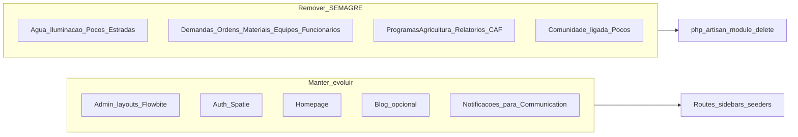

# Plano: Limpeza do JUB (SEMAGRE) rumo ao JUBAF

## Contexto do que existe hoje

- **[JUB](c:\laragon\www\JUB)**: Laravel **12**, `nwidart/laravel-modules` **^12**, **20 módulos** em `Modules/`, autoload **manual** de cada módulo no [`composer.json`](c:\laragon\www\JUB\composer.json) (não usa `wikimedia/composer-merge-plugin` como o JUBAF).
- **Painel que você quer manter**: layouts em [`resources/views/admin`](c:\laragon\www\JUB\resources\views\admin) (ex.: [`sidebar-admin.blade.php`](c:\laragon\www\JUB\resources\views\admin\layouts\sidebar-admin.blade.php)), Stack já alinhada ao plano visual: **Flowbite 4** + **Tailwind 4.1.x** em [`package.json`](c:\laragon\www\JUB\package.json) — subir para **4.2.x** como no JUBAF é só bump de versões.
- **Referência de arquitetura**: [PLANOJUBAF/Plano1-Estrutura.md](c:\laragon\www\JUB\PLANOJUBAF\Plano1-Estrutura.md) e [Plano2-Estrutura.md](c:\laragon\www\JUB\PLANOJUBAF\Plano2-Estrutura.md) descrevem módulos **Core, Auth, SuperAdmin, Churches, Secretariat, Finance, Events, …** — isso ainda **não existe** no JUB; o JUBAF em [c:\laragon\www\JUBAF\Modules](c:\laragon\www\JUBAF\Modules) já tem essa árvore (Laravel **13** + merge-plugin).

## 1. Módulos a **remover** (domínio SEMAGRE / campo)

Comando Nwidart (confirmação interativa): `php artisan module:delete NomeDoModulo` — ver [`ModuleDeleteCommand`](c:\laragon\www\JUB\vendor\nwidart\laravel-modules\src\Commands\Actions\ModuleDeleteCommand.php).

| Módulo                                             | Motivo                                   |
| -------------------------------------------------- | ---------------------------------------- |
| Agua, Iluminacao, Pocos, Estradas, Localidades     | Infraestrutura rural/urbana, não JUBAF   |
| Demandas, Ordens, Materiais, Equipes, Funcionarios | Operação de serviço de campo             |
| ProgramasAgricultura, Relatorios, CAF              | Agricultura / relatórios SEMAGRE         |
| Comunidade                                         | Portal de moradores acoplado a **Pocos** |

**Ordem sugerida:** remover primeiro **Comunidade** e dependências de **Pocos**, depois o restante (ou desabilitar em [`modules_statuses.json`](c:\laragon\www\JUB\modules_statuses.json) antes, testar boot, e só então `module:delete`).

## 2. Módulos a **manter** (reaproveitamento direto)

| Módulo           | Uso no JUBAF                                                                                                                |
| ---------------- | --------------------------------------------------------------------------------------------------------------------------- |
| **Homepage**     | Site público; você citou melhorar a homepage — manter e renomear conteúdos depois para JUBAF                                |
| **Blog**         | Comunicação institucional (opcional; pode virar “notícias” no plano)                                                        |
| **Notificacoes** | Base conceitual para **Communication** (envio/centro de avisos)                                                             |
| **Chat**         | **Decisão de produto:** útil como suporte interno; se não for usar, remover na mesma leva para reduzir `vite` + Pusher etc. |

## 3. Ajustes obrigatórios **fora** da pasta `Modules/` (após deletes)

O `module:delete` **não** limpa sozinho todo o acoplamento deste projeto.

- **Rotas:** [`routes/admin.php`](c:\laragon\www\JUB\routes\admin.php) (blocos enormes por módulo), [`routes/co-admin.php`](c:\laragon\www\JUB\routes\co-admin.php), [`routes/campo.php`](c:\laragon\www\JUB\routes\campo.php), [`routes/consulta.php`](c:\laragon\www\JUB\routes\consulta.php), [`routes/web.php`](c:\laragon\www\JUB\routes\web.php), [`routes/console.php`](c:\laragon\www\JUB\routes\console.php) — remover `if (Module::isEnabled(...))` e `use Modules\...` dos módulos apagados; **simplificar ou arquivar** painéis `co-admin` / `campo` / `consulta` se não existirem mais papéis equivalentes no JUBAF (senão ficam rotas mortas).
- **Sidebars / layouts:** [`resources/views/admin/layouts/sidebar-admin.blade.php`](c:\laragon\www\JUB\resources\views\admin\layouts\sidebar-admin.blade.php), [`Co-Admin/layouts/sidebar.blade.php`](c:\laragon\www\JUB\resources\views\Co-Admin\layouts\sidebar.blade.php), [`campo/layouts/app.blade.php`](c:\laragon\www\JUB\resources\views\campo\layouts\app.blade.php) — retirar entradas dos módulos removidos.
- **Componentes globais:** ex. [`resources/views/components/quick-pessoa-modal.blade.php`](c:\laragon\www\JUB\resources\views\components\quick-pessoa-modal.blade.php) referencia `Localidades` — remover ou reescrever quando houver modelo de “setor/cidade” JUBAF.
- **Admin app:** rotas como “lideres-comunidade”, “comunidade-portal”, `FormularioManualController` (demandas/ordens), impersonation ligada a `Funcionarios` — revisar e **cortar** o que não tiver substituto.
- **[`composer.json`](c:\laragon\www\JUB\composer.json):** remover **todas** as entradas `psr-4` sob `Modules\...\` dos módulos excluídos; depois `composer dump-autoload`.
- **[`vite.config.js`](c:\laragon\www\JUB\vite.config.js):** remover inputs de módulos deletados (ex.: `Modules/Chat/...` se Chat sair).
- **Seeders:** [`database/seeders`](c:\laragon\www\JUB\database\seeders) com `Localidades`, `Pocos`, `Funcionarios`, etc. — apagar ou isolar seed “demo SEMAGRE”.
- **Documentação estática:** pasta [`docs`](c:\laragon\www\JUB\docs) com HTML por módulo antigo — remover ou substituir por docs JUBAF quando fizer sentido (escopo baixa prioridade).

## 4. Banco de dados (sua escolha: **dev limpo**)

- **`php artisan migrate:fresh --seed`** (ou recriar SQLite/MySQL vazio) após:
  - Remover migrations que criam tabelas **só** dos módulos excluídos **ou** squash futuro (`schema:dump` + migrations novas), para não arrastar 100+ tabelas mortas.
  - Definir um **DatabaseSeeder** mínimo: roles Spatie JUBAF, usuário admin, configurações globais, dados mínimos para Homepage/Blog se mantidos.
- Tratar dados de produção **só** quando for migrar ambiente real (export seletivo / ETL) — fora do escopo imediato de “limpeza dev”.

## 5. Alinhar stack front (Tailwind **4.2** + Flowbite)

- Atualizar em [`package.json`](c:\laragon\www\JUB\package.json): `tailwindcss` e `@tailwindcss/vite` para **^4.2.x** (espelhar [JUBAF/package.json](c:\laragon\www\JUBAF\package.json)).
- Rodar `npm install` e `npm run build` para validar.
- Opcional: reduzir dependências que só serviam SEMAGRE (ex.: `jquery`, `preline`, `pusher-js`) **após** confirmar que nenhum Blade/JS restante as importa.

## 6. Composer: pacotes a **reavaliar** após a limpeza

| Pacote                                                | Provável uso pós-SEMAGRE                                              |
| ----------------------------------------------------- | --------------------------------------------------------------------- |
| `gerencianet/gerencianet-sdk-php`                     | Muito ligado a boletos/poços — candidato a remoção                    |
| `minishlink/web-push`                                 | Só se mantiver push como no plano de comunicação                      |
| `barryvdh/laravel-dompdf`, `phpoffice/phpspreadsheet` | Úteis para atas/relatórios JUBAF — **manter** se forem usar PDF/Excel |
| `intervention/image`                                  | Útil para uploads (eventos, blog)                                     |

## 7. Próxima fase (após o corte): módulos JUBAF no JUB

Duas linhas possíveis (escolha em sprint seguinte):

- **A)** Gerar módulos vazios com `php artisan module:make Churches` etc. e portar **lógica** do [JUBAF](c:\laragon\www\JUBAF) aos poucos, mantendo o **layout atual do JUB**.
- **B)** Subir o JUB para Laravel 13 + `composer-merge-plugin` como o JUBAF (mudança maior; facilita copiar módulos quase literais).

Recomendação pragmática: **primeiro** estabilizar JUB sem módulos mortos + banco fresco; **depois** decidir entre A ou B com base em esforço de upgrade.

## 8. Critérios de “pronto” para esta limpeza

- `php artisan route:list` e painel admin abrem sem referência a classes em módulos removidos.
- `composer dump-autoload` e `npm run build` sem erro.
- Sidebar admin só lista o que existe (Homepage, Blog, Notificações, etc.).
- Migrations + seed refletem um **JUBAF em construção**, não SEMAGRE.
