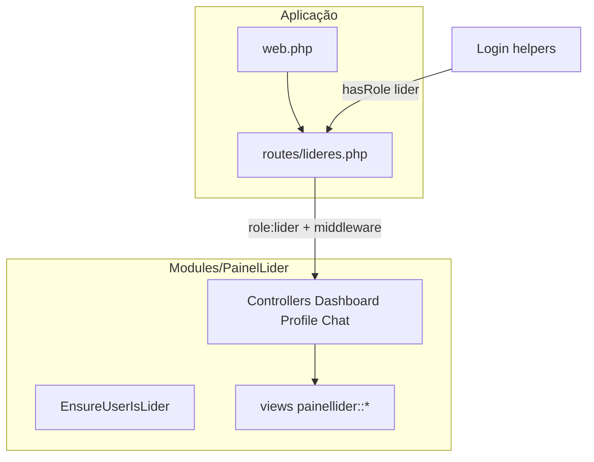

# Painel de Líderes JUBAF — migração completa (Campo → PainelLider)

## Princípios (pedido de revisão)

1. **Centralização no módulo** — Tudo o que for domínio do painel de líderes vive em [Modules/PainelLider](c:/laragon/www/JUB/Modules/PainelLider): `app/Http/Controllers`, `app/Http/Middleware`, vistas em `resources/views` (namespace `painellider::`), config do módulo, e eventualmente `lang/` ou componentes Blade do módulo. A app raiz **não** mantém controladores `Campo*` nem vistas em `resources/views/campo`.
2. **Rotas organizadas na raiz** — [routes/lideres.php](c:/laragon/www/JUB/routes/lideres.php) é o **único sítio canónico** onde o grupo `lideres.*` é declarado: `use` dos controladores do módulo, `prefix('lideres')`, `name('lideres.')`, middleware em cadeia. [routes/web.php](c:/laragon/www/JUB/routes/web.php) faz `require lideres.php` e **deixa de** carregar `campo.php`.
3. **Papel Spatie: `lider` apenas** — A role **`campo` deixa de existir** no sistema (código, seeders, config). Não se usa o slug `lider-local` no código: semanticamente equivale ao “Líder local” do [PLANOJUBAF/Escopo.md](c:/laragon/www/JUB/PLANOJUBAF/Escopo.md), mas o identificador profissional no produto é **`lider`** (URLs e painel em **`lideres`**).
4. **Migração completa + upgrade JUBAF** — Não é uma migração “mínima”: migrar **todo** o conjunto de layouts e páginas do legado [resources/views/campo](c:/laragon/www/JUB/resources/views/campo) (app, sidebar, navbar, dashboards, perfil, chat, e ficheiros que hoje não têm rota) e **transformar** o painel numa experiência **ponta a ponta** alinhada ao JUBAF: tipografia e componentes coerentes com o resto do projeto (Flowbite + Tailwind do bundle global, sem CDN ad hoc onde o projeto já padronizou Vite), copy institucional juventude/igreja local, hierarquia visual clara, estados vazios úteis, dashboard **rico** (resumo, atalhos para áreas JUBAF relevantes — ex. avisos, recursos públicos, Bíblia se fizer sentido, chat quando o módulo existir), remoção de linguagem “campo / OS / materiais” legado JUB **ou** substituição por blocos JUBAF (placeholders honestos “Em breve” com design polido, nunca links mortos).

## Contexto atual (antes da execução)

- Painel legado: [routes/campo.php](c:/laragon/www/JUB/routes/campo.php), vistas [resources/views/campo](c:/laragon/www/JUB/resources/views/campo), controladores `App\Http\Controllers\Funcionario\Campo*`.
- [Modules/PainelLider](c:/laragon/www/JUB/Modules/PainelLider) ainda é scaffold (resource `painelliders`, [PainelLiderController](c:/laragon/www/JUB/Modules/PainelLider/app/Http/Controllers/PainelLiderController.php)).

## Arquitetura alvo

- **Middleware** `EnsureUserIsLider` em `Modules/PainelLider/app/Http/Middleware/`, registado no [PainelLiderServiceProvider](c:/laragon/www/JUB/Modules/PainelLider/app/Providers/PainelLiderServiceProvider.php) (alias tipo `painellider.lider` ou documentar classe FQCN em `lideres.php`).
- **RouteServiceProvider do módulo**: evitar registar um segundo conjunto de rotas web que duplique `/lideres`; ou desativar `mapWebRoutes` para o painel e confiar só em `routes/lideres.php`, **ou** mover o conteúdo de `lideres.php` para um ficheiro no módulo e fazer `routes/lideres.php` apenas `require module_path('PainelLider', 'routes/lideres-panel.php')` — **preferência**: manter legibilidade em `routes/lideres.php` com `use Modules\PainelLider\...` (tudo ainda “centralizado” no módulo ao nível de código executável).

## Papel `lider` e dados

- **Migration**: para `guard_name = web`, mapear utilizadores com role `campo` para `lider` (criar role `lider` se não existir, sincronizar `model_has_roles`, apagar role `campo` se já não houver referências). `forgetCachedPermissions()` no fim.
- **[config/jubaf_roles.php](c:/laragon/www/JUB/config/jubaf_roles.php)**: substituir todas as chaves `campo` por `lider`; labels/descrições = Líder (igreja local / Unijovem) conforme Escopo.
- **[database/seeders/RolesPermissionsSeeder.php](c:/laragon/www/JUB/database/seeders/RolesPermissionsSeeder.php)**: role `lider`, mesmas permissões operacionais que hoje o campo tinha (ex. `chat.view`, `notificacoes.view`); utilizador demo `lider@jubaf.local` (ou equivalente) com `assignRole('lider')`.
- **Código**: `hasRole('lider')`, `role:lider`; remover referências a `campo` em Login, Register, Dashboard redirect, helpers, Chat (lista de roles), TranslationHelper, Homepage demo links (auto-login pode manter query tipo `?demo=lider` mapeando para o mesmo user demo).

## Upgrade de produto e UI (âmbito explícito)

- **Layout**: revisão do [app.blade.php](c:/laragon/www/JUB/resources/views/campo/layouts/app.blade.php) migrado — tema JUBAF, título/manifest/PWA meta “Painel de Líderes JUBAF”, sidebar e navbar com ícones alinhados ao projeto ([jubaf-module-icons](c:/laragon/www/JUB/.cursor/skills/jubaf-module-icons/SKILL.md) quando for representação de módulo).
- **Dashboard**: deixar de ser só “minimal” vazio; página principal com secções úteis (boas-vindas, cards de ação, área de avisos/notícias se houver API/rota existente, links para perfil e chat).
- **Perfil e Chat**: paridade com o comportamento atual dos controladores Campo\*, com formulários e feedback visuais atualizados.
- **Vistas sem rota hoje** (ex. `dashboard.blade.php` com ordens): **não** copiar links para rotas inexistentes; reescrever conteúdo para narrativa JUBAF ou remover secções substituindo por componentes reutilizáveis do painel.

## Limpeza obrigatória

- Apagar [routes/campo.php](c:/laragon/www/JUB/routes/campo.php), pasta `resources/views/campo`, `App\Http\Controllers\Funcionario\Campo*.php`, [CampoOrdensComposer](c:/laragon/www/JUB/app/View/Composers/CampoOrdensComposer.php), entrada `View::composer('campo.*', ...)` em [AppServiceProvider](c:/laragon/www/JUB/app/Providers/AppServiceProvider.php).
- **301** `Route::permanentRedirect('/campo', '/lideres')` (e subpaths usados no legado, se aplicável) para bookmarks.
- Remover stub `PainelLiderController` e rotas `painelliders` do módulo após o painel real estar ativo.

## Verificação

- `php artisan route:list --name=lideres`
- Login utilizador `lider` → `lideres.dashboard`
- 403 sem role `lider` em `/lideres/*`
- Testes Feature (painel + middleware + chat condicional)
- Grep: zero `campo` como role de painel / `routes/campo` / `views/campo`

## Nota `church_id`

- Se o modelo User ainda não tiver `church_id`, o upgrade pode incluir **UI preparada** (ex. banner “Igreja ainda não associada”) sem bloquear a migração; ligação de dados com [Modules/Churches](c:/laragon/www/JUB/Modules/Churches) fica como evolução natural após esta entrega.
