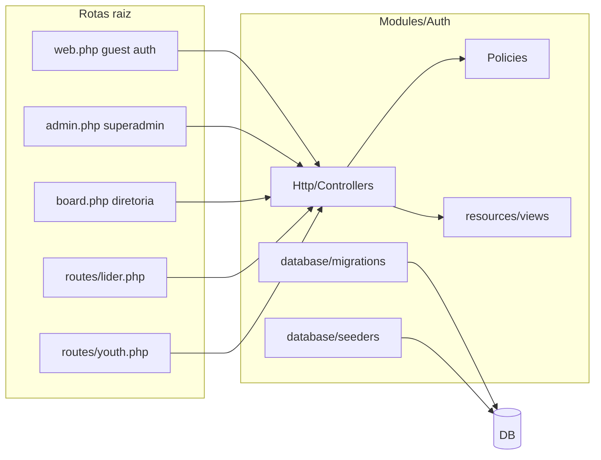

# Plano: módulo Auth completo e integrado (antes do Core)

## Contexto atual

- **Sessão pública:** [routes/web.php](routes/web.php) usa controladores em [app/Http/Controllers/Auth/](app/Http/Controllers/Auth/) e vistas em [resources/views/auth/](resources/views/auth/). [LoginController](app/Http/Controllers/Auth/LoginController.php) autentica por email ou CPF (`document_id`), redireciona sempre para `route('home')`.
- **Spatie:** [database/seeders/JubafRolesAndPermissionsSeeder.php](database/seeders/JubafRolesAndPermissionsSeeder.php) define os 7 papéis e a matriz de permissions do [Escopo.md](PLANOJUBAF/Escopo.md). Em [bootstrap/app.php](bootstrap/app.php) só está registado o middleware `role`; **não** há `permission` / `role_or_permission`.
- **Módulo Auth:** [MemberEnrollmentService](Modules/Auth/app/Services/MemberEnrollmentService.php), modelos [YouthProfile](Modules/Auth/app/Models/YouthProfile.php) / [BoardMember](Modules/Auth/app/Models/BoardMember.php) e [User](app/Models/User.php) já alinhados ao fluxo do escopo. [Modules/Auth/app/Http/Controllers/AuthController.php](Modules/Auth/app/Http/Controllers/AuthController.php) é scaffold vazio; [Modules/Auth/routes/web.php](Modules/Auth/routes/web.php) está vazio; o [RouteServiceProvider](Modules/Auth/app/Providers/RouteServiceProvider.php) do módulo **não** está na lista de `providers` do [module.json](Modules/Auth/module.json) (hoje as rotas efetivas são só as da raiz).
- **Painéis:** `/superadmin` ([routes/admin.php](routes/admin.php)) é CMS + Bíblia (módulo SuperAdmin). [routes/lider.php](routes/lider.php) só redireciona para `home`. Não confundir **DiretoriaMember** (página pública em `/diretoria`) com **board_members** (mandatos institucionais no Auth).

## Decisões de arquitetura

1. **Rotas na raiz:** Manter o requisito: ficheiros em `routes/` e registo em `bootstrap/app.php` (grupos por prefixo e middleware). Os controladores residem em `Modules/Auth/app/Http/Controllers/...` por domínio (ex.: `Guest/`, `SuperAdmin/`, `Lider/`, `Pastor/`, `Youth/`, `Board/`).
2. **Vistas no módulo:** Namespace `auth::` com pastas claras, por exemplo:

- `resources/views/guest/` — login, forgot/reset password (equivalente ao que está hoje em `resources/views/auth/`).
- `resources/views/superadmin/`, `diretoria/`, `lider/`, `pastor/`, `jovem/` — dashboards e CRUD por painel.
- Layouts partilhados: reutilizar padrão Flowbite/Tailwind já usado em [Modules/SuperAdmin/resources/views/layouts/app.blade.php](Modules/SuperAdmin/resources/views/layouts/app.blade.php) ou extrair um layout “painel” mínimo no Auth para não duplicar em excesso (preferir componentes/layout blade coerentes com o projeto).

1. **Modelo User:** Permanece em `App\Models\User` (convênio Laravel + `Authenticatable`); políticas e requests no módulo Auth podem referenciar `App\Models\User`.
2. **Migrações:** O ficheiro único [database/migrations/2025_01_20_000000_create_churches_users_and_auth_tables.php](database/migrations/2025_01_20_000000_create_churches_users_and_auth_tables.php) deve existir **num único sítio**. Plano: **mover** para [Modules/Auth/database/migrations/](Modules/Auth/database/migrations/) com o **mesmo nome de ficheiro** e registar `loadMigrationsFrom()` em [AuthServiceProvider](Modules/Auth/app/Providers/AuthServiceProvider.php). Remover a cópia da raiz para evitar dupla descoberta. Para bases já migradas, o registo na tabela `migrations` é pelo nome do ficheiro — continua válido após o move, desde que o comando `migrate` carregue o path do módulo (verificar com `php artisan migrate:status` após a alteração).
3. **Seeders:** Mover ou duplicar de forma controlada: colocar em `Modules/Auth/database/seeders/` o seeder de roles/permissions (hoje `JubafRolesAndPermissionsSeeder`) e fazer [DatabaseSeeder](database/seeders/DatabaseSeeder.php) e [AuthDatabaseSeeder](Modules/Auth/database/seeders/AuthDatabaseSeeder.php) chamarem as classes do módulo (evitar duas fontes de verdade).

## Segurança e autorização (Escopo)

- Registar middlewares Spatie em [bootstrap/app.php](bootstrap/app.php): `permission` e opcionalmente `role_or_permission` ([Spatie docs](https://spatie.be/docs/laravel-permission)).
- Introduzir **policies** (ex.: `UserPolicy`, `YouthProfilePolicy`, `BoardMemberPolicy`) em `Modules/Auth/app/Policies/`, registadas em `AuthServiceProvider` do **módulo** ou no `AppServiceProvider` da app (escolher um único local documentado).
- Regras centrais a codificar:
    - **SuperAdmin:** gestão global de utilizadores e papéis (`admin.`).
    - **Secretário:** criar/editar utilizadores ligados a igrejas e fluxos de secretariado (`churches.manage` / `secretariat.`) conforme matriz.
    - **Líder Local:** CRUD de jovens **apenas** com `church_id` igual ao do líder; usar `MemberEnrollmentService` + policies.
    - **Pastor Local:** leitura na própria igreja (`localchurch.view`).
    - **Jovem:** atualizar apenas o próprio perfil / campos permitidos.
    - **Presidente / diretoria:** mandatos `board_members` com `board.meetings` (e eventualmente `admin.full` para casos especiais, alinhado ao serviço existente).

## CRUD por painel (âmbito Auth)

| Área              | Rota sugerida (prefixo)                                                             | Permissão / papel                 | Entidades                                                                                          |
| ----------------- | ----------------------------------------------------------------------------------- | --------------------------------- | -------------------------------------------------------------------------------------------------- |
| SuperAdmin        | dentro de `/superadmin` (novas rotas em [routes/admin.php](routes/admin.php))       | `role:SuperAdmin` ou `admin.full` | Utilizadores (lista, criar, editar, ativar/desativar, atribuir roles), opcionalmente convite/reset |
| Diretoria (board) | novo ficheiro `routes/board.php` + prefixo `diretoria-painel` ou `painel/diretoria` | `board.meetings` (+ Presidente)   | `BoardMember` + utilizadores alvo                                                                  |
| Líder             | expandir [routes/lider.php](routes/lider.php)                                       | `permission:localchurch.manage`   | Jovens (`User` + `YouthProfile`)                                                                   |
| Pastor            | mesmo prefixo `lider` com sub-grupo ou `pastor`                                     | `permission:localchurch.view`     | Leitura de jovens/dados da igreja                                                                  |
| Jovem             | `routes/youth.php` ou `jovem`                                                       | `auth` + role `Jovem`             | Perfil próprio                                                                                     |

Incluir **dashboard por papel** após login: substituir o redirect fixo `route('home')` em [bootstrap/app.php](bootstrap/app.php) (`redirectUsersTo`) por um destino derivado de role/permission (controlador único `PostLoginRedirect` ou helper no Auth) para não enviar Presidente/Jovem todos para a homepage pública.

## Fluxos a completar

- **Login / logout / password:** Migrar controladores de `app/Http/Controllers/Auth/`_ para `Modules/Auth`, atualizar imports em `routes/web.php`, apontar `view()` para `auth::guest.`_.
- **Validação:** Form Requests no módulo por ação (criação utilizador, jovem, mandato).
- **Auditoria leve (opcional nesta fase):** `is_active`, `registered_by_id` já existem; garantir que desativação e remoção de papel respeitam política.

## Testes

- Feature tests PHPUnit (regra do projeto): login email/CPF, 403 em CRUD cross-church, SuperAdmin pode gerir roles, Líder só na sua igreja, Pastor só leitura, Jovem só self. Reutilizar padrão de [tests/Feature/PublicSiteTest.php](tests/Feature/PublicSiteTest.php) com `JubafRolesAndPermissionsSeeder`.

## Documentação transversal

- Atualizar [CHANGLOG.md](CHANGLOG.md) com a consolidação do Auth (rotas, pastas de views, migrações no módulo, middleware Spatie).

## Fora de âmbito (explícito)

- Módulos **Core**, **Churches** (cadastro completo de 70+ igrejas), **Finance**, **Secretariat** além do mínimo necessário a utilizadores — apenas o que o Auth precisa (ex.: select de `churches` para SuperAdmin/Secretário) fica neste passo.

