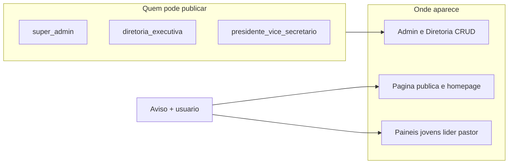

# Integração completa do módulo Avisos (JUBAF)

## Contexto e achados da auditoria

- **View pública quebrada**: [`Modules/Avisos/app/Http/Controllers/AvisosController.php`](Modules/Avisos/app/Http/Controllers/AvisosController.php) retorna `view('avisos::index')`, mas a view existente é [`Modules/Avisos/resources/views/public/index.blade.php`](Modules/Avisos/resources/views/public/index.blade.php) — o nome correto no namespace do módulo deve ser **`avisos::public.index`** (ou criar `index.blade.php` na raiz das views; preferir nome explícito `public.index`).
- **Painéis vazios**: [`paineljovens/avisos/index.blade.php`](Modules/Avisos/resources/views/paineljovens/avisos/index.blade.php) e [`painellider/avisos/index.blade.php`](Modules/Avisos/resources/views/painellider/avisos/index.blade.php) estão vazios; [`routes/jovens.php`](routes/jovens.php), [`routes/lideres.php`](routes/lideres.php) e [`routes/pastor.php`](routes/pastor.php) **não** definem rotas de avisos — os painéis não têm como exibir o recurso hoje.
- **Estatísticas incorretas**: em [`admin/index.blade.php`](Modules/Avisos/resources/views/admin/index.blade.php) e [`paineldiretoria/index.blade.php`](Modules/Avisos/resources/views/paineldiretoria/index.blade.php) os cards usam `estatisticas['por_tipo']['banner']` / `modal`, mas em [`AvisoAdminController`](Modules/Avisos/app/Http/Controllers/Admin/AvisosAdminController.php) `por_tipo` agrupa pelo campo **`tipo`** (info, success, …) e **`banner`/`modal` pertencem ao campo `estilo`** — alinhar com `por_estilo` (já calculado no controller) ou ajustar labels.
- **Autorização**: rotas em [`Modules/Avisos/routes/web.php`](Modules/Avisos/routes/web.php) para `admin/avisos` usam só `auth` + `throttle`. Falta **Policy ou middleware** alinhado a [`JubafRoleRegistry`](app/Support/JubafRoleRegistry.php) e à sua regra: **criar/editar/excluir** apenas super-admin, diretoria executiva e papéis **presidente / vice-presidente / secretário** (e equivalentes canônicos no registry).
- **API morta**: [`Modules/Avisos/routes/api.php`](Modules/Avisos/routes/api.php) registra `apiResource` em `AvisosController` com métodos vazios — ou remove o resource, ou implementa de forma segura; evitar expor CRUD aberto sem policy.
- **Dados para avatar**: o modelo [`Aviso`](Modules/Avisos/app/Models/Aviso.php) já tem `user_id` e `usuario()`. Garantir **eager load** `usuario` (e uso de `user_photo_url()` já existente em [`app/helpers.php`](app/helpers.php)) em listagens públicas, componentes de banner/modal e painéis.

## Diretrizes de UX e “oficial”

- **Avatar do autor**: em cards, listagens e página pública, exibir foto via `user_photo_url($aviso->usuario)` com fallback (iniciais ou ícone), sempre com **nome** do publicador.
- **Selo “Aviso oficial JUBAF”**: exibir quando o autor for super-admin **ou** tiver papel de diretoria executiva (e opcionalmente presidente/vice/secretário conforme regra de negócio única definida no helper/policy para não duplicar lógica). Texto curto e coerente com o evento (sem referência a SEMAGRi).
- **Layouts**: reutilizar os mesmos **layouts** que cada painel já usa (ex.: `paineljovens::layouts.app`, `painellider::layouts.app`, layout de pastor), espelhando padrões de outras listagens do módulo (ex. Blog/Calendário) para consistência.

## Trabalho por frente

### 1. Corrigir bug e enriquecer a rota pública

- Ajustar `AvisosController@index` para a view correta.
- Refatorar [`public/index.blade.php`](Modules/Avisos/resources/views/public/index.blade.php): grid/cards responsivos, filtros por posição/tipo se fizer sentido, **avatar + selo oficial**, datas, link “ver detalhe” se houver rota de show pública (hoje só `index` e `track` — decidir se `/avisos/{slug}` fica como página de detalhe usando `Aviso::findBySlug`).

### 2. Autorização centralizada

- Criar **`AvisoPolicy`** (ou estender política existente) com `viewAny`, `create`, `update`, `delete` baseados em `JubafRoleRegistry::hasRoleCanonical` / `userIsSuperAdmin`.
- Registrar policy no `AuthServiceProvider` do app ou no service provider do módulo.
- Aplicar `authorize` nos métodos de [`AvisosAdminController`](Modules/Avisos/app/Http/Controllers/Admin/AvisosAdminController.php) e, se necessário, middleware em [`Modules/Avisos/routes/web.php`](Modules/Avisos/routes/web.php) e [`routes/diretoria.php`](routes/diretoria.php) para rotas de criação/edição.
- Garantir que **leitores** (jovens, líder, pastor) só recebam `index`/`show` autorizados.

### 3. Painéis jovens, líder e pastor

- Adicionar rotas nomeadas (ex. `jovens.avisos.*`, `lideres.avisos.*`, `pastor.avisos.*`) apontando para um **controller dedicado** (ex. `AvisosPainelController`) com `index` e opcionalmente `show`, reutilizando `Aviso::ativos()->forAudience(auth()->user())` e ordenação igual ao serviço.
- Implementar views completas nos arquivos hoje vazios, com o mesmo bloco de **avatar + oficial** e link para detalhe.
- Inserir entradas nos **menus laterais** dos módulos PainelJovens, PainelLider e na navegação do pastor (onde já existem links similares), usando o skill de ícones do módulo se aplicável ([`.cursor/skills/jubaf-module-icons/SKILL.md`](.cursor/skills/jubaf-module-icons/SKILL.md)).

### 4. Admin e Diretoria (CRUD)

- O [`AvisosAdminController`](Modules/Avisos/app/Http/Controllers/Admin/AvisosAdminController.php) já alterna `avisos::admin.*` vs `avisos::paineldiretoria.*` por `routeIs('diretoria.*')`. Revisar **create/edit/show/index** para:
    - Corrigir blocos de estatísticas (`por_estilo` vs `por_tipo`).
    - Garantir que formulários usem os mesmos componentes/partials ([`church-audience-fields`](Modules/Avisos/resources/views/partials/church-audience-fields.blade.php)) e mensagens de validação.
    - Botões/ações condicionados à policy (ocultar “Novo” para quem não pode criar).

### 5. Componentes em tempo real / dinâmico

- **Fase mínima (recomendada)**: eager load + **polling leve** na página pública ou nos painéis (ex. `meta refresh` ou fetch a [`AvisosPublicController`](Modules/Avisos/app/Http/Controllers/AvisosPublicController.php) JSON com intervalo 60–120s) para “quase tempo real” sem infraestrutura extra.
- **Fase opcional**: se o projeto já usa Echo/Reverb, evento `AvisoPublished` + broadcast para atualizar lista — só se broadcasting já estiver configurado no app.

### 6. Performance de queries

- Em [`AvisoService`](Modules/Avisos/app/Services/AvisoService.php) e queries dos novos controllers, adicionar `with('usuario')` (e relação de foto de perfil se necessário) para evitar N+1 nos avatares.

### 7. Limpeza de arquivos mortos

- Remover ou consolidar: métodos vazios em `AvisosController` se não forem usados; rotas API sem implementação; assets do módulo não referenciados (ex. [`Modules/Avisos/vite.config.js`](Modules/Avisos/vite.config.js) se não entra no build principal).
- **Só apagar** após `grep`/testes confirmando ausência de referências.

### 8. Testes

- Estender [`Modules/Avisos/tests/Feature/AvisosFullSuiteTest.php`](Modules/Avisos/tests/Feature/AvisosFullSuiteTest.php) (ou criar testes focados) para: view pública responde 200; rotas dos painéis com usuário autenticado; usuário sem papel não cria aviso; usuário autorizado cria.

## Nota sobre “PLANOJUBAF”

Não foi encontrado ficheiro com esse nome no repositório; o copy e o tom visual seguirão **layouts e convenções JUBAF** já usados em Homepage e nos painéis.
