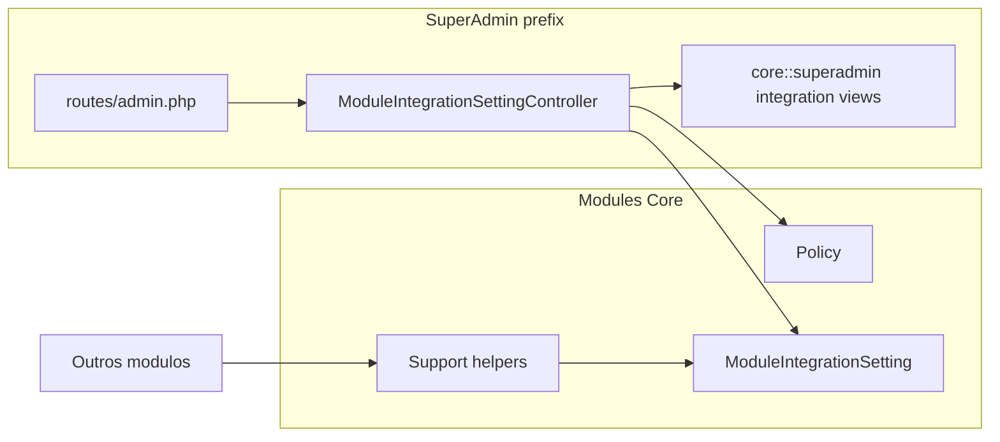

# Plano: Módulo Core 100% integrado (sem skeleton)

## Contexto e decisão de produto

- [PLANOJUBAF/Plano2-Estrutura.md](PLANOJUBAF/Plano2-Estrutura.md) define **Core** como camada de **lógica e design system partilhados** (Tailwind v4.2, Flowbite, traits), enquanto **SuperAdmin** é a “central técnica” de UI administrativa. O [README raiz](README.md) já descreve o stack global em `resources/css/app.css` e `resources/js/app.js`.
- O estado atual (`[Modules/Core/app/Http/Controllers/CoreController.php](Modules/Core/app/Http/Controllers/CoreController.php)`, `[Modules/Core/routes/web.php](Modules/Core/routes/web.php)`, `[Modules/Core/routes/api.php](Modules/Core/routes/api.php)`) é **stub de CRUD** (`cores`) com métodos vazios e **API com Sanctum** apontando para controlador que devolve **views** — incorreto e a expor `/cores` na raiz da app.
- `[Modules/Core/resources/views/components/layouts/master.blade.php](Modules/Core/resources/views/components/layouts/master.blade.php)` usa **CDN Bunny Fonts**, o que viola [AGENTS.md](AGENTS.md) / `.ai/guidelines/jubaf-project-standards.md`.

**Conclusão:** “CRUD completo” aqui significa **remover o falso resource** e entregar **um CRUD real com entidade de domínio do Core** (técnico/integração), mais **serviços e documentação**, sem duplicar o que já existe em `[app/Models/SiteSetting.php](app/Models/SiteSetting.php)` (conteúdo da homepage).

## Entregas principais

### 1. Domínio: integrações por módulo (CRUD)

- Nova tabela (ex.: `module_integration_settings`) com campos mínimos: `module_slug` (string, indexada), `key` (string), `value` (JSON), `description` (nullable text), timestamps, **unique** `(module_slug, key)`.
- Model Eloquent em `Modules/Core/app/Models/ModuleIntegrationSetting.php` com casts, scopes (`forModule(string $slug)`), e helper estático tipo `getValue(string $module, string $key, mixed $default = null)` para outros módulos consumirem.
- **Policy** dedicada (SuperAdmin-only ou `hasRole('SuperAdmin')`); registo em `[Modules/Core/app/Providers/CoreServiceProvider.php](Modules/Core/app/Providers/CoreServiceProvider.php)` via `Gate::policy`.
- **Form Requests** para store/update (validação: slug normalizado, key, JSON value opcionalmente validado como array).
- **Controller** em `Modules/Core/app/Http/Controllers/SuperAdmin/ModuleIntegrationSettingController.php` com resource completo (index, create, store, edit, update, destroy), autorização explícita em cada ação.

### 2. Rotas e integração com o painel existente

- **Remover** o `Route::resource('cores', …)` de `[Modules/Core/routes/web.php](Modules/Core/routes/web.php)` e o grupo problemático em `[Modules/Core/routes/api.php](Modules/Core/routes/api.php)` (substituir por comentário + eventual rota JSON só se fizer sentido no futuro, ou ficheiro mínimo sem `apiResource` incorreto).
- **Registar** o resource no prefixo já existente em `[routes/admin.php](routes/admin.php)` (mesmo padrão que `slides`, `faq`, etc.), com nome `superadmin.core.integration-settings.` (ou prefixo curto `core/integration-settings`), **middleware herdado** `web`, `auth`, `role:SuperAdmin` de `[bootstrap/app.php](bootstrap/app.php)`.

### 3. UI (Flowbite + Tailwind v4.2 + modo escuro)

- Views Blade em `Modules/Core/resources/views/superadmin/integration-settings/` estendendo `[Modules/SuperAdmin/resources/views/layouts/app.blade.php](Modules/SuperAdmin/resources/views/layouts/app.blade.php)` (`@extends('superadmin::layouts.app')`), seguindo o padrão visual de listagens existentes (tabela responsiva, botões, formulários, mensagens de estado/erro já tratadas no layout).
- Incluir link na barra de navegação do SuperAdmin em `[Modules/SuperAdmin/resources/views/layouts/app.blade.php](Modules/SuperAdmin/resources/views/layouts/app.blade.php)` com `[<x-module-icon module="core" />](config/module_icons.php)` ao lado do texto (ex.: “Core / Integrações”), e `request()->routeIs('superadmin.core.*')` para estado ativo.

### 4. Infraestrutura partilhada (Plano2)

- Pasta `Modules/Core/Support/` com pelo menos uma peça reutilizável, por exemplo:
    - `ModuleIntegration` facade/repository fino em cima do model, **ou**
    - trait/documentação para consumo consistente do helper `getValue` nos outros módulos.
- Opcional enxuto: classe `Modules\Core\Support\EnabledModules` que lista módulos nwidart (para uma secção “Sistema” na página index ou no dashboard SuperAdmin) — só se não inflar o escopo; prioridade é CRUD + qualidade.

### 5. Limpeza e alinhamento com padrões do projeto

- **Eliminar ou reescrever** `[Modules/Core/app/Http/Controllers/CoreController.php](Modules/Core/app/Http/Controllers/CoreController.php)` (remover se deixar de ser referenciado).
- **Corrigir ou remover** `[Modules/Core/resources/views/components/layouts/master.blade.php](Modules/Core/resources/views/components/layouts/master.blade.php)`: se mantido para demos internas, usar `@vite(['resources/css/app.css', 'resources/js/app.js'])`, `@include('partials.theme-script')`, **sem CDN**; caso não haja uso real após migração das views para SuperAdmin, remover o componente e `[Modules/Core/resources/views/index.blade.php](Modules/Core/resources/views/index.blade.php)` que o referencia.
- **Duplicado de frontend no módulo** (`[Modules/Core/package.json](Modules/Core/package.json)`, `vite.config.js`, `resources/css|js` locais): documentar no README que o **bundle oficial** é o da raiz; avaliar remoção dos artefactos duplicados para não confundir equipe (sem adicionar segundo pipeline de build salvo necessidade futura).

### 6. Permissões Spatie

- Adicionar permissão explícita (ex.: `core.integration.manage`) em `[Modules/Auth/database/seeders/JubafRolesAndPermissionsSeeder.php](Modules/Auth/database/seeders/JubafRolesAndPermissionsSeeder.php)` e atribuir a **SuperAdmin** (já recebe `$all`; garantir que a nova permissão entra na lista `$permissionNames`). Usar `authorize('…')` ou `$user->can('core.integration.manage')` no controller para não depender só do middleware de rota.

### 7. Testes, Pint, changelog, documentação

- Novo teste feature em `tests/Feature/Core/` (ou nome alinhado ao projeto): utilizador SuperAdmin consegue CRUD; utilizador sem papel recebe 403; validações básicas.
- `vendor/bin/pint --dirty` em ficheiros PHP alterados.
- Entrada em `[CHANGLOG.md](CHANGLOG.md)` (data ISO, módulo Core, rotas admin, migração, permissão).
- `**[Modules/Core/README.md](Modules/Core/README.md)` na raiz do módulo: propósito (Plano2), tabela `module_integration_settings`, rotas nomeadas, como ler valores a partir de outros módulos, regra de assets (Vite raiz), referência a AGENTS/docs/PLANOJUBAF.

## Diagrama de encaixe

## Ordem de implementação sugerida

1. Migração + model + policy + requests.
2. Controller + rotas em `routes/admin.php` + nav SuperAdmin.
3. Views Blade + remover rotas/controller antigos do Core.
4. Seeder de permissão + ajuste se necessário.
5. Testes + Pint + CHANGLOG + README.
