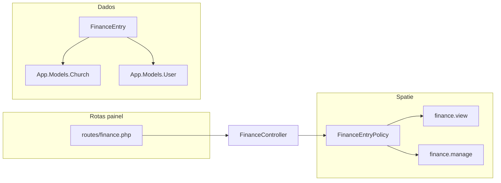

# Plano: módulo Finance (tesouraria) completo

## Contexto e lacuna atual

- `**[Modules/Finance](Modules/Finance)**` está em **scaffold** (`[FinanceController](Modules/Finance/app/Http/Controllers/FinanceController.php)` vazio, `[routes/web.php](Modules/Finance/routes/web.php)` com resource genérico, segundo Vite/`package.json`).
- **Permissões** já existem em `[JubafRolesAndPermissionsSeeder](Modules/Auth/database/seeders/JubafRolesAndPermissionsSeeder.php)`: `finance.manage`, `finance.view` — **Presidente** tem só `finance.view`; **Tesoureiro** tem `finance.manage` + `finance.view`.
- `**[PostLoginRedirect](Modules/Auth/app/Support/PostLoginRedirect.php)` **não** trata `finance.view` / `finance.manage`: um **Tesoureiro** cai no `return route('home')` — é obrigatório corrigir na mesma entrega.
- **Bootstrap:** não há grupo para finanças em `[bootstrap/app.php](bootstrap/app.php)`.

## Âmbito de negócio (PLANOJUBAF)

- [Plano2](PLANOJUBAF/Plano2-Estrutura.md): verbas/ofertas (Art. 27), relatórios para assembleia, reembolsos (Art. 23).
- [Plano1](PLANOJUBAF/Plano1-Estrutura.md): tesouraria, verbas ASBAF, ofertas das igrejas; apenas tesoureiros editam dados sensíveis.

**Decisão de modelo (um núcleo sólido, extensível depois):** tabela `**finance_entries` (ou nome equivalente) com lançamentos institucionais:

| Conceito   | Campos / regras                                                                                                                                             |
| ---------- | ----------------------------------------------------------------------------------------------------------------------------------------------------------- |
| Tipos      | `entry_type`: por exemplo `offering` (oferta/verba entrada), `expense` (despesa), `reimbursement` (reembolso a aprovar).                                    |
| Valores    | `amount` em `decimal(15,2)` com convenção clara (ex.: **sempre positivo** + campo `direction` `in`/`out`, ou montante com sinal); `currency` default `BRL`. |
| Data       | `transaction_date` (date).                                                                                                                                  |
| Contexto   | `title`, `notes` nullable; `church_id` nullable FK `[churches](app/Models/Church.php)` para ofertas por igreja.                                             |
| Reembolsos | `reimbursement_status` nullable: `pending` / `approved` / `rejected`; `approved_by`, `approved_at` opcionais quando `finance.manage` aprovar.               |
| Auditoria  | `created_by` FK `users`.                                                                                                                                    |
| Índices    | `transaction_date`, `church_id`, `entry_type`.                                                                                                              |

Modelo em `**Modules\Finance\Models\FinanceEntry`** (ou `App\Models\FinanceEntry` se preferirem simetria com `Church` — o plano recomenda **módulo para manter fronteira clara).

## HTTP e políticas

- `**FinanceEntryPolicy`:** `viewAny` / `view` → `finance.view` **ou** `finance.manage` **ou `admin.full`; `create` / `update` / `delete` / aprovar reembolsos → `finance.manage` (e SuperAdmin via permissões).
- Registo em `[FinanceServiceProvider](Modules/Finance/app/Providers/FinanceServiceProvider.php)` com `Gate::policy`.
- **Form Requests** (`StoreFinanceEntryRequest`, `UpdateFinanceEntryRequest`, opcional `ApproveReimbursementRequest`) com regras explícitas e `authorize()` alinhado.
- **Controladores sugeridos:**
    - `FinanceDashboardController` — resumo (totais por período, últimos lançamentos, filtros simples).
    - `FinanceEntryController` — resource (index com filtros data/tipo/igreja, create, store, show, edit, update, destroy).
    - Opcional: `FinanceReportController` ou ação `export` em index — **CSV** gerado no servidor (sem CDN), autorizado com `finance.view`.

## Rotas e bootstrap

- Novo ficheiro `**[routes/finance.php](routes/finance.php)` (padrão [secretariat.php](routes/secretariat.php)):
    - Prefixo URL: `**/painel/tesouraria` (UX alinhada ao estatuto).
    - Nomes: `**painel.tesouraria.`.
    - Grupo externo: `web` + `auth` (como secretaria).
    - Rotas de leitura/dashboard: `permission:finance.view` **ou** `role_or_permission` que aceite view+manage — na prática Spatie: `middleware(['permission:finance.view|finance.manage'])` **ou** duas rotas; o mais simples é **uma permissão composta** via `role_or_permission` se já estiver alias no projeto, senão **policy** no controller e middleware mínimo `auth` (como Churches). **Recomendação:** middleware `auth` + `authorize` em cada ação (como `ChurchController`) **ou** `permission:finance.view` no grupo de leitura e `permission:finance.manage` no subgrupo de escrita — espelhar o padrão já usado em Churches se for só `authorizeResource` com policy.
- Registar em `[bootstrap/app.php](bootstrap/app.php)` o `->group(base_path('routes/finance.php'))` com prefixo/nome coerentes.
- Limpar `[Modules/Finance/routes/web.php](Modules/Finance/routes/web.php)` (apenas comentário, como Board/Churches).
- Remover `[FinanceController](Modules/Finance/app/Http/Controllers/FinanceController.php)` stub após substituição.

## UI/UX

- Layout `**[auth::layouts.panel](Modules/Auth/resources/views/layouts/panel.blade.php)`**; partial de nav `**finance::nav\*\`com`<x-module-icon module="finance" />` (`[config/module_icons.php](config/module_icons.php)`já tem`finance`).
- **Dashboard:** cartões (totais entradas/saídas no período), tabela dos últimos lançamentos, links para CRUD.
- **Gráficos:** **sem CDN** (ApexCharts no browser violaria AGENTS); usar tabelas + totais, ou barras simples com HTML/Tailwind; se no futuro quiserem charts, adicionar biblioteca ao **bundle raiz** (`package.json` na raiz), não no módulo.
- **Dark mode** (`dark:`) em todas as vistas novas.

## Integração global

- `**[PostLoginRedirect::defaultUrl](Modules/Auth/app/Support/PostLoginRedirect.php)`:** inserir **após** blocos da diretoria/secretaria/igrejas conforme prioridade de produto — proposta: `**finance.manage`ou`finance.view`** → `route('painel.tesouraria.dashboard')`**antes** de`localchurch`/`pastor`/`jovem`, para o **Tesoureiro** ir direto ao painel.
- `**navbarPanel()`:** entrada `module => 'finance'`, `active` em `painel.tesouraria.`, label **Tesouraria (ou equivalente).
- **Navegação cruzada (opcional mas útil):** em painéis onde faz sentido (ex.: Presidente com `finance.view`), link para tesouraria; no `finance::nav`, link para **Diretoria** se `board.meetings` (espelhar padrão Secretaria ↔ Igrejas).

## Limpeza do módulo

- Eliminar segundo pipeline: `[package.json](Modules/Finance/package.json)`, `[vite.config.js](Modules/Finance/vite.config.js)`, `[resources/css|js](Modules/Finance/resources/css/app.css)`, layouts stub em `[resources/views/components/layouts/master.blade.php](Modules/Finance/resources/views/components/layouts/master.blade.php)` e `[index.blade.php](Modules/Finance/resources/views/index.blade.php)` antigos, se deixarem de ser usados.

## Testes e qualidade

- **Feature tests** (PHPUnit, `[tests/TestCase](tests/TestCase.php)` com `RefreshDatabase`):
    - Tesoureiro: CRUD permitido; export se existir.
    - Presidente: list/show/dashboard OK; create/update **403**.
    - Utilizador sem `finance.`: **403** no painel.
    - Opcional: fluxo reembolso `pending` → `approved`.
- `**vendor/bin/pint --dirty --format agent` em PHP alterado.
- `**php artisan test --compact` nos ficheiros novos/alterados.

## Documentação (obrigatório transversal)

- `**[Modules/Finance/README.md](Modules/Finance/README.md)` — estilo [Churches README](Modules/Churches/README.md): modelo, rotas, permissões, integração PostLoginRedirect, testes.
- `**[CHANGLOG.md](CHANGLOG.md)` — entrada datada (módulo Finance, rotas bootstrap, PostLoginRedirect, migração).
- `**[README.md](README.md)` raiz — linha na secção roadmap/módulos (“Finance — tesouraria implementada”) se ainda disser só “planejado”.
- `**[Modules/Auth/README.md](Modules/Auth/README.md)` — nota curta sobre destino pós-login para `finance.view` / `finance.manage`.
- **Não** duplicar regras longas em `AGENTS.md` se só for feature nova — o detalhe fica no **CHANGLOG** e no **README do módulo** (alinhado às regras do projeto em `[.ai/guidelines](.ai/guidelines)`).

## Ordem de implementação sugerida

1. Migração + model + factory + relacionamentos `User` / `Church`.
2. Policy + requests + `FinanceServiceProvider`.
3. `routes/finance.php` + `bootstrap/app.php` + controladores + vistas + nav.
4. `PostLoginRedirect` + `navbarPanel` + links cruzados mínimos.
5. Limpeza stubs Vite no módulo Finance.
6. Testes + Pint + README Finance + CHANGLOG + ajustes README raiz/Auth.
