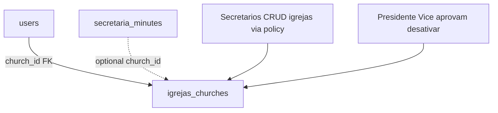

# Plano: Módulos Secretaria + Igrejas (100% integrados)

## Âmbito explícito

- **Incluído (backend + frontend Blade/Tailwind já usados no projeto):** [Modules/Igrejas](c:\laragon\www\JUB\Modules\Igrejas) e [Modules/Secretaria](c:\laragon\www\JUB\Modules\Secretaria), mais alterações mínimas em **app core** (`users.church_id`, `User` model, formulários de utilizador da diretoria) e **PainelLider** / **PainelJovens** para consumir a igreja vinculada.
- **Fora desta entrega (apenas hooks ou notas de integração):** desenvolvimento profundo de Avisos, Blog, Calendario, Chat, Bible, Homepage, Financeiro, Talentos — listados como consumidores futuros de `church_id` ou de conteúdos da secretaria.

## Estado atual

- **Igrejas** e **Secretaria** estão no mesmo estado de esqueleto: controllers stub, `Route::resource` na raiz ([Igrejas web.php](c:\laragon\www\JUB\Modules\Igrejas\routes\web.php), [Secretaria web.php](c:\laragon\www\JUB\Modules\Secretaria\routes\web.php)), views inexistentes ou placeholder.
- [app/Models/User.php](c:\laragon\www\JUB\app\Models\User.php) **não tem** `church_id` nem relação com igreja.
- [PLANOJUBAF/Escopo.md](c:\laragon\www\JUB\PLANOJUBAF\Escopo.md): Secretaria cadastra igreja → líder vinculado → jovens da congregação; alinhar **Igrejas** como módulo dono dos dados e **Secretaria** com permissões de gestão (secretários) conforme seed.

## Arquitetura de dados (Igrejas como fonte canónica)

| Responsabilidade                                                                                          | Módulo                                                                                                                                                                    |
| --------------------------------------------------------------------------------------------------------- | ------------------------------------------------------------------------------------------------------------------------------------------------------------------------- |
| Tabela de congregações (nome, cidade, contactos, status ASBAF/JUBAF, notas, slug público opcional)        | **Igrejas**                                                                                                                                                               |
| Utilizadores `lider` / `jovens` vinculados a uma congregação                                              | **`users.church_id` → FK `churches.id`** (migration na app ou no módulo Igrejas que altera `users`; preferência: migration em `database/migrations` da app para FK clara) |
| Atas, reuniões, convocatórias, arquivo institucional                                                      | **Secretaria**                                                                                                                                                            |
| Referência opcional a igreja em registos da secretaria (ex.: ata de assembleia com anexo por congregação) | **Secretaria** com `church_id` **nullable** FK para `churches`                                                                                                            |

Evitar `secretaria_churches` duplicado: qualquer ecrã “censo” na secretaria usa o modelo `Modules\Igrejas\App\Models\Church` (ou nome final do Eloquent).

## Módulo Igrejas — entregáveis

1. **Schema:** tabela `igrejas_churches` (ou `churches` com prefixo de módulo consistente com o resto do repo), campos mínimos profissionais: `name`, `slug`, `city`, `address`, `phone`, `email`, `asbaf_notes` / `is_active`, `joined_at` (opcional), `metadata` JSON opcional.
2. **Eloquent + policies + Form Requests**; export CSV/XLSX opcional via [phpoffice/phpspreadsheet](c:\laragon\www\JUB\composer.json) (já no projeto).
3. **Permissões `igrejas.*`:** `view`, `create`, `edit`, `delete`, `activate` (ou `manage`). Matriz sugerida:
    - `secretario-1` / `secretario-2`: criar/editar congregações (operacional).
    - `presidente` / `vice-presidente-1` / `vice-presidente-2`: tudo + desativar/arquivar institucionalmente.
    - `tesoureiro-*`: `view`.
    - `super-admin`: tudo.
    - `lider` / `jovens`: sem permissões `igrejas.manage`; apenas **leitura** dos próprios dados via painel (scoped pela sua `church_id`).
4. **Rotas:** fragments `Modules/Igrejas/routes/diretoria.php` (prefixo `diretoria/igrejas`, nomes `diretoria.igrejas.*`), `admin.php` se necessário para paridade super-admin, `public.php` (listagem pública opcional “Igrejas da JUBAF”), `api.php` (Sanctum/listagens); inclusão condicional em [routes/diretoria.php](c:\laragon\www\JUB\routes\diretoria.php), [routes/admin.php](c:\laragon\www\JUB\routes\admin.php), [routes/web.php](c:\laragon\www\JUB\routes\web.php), [routes/api.php](c:\laragon\www\JUB\routes\api.php).
5. **Views:** pastas `resources/views/paineldiretoria`, `admin`, `public`, `components` (como pedido historicamente para Secretaria; aplicar o mesmo padrão a Igrejas).
6. **UI PainelDiretoria:** listagem com filtros, ficha da igreja, estatísticas rápidas (contagem de jovens/líderes ligados — `User::query()->where('church_id', …)`).

## Vínculo PainelLider / PainelJovens

1. **Migration `church_id`** em `users` (nullable, FK, `nullOnDelete` ou `restrict` conforme regra de negócio).
2. **Atribuição:** no fluxo de edição de utilizadores já usado pela diretoria ([DiretoriaUserController](c:\laragon\www\JUB\Modules\PainelDiretoria) / views), mostrar select de congregações quando o utilizador tiver role `lider` ou `jovens` (e validar: jovem deve ter igreja; líder idem).
3. **PainelLider:** dashboard/secção “A minha igreja” (dados de `Church`); listagem de jovens **apenas** `where('church_id', auth()->user()->church_id)` + policy `view` em `User` para impedir fugas entre congregações.
4. **PainelJovens:** exibir nome da igreja e contactos institucionais em leitura; se sem `church_id`, mensagem orientando contacto com o líder (estado de dados incompletos).
5. **Middleware opcional:** reforço `EnsureChurchAffiliated` nos painéis operacionais (só se necessário após analisar fluxo atual `jovens.panel` / `lider.panel`).

## Módulo Secretaria — ajustes ao plano anterior

- Manter domínio: **reuniões, atas, convocatórias, arquivo**, fluxo rascunho → aprovação executivo → publicação, imutabilidade pós-`locked_at` / `published_at`.
- **Remover** do desenho anterior a tabela dedicada só na Secretaria para igrejas; substituir por integração com **Igrejas**.
- **PDF:** usar [barryvdh/laravel-dompdf](c:\laragon\www\JUB\composer.json) (já instalado) para export de ata finalizada.
- **Rich text:** [quill](c:\laragon\www\JUB\package.json) já está no projeto — reutilizar padrão de outros módulos (ex.: Avisos) para corpo de atas/convocatórias, sem adicionar dependência npm nova salvo necessidade pontual.

## Integrações com outros módulos (contrato, não implementação completa)

| Módulo                                                                       | Integração nesta entrega                                                                                                                                  |
| ---------------------------------------------------------------------------- | --------------------------------------------------------------------------------------------------------------------------------------------------------- |
| [Notificacoes](c:\laragon\www\JUB\Modules\Notificacoes)                      | Se `module_enabled`, disparar notificação na publicação de convocatória/ata (audiência configurável: diretoria, líderes, todos).                          |
| [PainelDiretoria](c:\laragon\www\JUB\Modules\PainelDiretoria)                | Menus, dashboard, gestão utilizadores com `church_id`.                                                                                                    |
| Avisos / Blog / Calendario / Bible / Homepage / Chat / Financeiro / Talentos | **Não construir** funcionalidades novas; apenas **documentar** no código (comentário ou config) onde no futuro filtrar por `church_id` ou linkar eventos. |

## Dependências locais (Composer / NPM)

- **Composer:** DomPDF e PhpSpreadsheet já disponíveis — usar para PDF e exportações; **não** exigir novos pacotes salvo necessidade descoberta na implementação (ex.: se faltar helper de Excel, usar PhpSpreadsheet diretamente).
- **NPM:** Tailwind 4 + Flowbite/Preline + Alpine + Quill já presentes — alinhar UI aos painéis existentes; evitar novas stacks.

## Ordem de implementação recomendada

1. **Igrejas:** schema + model + permissões + rotas diretoria + UI CRUD.
2. **`users.church_id` + User relationships** + atualização formulário utilizadores diretoria.
3. **PainelLider / PainelJovens:** consumo da igreja e listagens scoped.
4. **Secretaria:** schema + permissões + workflows + UI + PDF + rotas em todos os painéis necessários.
5. **Notificacoes** hook (se módulo ativo).
6. Higiene: ícones módulo, `module_enabled`, seeds demo, testes manuais ponta a ponta.

## Riscos

- **Dados legados:** utilizadores sem `church_id` após migração — plano de comunicação na UI e seed/demo para preencher.
- **Sincronização de permissões:** após adicionar `igrejas.*` e `secretaria.*`, correr seeder ou migration de permissões em ambientes já existentes.
