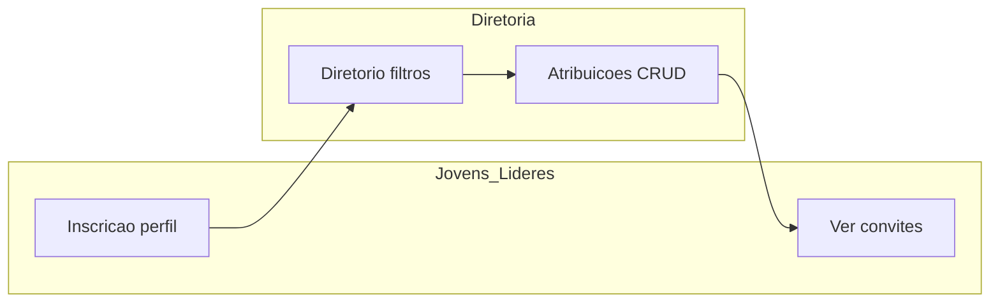

# Plano: Módulo Talentos mais completo e alinhado ao JUBAF

## Estado atual (resumo)

- **Propósito declarado**: banco interno de competências + convites a funções ligados ao [Calendario](Modules/Calendario) ([`module.json`](Modules/Talentos/module.json), copy em [`public/index`](Modules/Talentos/resources/views/public/index.blade.php)).
- **Rotas**: Diretoria em [`routes/diretoria.php`](routes/diretoria.php) via [`Modules/Talentos/routes/diretoria.php`](Modules/Talentos/routes/diretoria.php); jovens/líderes em [`routes/jovens.php`](routes/jovens.php) / [`routes/lideres.php`](routes/lideres.php) → [`talentos-panel.php`](Modules/Talentos/routes/talentos-panel.php).
- **Dados**: [`TalentProfile`](Modules/Talentos/app/Models/TalentProfile.php) (bio, disponibilidade, `is_searchable`, skills/areas), [`TalentAssignment`](Modules/Talentos/app/Models/TalentAssignment.php) (função, evento opcional, estado).
- **Permissões**: já seedadas em [`database/seeders/RolesPermissionsSeeder.php`](database/seeders/RolesPermissionsSeeder.php) (`talentos.profile.edit`, `talentos.directory.*`, `talentos.assignments.*`).
- **Painel diretoria**: atalhos no [`sidebar`](Modules/PainelDiretoria/resources/views/components/layouts/sidebar.blade.php) e contadores no [`DiretoriaDashboardController`](Modules/PainelDiretoria/app/Http/Controllers/DiretoriaDashboardController.php).

## Lacunas principais identificadas

1. **Resposta ao convite**: na UI de jovens ([`paineljovens/inscription.blade.php`](Modules/Talentos/resources/views/paineljovens/inscription.blade.php)) o membro **vê** estado mas **não pode** confirmar/recusar; só quem tem `talentos.assignments.edit` altera em [`AssignmentController`](Modules/Talentos/app/Http/Controllers/Diretoria/AssignmentController.php). A política [`TalentAssignmentPolicy`](Modules/Talentos/app/Policies/TalentAssignmentPolicy.php) não permite ao titular atualizar o próprio registo.
2. **Descoberta de talentos**: [`DirectoryController@index`](Modules/Talentos/app/Http/Controllers/Diretoria/DirectoryController.php) filtra por igreja, **uma** competência e “só pesquisáveis”, mas **não** por **área**, nem por **pesquisa textual** (nome/email). O formulário de inscrição já recolhe áreas ([`inscription-form.blade.php`](Modules/Talentos/resources/views/painel/partials/inscription-form.blade.php)), porém o diretório não aproveita esse critério.
3. **Export CSV**: [`exportCsv`](Modules/Talentos/app/Http/Controllers/Diretoria/DirectoryController.php) replica `church_id` e `skill_id` mas **não** o filtro `searchable_only` aplicado na listagem — comportamento inconsistente.
4. **Nível de competência**: a pivot `talent_profile_skill` tem coluna `level` ([migração](Modules/Talentos/database/migrations/2026_04_05_120003_create_talent_profile_skill_table.php)), mas [`UpdateTalentProfileRequest`](Modules/Talentos/app/Http/Requests/UpdateTalentProfileRequest.php) e o formulário **não** expõem nível; o `sync()` em [`TalentProfilePanelController`](Modules/Talentos/app/Http/Controllers/TalentProfilePanelController.php) ignora pivots.
5. **Atribuições — UX diretoria**: lista de membros é `User::…->limit(500)` em [`AssignmentController@create`](Modules/Talentos/app/Http/Controllers/Diretoria/AssignmentController.php); funciona para MVP, mas dificulta achar pessoas sem ir antes ao diretório (o link “Convidar” com `user_id` já ajuda na ficha [`directory/show`](Modules/Talentos/resources/views/paineldiretoria/directory/show.blade.php)).

## Direção recomendada (por prioridade)

### A. Fechar o fluxo “convite → resposta” (maior impacto no propósito)

- Adicionar autorização explícita para o **membro** alterar **apenas** `status` da **própria** `TalentAssignment` (ex.: método `respond` na policy ou regra em `update` com restrição de campos).
- Novas rotas `POST`/`PATCH` sob `jovens.talentos.*` e `lideres.talentos.*` (ex.: `assignments/{assignment}/respond`) com [`FormRequest`](Modules/Talentos/app/Http/Requests/) que valida `status` ∈ {`confirmed`, `declined`} e opcionalmente exige `invited`.
- Atualizar as vistas de inscrição (jovens e [`painellider/inscription`](Modules/Talentos/resources/views/painellider/inscription.blade.php)) com botões claros e mensagens de sucesso — fluxo guiado: “Convite pendente → Confirmar / Não posso”.
- (Opcional) integrar com [`Notificacoes`](Modules/Notificacoes) ao criar atribuição, se o projeto já usa notificações para outros eventos — mantém coerência com o resto da plataforma.

### B. Diretório da diretoria: “achar talentos” de forma completa

- **Pesquisa**: parâmetro `q` com `where` em `users.name` / `users.email` (via join já existente), usando índices existentes ou `whereLike` conforme padrão do projeto (ler [`laravel-best-practices`](.cursor/skills/laravel-best-practices/SKILL.md) para evitar N+1 e manter `with()`).
- **Filtro por área**: `area_id` com `whereExists` em `talent_profile_area`, espelhando o padrão de `skill_id`.
- **Export CSV**: aplicar os **mesmos** filtros que a listagem (`q`, `area_id`, `searchable_only`, etc.) para não haver surpresas ao exportar.
- **Resumo no dashboard** de talentos ([`TalentDashboardController`](Modules/Talentos/app/Http/Controllers/Diretoria/TalentDashboardController.php)): contador de convites `invited` pendentes e link direto para lista filtrada — reforça o fluxo guiado para a diretoria.

### C. Inscrição mais rica e coerente com o modelo

- Expor **nível** por competência (ex.: select por linha ou mapa `skill_levels[skill_id]` no request) e usar `sync()` com pivots: `$profile->skills()->sync([$id => ['level' => ...]])`.
- Na ficha da diretoria ([`directory/show`](Modules/Talentos/resources/views/paineldiretoria/directory/show.blade.php)), mostrar nível quando existir.
- Pequeno ajuste de copy/stepper no hero das páginas de inscrição: checklist “Perfil → Competências → Visibilidade” para cumprir o pedido de fluxo **guiado e claro**.

### D. Melhorias opcionais (se quiserem ir além do MVP)

- **Gestão de taxonomias**: CRUD de `TalentSkill` / `TalentArea` no painel diretoria (permissões novas + políticas), em vez de depender só do [`TalentosDatabaseSeeder`](Modules/Talentos/database/seeders/TalentosDatabaseSeeder.php).
- **Seleção de membro** na criação de atribuição: campo de pesquisa com debounce (Livewire/Alpine) ou redirecionamento explícito “Escolher no diretório” — reduz fricção sem substituir o dropdown imediato.

## Ficheiros centrais a tocar

- Controllers: [`DirectoryController`](Modules/Talentos/app/Http/Controllers/Diretoria/DirectoryController.php), novo controller ou métodos para resposta do membro em `TalentProfilePanelController` ou classe dedicada; opcionalmente [`TalentDashboardController`](Modules/Talentos/app/Http/Controllers/Diretoria/TalentDashboardController.php).
- Policies/requests: [`TalentAssignmentPolicy`](Modules/Talentos/app/Policies/TalentAssignmentPolicy.php), novas FormRequests, [`routes/talentos-panel.php`](Modules/Talentos/routes/talentos-panel.php).
- Views: [`paineldiretoria/directory/index.blade.php`](Modules/Talentos/resources/views/paineldiretoria/directory/index.blade.php), [`painel/partials/inscription-form.blade.php`](Modules/Talentos/resources/views/painel/partials/inscription-form.blade.php), inscrições jovens/líderes.
- Ícones de módulo: se surgirem novos ítens de menu, seguir [`jubaf-module-icons`](.cursor/skills/jubaf-module-icons/SKILL.md).

## Critérios de sucesso

- Diretoria encontra perfis por nome/email, área e competência, com CSV alinhado aos filtros.
- Membro conclui o ciclo **convite → resposta** sem depender da diretoria para mudar o estado quando já foi convidado.
- Inscrição reflete níveis onde o modelo já os prevê; copy e passos deixam o percurso óbvio para jovens, líderes e diretoria.
