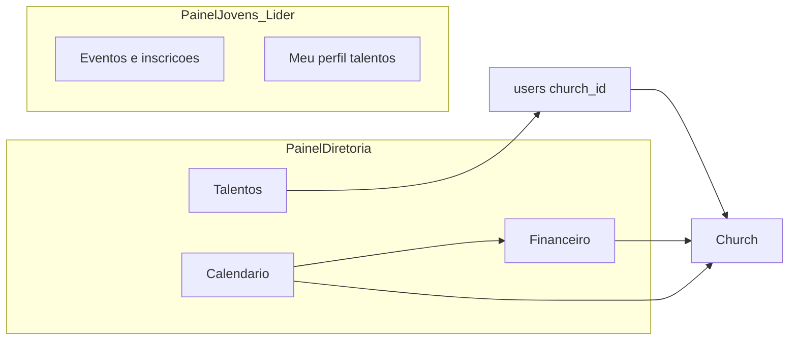

# Plano: Financeiro, Calendário e Talentos (JUBAF)

## Contexto e referências

- **Estado atual**: [Modules/Financeiro](c:\laragon\www\JUB\Modules\Financeiro), [Modules/Calendario](c:\laragon\www\JUB\Modules\Calendario) e [Modules/Talentos](c:\laragon\www\JUB\Modules\Talentos) estão em **stub** (controller + `public/index`, layout `master`, rotas genéricas).
- **Padrão de integração** a replicar:
    - Fragments `routes/diretoria.php` no módulo, incluídos condicionalmente em [routes/diretoria.php](c:\laragon\www\JUB\routes\diretoria.php) (como [Modules/Secretaria/routes/diretoria.php](c:\laragon\www\JUB\Modules\Secretaria\routes\diretoria.php)).
    - Painéis operacionais: `require module_path(...)` em [routes/jovens.php](c:\laragon\www\JUB\routes\jovens.php) e [routes/lideres.php](c:\laragon\www\JUB\routes\lideres.php) com `middleware` de `permission:` (como Secretaria).
    - Super-admin: fragment opcional [routes/admin.php](c:\laragon\www\JUB\routes\admin.php) alinhado a [Modules/Igrejas/routes/admin.php](c:\laragon\www\JUB\Modules\Igrejas\routes\admin.php) quando fizer sentido (export global, auditoria).
- **Produto / estatuto**: tesouraria e transparência ([PLANOJUBAF/Escopo.md](c:\laragon\www\JUB\PLANOJUBAF\Escopo.md)); eventos e ligação futura a inscrições/pagamentos ([PLANOJUBAF/Plano2-Estrutura.md](c:\laragon\www\JUB\PLANOJUBAF\Plano2-Estrutura.md)).
- **UI diretoria**: hero, grids por “accent”, cards com `x-icon` / `x-module-icon` como em [Modules/PainelDiretoria/resources/views/dashboard.blade.php](c:\laragon\www\JUB\Modules\PainelDiretoria\resources\views\dashboard.blade.php); **não** usar o `master.blade.php` legado dos stubs — estender `paineldiretoria::components.layouts.app` (igual Secretaria/Igrejas).
- **Permissões**: hoje [database/seeders/RolesPermissionsSeeder.php](c:\laragon\www\JUB\database\seeders\RolesPermissionsSeeder.php) dá aos tesoureiros apenas `*.view` genéricos — **é obrigatório** acrescentar permissões explícitas `financeiro.*`, `calendario.*`, `talentos.*` e ajustar `syncPermissions` para **tesoureiro** = operação financeira completa; **presidente/vice** = leitura agregada + aprovações se existirem; **secretário** conforme necessidade de leitura para assembleia; **lider/jovens** = calendário/talentos de participação; políticas com `church_id` onde aplicável ([Modules/Igrejas/App/Models/Church.php](c:\laragon\www\JUB\Modules\Igrejas\App\Models\Church.php)).

## Arquitetura por módulo

### 1) Financeiro (CRM tesouraria — Painel Diretoria)

**Modelo de dados (MVP sólido, extensível):**

- `fin_categories` — tipo (receita/despesa), nome, ativo; seeds para “Oferta igreja”, “Verba ASBAF”, “Despesa operacional”, “Reembolso”, etc.
- `fin_transactions` — `category_id`, `occurred_on`, `amount` (decimal BRL), `direction` (in/out), `scope` (`nacional` | `igreja`), `church_id` (nullable), `description`, `reference` (texto livre ou número de documento), `created_by`, timestamps; opcional `metadata` JSON para integrações.
- `fin_expense_requests` (reembolsos Art. 23 — fluxo) — valores, justificação, anexos (usar `storage` + coluna path ou tabela `fin_attachments`), estados `rascunho | submetido | aprovado | pago | recusado`, `approved_by` / `paid_transaction_id` (FK opcional para `fin_transactions`).
- Índices por data, `church_id`, `direction` para relatórios.

**Backend:**

- Controllers em `Modules/Financeiro/App/Http/Controllers/Diretoria/*` (dashboard, lançamentos, reembolsos, relatórios, export CSV).
- **Policies** por modelo; tesoureiro CRUD; presidente/vice `view` + aprovar reembolso se política assim definir; super-admin tudo.
- Form Requests para validação (valores, datas, `church_id` obrigatório quando `scope=igreja`).
- **Relatórios**: página “Balancete” por período; agregação por categoria e por igreja; export CSV (e PDF opcional com DomPDF já no projeto).

**Views (pastas pedidas):**

- `resources/views/paineldiretoria/*` — dashboards, tabelas com filtros (Flowbite + Tailwind do bundle), estados vazios úteis, mesma linguagem visual do dashboard da diretoria.
- `resources/views/components/*` — cards de resumo, badge de status de reembolso, tabela reutilizável se repetir.
- `resources/views/public/*` — **opcional** página de transparência (só se `SystemConfig` ou policy permitir); caso contrário manter finanças só autenticadas.

**Automatização / integração:**

- Ao concluir `fin_expense_requests` aprovado, opcionalmente gerar `fin_transactions` “out” ligado (uma ação de serviço).
- Preparar FK opcional `calendar_event_id` em `fin_transactions` (nullable) para **Fase 2** do calendário (pagamento de inscrição); não bloquear MVP.

---

### 2) Calendário (institucional + participação)

**Modelo de dados:**

- `calendar_events` — título, descrição (rich text simples), `starts_at`, `ends_at`, `timezone` (default app), `all_day`, `visibility` (`publico` | `autenticado` | `diretoria` | `lideres` | `jovens`), `type` (assembleia, evento, prazo, culto…), `location`, `church_id` opcional, `registration_open` bool, `max_participants` nullable, `created_by`.
- `calendar_registrations` — `event_id`, `user_id`, `status` (confirmado, lista espera, cancelado), `checked_in_at` nullable (base para QR/check-in numa iteração seguinte).
- Soft deletes nos eventos se a diretoria precisar “recuperar” histórico.

**Backend:**

- `Diretoria/*`: CRUD completo, lista + vista calendário (FullCalendar via npm já comum em Laravel ou grid mensal MVP com Blade + CSS; escolher **uma** abordagem no implementação: ou biblioteca leve no `resources/js` do app principal, ou MVP lista/mês sem lib).
- `PainelJovens` / `PainelLider`: listagem de eventos permitidos pela `visibility` + detalhe + inscrição/cancelamento.
- Policies: diretoria edita; jovem/líder só leitura/inscrição conforme visibilidade e `church_id` quando o evento for local.

**Views:**

- Todas as pastas pedidas (`admin` se houver paridade super-admin; `paineldiretoria`, `paineljovens`, `painellider`, `public` para eventos `publico`).
- **Homepage**: opcional bloco “Próximos eventos” alimentado por API interna ou view composer (só se módulo ativo) — marcado como melhoria rápida após MVP.

**Integração com Financeiro:**

- MVP: campo opcional em evento “valor de inscrição” + ao marcar inscrito como pago manualmente cria `fin_transactions` (ação explícita no controller). Automático total fica para iteração.

---

### 3) Talentos (membros com conta apenas)

**Modelo de dados:**

- `talent_profiles` — `user_id` único, bio curta, disponibilidade (enum ou texto), `is_searchable` bool, timestamps.
- `talent_skills` + pivot `talent_profile_skill` (tag + nível opcional) **ou** JSON validado em `skills` (preferir tabelas normalizadas para filtrar na diretoria).
- `talent_interests` — áreas (música, mídia, recepção, evangelismo…) via tabela de taxonomia.
- `talent_assignments` — `event_id` (FK calendário) opcional, `user_id`, `role_label`, `notes`, `status` (convidado, confirmado, declinou) para ligação **Calendário ↔ Talentos**.

**Backend:**

- Utilizador edita o **próprio** perfil (jovens/líder); diretoria vê **diretoria/pesquisa**, ficha, export CSV, convites para eventos (cria assignment).
- Policies: `user_id` match para editar próprio perfil; diretoria `viewAny` listagens.

**Views:**

- `paineljovens` / `painellider`: wizard simples “Meu perfil de talentos”.
- `paineldiretoria`: CRM — filtros por skill, igreja (`user.church_id`), export, ligação a evento.
- `public`: apenas se no futuro houver vitrine; com a decisão **members_only**, público pode ficar vazio ou redirect.

---

## Fios transversais (obrigatórios)

1. **Rotas centrais** — Adicionar blocos `if (module_enabled('Financeiro'))` (e Calendario, Talentos) em [routes/diretoria.php](c:\laragon\www\JUB\routes\diretoria.php); espelhar em `jovens.php` / `lideres.php`; `web.php` para público calendário; `api.php` só se necessário para SPA futura.
2. **Ícones de módulo** — PNG em `public/modules/icons` + uso de `x-module-icon` onde for navegação de módulo ([.cursor/skills/jubaf-module-icons/SKILL.md](c:\laragon\www\JUB.cursor\skills\jubaf-module-icons\SKILL.md)).
3. **Dashboard diretoria** — Estender [DiretoriaDashboardController](c:\laragon\www\JUB\Modules\PainelDiretoria\App\Http\Controllers\DiretoriaDashboardController.php) com stats condicionais (ex.: saldo do mês, próximos eventos, talentos ativos) e [dashboard.blade.php](c:\laragon\www\JUB\Modules\PainelDiretoria\resources\views\dashboard.blade.php) com novos grupos de atalhos (padrão `$orgLinks` / `$commsLinks`).
4. **Module enable** — Garantir `module.json` + registo no painel de módulos; seeders de permissões e dados demo mínimos por módulo.
5. **Testes** — Feature tests por painel crítico: tesoureiro cria lançamento; jovem inscreve evento; líder não vê finanças globais; policy `church_id`.

## Ordem de implementação recomendada

1. **Permissões + policies base** (seed + middleware nas rotas).
2. **Financeiro** (dados + diretoria completa + relatórios) — maior valor para tesoureiro.
3. **Calendário** (diretoria CRUD + painéis leitura/inscrição + público opcional).
4. **Talentos** (perfil membro + CRM diretoria + assignments ligados a eventos).
5. **Polimento**: exports, notificações (módulo Notificacoes se já existir), widgets no dashboard, testes.

## Riscos / limites honestos

- **“Mais do que pedir”** em uma única entrega tende a atrasar qualidade; o plano acima entrega **MVP completo ponta a ponta** com extensões claras (QR check-in, pagamento online, homepage widget).
- **FullCalendar vs Blade mensal**: decidir na implementação com base no tempo e no bundle JS atual ([resources/js/app.js](c:\laragon\www\JUB\resources\js\app.js)).
