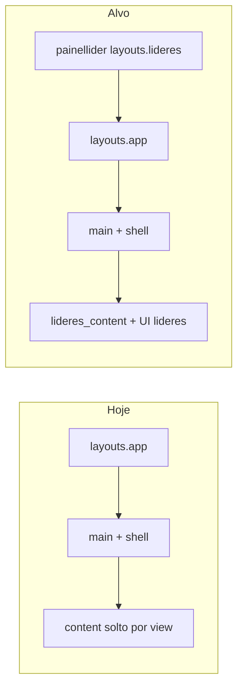

# Padronização completa do Painel de Líderes (UI/UX + layout)

## Estado actual

- **Shell**: [resources/views/layouts/partials/shell-mobile-panel.blade.php](resources/views/layouts/partials/shell-mobile-panel.blade.php) — sidebar/navbar já coerentes; breadcrumbs HyperUI para líderes (Bíblia oculta no shell, como Jovens).
- **Jovens (referência técnica)**: [Modules/PainelJovens/resources/views/layouts/jovens.blade.php](Modules/PainelJovens/resources/views/layouts/jovens.blade.php) estende `layouts.app` e expõe `@yield('jovens_content')` com wrapper `jovens-layout` + `pb-safe`. Componentes via `Blade::anonymousComponentPath(..., 'ui.jovens')` em [PainelJovensServiceProvider](Modules/PainelJovens/app/Providers/PainelJovensServiceProvider.php) (linhas 134–137).
- **Líderes**: **não existe** layout dedicado; **~36** ficheiros em `**/painellider/**/*.blade.php` usam `@extends('layouts.app')` + `@section('content')` directamente — padrões visuais mistos (`max-w-7xl`, `rounded-2xl`, `rounded-3xl`, heroes ad-hoc).
- **Referência visual desejada**: [Modules/Bible/resources/views/painellider/plans/dashboard.blade.php](Modules/Bible/resources/views/painellider/plans/dashboard.blade.php) — hero gradiente, secções, empty state rico.

## Decisões de desenho

| Tema                | Escolha                                                                                                                                                                         |
| ------------------- | ------------------------------------------------------------------------------------------------------------------------------------------------------------------------------- |
| **Paleta conteúdo** | Primária **emerald/teal + slate** (alinhado ao navbar/sidebar); heroes podem reutilizar o gradiente “referência” (teal/emerald/slate) sem rainbow por página                    |
| **Componentes**     | Namespace **`x-ui.lideres::`** (análogo a `x-ui.jovens::`): pelo menos `page-shell`, `hero`, `empty-state`; opcional `engagement-card` / `status-pill` se fizer falta ao migrar |
| **Layout**          | `@extends('painellider::layouts.lideres')` + `@section('lideres_content')`; manter `@section('title')` e `@section('breadcrumbs')` como hoje                                    |
| **Âmbito**          | **Fases** (confirmado) — reduz regressões e permite rever PRs por módulo                                                                                                        |

## Fase 0 — Fundação (PainelLider + provider)

1. Criar [Modules/PainelLider/resources/views/layouts/lideres.blade.php](Modules/PainelLider/resources/views/layouts/lideres.blade.php) espelhando Jovens: `@extends('layouts.app')`, `@section('content')` com wrapper `lideres-layout w-full pb-safe` e `@yield('lideres_content')`.
2. Em [PainelLiderServiceProvider](Modules/PainelLider/app/Providers/PainelLiderServiceProvider.php) `registerViews()` / `boot()`, registar:
   - `Blade::anonymousComponentPath(module_path(..., 'resources/views/components/ui/lideres'), 'ui.lideres');`
3. Criar pasta `Modules/PainelLider/resources/views/components/ui/lideres/` com:
   - **`page-shell.blade.php`** — espelhar [page-shell Jovens](Modules/PainelJovens/resources/views/components/ui/jovens/page-shell.blade.php) (max-width, espaçamento, padding responsivo).
   - **`hero.blade.php`** — props `title`, `description`, `eyebrow`, slot `actions` (variante gradiente emerald/teal coerente com a referência Bíblia).
   - **`empty-state.blade.php`** — título, descrição, ícone opcional, slot/link CTA.

Não adicionar documentação markdown além do necessário; seguir convenções Tailwind já usadas no projecto.

## Fase 1 — Núcleo PainelLider

- Migrar [dashboard.blade.php](Modules/PainelLider/resources/views/dashboard.blade.php) e [profile/index.blade.php](Modules/PainelLider/resources/views/profile/index.blade.php) para o novo layout + `page-shell` + hero onde fizer sentido.
- Garantir **mobile bottom bar** / `pb-safe`: o wrapper `lideres-layout` deve compatibilizar com a barra fixa do shell (igual lógica que em Jovens/perfil).

## Fase 2 — Módulo Bible (painellider)

- Migrar todas as views em [Modules/Bible/resources/views/painellider/](Modules/Bible/resources/views/painellider/) (~17 ficheiros).
- **Planos** ([plans/dashboard.blade.php](Modules/Bible/resources/views/painellider/plans/dashboard.blade.php)): extrair padrões repetíveis (hero, grelhas, cards) para componentes `ui.lideres` só onde reduz duplicação; manter paridade visual com o actual.
- Remover `@section('breadcrumbs')` mortos onde o shell já os oculta para `lideres.bible.*` (limpeza opcional nesta fase).

## Fase 3 — Restantes módulos

Ordem sugerida (por impacto e uso): **Avisos** → **Notificações** → **Blog** → **Calendário** → **Chat** → **Igrejas** (congregação/pedidos) → **Financeiro** → **Talentos** → **PainelJovens/metrics** (rota líder).

Em cada módulo: trocar `extends` + `content` → `lideres_content`; envolver listas/detalhe em `page-shell`; alinhar tipografia/cartões (`rounded-lg` / `border border-slate-200` / dark) ao padrão.

## Integração e navegação (“ferramentas completas”)

- **Sidebar** ([sidebar.blade.php](Modules/PainelLider/resources/views/components/layouts/sidebar.blade.php)): hoje **não há** entrada explícita para **Financeiro** (`lideres.financeiro.minhas-contas`), apesar de existir rota em [routes/lideres.php](routes/lideres.php) e referência no composer `liderNavSections`. **Plano**: adicionar item condicional (`module_enabled` + `can('financeiro.minhas_contas.view')` + `Route::has`) com ícone módulo, no mesmo estilo dos outros itens.
- Rever **Chat**: existem [chat/index](Modules/Chat/resources/views/painellider/chat/index.blade.php) e [erp-chat/index](Modules/Chat/resources/views/painellider/erp-chat/index.blade.php) — confirmar qual rota `lideres.chat.*` usa e evitar duplicação de UX na sidebar (um único destino claro).

## Verificação

- Smoke manual: dashboard, perfil, planos Bíblia, um fluxo Avisos, congregação, calendário, minhas contas (se módulo activo).
- `php artisan view:cache` após cada fase maior.

## Riscos e mitigação

- **Diff grande por módulo**: fases e commits por módulo reduzem conflitos.
- **Regressões CSS**: manter classes utilitárias existentes onde possível; `page-shell` só envolve e não força redesign completo na primeira passagem nas views mais simples.
