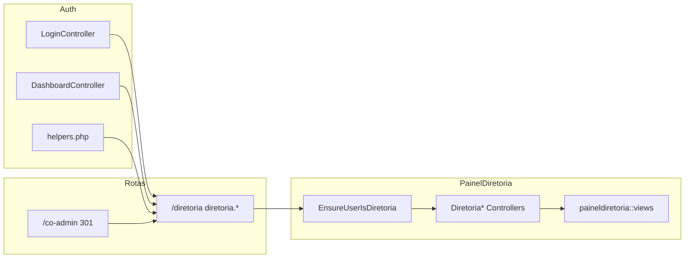

# Migração Co-Admin → Painel Diretoria (PLANOJUBAF / Estatuto)

## Decisão de modelagem (profissional e segura)

- **Usar roles Spatie separados** para cada cargo do Art. 7º: `presidente`, `vice-presidente-1`, `vice-presidente-2`, `secretario-1`, `secretario-2`, `tesoureiro-1`, `tesoureiro-2` (slugs estáveis em `config/jubaf_roles.php`, labels em português na UI).
- **Vantagens**: matriz de permissões explícita, auditoria por papel, políticas Laravel simples (`User::hasRole(...)`), sem ambiguidade “1º vs 2º” em código.
- **Migração de dados**: migration(ões) que renomeiam/mesclam roles atuais (`vice-presidente` → `vice-presidente-1` ou atribuição manual via seeder + nota operacional), e `forgetCachedPermissions()`.

## Estado atual (relevante)

- [routes/web.php](routes/web.php) carrega apenas [routes/co-admin.php](routes/co-admin.php); [routes/diretoria.php](routes/diretoria.php) é **duplicado** do `co-admin` e **não é incluído** — deve ser unificado ou removido para evitar deriva.
- Painel real: prefixo `/co-admin`, middleware [`EnsureUserIsCoAdminOrAdmin`](app/Http/Middleware/EnsureUserIsCoAdminOrAdmin.php) (apenas diretoria + legado `co-admin`), controladores em [`app/Http/Controllers/CoAdmin/`](app/Http/Controllers/CoAdmin/), views em [`resources/views/Co-Admin/`](resources/views/Co-Admin/) (ex.: dashboard pesado em [resources/views/Co-Admin/dashboard.blade.php](resources/views/Co-Admin/dashboard.blade.php)).
- [`Modules/PainelDiretoria`](Modules/PainelDiretoria): muitas blades (users, roles, carousel, etc.) **sem rotas canónicas** além do stub `Route::resource('paineldiretorias', ...)` em [Modules/PainelDiretoria/routes/web.php](Modules/PainelDiretoria/routes/web.php); [dashboard.blade.php](Modules/PainelDiretoria/resources/views/dashboard.blade.php) é stub — na migração, o painel deve usar o **mesmo layout e estilo** que [resources/views/Co-Admin/layouts/](resources/views/Co-Admin/layouts/) (não o estilo do Painel Líder/Jovens).

## UI / design (requisito explícito)

- **Manter o designer actual do Co-Admin**: índigo/cinza, sidebar e navbar de [resources/views/Co-Admin/layouts/app.blade.php](resources/views/Co-Admin/layouts/app.blade.php), [navbar.blade.php](resources/views/Co-Admin/layouts/navbar.blade.php), [sidebar.blade.php](resources/views/Co-Admin/layouts/sidebar.blade.php), e o dashboard denso em [resources/views/Co-Admin/dashboard.blade.php](resources/views/Co-Admin/dashboard.blade.php) — apenas mover namespace para `paineldiretoria::` e trocar nomes de rotas para `diretoria.*`.
- **Não** aplicar o padrão visual do Painel Líder (emerald, hero arredondado, `painellider::components.layouts.app`) nem o do Painel Jovens (violeta).
- Textos de marca no layout podem passar de “Co-Admin” para “Diretoria” / “Painel da Diretoria” onde fizer sentido, **sem** redesenhar componentes.

## Fase 1 — Paridade funcional + URL canónica (padrão técnico como Jovens/Líderes: rotas no módulo; UI = Co-Admin)

1. **Rotas canónicas** em `routes/diretoria.php` (único ficheiro):
    - `Route::permanentRedirect('/co-admin', '/diretoria')` e redirects para subpaths usados (ex. `/co-admin/dashboard` → `/diretoria/dashboard`).
    - Grupo `prefix('diretoria')->name('diretoria.')->middleware(['auth', 'diretoria.panel'])` com as mesmas rotas hoje em [routes/co-admin.php](routes/co-admin.php) (dashboard, profile, board-members, devotionals, notificações, chat).
2. **Middleware** em [bootstrap/app.php](bootstrap/app.php):
    - Alias `diretoria.panel` → novo `Modules\PainelDiretoria\App\Http\Middleware\EnsureUserIsDiretoria` (ou renomear mentalmente o actual fluxo): validar `hasAnyRole(JubafRoleRegistry::directorateRoleNames() + legacy co-admin)` — igual ao comportamento actual.
    - Manter `co-admin-or-admin` temporariamente como alias do mesmo middleware **só durante transição**, ou remover após atualizar referências.
3. **Controladores no módulo**: mover/copiar lógica de `CoAdmin\*` para `Modules\PainelDiretoria\App\Http\Controllers\` (Dashboard, Profile, BoardMember, Devotional — nomes `Diretoria*`), retornando views `paineldiretoria::...`.
4. **Views**: mover conteúdo de `resources/views/Co-Admin/*` para `Modules/PainelDiretoria/resources/views/` (estrutura espelhada: p.ex. `components/layouts/` com o HTML/CSS **herdado do Co-Admin**); atualizar `@extends` / `@include` para `paineldiretoria::components.layouts.app` (ficheiros = port fiel dos actuais Co-Admin); substituir **todas** as referências `route('co-admin.*')` → `route('diretoria.*')` e `request()->routeIs('co-admin.*')` → `diretoria.*`.
5. **Layout**: **não redesenhar** — substituir/ignorar layouts genéricos já existentes no módulo que não coincidam com Co-Admin; a fonte de verdade visual é `resources/views/Co-Admin/layouts/*` até à migração (depois, cópia no módulo). Ajustar apenas copy (ex. “Co-Admin” → “Diretoria”) onde aparecer no chrome do painel.
6. **Integração global**: [app/helpers.php](app/helpers.php) (`get_profile_route`, `get_dashboard_route`), [LoginController](app/Http/Controllers/Auth/LoginController.php), [DashboardController](app/Http/Controllers/DashboardController.php), textos em [resources/views/admin/roles/index.blade.php](resources/views/admin/roles/index.blade.php) — trocar `co-admin` → `diretoria`.
7. **web.php**: `require diretoria.php`; **remover** [routes/co-admin.php](routes/co-admin.php) após redirects e grep limpo.
8. **Limpeza**: apagar `resources/views/Co-Admin/`, `app/Http/Controllers/CoAdmin/`, stubs `PainelDiretoriaController` + resource em [Modules/PainelDiretoria/routes/web.php](Modules/PainelDiretoria/routes/web.php) (como em PainelJovens).
9. **Testes**: renomear/atualizar [tests/Feature/CoAdmin/CoAdminSecurityTest.php](tests/Feature/CoAdmin/CoAdminSecurityTest.php) para `DiretoriaPanelTest` com rotas `diretoria.*`; **reconciliar** testes que referenciam `co-admin.demandas.*` com o que as rotas realmente expõem (hoje [routes/co-admin.php](routes/co-admin.php) não define demandas — ajustar testes ou documentar remoção intencional).
10. **Canais / broadcasting** ([routes/channels.php](routes/channels.php)): substituir referências `co-admin` por roles de diretoria ou `user_can_access_diretoria_panel`.

## Fase 2 — RBAC alinhado ao Estatuto (1º/2º)

1. Atualizar [`config/jubaf_roles.php`](config/jubaf_roles.php): array `directorate`, `system_roles`, `labels`, `descriptions`, `sort_order`, `tiers` para os **7 roles** + manter legado `co-admin` até migration zerar utilizadores.
2. Atualizar [`database/seeders/RolesPermissionsSeeder.php`](database/seeders/RolesPermissionsSeeder.php):
    - `firstOrCreate` dos novos roles; permissões: **presidente + vice-presidente-1 + vice-presidente-2** espelham hoje `presidente`/`vice` (acesso amplo ao painel diretoria); **secretario-\*** e **tesoureiro-\*** começam com o subconjunto já pensado para secretário/tesoureiro (comunicação / leitura), alinhado ao que descreveste até existir “delegação”.
3. Ajustar [`JubafRoleRegistry::directorateRoleNames()`](app/Support/JubafRoleRegistry.php) indiretamente via config (já lê `jubaf_roles.directorate`).
4. Policies ou middleware fino por rota (opcional nesta fase): `Route::middleware('role:presidente|vice-presidente-1|vice-presidente-2')` em recursos “sensíveis” (ex.: gestão agressiva de chat admin, futuros módulos tesouraria).

## Fase 3 — “O que o Presidente/Vice permite” (Secretário/Tesoureiro)

Não existe hoje modelo de delegação; é **incremento de produto**:

- **Opção recomendada**: tabela `diretoria_capability_grants` (user_id alvo, capability string, granted_by user_id, expires_at opcional) + `Gate::define` / policy que consulta grants **ou** atribuição dinâmica de permissões Spatie pelo Presidente (UI futura).
- **MVP**: documentar no código e PLANOJUBAF; até lá, matriz fixa no seeder + mensagens na UI (“em breve: delegação de ferramentas”).

## Fase 4 — Papel **Pastor** (supervisão do painel do líder local)

- Novo role `pastor` em `operational` (ou grupo próprio), migration + seeder.
- Modelo de dados: associação `pastor` ↔ `igreja` / `church_id` (igual à necessidade futura de líder/jovem) — definir tabela ou campo em `users`.
- Rotas dedicadas (ex. `routes/pastor.php`): leitura / auditoria do que o líder da mesma igreja vê — **sem** duplicar todo o Painel Líder na primeira entrega; começar por “lista de líderes da igreja + link seguro somente leitura” ou políticas no `PainelLider`.
- Integrar redirects em Login/Dashboard/helpers para `pastor.dashboard` quando aplicável.

## Bible `paineldiretoria` views

- As views em [`Modules/Bible/resources/views/paineldiretoria/`](Modules/Bible/resources/views/paineldiretoria/) existem; as rotas atuais de administração da Bíblia estão sob **super-admin** ([routes/admin.php](routes/admin.php) + [Modules/Bible/routes/admin-superadmin.php](Modules/Bible/routes/admin-superadmin.php)). **Não mover** isto na Fase 1 salvo requisito explícito: na Fase 2/3, avaliar se alguma rota `superadmin.bible.*` deve ser espelhada em `diretoria.bible.*` com permissão `bible.*` para presidentes — fora de escopo até definires quem edita conteúdo bíblico.

## Ficheiros principais a tocar

- Rotas: [routes/web.php](routes/web.php), novo único [routes/diretoria.php](routes/diretoria.php), remoção [routes/co-admin.php](routes/co-admin.php)
- Middleware: [bootstrap/app.php](bootstrap/app.php), novo `EnsureUserIsDiretoria` no módulo
- App: controladores atuais em `CoAdmin` → módulo; helpers, auth, channels
- Config/seed: [config/jubaf_roles.php](config/jubaf_roles.php), [database/seeders/RolesPermissionsSeeder.php](database/seeders/RolesPermissionsSeeder.php), migrations de roles
- Views: `Co-Admin` → `paineldiretoria::`
- Testes: `tests/Feature/CoAdmin/*` → diretoria; phpstan-baseline se referenciar classes removidas

## Riscos / notas

- **Permalink bookmarks**: redirects 301 de `/co-admin` minimizam rutura.
- **Super-admin**: não deve ganhar acesso automático ao painel diretoria só por ser admin — manter regra actual (só roles de diretoria), a menos que queiras exceção explícita.
- **Views órfãs no PainelDiretoria** (users, roles, carousel…): ou integrar rotas reais (se forem cópia do `/admin`) ou remover na limpeza para não confundir — validar conteúdo antes de apagar.
