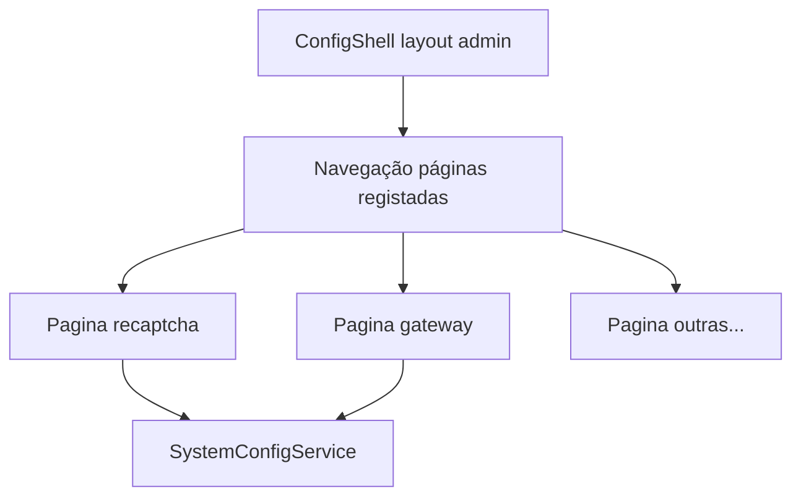

# Plano: painel global profissional + zero legado + sistema de páginas

## Objectivos

1. **Zero legado de produto**: remover `co-admin` / `admin` como mecanismo de acesso à diretoria, flags `access.legacy_*`, textos de UI que mencionem `/co-admin` como caminho actual, e qualquer referência que não pertença ao modelo JUBAF actual (papéis do Estatuto + `super-admin`).
2. **Painel de configuração de nível superior**: deixar de ser um único `index.blade.php` com dezenas de campos em abas — passar a um **shell global** (navegação + cabeçalho + área de conteúdo) e **páginas dedicadas** por domínio, cada uma completa, clara e reutilizável.
3. **Uma página = um módulo visual**: exemplo **reCAPTCHA** — página própria com bloco introdutório, estado (activo/inactivo), campos, links para consola Google, mensagens de ajuda, preview de impacto — padrão replicável para **Gateway**, notificações, etc.

## Contexto (estado actual)

- Shell actual: [Modules/Admin/resources/views/config/index.blade.php](Modules/Admin/resources/views/config/index.blade.php) — sidebar com `$groups`, conteúdo por `x-show` e loop genérico sobre `SystemConfig` (bom para protótipo, mau para escala e UX rica).
- Partials: apenas [partials/branding.blade.php](Modules/Admin/resources/views/config/partials/branding.blade.php).
- Legado e painel: `access.legacy_co_admin_diretoria`, `jubaf_roles.legacy`, Notificações `panel = co-admin`, helpers com `admin`/`co-admin` hardcoded — ver secção “Fase A” abaixo.

## Princípios de UX (painel dinâmico global)

- **Shell único**: uma rota “hub” `admin.config.index` que mostra navegação lateral (ou topo em mobile) e **área de conteúdo** onde cada **página** é um `@include` ou view dedicada.
- **Registo de páginas** (ex.: `App\Support\Admin\ConfigPageRegistry` ou array em `config/admin_config_pages.php`): `id`, `label`, `icon`, `route` ou `section`, `permission` opcional, `view` (Blade), `order`.
- **Páginas de exemplo** a implementar primeiro:
    - **Google reCAPTCHA** — chaves `recaptcha.*` já em `SystemConfig`; página com formulário completo e copy orientada ao administrador não técnico.
    - **Gateway / integrações** — mesmo padrão; campos alinhados ao que o projecto usa (sem PSPs ou APIs que não existam no código).
- **Formulários**: cada página pode submeter para o mesmo `PUT admin.config.update` com `configs[...]` **ou** endpoints específicos se houver validação complexa (preferir um serviço por domínio que chame `batchUpdateConfigsWithEnvSync`).
- **Sem legado na cópia**: textos do painel não referem “co-admin”, “Vertex antigo”, ou URLs obsoletas; redirect 301 `/co-admin` → `/diretoria` pode manter-se em [routes/diretoria.php](routes/diretoria.php) sem aparecer como “funcionalidade” no painel.

## Fase A — Remover legado de acesso e dados

(Mantém-se o conteúdo técnico da versão anterior; reforço: **eliminar** `access.legacy_co_admin_diretoria` do painel e do código; **directorate** só com cargos do Estatuto; migração de utilizadores; normalizar `notifications.panel`; actualizar testes; renomear alias de middleware; UI strings sem “/co-admin” como rota actual.)

## Fase B — Papéis: textos via painel (sem editar slugs)

- Chaves `jubaf_role.display.{slug}` / ajuda; `JubafRoleRegistry` com fallback a [config/jubaf_roles.php](config/jubaf_roles.php).
- UI preferencialmente numa **página dedicada** “Papéis e nomes” dentro do novo shell (não só mais uma aba genérica).

## Fase C — Redundância Homepage / SystemConfig

- Fonte única e uma página “Homepage” no shell ou fusão com módulo Homepage.

## Fase D — `.env` / exemplos

- Auditoria e comentários; alinhamento com o que o código lê.

## Fase E — Runtime (`config:cache`)

- Alargar [SystemConfigRuntimeProvider](app/Providers/SystemConfigRuntimeProvider.php) para recaptcha/vertex/maps conforme chaves persistidas.

## Fase F — Sistema de páginas de configuração (nova)

1. **Contrato**: interface ou array de definição de página com `view`, `key_prefix` opcional, `title`, `description`.
2. **Rotas**: `GET admin/config` → hub; `GET admin/config/{section}` **ou** query `?page=recaptcha` — escolher uma estratégia e documentar (URLs partilháveis favorecem `/config/recaptcha`).
3. **Controller**: [SystemConfigController](app/Http/Controllers/Admin/SystemConfigController.php) — método `page(string $section)` que autoriza o utilizador, carrega dados necessários, devolve `admin::config.shell` com `@include('admin::config.pages.'.$section)`.
4. **Views**:
    - `config/shell.blade.php` — grelha + sidebar a partir do **registo** (não lista hardcoded de 15 `@case`).
    - `config/pages/recaptcha.blade.php` — formulário completo.
    - `config/pages/gateway.blade.php` (exemplo) — alinhado a [config/gateway.php](config/gateway.php) se aplicável.
5. **Migração gradual**: o `index.blade.php` actual pode ser substituído pelo shell; grupos que ainda forem só lista de chaves genéricas podem usar um partial `config/pages/generic_group.blade.php` com o loop actual até cada grupo ter página própria.
6. **Acessibilidade e tema**: manter dark mode, foco, headings por página.

## Riscos e mitigação

| Risco                   | Mitigação                                                                    |
| ----------------------- | ---------------------------------------------------------------------------- |
| Muitas rotas            | Registo central + teste de feature que lista páginas e responde 200          |
| Duplicar lógica de save | Um serviço `ConfigPageService` ou reutilizar `batchUpdateConfigsWithEnvSync` |
| Legado na copy          | Revisão de strings em Blade dos novos partials                               |

## Entregáveis finais

- Código sem legado de **acesso** co-admin/admin na diretoria; dados normalizados.
- **Painel**: shell global + páginas dedicadas (reCAPTCHA e Gateway como referência); caminho claro para acrescentar páginas sem inflar um único ficheiro.
- `.env` e runtime alinhados ao plano das fases D–E.
