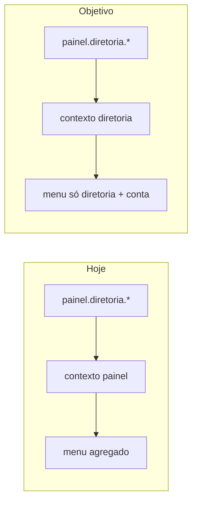

# Organização dos painéis (estilo Vertex) + módulo Diretoria

## Diagnóstico

- **VertexCBAV**: módulos “casca” (`[Modules/MemberPanel](c:\xampp\htdocs\VertexCBAV\Modules\MemberPanel)`, `[Modules/Admin](c:\xampp\htdocs\VertexCBAV\Modules\Admin)`) e, nos domínios (ex.: Bible), views separadas em pastas por audiência (`admin/`, `memberpanel/`). No teu VertexCBAV atual, o Bible **não** tem `diretoriapainel`/`liderpainel`; o **JUBAF** já replica o padrão Bible com `[Modules/Bible/resources/views/superadmin](c:\laragon\www\JUBAF\Modules\Bible\resources\views\superadmin)` e `[memberpanel](c:\laragon\www\JUBAF\Modules\Bible\resources\views\memberpanel)`.
- **Problema principal no JUBAF (ex.: Presidente)**: `[Modules/Auth/resources/views/layouts/painel-shell.blade.php](c:\laragon\www\JUBAF\Modules\Auth\resources\views\layouts\painel-shell.blade.php)` só distingue `superadmin`, `lider`, `pastor`, `jovem`; qualquer rota `painel.diretoria.` cai em `default => 'painel'`, que usa `[config/panel_navigation.php](c:\laragon\www\JUBAF\config\panel_navigation.php)` — lista **todas** as entradas para as quais o utilizador tem permissão (Presidente tem várias: tesouraria, igrejas, eventos, comunicação, etc.). Por isso, mesmo na página da diretoria, a sidebar não fica “só diretoria”.
- **Módulo da diretoria**: a lógica já está isolada em `[Modules/Board](c:\laragon\www\JUBAF\Modules\Board)` com rotas `painel.diretoria.` em `[bootstrap/app.php](c:\laragon\www\JUBAF\bootstrap\app.php)` + `[routes/board.php](c:\laragon\www\JUBAF\routes\board.php)`. A tua escolha foi **renomear o módulo Board → Diretoria** (nomes alinhados ao PT).

## 1. Navegação por contexto de rota (prioridade UX)

- **Alterar** o `match` em `[painel-shell.blade.php](c:\laragon\www\JUBAF\Modules\Auth\resources\views\layouts\painel-shell.blade.php)` para mapear prefixos de rota a contextos dedicados, por exemplo:
  - `painel.diretoria.` → `diretoria`
  - `painel.secretaria.` → `secretaria`
  - `painel.tesouraria.` → `tesouraria`
  - `painel.igrejas.` → `igrejas`
  - `painel.eventos.` → `eventos`
  - `painel.comunicacao.` → `comunicacao`
- **Refatorar** `[config/panel_navigation.php](c:\laragon\www\JUBAF\config\panel_navigation.php)`: extrair do bloco atual `painel` as secções específicas para cada chave acima (cada uma com itens + `active` coerentes). Manter um `painel` **mínimo** (ex.: só “Conta” / fallback) para rotas que não tenham prefixo dedicado.
- **SuperAdmin**: manter atalhos em `panel_navigation.superadmin` (já existem entradas para abrir outros painéis); ajustar `module` de `board` → `diretoria` após o rename.
- **Opcional (UX multi-função)**: secção curta “Outras áreas” com links só para painéis onde o utilizador tem permissão — útil para Presidente saltar para Tesouraria sem misturar com o menu principal da diretoria. Só se quiseres esse extra após o isolamento base.

## 2. Renomear módulo Board → Diretoria

Trabalho mecânico mas transversal (composer, nwidart, testes, docs internas).

- **Pasta e metadados**: `Modules/Board` → `Modules/Diretoria`; atualizar `[modules_statuses.json](c:\laragon\www\JUBAF\modules_statuses.json)` (`Board` → `Diretoria`); novo `[module.json](c:\laragon\www\JUBAF\Modules\Board\module.json)` com `name`/`alias` adequados e providers `Modules\Diretoria\Providers\...`.
- **Composer**: `[Modules/Board/composer.json](c:\laragon\www\JUBAF\Modules\Board\composer.json)` → `vertex-solutions/diretoria`, PSR-4 `Modules\Diretoria\`; `composer dump-autoload --optimize` na raiz.
- **Código PHP**: renomear namespaces `Modules\Board\` → `Modules\Diretoria\` (controllers, requests, policies, models, providers). **Modelos**: renomear `BoardMeeting` → `DiretoriaMeeting` (ou nome equivalente) e políticas associadas; manter `[Modules\Auth\Models\BoardMember](c:\laragon\www\JUBAF\Modules\Auth\app\Models\BoardMember.php)` em Auth (mandatos continuam no domínio de membros), atualizando imports nos controllers do novo módulo.
- **Base de dados**: migração nova `rename('board_meetings', 'diretoria_meetings')` (e ajustar `$table` no modelo) **ou** manter tabela `board_meetings` com modelo novo apontando para esse nome — decidir uma linha e ser consistente; renomear tabela evita confusão futura.
- **Views / namespace Blade**: de `board::` para `diretoria::`; **reorganizar pasta** `resources/views/diretoria/` → `resources/views/diretoriapainel/` (incl. `nav`, dashboards, `reunioes`, `mandatos`), atualizando todos os `view('diretoria::diretoriapainel....')` e includes.
- **Rotas**: ficheiro `[routes/board.php](c:\laragon\www\JUBAF\routes\board.php)` pode renomear-se para `routes/diretoria-panel.php` (ou manter nome físico `board.php` com comentário — preferível renomear para clareza); **não** confundir com `[routes/diretoria.php](c:\laragon\www\JUBAF\routes\diretoria.php)` (rota **pública** `/diretoria`). Em `[bootstrap/app.php](c:\laragon\www\JUBAF\bootstrap\app.php)`, o `group(base_path(...))` deve apontar para o ficheiro final.
- **Permissões Spatie**: alinhar com o nome do módulo — renomear `board.dashboard` / `board.meetings` → `diretoria.dashboard` / `diretoria.meetings` em `[JubafRolesAndPermissionsSeeder](c:\laragon\www\JUBAF\Modules\Auth\Database\Seeders\JubafRolesAndPermissionsSeeder.php)`, policies, middleware em `bootstrap/app.php`, `@can`, `PostLoginRedirect`, `panel_navigation`, e **migração de dados** que atualize linhas em `permissions` e pivots `role_has_permissions` / `model_has_permissions` para ambientes já semeados.
- **Referências de produto**: `[ModuleManagementController](c:\laragon\www\JUBAF\Modules\SuperAdmin\app\Http\Controllers\ModuleManagementController.php)` (`'Board'` → `'Diretoria'`), `[config/module_icons.php](c:\laragon\www\JUBAF\config\module_icons.php)` (nova chave `diretoria` — copiar `[public/modules/icons/Board.png](c:\laragon\www\JUBAF\public\modules\icons)` para `Diretoria.png` até haver ícone oficial novo, e atualizar labels).
- **Testes**: mover/renomear `[tests/Feature/Board](c:\laragon\www\JUBAF\tests\Feature\Board)` → `tests/Feature/Diretoria`; atualizar asserts e factories se existirem.

## 3. Pastas de views por painel (resto do projeto, alinhamento Vertex)

Ordem sugerida (incremental, sem reescrever tudo de uma vez):

| Módulo                                                | Situação atual                       | Alvo sugerido                                                                                                                                  |
| ----------------------------------------------------- | ------------------------------------ | ---------------------------------------------------------------------------------------------------------------------------------------------- |
| Bible                                                 | já tem `superadmin/`, `memberpanel/` | manter; opcional criar pastas vazias `diretoriapainel/` só se no futuro houver UI diretoria no Bible                                           |
| Diretoria (ex-Board)                                  | `diretoria/`                         | `diretoriapainel/`                                                                                                                             |
| LocalChurch                                           | `lider/`, `pastor/`                  | `liderpainel/`, `pastorpainel/` (ou `pastor/` + doc)                                                                                           |
| Youth                                                 | `portal/`                            | `jovempainel/` (renomear + atualizar `view()` e testes)                                                                                        |
| Secretariat, Finance, Churches, Events, Communication | views na raiz ou `panel/`            | introduzir subpastas por painel **quando a view for exclusiva desse painel** (ex.: `secretariapainel/`, `tesourariapainel/`, …), como no Bible |

Isto espelha a ideia “cada módulo tem a pasta da responsabilidade daquele painel”, sem obrigar ficheiros duplicados onde uma view é partilhada.

## 4. Verificação

- `vendor/bin/pint --dirty --format agent` em ficheiros PHP alterados.
- Testes mínimos: feature do módulo Diretoria (ex.: reuniões), `[PanelShellNavigationTest](c:\laragon\www\JUBAF\tests\Feature\Auth\PanelShellNavigationTest.php)` **estendido** com caso **Presidente** em `painel.diretoria.dashboard`: não deve aparecer “Tesouraria” / “Eventos” na sidebar (texto atual do menu), mas deve continuar a conseguir aceder a essas rotas diretamente se tiver permissão (403 nunca onde já havia 200).

## 5. Changelog

- Entrada em `[CHANGLOG.md](c:\laragon\www\JUBAF\CHANGLOG.md)` (rename módulo, permissões, navegação por contexto, convenção de pastas).

---

**Nota**: Não é obrigatório criar novos módulos “Admin”/“MemberPanel” como no VertexCBAV — o JUBAF já centraliza o chrome em `[auth::layouts.painel-shell](c:\laragon\www\JUBAF\Modules\Auth\resources\views\layouts\painel-shell.blade.php)` e SuperAdmin; o ganho equivalente vem dos **contextos de navegação** + **pastas de views por painel** + **módulo Diretoria** explícito.
