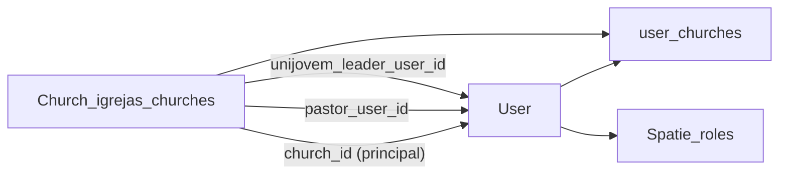

# Plano: Permissão (views + rotas Blade), Igrejas e perfil integrado

## Diagnóstico do erro

- Em [admin/roles/\*.blade.php](c:\laragon\www\JUB\Modules\Permisao\resources\views\admin\roles) e [paineldiretoria/roles/\*.blade.php](c:\laragon\www\JUB\Modules\Permisao\resources\views\paineldiretoria\roles) aparece **`route($routePrefix.'.'index)`** (e variantes `create`, `show`, `edit`, `update`, `destroy`, `store`, `permissionsRoutePrefix`).
- Em PHP isso é interpretado como string `'.'` concatenada com o identificador **`index`** (não é string) → **ParseError**.
- As views de **users** e **permissions** já usam o padrão válido: **`route($routePrefix.'.index')`** (nome da rota inteiro numa única string).

**Correção mecânica:** trocar todas as ocorrências do padrão quebrado pelo padrão válido, por exemplo `$routePrefix.'.'index` → `$routePrefix.'.index'` (idem para `permissionsRoutePrefix`).

## Alinhar controladores à nova árvore de views

As views existem só em `admin/*` e `paineldiretoria/*` ([listagem em `resources/views`](c:\laragon\www\JUB\Modules\Permisao\resources\views)); os `viewPrefix()` ainda apontam para nomes “planos” inexistentes.

| Controlador                                                                                                                        | `viewPrefix()` atual    | Novo valor                              |
| ---------------------------------------------------------------------------------------------------------------------------------- | ----------------------- | --------------------------------------- |
| [UserManagementController](c:\laragon\www\JUB\Modules\Permisao\app\Http\Controllers\UserManagementController.php)                  | `permisao::users`       | `permisao::admin.users`                 |
| [DiretoriaUserController](c:\laragon\www\JUB\Modules\PainelDiretoria\app\Http\Controllers\DiretoriaUserController.php)             | `permisao::users`       | `permisao::paineldiretoria.users`       |
| [RoleManagementController](c:\laragon\www\JUB\Modules\Permisao\app\Http\Controllers\RoleManagementController.php)                  | `permisao::roles`       | `permisao::admin.roles`                 |
| [DiretoriaRoleController](c:\laragon\www\JUB\Modules\PainelDiretoria\app\Http\Controllers\DiretoriaRoleController.php)             | `permisao::roles`       | `permisao::paineldiretoria.roles`       |
| [PermissionManagementController](c:\laragon\www\JUB\Modules\Permisao\app\Http\Controllers\PermissionManagementController.php)      | `permisao::permissions` | `permisao::admin.permissions`           |
| [DiretoriaPermissionController](c:\laragon\www\JUB\Modules\PainelDiretoria\app\Http\Controllers\DiretoriaPermissionController.php) | `permisao::permissions` | `permisao::paineldiretoria.permissions` |

[AccessHubController](c:\laragon\www\JUB\Modules\Permisao\app\Http\Controllers\AccessHubController.php) já referencia `permisao::admin.hub` e `permisao::paineldiretoria.hub` — manter.

## UI: admin vs painel diretoria

- **Admin:** manter o padrão já forte em [admin/permissions/index.blade.php](c:\laragon\www\JUB\Modules\Permisao\resources\views\admin\permissions\index.blade.php) (hero com ícone, breadcrumb, cartões). Garantir que **users**, **roles** e **permissions** admin partilham o mesmo “ritmo” visual (cabeçalho, espaçamento, botões secundários) sem reescrever tudo — ajustes pontuais onde faltar.
- **Painel diretoria:** espelhar a **estrutura** da Secretaria: `@include` de subnav + faixa “Painel diretoria” + título com [`x-module-icon`](c:\laragon\www\JUB\Modules\Secretaria\resources\views\paineldiretoria\dashboard.blade.php) (referência: [subnav Secretaria](c:\laragon\www\JUB\Modules\Secretaria\resources\views\paineldiretoria\partials\subnav.blade.php)).
    - Criar [Modules/Permisao/resources/views/paineldiretoria/partials/subnav.blade.php](c:\laragon\www\JUB\Modules\Permisao\resources\views\paineldiretoria\partials\subnav.blade.php) com links: hub (`diretoria.access.hub` ou rota equivalente já usada em [hub.blade.php](c:\laragon\www\JUB\Modules\Permisao\resources\views\paineldiretoria\hub.blade.php)), `diretoria.users.*`, `diretoria.roles.*`, `diretoria.permissions.*`, e variável `$active` (`hub|users|roles|permissions`).
    - Incluir subnav + bloco de título/descrição no topo de: `hub`, `users/*`, `roles/*`, `permissions/*` sob `paineldiretoria/`. Cor de destaque: **índigo** (já usado nas telas de Permissão) para distinguir do verde da Secretaria, mantendo o **mesmo layout**.

## Igrejas: congregação vs sede, CNPJ, logo e capa

Estado atual: [create_igrejas_churches_table](c:\laragon\www\JUB\Modules\Igrejas\database\migrations\2026_04_04_100000_create_igrejas_churches_table.php) sem tipo/CNPJ/logo/capa; [institutional migration](c:\laragon\www\JUB\Modules\Igrejas\database\migrations\2026_04_06_100000_add_institutional_fields_to_igrejas_churches_table.php) já liga `pastor_user_id` e `unijovem_leader_user_id` a `users`.

**Nova migração aditiva** (não editar `0001` nem migrações já aplicadas em produção):

- `kind` (ex.: `enum`/`string`: `church` | `congregation`) ou boolean `is_congregation` — preferência: **`kind`** + validação explícita.
- `parent_church_id` nullable, FK para `igrejas_churches` (congregação opcionalmente ligada à sede).
- `cnpj` nullable (14 caracteres normalizados); **regra de validação:** obrigatório só quando `kind === church` (sede).
- `logo_path` e `cover_path` nullable (strings; ficheiros em `storage`, igual ao padrão de `photo` em users).

Atualizar [Church.php](c:\laragon\www\JUB\Modules\Igrejas\app\Models\Church.php) (`fillable`, relação `parent()` / `congregations()`), Form Requests e formulários de criação/edição (onde existirem no módulo) + policy se necessário. Ajustar [ChurchLeadershipSync](c:\laragon\www\JUB\Modules\Igrejas\app\Services\ChurchLeadershipSync.php) apenas se o novo modelo alterar invariantes.

## Utilizadores: perfil pessoal vs igreja

- **Não** misturar dados da entidade igreja na ficha “perfil” do utilizador: o vínculo continua com `church_id` ([add_church_id migration](c:\laragon\www\JUB\database\migrations\2026_04_04_100001_add_church_id_to_users_table.php)) e [user_churches](c:\laragon\www\JUB\database\migrations\2026_04_05_130000_create_user_churches_table.php).
- [0001 users](c:\laragon\www\JUB\database\migrations\0001_01_01_000000_create_users_table.php): manter como está para installs novos; **campos novos** numa migração separada, por exemplo:
    - `emergency_contact_name`, `emergency_contact_phone`, `emergency_contact_relationship` (todos nullable).
- Atualizar modelo `User` (`fillable`/casts), validação nos controladores de perfil (Painel Líder / Jovens / Pastor / Secretaria conforme existirem) e labels: `church_phone` como contacto **institucional do utilizador na função**, não duplicar endereço/CNPJ da igreja no perfil.

## Integração entre módulos (modelo mental)

- **Igreja (sede)** agrupa utilizadores e pode ter **congregações** (`parent_church_id`).
- **Pastor / líder UniJovem** são referências explícitas na igreja; **papéis** (Spatie) definem o que cada um pode fazer nos módulos.
- Listagens e políticas devem continuar a respeitar `church_id` / pivot e, quando aplicável, o contexto da igreja atual (helpers existentes — reutilizar em vez de inventar segundo critério).

Documentar este fluxo em [Modules/README.md](c:\laragon\www\JUB\Modules\README.md) numa secção curta “Identidade e vínculos (User ↔ Church ↔ Roles)” para alinhar futuros módulos.

## Verificação

- `php artisan view:clear` e abrir rotas admin e diretoria de roles/users/permissions sem erro.
- Testes feature existentes de RBAC (se houver) + smoke manual nos formulários Igrejas e perfil.

## Ordem sugerida de implementação

1. Corrigir Blade nas **roles** + atualizar os **seis** `viewPrefix()` (impacto imediato, desbloqueia páginas).
2. Subnav + harmonização **paineldiretoria** Permissão.
3. Migração + modelo + UI **Igrejas** (tipo, CNPJ, logo, capa).
4. Migração + **User** + ecrãs de perfil (emergency contact).
5. Atualização **Modules/README.md** com o diagrama/contrato de integração.
