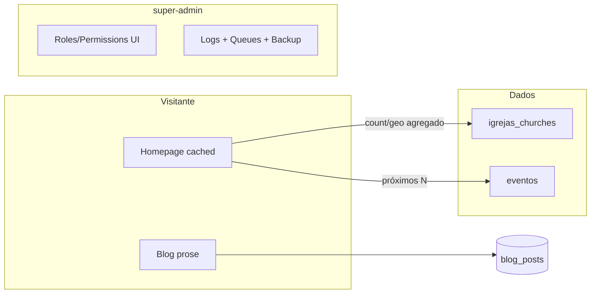

# Plano: Portal institucional + Admin/Permisao (fase final)

## Estado atual (referência)

- **Homepage:** [`Modules/Homepage/app/Http/Controllers/HomepageController.php`](Modules/Homepage/app/Http/Controllers/HomepageController.php) monta a landing com `SystemConfig`, carrossel e bloco bíblico; ainda **não** integra `Church` nem eventos públicos do calendário.
- **Rotas públicas canónicas:** [`Modules/Homepage/routes/web.php`](Modules/Homepage/routes/web.php) (`/`), Blog em [`Modules/Blog/routes/web.php`](Modules/Blog/routes/web.php) (`/blog/*`), eventos em [`Modules/Calendario/routes/public.php`](Modules/Calendario/routes/public.php) (carregado por [`routes/web.php`](routes/web.php)) — reutilizar o mesmo critério de “público + publicado” que [`PublicCalendarController`](Modules/Calendario/app/Http/Controllers/PublicCalendarController.php).
- **Igrejas:** [`ChurchRepository`](Modules/Igrejas/app/Repositories/ChurchRepository.php) hoje expõe `statsForUser()` com `ErpChurchScope` — **inadequado para visitante anónimo**. Para o portal é preciso um caminho explícito “público” (sem utilizador) com dados agregados/LGPD-safe.
- **EventService:** [`Modules/Calendario/app/Services/EventService.php`](Modules/Calendario/app/Services/EventService.php) só trata capacidade/inscrições; a listagem para a Homepage deve ser **nova API no serviço** (ou um `HomepageCalendarQuery` no módulo Calendario) que delegue internamente a `CalendarEvent` com `published()` + `visibility = publico` + `start_date >= hoje`, ordenação por data, limite N.
- **Blog:** [`BlogPost`](Modules/Blog/app/Models/BlogPost.php) já tem `slug`, `author_id`, `published_at` e scope `published`. **Decisão aceite:** manter a tabela **`blog_posts`** (sem rename para `posts`).
- **RBAC web:** Em [`routes/admin.php`](routes/admin.php), dentro de `middleware(['role:super-admin'])`, já existem `resources('roles', RoleManagementController)` e CRUD de `permissions`, com [`PermissionService`](app/Services/Admin/PermissionService.php) e views `permisao::admin.*` (ex.: [`Modules/Permisao/resources/views/admin/roles/edit.blade.php`](Modules/Permisao/resources/views/admin/roles/edit.blade.php) com matriz de checkboxes). O trabalho aqui é **finalizar UX densa + convergência com o módulo `Admin`**, não recriar do zero.
- **Backups:** [`BackupController`](app/Http/Controllers/Admin/BackupController.php) e rotas `admin.backup.*` já estão ligados — apenas integrar no dashboard técnico.
- **Filas:** **Decisão aceite:** sem Horizon — painel com métricas nativas (driver, profundidade das filas onde aplicável, estado do worker não é trivial sem supervisão; foco em `failed_jobs` se a tabela existir, config de `QUEUE_CONNECTION`, e eventual contagem por conexão).

---

## 1. Homepage: camada de dados + cache estrito

**Objetivo:** landing rápida; TTL curto ou invalidação mínima; nada de N+1 na request.

1. **Novo suporte de leitura pública (Igrejas)**
    - Adicionar em `ChurchRepository` (ou uma classe dedicada `PublicChurchStats` no módulo Igrejas) métodos do tipo:
        - `publicAssociationStats()` → total de igrejas associadas (regra de negócio: ex. `is_active` + eventual `kind = church` vs congregações — alinhar com produto).
        - Opcional: agregações por `state` para um mapa simples (choropleth ou pontos por capital de UF se não houver coordenadas no modelo — hoje [`Church`](Modules/Igrejas/app/Models/Church.php) não expõe lat/long explícitos; mapa “real” pode ser **por município/UF** ou derivado de `metadata` se existir).
    - **Não** reutilizar `statsForUser()` sem utilizador.

2. **Próximos congressos/eventos públicos**
    - Centralizar a query no Calendário (método novo em `EventService` tipo `upcomingPublicFeatured(int $limit): Collection` usando o mesmo critério que [`PublicCalendarController@index`](Modules/Calendario/app/Http/Controllers/PublicCalendarController.php)).
    - Filtrar “congressos” se necessário: campo `type` em `CalendarEvent` (confirmar valores usados na operação; se não houver distinção, documentar “eventos públicos em destaque” via `is_featured` ou convenção de título).

3. **Controller e cache**
    - Em `HomepageController@index` (ou um `CachedHomepageComposer` invocado ali), usar `Cache::remember` com chaves explícitas (`homepage.church_stats`, `homepage.upcoming_events`) e TTL configurável (ex. 300–900s) via `config` ou `SystemConfig`.
    - Passar à view apenas DTOs leves: contadores, lista curta de eventos (título, data, slug, URL `route('eventos.show', $slug)`).

4. **View / marketing**
    - Refatorar [`Modules/Homepage/resources/views/index.blade.php`](Modules/Homepage/resources/views/index.blade.php) e parciais: hero expansivo, CTA para login (rotas já usadas em auth Homepage), secção “Igrejas associadas” com número real + mapa/agregação, secção “Próximos eventos” com cards.
    - Rodapé institucional: passar **CNPJ e contactos** via `SystemConfig` (campos novos se não existirem) para não hardcodar.

---

## 2. Blog institucional (Medium/Substack) sobre `blog_posts`

**Objetivo:** leitura limpa; tipografia forte; autoria de liderança.

1. **Conteúdo**
    - Manter modelo e tabela **`blog_posts`**. Garantir que fluxos de publicação usam `published_at` e `author_id` (já no fillable).

2. **UI pública**
    - Ajustar [`Modules/Blog/resources/views/layouts/blog.blade.php`](Modules/Blog/resources/views/layouts/blog.blade.php), [`public/show.blade.php`](Modules/Blog/resources/views/public/show.blade.php), [`public/index.blade.php`](Modules/Blog/resources/views/public/index.blade.php): layout mais editorial (max-width, hierarquia tipográfica).
    - Adicionar **`@tailwindcss/typography`** e classe `prose` no corpo do artigo (dependência em [`package.json`](package.json) + `tailwind.config`).

3. **Performance**
    - `Cache::remember` para página inicial do blog e, se necessário, fragment cache da lista por página; invalidar ao publicar/atualizar post (listener no modelo ou no controller do painel).

4. **Comentários / tags**
    - Decisão de produto: para “portal da liderança”, pode manter comentários moderados ou desactivar por defeito (`allow_comments`). O plano assume **manter infra existente**, só simplificar a UI pública.

---

## 3. Bible (módulo público)

- Não é necessário fundir o motor de estudo na Homepage para cumprir o portal institucional: manter **entradas actuais** (`/devocionais`, integração Bible no Homepage) e garantir navegação clara no novo layout. Escopo mínimo: coerência visual e links no rodapé/hero.

---

## 4. Módulo Permisao + RBAC (Spatie) — finalização

**O que já existe:** CRUD de roles e permissions + `PermissionService` + rotas `admin.roles.*` e `admin.permissions.*` apenas para `super-admin`.

**Trabalho de fecho:**

1. **UX “ultra-densa” para TI**
    - Variante de layout ou classes utilitárias nas views `permisao::admin.*`: tabelas `text-xs`, menos padding, cabeçalhos fixos na matriz de permissões, pesquisa/filtro por nome de permissão (JS simples ou Livewire já presente em dev).

2. **Segurança**
    - Manter protecção de roles de sistema via [`JubafRoleRegistry`](app/Support/JubafRoleRegistry.php) / `jubaf_role_is_protected()` já usada nas views.
    - Confirmar que criação de **novas** permissions pela UI continua a usar `PermissionService::createPermission` e que gates/policies críticas não dependem só de nomes ad-hoc (documentar convenção `modulo.acção`).

3. **Hub**
    - [`/admin/seguranca`](routes/admin.php) (`AccessHubController@superadmin`) como ponto único com links para utilizadores, roles, permissions.

---

## 5. Módulo Admin — dashboard técnico (Ops)

**Objetivo:** uma vista “estado do sistema” para Diretoria de TI, separada mentalmente do marketing.

1. **Novo controlador ou secção** (ex. `SystemOpsController@index`) sob `role:super-admin`, reutilizando layout [`admin::layouts.admin`](Modules/Admin/resources/views/layouts/sidebar-admin.blade.php) e registo no [`AdminNavigationBuilder`](Modules/Admin/app/Support/AdminNavigationBuilder.php).

2. **Logs de erro Laravel**
    - Leitura **segura** do ficheiro `storage/logs/laravel.log`: últimas N linhas ou últimos X KB, com guarda de tamanho e exclusão em produção de paths sensíveis na UI.
    - Alternativa/além: integração com `pail` só em dev; em prod, a vista web é “último tail” + link para export.

3. **Filas (sem Horizon)**
    - Mostrar `config('queue.default')`, conexões relevantes, contagem de jobs (`jobs` table se database driver), `failed_jobs` recente com retry/delete (usar políticas existentes ou middleware `super-admin` apenas).
    - Documentar no painel que workers devem estar a correr (documentação curta na própria página).

4. **Backups**
    - Embutir resumo + link directo para [`admin.backup.index`](routes/admin.php) e estatísticas rápidas (último ficheiro, tamanho).

5. **`AdminDashboardController`**
    - Opcional: separar dashboard “conteúdo/negócio” do dashboard “Ops” para não poluir a vista dos cargos não-TI (hoje [`AdminDashboardController`](app/Http/Controllers/Admin/AdminDashboardController.php) mistura widgets genéricos).

---

## 6. Testes e hardening

- Feature tests: Homepage devolve 200 e inclui números esperados quando há `Church`/eventos em fixtures.
- Teste de rotas `super-admin` para Ops e RBAC (403 para outros roles).
- Revisão de cache: chaves e flush em comandos de deploy se necessário.

---

## Ordem de implementação sugerida

1. Camada de dados públicos (Igrejas + Calendário) + cache na Homepage.
2. Refino visual Homepage (hero, CTA, rodapé institucional).
3. Blog: Tailwind Typography + templates públicos.
4. Admin Ops (logs + filas + atalhos) e navegação.
5. Densificação RBAC / Permisao e polimento final.
