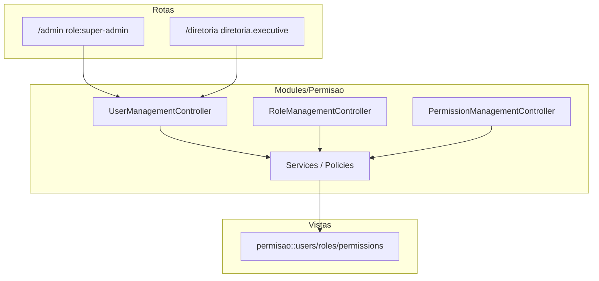

# Plano: RBAC centralizado, utilizadores completos e limpeza profunda

## Estado atual (descobertas)

- **Implementação real** de utilizadores/funções/permissões está em [`app/Http/Controllers/Admin/UserController.php`](c:\laragon\www\JUB\app\Http\Controllers\Admin\UserController.php), [`RoleController.php`](c:\laragon\www\JUB\app\Http\Controllers\Admin\RoleController.php), [`PermissionController.php`](c:\laragon\www\JUB\app\Http\Controllers\Admin\PermissionController.php), serviços em [`app/Services/Admin/`](c:\laragon\www\JUB\app\Services\Admin) e vistas em [`resources/views/admin/users|roles|permissions`](c:\laragon\www\JUB\resources\views\admin).
- **Painel Diretoria** só faz _thin wrappers_ que apontam para as mesmas vistas `admin.*` com layout [`paineldiretoria::components.layouts.app`](c:\laragon\www\JUB\Modules\PainelDiretoria\resources\views\components\layouts\app.blade.php) — ex.: [`DiretoriaUserController`](c:\laragon\www\JUB\Modules\PainelDiretoria\app\Http\Controllers\DiretoriaUserController.php).
- **Views mortas**: existem ficheiros em `Modules/PainelDiretoria/resources/views/users`, `roles`, `permissions` que **não são referenciados** em lado nenhum (zero matches a `paineldiretoria::users` etc.) — candidatos diretos a remoção.
- **Módulo Permisao** é um **stub** do legado Vertex: [`PermisaoController`](c:\laragon\www\JUB\Modules\Permisao\app\Http\Controllers\PermisaoController.php) referencia `permisao::index/create/...` que **não existem** (só [`master.blade.php`](c:\laragon\www\JUB\Modules\Permisao\resources\views\components\layouts\master.blade.php)); [`routes/web.php`](c:\laragon\www\JUB\Modules\Permisao\routes\web.php) regista `Route::resource('permisaos', ...)` — rotas quebradas se alguém as aceder.
- **Rotas**: Super-admin — [`routes/admin.php`](c:\laragon\www\JUB\routes\admin.php) (`role:super-admin`) para `users`, `roles`, `permissions`; Diretoria executiva — [`routes/diretoria.php`](c:\laragon\www\JUB\routes\diretoria.php) (`diretoria.executive` = Presidente + Vices, ver [`EnsureUserIsDiretoriaExecutive`](c:\laragon\www\JUB\Modules\PainelDiretoria\app\Http\Middleware\EnsureUserIsDiretoriaExecutive.php)). **Decisão confirmada**: Secretários **não** passam a gerir RBAC (mantém-se o teste em [`DiretoriaPanelTest`](c:\laragon\www\JUB\tests\Feature\Diretoria\DiretoriaPanelTest.php)).
- **Utilizador na BD**: colunas espalhadas por várias migrações (`phone`, `active`, `photo`, `cpf`, `church_id`, `birth_date`, pivot `user_churches`). [`0001_01_01_000000_create_users_table.php`](c:\laragon\www\JUB\database\migrations\0001_01_01_000000_create_users_table.php) ainda só tem o mínimo Laravel.
- **Risco de segurança**: [`UserService`](c:\laragon\www\JUB\app\Services\Admin\UserService.php) faz `assignRole` / `syncRoles` **sem** filtrar funções — um Presidente na rota `diretoria.users` poderia em teoria atribuir `super-admin` se o formulário listar essa role. Isto deve ser **corrigido de raiz** com regras explícitas por contexto (super-admin vs diretoria executiva).
- **Permissões**: [`PermissionController`](c:\laragon\www\JUB\app\Http\Controllers\Admin\PermissionController.php) só tem `index` + `store` — falta CRUD completo (editar/desativar ou apagar permissões _custom_, com proteção às geradas pelo sistema).
- **Referência PLANOJUBAF**: [`PLANOJUBAF/Plano1-Estrutura.md`](c:\laragon\www\JUB\PLANOJUBAF\Plano1-Estrutura.md) descreve Admin com utilizadores + Spatie + auditoria — o plano abaixo alinha o **módulo Permisao** como “casa” dessa área no código modular.
- **VERTEXSEMAGRI**: o caminho `c:\laragon\www\VERTEXSEMAGRI` **não está disponível** neste ambiente; para comparar ficheiros legados, usar a cópia local no teu PC e cruzar com a lista de remoções deste plano.

## 1. Modelo de dados `users` (completo e coerente)

- **Campos novos desejados**: `first_name`, `last_name`, manter ou derivar `name` para compatibilidade (recomendado: **preencher `name` automaticamente** em `User::saving` como `trim(first_name + last_name)` ou migração que copia `name` para `first_name` e deixa `last_name` vazio até edição — evita quebrar centenas de `where name`).
- **Campos já existentes noutras migrações** a integrar na “fonte de verdade” após `fresh`:
    - Em [`0001_01_01_000000_create_users_table.php`](c:\laragon\www\JUB\database\migrations\0001_01_01_000000_create_users_table.php): `phone`, `active` (boolean default true), `photo` (nullable string), `cpf` (nullable, unique), `birth_date` (nullable date), `email_verified_at`, `password`, `remember_token`, timestamps.
    - **Não** colocar `foreignId('church_id')` no `0001` — a tabela [`igrejas_churches`](c:\laragon\www\JUB\Modules\Igrejas\database\migrations\2026_04_04_100000_create_igrejas_churches_table.php) é criada **depois**; manter `church_id` numa migração posterior (podes **fundir** o conteúdo de [`2026_04_04_100001_add_church_id_to_users_table.php`](c:\laragon\www\JUB\database\migrations\2026_04_04_100001_add_church_id_to_users_table.php) nessa ordem, não no 0001).
- **“Telefone igreja”**: se for contacto da **congregação**, o lugar natural é o modelo `Church` (módulo Igrejas); se for **telefone profissional do utilizador ligado à função na igreja**, adicionar `church_phone` (nullable) em `users` e expor nos formulários admin/diretoria. Documentar no seeder/UI qual semântica escolheste.
- **Limpeza de migrações**: após consolidar, **remover ou esvaziar** migrações redundantes que só acrescentam colunas já no 0001 + migração `church_id` (ex.: [`2024_01_01_000001_add_phone_active_to_users_table.php`](c:\laragon\www\JUB\database\migrations\2024_01_01_000001_add_phone_active_to_users_table.php), [`2025_11_19_005918_add_photo_to_users_table.php`](c:\laragon\www\JUB\database\migrations\2025_11_19_005918_add_photo_to_users_table.php), [`2025_12_04_154715_add_cpf_to_users_table.php`](c:\laragon\www\JUB\database\migrations\2025_12_04_154715_add_cpf_to_users_table.php), [`2026_04_06_100002_add_birth_date_to_users_table.php`](c:\laragon\www\JUB\database\migrations\2026_04_06_100002_add_birth_date_to_users_table.php)) para evitar duplicar `Schema::hasColumn` em cada uma.
- Atualizar [`app/Models/User.php`](c:\laragon\www\JUB\app\Models\User.php), [`UserService`](c:\laragon\www\JUB\app\Services\Admin\UserService.php), [`UserController`](c:\laragon\www\JUB\app\Http\Controllers\Admin\UserController.php) validações, vistas `admin/users/*`, perfis (`updateProfile` / Diretoria profile), e [`database/factories/UserFactory.php`](c:\laragon\www\JUB\database\factories\UserFactory.php) para os novos campos.

## 2. Segurança RBAC (obrigatório)

- **Política de atribuição de funções** (nova classe, ex. `App\Policies\RoleAssignmentPolicy` ou métodos em `UserService` com `Request`/actor):
    - Utilizador **sem** `super-admin`: **não pode** atribuir/remover `super-admin` nem alterar utilizadores que já têm `super-admin`.
    - **Diretoria executiva**: pode gerir diretoria operacional, líderes, jovens, pastor, etc., conforme lista **allowlist** derivada de [`config/jubaf_roles.php`](c:\laragon\www\JUB\config\jubaf_roles.php) (ex.: todos exceto `super-admin`).
    - **Super-admin**: sem restrições de função (exceto regras de negócio: não apagar a si próprio, manter pelo menos um super-admin ativo).
- **Proteção de conta**: impedir desativação/remoção do último `super-admin` ativo; impedir auto-remoção acidental da própria role `super-admin`.
- **Funções**: [`PermissionService::isProtectedRole`](c:\laragon\www\JUB\app\Services\Admin\PermissionService.php) já impede renomear/apagar roles de sistema — reutilizar e alinhar com a mesma allowlist na UI (dropdown de roles filtrado por actor).
- **Permissões**: definir conjunto **imutável** (nomes criados pelo [`RolesPermissionsSeeder`](c:\laragon\www\JUB\database\seeders\RolesPermissionsSeeder.php)) vs **custom** (criadas no painel); só as custom podem ser editadas/apagadas (ou soft-delete se preferires histórico).

## 3. Centralizar no módulo `Permisao`

- **Mover** (ou extrair para) `Modules/Permisao/App/Http/Controllers/` as implementações de gestão (utilizadores, roles, permissions), mantendo **uma** base abstrata ou _traits_ para `routePrefix()`, `viewPrefix()`, `panelLayout()` — hoje isso está espalhado entre Admin e Diretoria.
- **Vistas**: migrar de `resources/views/admin/users|roles|permissions` para `Modules/Permisao/resources/views/...` com namespace `permisao::`, mantendo componentes Flowbite/Tailwind existentes (seguir [`.cursor/skills/tailwindcss-development/SKILL.md`](c:\laragon\www\JUB.cursor\skills\tailwindcss-development\SKILL.md) ao refatorar classes).
- **Rotas**:
    - Em [`routes/admin.php`](c:\laragon\www\JUB\routes\admin.php) e [`routes/diretoria.php`](c:\laragon\www\JUB\routes\diretoria.php), apontar para os controllers do módulo (em vez de `App\Http\Controllers\Admin\*`).
    - **Remover ou desativar** o `Route::resource('permisaos', ...)` em [`Modules/Permisao/routes/web.php`](c:\laragon\www\JUB\Modules\Permisao\routes\web.php) e o espelho em `api.php` **ou** substituir por redirecionamento para `/admin/...` / `/diretoria/...` para não haver URLs mortas.
- **Dashboards**: implementar entradas claras em `Modules/Permisao/resources/views/...` (substituir referências a dashboards vazios que mencionaste); ligar a partir do sidebar super-admin e do painel diretoria (secção “Segurança / Acesso”) sem duplicar lógica.

## 4. CRUD de permissões “completo”

- Estender [`PermissionService`](c:\laragon\www\JUB\app\Services\Admin\PermissionService.php) com `updatePermission` / `deletePermission` (com validação e auditoria [`AuditLog`](c:\laragon\www\JUB\app\Models\AuditLog.php)).
- Estender controller + vistas: listagem por módulo (já existe agrupamento em `getPermissionsGrouped`), formulário de criação/edição, remoção com confirmação.
- Garantir que políticas de `Gate`/middleware dos outros módulos (Blog, Secretaria, etc.) continuam a usar os **mesmos nomes** string que o seeder — documentar no cabeçalho do seeder ou num `config/permissions.php` opcional.

## 5. Limpeza de ficheiros mortos e legado

- **Apagar** (após confirmar grep): `Modules/PainelDiretoria/resources/views/users/**`, `roles/**`, `permissions/**` não usados.
- Rever referências a `co-admin` / `admin` em [`RolesPermissionsSeeder`](c:\laragon\www\JUB\database\seeders\RolesPermissionsSeeder.php) e [`config/jubaf_roles.php`](c:\laragon\www\JUB\config\jubaf_roles.php): planear fase “só migração de dados” vs remoção total dos roles legados quando já não houver utilizadores (alinhado a [.cursor/plans/limpeza_jub_para_jubaf_5f48b5fa.plan.md](c:\laragon\www\JUB.cursor\plans\limpeza_jub_para_jubaf_5f48b5fa.plan.md)).
- **Composer / `modules_statuses.json`**: se o módulo Permisao ficar funcional, manter `true`; caso contrário nunca deixar rotas quebradas registadas.

## 6. Integração com módulos existentes

- Validar que `module_enabled()` e permissões em [`RolesPermissionsSeeder`](c:\laragon\www\JUB\database\seeders\RolesPermissionsSeeder.php) cobrem Avisos, Bible, Blog, Calendario, Chat, Financeiro, Homepage, Igrejas, Notificacoes, Secretaria, Talentos (ajustar matriz presidente/vice vs secretário/tesoureiro conforme Estatuto e [`PLANOJUBAF/ESTATUTOJUBAF.md`](c:\laragon\www\JUB\PLANOJUBAF\ESTATUTOJUBAF.md)).
- **Secretaria**: rotas [`Modules/Secretaria/routes/admin.php`](c:\laragon\www\JUB\Modules\Secretaria\routes\admin.php) (super-admin) e [`diretoria.php`](c:\laragon\www\JUB\Modules\Secretaria\routes\diretoria.php) mantêm-se; o upgrade de RBAC não precisa mudar o fluxo de atas, só garante que **quem gere contas** não contamine o papel super-admin.

## 7. Verificação final (dev)

- Correr `php artisan migrate:fresh --seed` e testes: `php artisan test --filter=Diretoria` (e suite completa se possível).
- Testes novos sugeridos: “presidente não pode atribuir super-admin”, “presidente pode atribuir secretario-1”, “não apagar último super-admin”.

## Riscos e mitigação

| Risco                                 | Mitigação                                                                                              |
| ------------------------------------- | ------------------------------------------------------------------------------------------------------ |
| Quebrar URLs bookmarked               | Manter nomes de rotas `admin.*` e `diretoria.*` inalterados ao mudar apenas o namespace do controller. |
| Migração 0001 demasiado cedo para FKs | Manter FK `church_id` apenas após migração de `igrejas_churches`.                                      |
| UI regressions                        | Reutilizar markup actual das vistas admin ao mover para `permisao::`.                                  |
