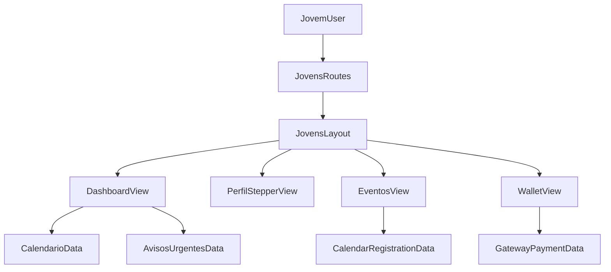

# Plano de Refatoração Completa do Painel Jovens

## Objetivo e Escopo Fechado

- Manter `routes/jovens.php` como **fonte única de rotas web** do domínio jovens, com padronização final em `/jovens/*`.
- Refatorar o front-end para padrão mobile-first com UX de aplicativo nativo: sidebar no desktop + bottom navigation no mobile.
- Entregar integração **real** (sem placeholders) para:
  - status de inscrição/pagamento,
  - feed de avisos urgentes,
  - carteira de ingressos/vouchers com QR Code.
- Centralizar o layout do módulo em `[Modules/PainelJovens/resources/views/layouts/jovens.blade.php](Modules/PainelJovens/resources/views/layouts/jovens.blade.php)` estendendo `[resources/views/layouts/app.blade.php](resources/views/layouts/app.blade.php)`.

## Arquitetura de Rotas e Navegação

- Consolidar todos os endpoints jovens no grupo existente em `[routes/jovens.php](routes/jovens.php)` (prefixo `jovens`, nome `jovens.`).
- Introduzir rotas canônicas orientadas à UX solicitada:
  - `/jovens/dashboard` (home),
  - `/jovens/perfil` (novo slug canônico; manter `/jovens/profile` como redirect 301 temporário),
  - `/jovens/eventos` (alias canônico para experiência jovem, mapeando para fluxo de participação),
  - `/jovens/wallet` (tickets/vouchers/QR).
- Preservar compatibilidade com integrações existentes (`jovens.calendario.*`, `jovens.talentos.*`, `jovens.avisos.*`) e fazer migração gradual de links internos.
- Atualizar a navegação para ter a mesma IA em desktop/mobile:
  - Desktop: menu lateral completo.
  - Mobile: bottom nav com Home, Eventos e Perfil como ações primárias, mantendo acesso a extras via drawer.

## Design System e Componenteização Blade

- Criar biblioteca de componentes jovens em `Modules/PainelJovens/resources/views/components/ui/` sobre os componentes base de `[resources/views/components/ui](resources/views/components/ui)`.
- Componentes planejados:
  - `x-ui.jovens.page-shell` (containers e spacing responsivo),
  - `x-ui.jovens.hero` (header com saudação + CTA),
  - `x-ui.jovens.engagement-card` (cards 2xl com gradiente suave),
  - `x-ui.jovens.empty-state` (SVG/CSS state para eventos/talentos/wallet),
  - `x-ui.jovens.stepper` (Flowbite stepper para Perfil/Censo),
  - `x-ui.jovens.social-link-input` (campos com ícones e validação),
  - `x-ui.jovens.status-pill` (pagamento/inscrição/verificação),
  - `x-ui.jovens.ticket-card` (voucher + QR + CTA).
- Padronizar tokens visuais do tema jovem (light/dark) em classes utilitárias e uso consistente de `rounded-2xl`, `focus-visible:ring-*`, estados hover/active.
- Garantir micro-interações com Alpine.js em modais de inscrição, feedback de salvamento e transições de stepper.

## Refatoração de Layouts

- Criar `[Modules/PainelJovens/resources/views/layouts/jovens.blade.php](Modules/PainelJovens/resources/views/layouts/jovens.blade.php)` como layout oficial do módulo:
  - `@extends('layouts.app')`,
  - slots de título/breadcrumb,
  - composição de sidebar/navbar/bottom-nav via componentes jovens.
- Ajustar uso de `[resources/views/layouts/partials/shell-mobile-panel.blade.php](resources/views/layouts/partials/shell-mobile-panel.blade.php)` para consumir componentes jovens e evitar duplicação estrutural.
- Padronizar sidebars/navbars atuais de:
  - `[Modules/PainelJovens/resources/views/components/layouts/sidebar.blade.php](Modules/PainelJovens/resources/views/components/layouts/sidebar.blade.php)`
  - `[Modules/PainelJovens/resources/views/components/layouts/navbar.blade.php](Modules/PainelJovens/resources/views/components/layouts/navbar.blade.php)`
    para o novo contrato visual.

## Refatoração das Views Principais

- Dashboard (`[Modules/PainelJovens/resources/views/dashboard.blade.php](Modules/PainelJovens/resources/views/dashboard.blade.php)`):
  - Header personalizado “Olá, [Nome]”.
  - Widget real de status da inscrição/pagamento (origem: Calendário + Gateway).
  - Feed “Avisos Urgentes” consumindo `Aviso::ativos()->forAudience()` com filtro de urgência/classificação.
  - Cards de engajamento: Próximos Eventos e Meus Talentos.
- Perfil & Censo (`[Modules/PainelJovens/resources/views/profile/index.blade.php](Modules/PainelJovens/resources/views/profile/index.blade.php)`):
  - Quebrar formulário em etapas (Stepper Flowbite + Alpine).
  - Social links com ícones e validação amigável.
  - Feedback de salvamento com toast/modal e foco acessível.
- Portfólio de Talentos:
  - Refatorar visão jovem de talentos (atualmente em `[Modules/Talentos/resources/views/paineljovens/inscription.blade.php](Modules/Talentos/resources/views/paineljovens/inscription.blade.php)`), exibindo grid de competências validadas.
  - Incluir badge “Talento Verificado” para competências aprovadas pelo líder.
- Eventos/Wallet:
  - Refatorar fluxo jovem de eventos (hoje em `[Modules/Calendario/resources/views/paineljovens/index.blade.php](Modules/Calendario/resources/views/paineljovens/index.blade.php)` e `[Modules/Calendario/resources/views/paineljovens/show.blade.php](Modules/Calendario/resources/views/paineljovens/show.blade.php)`).
  - Criar view de wallet no módulo jovens para listar pagamentos/inscrições e exibir QR/ticket URL vindo de Gateway (`gateway_transactions`) vinculado às inscrições.

## Integrações Backend (Dados Reais)

- Dashboard: evoluir `[Modules/PainelJovens/app/Http/Controllers/DashboardController.php](Modules/PainelJovens/app/Http/Controllers/DashboardController.php)` para agregar:
  - próximas inscrições do usuário,
  - estado do pagamento (`pending/paid/failed/...`) via `gatewayPayment`,
  - avisos urgentes relevantes.
- Perfil: manter contrato atual de update em `[Modules/PainelJovens/app/Http/Controllers/ProfileController.php](Modules/PainelJovens/app/Http/Controllers/ProfileController.php)` e modularizar validações/steps sem regressão funcional.
- Eventos/Wallet: criar controller dedicado no módulo jovens para visão unificada de tickets/vouchers, consumindo relações de `CalendarRegistration` + `GatewayPayment`.
- Garantir consultas performáticas (eager loading, seleção de colunas necessárias, sem query em Blade).

## PWA Ready (App-like)

- Reusar infraestrutura existente de PWA em `[resources/views/layouts/app.blade.php](resources/views/layouts/app.blade.php)` + `[public/sw.js](public/sw.js)` + `[public/manifest.json](public/manifest.json)`.
- Ajustar experiência jovem para instalação e modo offline:
  - ícones e splash adequados,
  - fallback offline para rotas críticas jovens,
  - feedback de conectividade degradada nos cards de eventos/wallet.

## Fluxo-alvo (alto nível)

## Validação e Critérios de Aceite

- Rotas jovens disponíveis e funcionais com prefixo `/jovens`.
- Layout jovens centralizado no módulo e aplicado às páginas principais.
- Dashboard, Perfil/Censo, Talentos e Eventos/Wallet com UI mobile-first consistente.
- Dark mode e acessibilidade: contraste AA, foco visível, navegação por teclado nas ações principais.
- Status de inscrição/pagamento e QR/ticket funcionando com dados reais.
- Regressão mínima nas integrações entre módulos (Calendário, Talentos, Avisos, Gateway).
