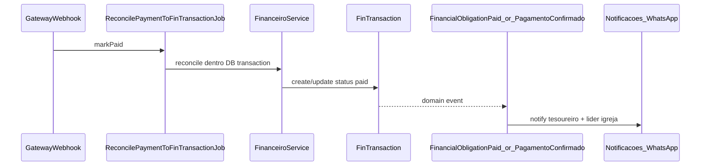

# Plano de refatoração — Módulo Financeiro (Tesouraria JUBAF)

## Estado atual (baseline)

- **Rotas diretoria:** [Modules/Financeiro/routes/diretoria.php](Modules/Financeiro/routes/diretoria.php) — prefixo `diretoria.financeiro.*` (incluído por [routes/diretoria.php](routes/diretoria.php)).
- **Modelos:** `FinCategory` ([`fin_categories`](Modules/Financeiro/app/Models/FinCategory.php)), `FinTransaction` ([`fin_transactions`](Modules/Financeiro/app/Models/FinTransaction.php)), `FinObligation`, `FinExpenseRequest`; FK para **atas** já prevista como `secretaria_minute_id` → `secretaria_minutes` (migração [database/migrations/2026_04_15_120000_fin_obligations_and_fin_transactions_minute.php](database/migrations/2026_04_15_120000_fin_obligations_and_fin_transactions_minute.php)).
- **Gateway:** [Modules/Gateway/app/Jobs/ReconcilePaymentToFinTransactionJob.php](Modules/Gateway/app/Jobs/ReconcilePaymentToFinTransactionJob.php) cria `FinTransaction` com `source = gateway`, reconcilia `FinObligation` e dispara `FinancialObligationPaid`; notificação in-app básica em `Notificacao` (não WhatsApp dedicado).
- **Cotas:** [Modules/Financeiro/app/Services/FinObligationGenerator.php](Modules/Financeiro/app/Services/FinObligationGenerator.php) + comando [GenerateFinancialObligationsCommand.php](Modules/Financeiro/app/Console/Commands/GenerateFinancialObligationsCommand.php) — ciclo **anual** por `assoc_start_year`, igrejas `is_active = true`.
- **RBAC:** [database/seeders/RolesPermissionsSeeder.php](database/seeders/RolesPermissionsSeeder.php) já define permissões `financeiro.*`, mas **`presidente` recebe quase todas as permissões** (incluindo edição financeira), o que **contradiz** o requisito “view only”. **`lider` não tem nenhuma permissão financeira**; **`pastor`** herda todos os `.view` — demasiado amplo para “só Minhas Contas”.
- **Lacuna crítica:** não há migrações no repositório que criem `fin_transactions` / `fin_categories` / `fin_expense_requests`; apenas extensões. Para `migrate:fresh` e consistência, é necessário **baseline DDL** no módulo ou em `database/migrations`.

**Nomenclatura:** o domínio pedido (`contas_bancarias`, `plano_de_contas`, `transacoes`) mapeia para **`fin_bank_accounts`** (ou `fin_contas_bancarias`), **`fin_categories`** (plano), **`fin_transactions`** (lançamentos), mantendo o prefixo `fin_` e consistência com Gateway e código existente. O campo **`ata_id`** corresponde a **`secretaria_minute_id`** (já alinhado ao Secretaria).

---

## 1. Camada de dados (migrations + modelos)

### 1.1 Baseline e novas tabelas

- Criar migração(ões) idempotentes (`Schema::hasTable` / `hasColumn`) que:
    - **`fin_categories` (plano hierárquico):** acrescentar `parent_id` (self-FK nullable), índice; manter `group_key`, `direction`, `code`, flags. Opcional: `depth` ou resolver hierarquia só por `parent_id`.
    - **`fin_bank_accounts` (`contas_bancarias` conceitual):** `id`, `name`, `institution`, `account_type` (enum: corrente/poupanca), `currency`, `balance` (decimal, default 0), `is_active`, `sort_order`, `timestamps`. Relacionamento: muitas transações → uma conta (opcional: uma conta “principal” regional).
    - **`fin_transactions` (lançamentos):**
        - `uuid` (unique, para trazabilidade externa);
        - `bank_account_id` (nullable FK `fin_bank_accounts`);
        - `due_on` (data vencimento), `paid_on` (data pagamento; pode espelhar `occurred_on` quando pago);
        - `status` (`pending`, `paid`, `overdue` — calcular `overdue` por comando/job ou ao guardar);
        - `comprovante_path` (string nullable; disco `private` ou `s3` conforme app);
        - `reconciled` ou `locked` (bool) — para política de delete/update; transações **gateway** continuam bloqueadas como hoje;
        - flag ou convenção para **despesa extraordinária** (ver §2).
    - Índices compostos para extrato: `occurred_on`, `status`, `church_id`, `category_id`, `bank_account_id`.

### 1.2 Compatibilidade com dados legados

- Migrações `after` para preencher `uuid` em linhas antigas, `status = paid` onde `occurred_on` já existir e não houver pendência, e `bank_account_id` default para conta principal se existir.

### 1.3 Modelos Eloquent

- Novo modelo **`FinBankAccount`** (tabela `fin_bank_accounts`).
- Ajustar **`FinCategory`**, **`FinTransaction`**: `fillable`, `casts`, relações `parent()` / `children()`, `bankAccount()`, scopes (`pending`, `overdue`).
- Manter **`secretariaMinute()`**; documentar que é o vínculo **ata digital**.

---

## 2. Lógica de negócio: `FinanceiroService` + regras de auditoria

- Introduzir **`Modules\Financeiro\App\Services\FinanceiroService`** (ou nome já existente se preferir namespace único) com métodos explícitos, por exemplo:
    - `createTransaction`, `updateTransaction`, `deleteTransaction`, `markPaid`, `attachReceipt`;
    - **todas** as operações que alterem `fin_transactions.amount` ou `fin_bank_accounts.balance` envolvem **`DB::transaction()`**.
- **Atualização de saldo:** ao confirmar pagamento (manual ou integrada), incrementar/decrementar `balance` na conta conforme `direction` in/out; em reversão/delete, operação inversa **somente se** `!$tx->reconciled` e política permitir.
- **Despesa extraordinária:** definir critério único (recomendado):
    - categoria com flag `requires_minute_and_receipt` **ou** `group_key` / `code` em lista de config ([config](Modules/Financeiro/config/config.php)) + `direction = out`;
    - validação em **Form Request** + método no service: se extraordinária → `comprovante` obrigatório + `secretaria_minute_id` obrigatório (FK real).
- **Status `overdue`:** job diário leve (`Schedule`) ou `scopeOverdue` que marca `pending` com `due_on < today` como `overdue` (evitar lógica só na UI).

### 2.1 Cotas mensais — `GerarCotasAssociativasJob`

- **Decisão de produto (implícita no pedido):** “faturas mensais” para as igrejas ativas. O modelo atual é **anual** (`fin_obligations` + ano associativo). O plano técnico recomendado:
    - **Opção A (recomendada):** nova entidade **`fin_quota_invoices`** (ou campos em `fin_obligations`: `billing_month` YYYY-MM) com uma linha por igreja por mês, valor configurável, `status` pending/paid, FK opcional para `FinTransaction` quando pago via Gateway (similar ao fluxo atual com `fin_obligation_id` no payload, estendido para `fin_quota_invoice_id`).
    - **Opção B:** manter apenas obrigação anual e job mensal que **só notifica** (sem nova fatura) — **não** cumpre “emitir faturas mensalmente”.

**Implementação:** `GerarCotasAssociativasJob` mensal (`ShouldQueue`), idempotente (unique por `church_id` + `billing_month`), reutilizando `Church::where('is_active', true)` como [FinObligationGenerator](Modules/Financeiro/app/Services/FinObligationGenerator.php). Registrar em [Modules/Financeiro/app/Providers/FinanceiroServiceProvider.php](Modules/Financeiro/app/Providers/FinanceiroServiceProvider.php) ou `App\Console\Kernel` / `routes/console.php` conforme Laravel 12+.

- Manter o comando anual existente para **compatibilidade** ou fundir numa única estratégia após a decisão de negócio.

---

## 3. RBAC (Spatie) e policies

### 3.1 Novas permissões (exemplos)

- `financeiro.minhas_contas.view` — líder/pastor: só a própria congregação (via `ErpChurchScope` / vínculo usuário–igreja).
- Opcional granular: `financeiro.transactions.reconcile` se separar operação de tesoureiro.

### 3.2 Ajuste em [RolesPermissionsSeeder.php](database/seeders/RolesPermissionsSeeder.php)

- **`tesoureiro-1` / `tesoureiro-2` / `super-admin`:** manter operações completas de tesouraria; **delete** condicionado no modelo (policy) a **não reconciliado** e não gateway.
- **`presidente` / `vice-presidente-1` / `vice-presidente-2`:** **remover** `financeiro.transactions.{create,edit,delete}`, `financeiro.categories.manage`, `financeiro.obligations.manage`, `financeiro.expense_requests.{create,edit,delete,approve,pay}` — manter apenas `financeiro.dashboard.view`, `financeiro.transactions.view`, `financeiro.reports.view`, `financeiro.categories.view`, `financeiro.obligations.view`, `financeiro.expense_requests.view` (alinhado ao “read-only executivo”).
- **`lider`:** adicionar `financeiro.minhas_contas.view` (e **não** `financeiro.dashboard.view` da diretoria, se o desejado é isolamento total).
- **`pastor`:** substituir o padrão “todos os `.view`” por conjunto explícito **ou** remover permissões `financeiro.*` do filtro genérico e atribuir só `financeiro.minhas_contas.view` + views já necessárias ao pastor.

### 3.3 Policies

- Estender **`FinTransactionPolicy`**: `delete`/`update` negados se `reconciled` ou `isFromGateway()`; `create`/`update` exigem permissões adequadas.
- Nova policy ou métodos para **conta bancária** e **categorias** (quem pode gerir plano).
- **Controller de “Minhas Contas”:** autorizar por `financeiro.minhas_contas.view` + scope de igreja (reutilizar padrões de [ErpChurchScope](app/Support/ErpChurchScope.php) já usados em [TransactionController](Modules/Financeiro/app/Http/Controllers/Diretoria/TransactionController.php)).

---

## 4. UI/UX (Blade, Tailwind v4, Flowbite v4.1)

- **Dashboard executivo** ([resources/views/paineldiretoria/dashboard.blade.php](Modules/Financeiro/resources/views/paineldiretoria/dashboard.blade.php)): adicionar gráficos (barras receitas vs despesas mensais, pizza despesas por `group_key`/`category`), KPIs (saldo atual = soma `fin_bank_accounts.balance` ou saldo consolidado definido, inadimplência do mês a partir de `fin_quota_invoices` ou obrigações pendentes). Usar **Flowbite** + **Chart.js** ou **ApexCharts** (escolher uma e alinhar ao bundle do módulo/Vite).
- **Extrato:** evoluir [transactions/index](Modules/Financeiro/resources/views/paineldiretoria/transactions/index.blade.php) com filtros (período, status, igreja, categoria), DataTable (padrão já usado no projeto), exportação PDF existente em [ReportController](Modules/Financeiro/app/Http/Controllers/Diretoria/ReportController.php) / [balancete_pdf.blade.php](Modules/Financeiro/resources/views/reports/balancete_pdf.blade.php) — alinhar colunas ao novo modelo (UUID, vencimento, conta, comprovante).
- **Formulários:** upload de comprovante (campo file, storage seguro), seleção de ata (lista `Minute` autorizada), indicadores visuais para pendências e atrasadas.
- **Painel líder/pastor — “Minhas Contas JUBAF”:** novo controller + views em `financeiro::painellider/` (ou `painel-lider`), registrar rotas:
    - Incluir `require module_path('Financeiro', 'routes/painel-lider.php')` em [routes/lideres.php](routes/lideres.php) (middleware `role:lider` + permissão) e equivalente em [routes/pastor.php](routes/pastor.php) para pastor.
    - Mostrar adimplência por igreja, links para pagamento Gateway (rotas existentes do módulo Gateway / checkout com `fin_obligation_id` ou novo `fin_quota_invoice_id`).

Seguir [`.cursor/skills/jubaf-module-icons/SKILL.md`](.cursor/skills/jubaf-module-icons/SKILL.md) para ícones de módulo; para classes Tailwind, [`.cursor/skills/tailwindcss-development/SKILL.md`](.cursor/skills/tailwindcss-development/SKILL.md).

---

## 5. Eventos e integração

- **Evento:** introduzir `PagamentoConfirmado` (payload: `FinTransaction`, `GatewayPayment`, igreja opcional) **ou** estender `FinancialObligationPaid` com dados suficientes; **não duplicar** lógica entre listeners.
- **Listener:** notificar `Notificacoes` (canal WhatsApp se existir no módulo — investigar API interna de [Modules/Notificacoes](Modules/Notificacoes)); destinatários: usuários com role `tesoureiro-*` e líder(es) da `church_id` pagadora.
- Atualizar [docs/erp-events-catalog.md](docs/erp-events-catalog.md).

---

## 6. Testes e qualidade

- Feature tests: criação de transação com atualização de saldo; bloqueio de despesa extraordinária sem comprovante/ata; policy de delete; job mensal idempotente.
- Aplicar práticas [`.cursor/skills/laravel-best-practices/SKILL.md`](.cursor/skills/laravel-best-practices/SKILL.md) em queries (evitar N+1 nos relatórios), validação e transações.

---

## Riscos e decisões a fechar antes da implementação

1. **Cotas:** confirmação se “mensal” implica **nova tabela de faturas mensais** (recomendado) ou apenas lembretes sobre obrigação anual.
2. **Contas bancárias:** uma conta regional única vs múltiplas — impacta saldo e extrato.
3. **WhatsApp:** confirmar API disponível no módulo Notificações (template, opt-in).

---

## Ordem de implementação sugerida

1. Migrações + modelos + seed mínimo de categorias/conta.
2. `FinanceiroService` + refatorar `TransactionController` / `ExpenseRequestController` para usar o service onde houver escrita e saldo.
3. Validações de despesa extraordinária + upload.
4. RBAC (seeder + policies) + correção presidente/vice.
5. UI dashboard + extrato + upload.
6. `GerarCotasAssociativasJob` + schedule + integração Gateway para novos IDs se necessário.
7. Eventos + notificações multi-perfil.
8. Painel líder/pastor “Minhas Contas” + links Gateway.
