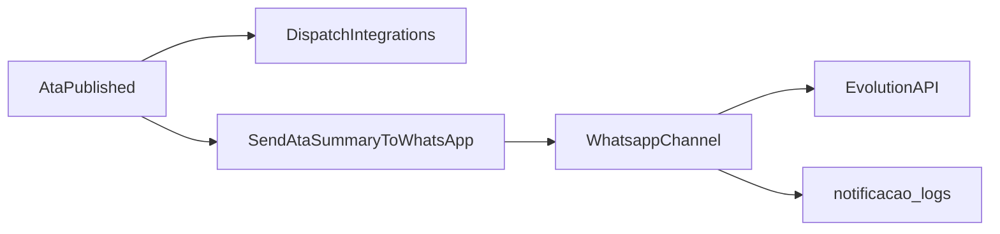

# Plano: Secretaria (GED + assinaturas) e Notificacoes (Evolution API)

## Estado actual (baseline)

- **Atas:** [`Modules/Secretaria/app/Models/Minute.php`](Modules/Secretaria/app/Models/Minute.php) usa `secretaria_minutes` com `body`, `status` (`draft`, `pending_approval`, `approved`, `published`, `archived`), `content_checksum`, DomPDF em [`MinuteController::pdf`](Modules/Secretaria/app/Http/Controllers/Diretoria/MinuteController.php). Editor Quill já existe em [`minutes/_form.blade.php`](Modules/Secretaria/resources/views/paineldiretoria/minutes/_form.blade.php).
- **Evento:** [`MinutePublished`](Modules/Secretaria/app/Events/MinutePublished.php) + [`DispatchMinutePublishedIntegrations`](Modules/Secretaria/app/Listeners/DispatchMinutePublishedIntegrations.php) → [`SecretariaNotificationDispatcher::minutePublished`](Modules/Secretaria/app/Services/SecretariaNotificationDispatcher.php) (notificações in-app na tabela `notifications`).
- **GED:** [`SecretariaDocument`](Modules/Secretaria/app/Models/SecretariaDocument.php) em `secretaria_documents` com `visibility`, `church_id`, `path`.
- **RBAC:** Permissões `secretaria.*` e roles em [`database/seeders/RolesPermissionsSeeder.php`](database/seeders/RolesPermissionsSeeder.php); `presidente` tem quase tudo; `secretario-*` sem `approve`/`publish` explícitos no filtro actual; `pastor`/`lider` com `secretaria.minutes.view` entre outras.
- **Igrejas activas:** [`Church::CRM_ATIVA`](Modules/Igrejas/app/Models/Church.php) e [`ChurchRepository`](Modules/Igrejas/app/Repositories/ChurchRepository.php) (não existe classe `IgrejaRepository`; o plano usa este repositório ou um alias fino `IgrejaRepository` que delega, para bater com o vocabulário do domínio).

Decisão confirmada: **substituir** o fluxo antigo — migrar dados e remover `pending_approval` / `approved` do código activo.

---

## 1. Data layer (migrations)

**Ficheiros sugeridos** (em `database/migrations/` para consistência com [`2026_04_14_100001_secretaria_minutes_erp_governance_fields.php`](database/migrations/2026_04_14_100001_secretaria_minutes_erp_governance_fields.php)):

### 1.1 `secretaria_minutes`

- Adicionar: `uuid` (char 36, único), `meeting_date` (date, nullable — preencher a partir de `secretaria_meetings.starts_at` quando existir `meeting_id`), `content` (longtext, nullable).
- **Backfill:** `UPDATE content = body` onde `content` é null; manter `body` temporariamente com _accessor_ no model que delega para `content` se vazio, depois remover coluna `body` numa migration posterior opcional para reduzir risco em PR única.
- Estados: normalizar para `draft` | `pending_signatures` | `published` (manter `archived` se ainda fizer sentido legal).
    - `pending_approval` / `approved` → `pending_signatures` (ou `draft` se não houver conteúdo mínimo — regra na migration).
- Adicionar: `document_hash` (string 64, nullable) — hash final pós-assinaturas; alinhar ou deprecar `content_checksum` (evitar duplicação: usar só `document_hash` para integridade publicada e remover `content_checksum` após backfill se redundante).
- Adicionar: `pdf_path` (string, nullable) — caminho no disco (ex.: `local` ou `public` conforme política de download).
- Índices: `uuid`, `status`, `meeting_date`.

### 1.2 `secretaria_minute_signatures` (nova)

- `id`, `minute_id` (FK `secretaria_minutes`), `user_id`, `role_at_the_time` (string), `ip_address` (nullable), `user_agent` (text, nullable), `signed_at` (timestamp), `unique(minute_id, user_id)` para idempotência.

### 1.3 GED — `secretaria_ged_documents`

- Opção limpa alinhada ao pedido: **criar** `secretaria_ged_documents` com `title`, `category` (enum/string: Estatuto, Ofício, Circular, Outros), `file_path`, `igreja_id` nullable FK `igrejas_churches`, `is_public` (boolean), `uploaded_by_id`, timestamps; migrar linhas de `secretaria_documents` → nova tabela; actualizar model [`SecretariaDocument`](Modules/Secretaria/app/Models/SecretariaDocument.php) (`$table = 'secretaria_ged_documents'`) e referências em [`HasDocumentos`](Modules/Igrejas/app/Models/Concerns/HasDocumentos.php) / controladores.
- Mapear `visibility` legada → `is_public` + regras de policy (documentar no código de migração).

### 1.4 `notificacao_logs` (módulo Notificacoes)

- Nova migration em [`Modules/Notificacoes/database/migrations`](Modules/Notificacoes) (o provider já faz [`loadMigrationsFrom`](Modules/Notificacoes/app/Providers/NotificacoesServiceProvider.php)): `user_id` nullable, `channel` (`whatsapp`/`database`), `message` (text), `status` (`sent`/`failed`), `response_payload` (json, nullable), timestamps.
- Model `NotificacaoLog` com casts.

---

## 2. Domínio e serviços

### 2.1 `AtaWorkflowService` (novo)

- **Transição para `pending_signatures`:** validar conteúdo mínimo; bloquear edição de texto (ver policies).
- **Assinatura:** método `sign(Minute $minute, User $user, string $password, Request $request)`:
    - `Hash::check` contra password actual.
    - Registar `MinuteSignature` com IP/`user_agent` (de `Request`).
    - Recalcular candidato a `document_hash` = `hash('sha256', canonical_json(content, ordered_signer_user_ids, minute_id, meeting_date))` — especificar formato canónico num único sítio (ex. classe `MinuteIntegrityHasher`).
- **Conclusão:** quando todos os signatários obrigatórios assinaram (lista configurável, ex. [`config/secretaria.php`](Modules/Secretaria/config/config.php) `required_minute_signers` com roles `presidente`, `secretario-1`):
    - `status = published`, `published_at = now()`, `locked_at` coerente.
    - Disparar **`AtaPublished`** (ver §3).

### 2.2 `PdfGenerationService` (novo)

- Extrair geração de [`MinuteController::pdf`](Modules/Secretaria/app/Http/Controllers/Diretoria/MinuteController.php): Blade principal + **página final** com tabela/lista de assinaturas (nome, papel, data, IP mascarado opcional).
- Persistir ficheiro em `Storage`, gravar `pdf_path` no minuto.
- Manter rota de download a servir o ficheiro guardado (e regenerar só se flag/config permitir).

### 2.3 Repositório de destinatários WhatsApp

- Método no `ChurchRepository` ou serviço dedicado `AtaWhatsAppAudienceResolver`: utilizadores com roles `pastor` ou `lider` **e** com vínculo a pelo menos uma [`Church`](Modules/Igrejas/app/Models/Church.php) com `crm_status = CRM_ATIVA` e `is_active = true` (via `church_id` + `user_churches` como em [`User::affiliatedChurchIds`](app/Models/User.php)).
- Deduplicar por `user_id`.

---

## 3. Eventos e notificações

### 3.1 Renomear `MinutePublished` → `AtaPublished`

- Criar classe `AtaPublished` com o mesmo payload (`Minute $minute`, `User $publisher`).
- Remover ou manter `MinutePublished` como alias `class_alias` **temporário** só se houver referências externas; caso contrário, substituir todas as referências (incl. [`docs/erp-events-catalog.md`](docs/erp-events-catalog.md)).

### 3.2 Listeners

- **`DispatchMinutePublishedIntegrations`** → renomear para refletir `AtaPublished`; manter chamadas a `SecretariaNotificationDispatcher` e `SecretariaIntegrationBus`.
- **Novo `SendAtaSummaryToWhatsApp`** (módulo Notificacoes ou Secretaria conforme dependências):
    - Resolve audiência (§2.3).
    - Envia [`Notification`](https://laravel.com/docs/notifications) que implementa `ShouldQueue` e usa canal `whatsapp`.
    - Corpo: título/resumo (`executive_summary` ou `Str::limit` do conteúdo) + URL absoluta do PDF (rota nomeada existente ou nova para ficheiro público/autenticado com token — decidir: **link assinado temporário** vs login; recomendação: URL do painel + atalho, ou rota `storage` com policy `downloadPdf`).

### 3.3 `WhatsappChannel` (Notificacoes)

- Implementar [`Illuminate\Notifications\Channels\Channel`](https://laravel.com/docs/notifications#custom-channels) ou `via()` + classe em `Modules/Notificacoes/App/Notifications/Channels/WhatsappChannel.php`.
- Ler `config('notificacoes.evolution.url')` e `key` mapeados de `EVOLUTION_API_URL` e `EVOLUTION_API_KEY` em [`.env.example`](.env.example) e [`Modules/Notificacoes/config/config.php`](Modules/Notificacoes/config/config.php).
- Cliente HTTP (`Http::timeout(...)`): payload JSON alinhado à API Evolution (endpoint típico `message/sendText` / instância — **confirmar versão** da Evolution API em uso no projecto; parametrizar `instance`/`number` se necessário).
- **Fila:** notificação com `ShouldQueue`; o canal só regista sucesso/falha em `notificacao_logs`.
- Registo: em `NotificacoesServiceProvider::boot`, `Notification::extend('whatsapp', ...)` ou documentar uso de `via ['whatsapp']` com [custom channel registration](https://laravel.com/docs/notifications#custom-channels).

### 3.4 `User` e telefone

- Usar campo existente `phone` em [`User`](app/Models/User.php); normalizar para E.164 (helper) e ignorar utilizadores sem número válido (log `failed` com motivo).

---

## 4. RBAC (Spatie) e policies

- **Novas permissões** (seed em [`RolesPermissionsSeeder`](database/seeders/RolesPermissionsSeeder.php)): por exemplo `secretaria.minutes.request_signatures`, `secretaria.minutes.sign`, ajustar `secretaria.documents.*` para GED se necessário.
- **`secretario-1` / `secretario-2`:** criar/editar `draft`, solicitar assinaturas, GED completo (alinhado ao que já têm, mais permissões de assinatura se forem signatários obrigatórios).
- **`presidente`:** `view` rascunhos onde a policy permitir; `secretaria.minutes.sign`.
- **`lider` / `pastor`:** apenas `view` atas `published` e documentos GED `is_public` (ajustar [`MinutePolicy`](Modules/Secretaria/app/Policies/MinutePolicy.php) e [`SecretariaDocumentPolicy`](Modules/Secretaria/app/Policies/SecretariaDocumentPolicy.php) para negar `pending_signatures`/`draft` a estes roles mesmo com `secretaria.minutes.view` genérico — pode exigir permissão mais granular `secretaria.minutes.view_draft` só para secretaria/presidente).

---

## 5. UI/UX (Blade, Tailwind, Flowbite)

- **Editor:** reforçar o padrão “folha digital” (container `max-w-*`, sombra, fundo branco) em [`minutes/create|edit`](Modules/Secretaria/resources/views/paineldiretoria/minutes/) — já há Quill; validar integração com campo `content`.
- **Detalhe da ata:** timeline/stepper Flowbite em [`minutes/show.blade.php`](Modules/Secretaria/resources/views/paineldiretoria/minutes/show.blade.php): passos “Rascunho → Assinaturas → Publicada” + lista de signatários obrigatórios e estado.
- **Form de assinatura:** modal ou card com campo password + CSRF; POST para nova rota `sign` no [`MinuteController`](Modules/Secretaria/app/Http/Controllers/Diretoria/MinuteController.php) (e espelho operacional se aplicável).
- **GED:** [`documents/index`](Modules/Secretaria/resources/views/paineldiretoria/documents/index.blade.php) — grelha de cards ou tabela com ícones por MIME/extensão, filtros rápidos (categoria, pesquisa, igreja).

---

## 6. Fluxo resumido

---

## 7. Ficheiros principais a tocar

| Área         | Ficheiros                                                                                                        |
| ------------ | ---------------------------------------------------------------------------------------------------------------- |
| Migrations   | `database/migrations/*secretaria*`, `Modules/Notificacoes/database/migrations/*notificacao_logs*`                |
| Models       | `Minute`, novo `MinuteSignature`, `SecretariaDocument` / GED, `NotificacaoLog`                                   |
| Services     | `AtaWorkflowService`, `PdfGenerationService`, `MinuteIntegrityHasher`                                            |
| HTTP         | `MinuteController` (+ rotas [`diretoria.php`](Modules/Secretaria/routes/diretoria.php)), Form Requests para sign |
| Policies     | `MinutePolicy`, `SecretariaDocumentPolicy`                                                                       |
| Notificacoes | `WhatsappChannel`, notificação `AtaPublishedWhatsAppNotification`, `SendAtaSummaryToWhatsApp`, config Evolution  |
| Docs         | [`docs/erp-events-catalog.md`](docs/erp-events-catalog.md)                                                       |

---

## 8. Riscos e mitigação

- **Financeiro:** FK `fin_transactions.secretaria_minute_id` — apenas mudança de estados/ colunas; não remover `secretaria_minutes.id`.
- **Evolution API:** variar por versão; encapsular endpoint no config e testar com payload real.
- **Segurança:** assinatura com password + rate limiting na rota `sign`; nunca logar password.

---

## Ordem de implementação sugerida

1. Migrations + models + backfill de estados/campos.
2. `AtaWorkflowService` + policies + rotas/controller (substituir submit/approve/publish pelo novo fluxo ou mapear botões UI).
3. `PdfGenerationService` + `pdf_path`.
4. Renomear evento para `AtaPublished` e actualizar listeners existentes.
5. `WhatsappChannel` + `notificacao_logs` + `SendAtaSummaryToWhatsApp`.
6. Views (timeline, GED, estilização “folha”).
7. Seeder de permissões + testes de feature mínimos (assinatura, publicação, canal mock HTTP).
