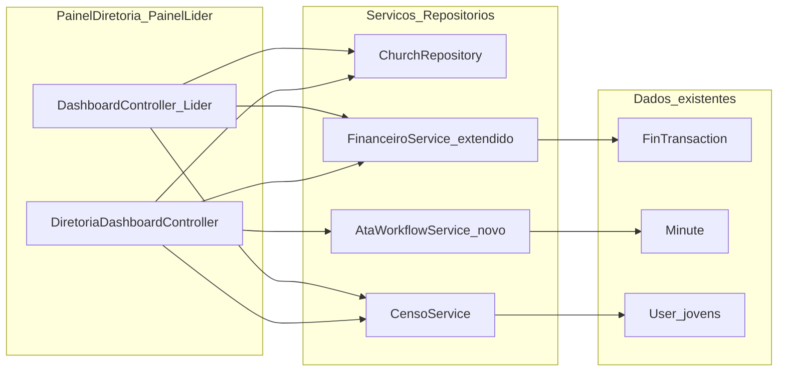

# Plano: Torres de controlo — Painel Diretoria e Painel Líder

## Estado atual (relevante)

- **Diretoria:** [`DiretoriaDashboardController`](Modules/PainelDiretoria/app/Http/Controllers/DiretoriaDashboardController.php) monta `quickStats` com consultas diretas a modelos (incl. `FinTransaction` **sem** `ErpChurchScope`), o que **não** alinha vice-presidentes ao setor. Layout já existe: [`paineldiretoria::components.layouts.app`](Modules/PainelDiretoria/resources/views/components/layouts/app.blade.php) + sidebar.
- **Líder:** [`DashboardController`](Modules/PainelLider/app/Http/Controllers/DashboardController.php) é mínimo (contagem de jovens). Já existem rotas úteis: [`routes/lideres.php`](routes/lideres.php) (financeiro `MinhasContas`, talentos validação, etc.).
- **Serviços pedidos vs código:**
    - [`ChurchRepository`](Modules/Igrejas/app/Repositories/ChurchRepository.php): `statsForUser`, `growthStatsForUser`, `paginateForUser` — já aplica escopo setorial.
    - [`CensoService`](Modules/PainelJovens/app/Services/CensoService.php): `youthSummaryBySector()` — base para “Top 5 setores”; falta filtro explícito para VP (um setor).
    - [`FinanceiroService`](Modules/Financeiro/app/Services/FinanceiroService.php): hoje **só** operações de escrita/ledger; **não** expõe KPIs. Métricas mensais existentes estão em [`FinanceiroDashboardController`](Modules/Financeiro/app/Http/Controllers/Diretoria/FinanceiroDashboardController.php) com `ErpChurchScope::applyToFinTransactionQuery`.
    - **`AtaWorkflowService`:** **não existe.** O equivalente funcional é Secretaria: atas `pending_approval` + [`ErpChurchScope::applyToSecretariaMinuteQuery`](app/Support/ErpChurchScope.php) (ver [`SecretariaDashboardController`](Modules/Secretaria/app/Http/Controllers/Diretoria/SecretariaDashboardController.php)).

## 1. Integração e regras de negócio

### 1.1 Diretoria — KPIs globais (e setoriais para VP)

| KPI                                | Implementação proposta                                                                                                                                                                                                                                                                                                                                                                                                                                                                                                                             |
| ---------------------------------- | -------------------------------------------------------------------------------------------------------------------------------------------------------------------------------------------------------------------------------------------------------------------------------------------------------------------------------------------------------------------------------------------------------------------------------------------------------------------------------------------------------------------------------------------------- |
| Receita do mês vs despesa          | Novos métodos de **leitura** em `FinanceiroService` (ou classe dedicada `FinanceiroDashboardMetrics` no módulo Financeiro se quiserem manter `FinanceiroService` fino) que repliquem a lógica de somas do mês usando `FinTransaction::query()` + **`ErpChurchScope::applyToFinTransactionQuery($q, $user)`**. Incluir série diária (ex.: últimos 30 dias ou dias do mês) para sparkline.                                                                                                                                                           |
| Top 5 setores com mais jovens      | A partir de `CensoService::youthSummaryBySector()`, **excluir** a linha agregada “Geral”, ordenar por `youth_count`, `array_slice(..., 5)`. Para VP (`User::restrictsChurchDirectoryToSector()`), filtrar à entrada à **única** linha cujo `sector_id === $user->jubaf_sector_id` (ou só esse setor no ranking).                                                                                                                                                                                                                                   |
| Atas aguardando “minha assinatura” | No modelo atual, mapear para **atas em `pending_approval`** que o executivo pode aprovar (fluxo já usado na Secretaria). Criar **`AtaWorkflowService`** com `pendingMinutesForUser(User $user): Collection` e `pendingMinutesCount(User $user): int` aplicando **`ErpChurchScope::applyToSecretariaMinuteQuery`** + filtro `status = pending_approval` + respeitar `MinutePolicy`/permissão `secretaria.minutes.view` no controller. Texto na UI: “Atas pendentes de aprovação” (ou manter “assinatura” como linguagem institucional se desejado). |

**Ficheiros principais:** estender [`FinanceiroService`](Modules/Financeiro/app/Services/FinanceiroService.php) (ou extrair trait partilhado usado pelo dashboard financeiro e pelo novo painel), estender [`CensoService`](Modules/PainelJovens/app/Services/CensoService.php) com método tipo `topSectorsByYouthCount(User $user, int $limit = 5)`, novo [`AtaWorkflowService`](Modules/Secretaria/app/Services/AtaWorkflowService.php) registado em [`SecretariaServiceProvider`](Modules/Secretaria/app/Providers/SecretariaServiceProvider.php).

### 1.2 Líder — KPIs locais

| KPI                             | Implementação proposta                                                                                                                                                                                                                                                                                                                                                   |
| ------------------------------- | ------------------------------------------------------------------------------------------------------------------------------------------------------------------------------------------------------------------------------------------------------------------------------------------------------------------------------------------------------------------------ |
| Status financeiro com a JUBAF   | Reutilizar padrão de [`MinhasContasController`](Modules/Financeiro/app/Http/Controllers/PainelLider/MinhasContasController.php): `affiliatedChurchIds()`, últimas `FinObligation` / `FinQuotaInvoice` ou resumo (em atraso vs em dia) calculado no serviço para não duplicar queries na view.                                                                            |
| Talentos pendentes de validação | Contagem + pré-lista: mesma regra que [`TalentSkillValidationController@index`](Modules/Talentos/app/Http/Controllers/PainelLider/TalentSkillValidationController.php) (`whereNull validated_at` em `talent_profile_skill`), limitada para o dashboard.                                                                                                                  |
| Próximos eventos regionais      | `CalendarEvent::query()` publicados, `starts_at >= now()`, visibilidade adequada (`VIS_LIDERES` / público conforme [`CalendarEvent`](Modules/Calendario/app/Models/CalendarEvent.php)), opcionalmente filtrar por `church_id`/`jubaf_sector` da igreja do líder se o modelo e políticas permitirem — validar no código existente de listagem do calendário para líderes. |

### 1.3 Controlo de acesso (Spatie / Gates)

- **Sidebar e CTAs:** construir arrays de itens de navegação no PHP com `Route::has` + `@can` / `auth()->user()->can(...)` por item (padrão já presente em [`paineldiretoria::dashboard`](Modules/PainelDiretoria/resources/views/dashboard.blade.php)).
- **Exemplo explícito:** ocultar atalhos de aprovação financeira se não existir `financeiro.expense_requests.approve` (ou a permissão real usada no seeder) — alinhar com [`database/seeders/RolesPermissionsSeeder.php`](database/seeders/RolesPermissionsSeeder.php) e políticas do Financeiro.

## 2. UI/UX (Tailwind v4.2 + Flowbite + dark mode)

- **Layout:** Evoluir [`sidebar.blade.php`](Modules/PainelDiretoria/resources/views/components/layouts/sidebar.blade.php) / estrutura do layout da diretoria para padrão **Flowbite** (navbar superior + sidebar fixo), mantendo a inicialização de tema já presente no layout (evitar FOUC).
- **Painel Líder:** Harmonizar com o mesmo sistema de tema (`dark` no `<html>`) e componentes Flowbite onde fizer sentido, sem quebrar o visual atual de forma desordenada — ajustar [`painellider::components.layouts.app`](Modules/PainelLider/resources/views/components/layouts/app.blade.php) e [`navbar.blade.php`](Modules/PainelLider/resources/views/components/layouts/navbar.blade.php) de forma incremental.
- **Stat cards + sparklines:** O projeto **não** tem ApexCharts; tem **Chart.js** em [`package.json`](package.json). **Decisão:** adicionar **`apexcharts`** (pedido explicitamente) e um entry Vite pequeno (ex.: `resources/js/painel-charts.js`) inicializado só nas páginas de dashboard para não inflacionar o bundle global.
- **Tabelas:** Não há DataTables no repo. Adicionar dependência (ex. `datatables.net-dt` + tema compatível com Tailwind) **ou** usar tabela responsiva Flowbite + pesquisa mínima Alpine na primeira iteração. O plano recomenda **DataTables** como pedido, com wrapper Blade reutilizável.

## 3. View Composers (opcional mas útil)

- Registrar em [`PainelDiretoriaServiceProvider`](Modules/PainelDiretoria/app/Providers/PainelDiretoriaServiceProvider.php) um **View Composer** para `paineldiretoria::components.layouts.*` (ou só `app`) que partilhe **`diretoriaNavSections`** (itens com `permission`, `route`, `label`, `icon`) — reduz duplicação entre dashboard e futuras vistas.
- Para Líder, equivalente opcional em [`PainelLiderServiceProvider`](Modules/PainelLider/app/Providers/PainelLiderServiceProvider.php).

## 4. Entregáveis por ficheiro (resumo)

| Área                           | Acção                                                                                                                                                                                                                                                                                                   |
| ------------------------------ | ------------------------------------------------------------------------------------------------------------------------------------------------------------------------------------------------------------------------------------------------------------------------------------------------------- |
| `Modules/PainelDiretoria`      | Refatorar `DiretoriaDashboardController` (ou renomear para `PainelDiretoriaController` se quiserem nomenclatura única) para injetar serviços e passar DTOs/views; reescrever [`dashboard.blade.php`](Modules/PainelDiretoria/resources/views/dashboard.blade.php) com grids de KPI, tabelas e gráficos. |
| `Modules/PainelLider`          | Expandir `DashboardController` + [`dashboard.blade.php`](Modules/PainelLider/resources/views/dashboard.blade.php).                                                                                                                                                                                      |
| `Modules/Financeiro`           | Métodos de leitura agregadores + uso de `ErpChurchScope` em todas as queries do painel diretoria.                                                                                                                                                                                                       |
| `Modules/PainelJovens`         | Método auxiliar em `CensoService` para top setores com filtro VP.                                                                                                                                                                                                                                       |
| `Modules/Secretaria`           | Novo `AtaWorkflowService` + registo no provider.                                                                                                                                                                                                                                                        |
| `package.json` / `vite.config` | ApexCharts (+ DataTables se aplicável) e entrada JS dos dashboards.                                                                                                                                                                                                                                     |

## 5. Riscos e decisões

- **“Assinatura” vs modelo de dados:** Sem tabela de assinaturas digitais, o MVP alinha-se ao fluxo **`pending_approval`**. Se no futuro existir assinatura por linha, `AtaWorkflowService` concentra a evolução.
- **Duplicação com dashboards dos módulos:** O painel agregador deve **linkar** para `diretoria.financeiro.*`, `diretoria.secretaria.*`, etc., em vez de recriar CRUD.
- **Performance:** Para séries de gráficos, preferir uma query agregada por dia (groupBy data) em vez de N queries.

## 6. Testes sugeridos

- Feature test: utilizador VP com `jubaf_sector_id` vê totais financeiros e contagens de setor **iguais** ao esperado para esse setor apenas.
- Feature test: utilizador sem `financeiro.dashboard.view` não vê bloco financeiro no dashboard (ou vê mensagem neutra).
