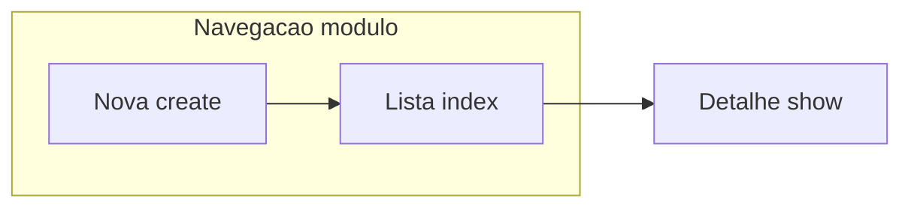

# Melhorar Painel Diretoria — Notificações

## Contexto e decisão de navegação

- Hoje as três vistas incluem `@include('paineldiretoria::partials.section-nav', ['active' => 'notificacoes'])`, que é a barra **global** da diretoria (Painel, Perfil, Carousel, Módulos, etc.).
- O pedido é o mesmo padrão de [**Talentos** `partials/subnav.blade.php\*\*](c:\laragon\www\JUBAF\Modules\Talentos\resources\views\paineldiretoria\partials\subnav.blade.php) e [**Secretaria** `partials/subnav.blade.php`](c:\laragon\www\JUBAF\Modules\Secretaria\resources\views\paineldiretoria\partials\subnav.blade.php): **apenas links para rotas do próprio módulo** (`diretoria.notificacoes.*`).
- Rotas disponíveis na diretoria ([`routes/diretoria.php`](c:\laragon\www\JUBAF\routes\diretoria.php)): `index`, `create`, `store`, `show`, `destroy`, `markAsRead`, `markAllAsRead`. O subnav cobre de forma óbvia **Lista** (`index`) e **Nova notificação** (`create`). Na página **detalhe** (`show`), o estado ativo pode seguir **Lista** (como “dentro da caixa de entrada”) para não inventar uma terceira aba vazia.

## 1. Novo partial de navegação do módulo

- Criar [`Modules/Notificacoes/resources/views/paineldiretoria/partials/subnav.blade.php`](c:\laragon\www\JUBAF\Modules\Notificacoes\resources\views\paineldiretoria\partials\subnav.blade.php) espelhando a estrutura de Talentos/Secretaria (mesmas classes base `rounded-2xl border …`, `linkActive` com cor de acento **índigo** para manter coerência com o restante das telas atuais de notificações).
- Parâmetro `@var string $active` com valores sugeridos: `lista` | `nova` | `detalhe` (opcional: tratar `detalhe` como visual “lista” para o primeiro link).
- Ícones: `x-icon` / identidade do módulo com `x-module-icon` ou `x-icon module="notificacoes"` como já em [`create.blade.php`](c:\laragon\www\JUBAF\Modules\Notificacoes\resources\views\paineldiretoria\create.blade.php) — **sem CDN**.

## 2. Atualizar as três vistas Blade

Arquivos: [`index.blade.php`](c:\laragon\www\JUBAF\Modules\Notificacoes\resources\views\paineldiretoria\index.blade.php), [`create.blade.php`](c:\laragon\www\JUBAF\Modules\Notificacoes\resources\views\paineldiretoria\create.blade.php), [`show.blade.php`](c:\laragon\www\JUBAF\Modules\Notificacoes\resources\views\paineldiretoria\show.blade.php).

- **Remover** o include do `section-nav`.
- **Incluir** `@include('notificacoes::paineldiretoria.partials.subnav', ['active' => '...'])` no topo do conteúdo (logo após abrir o wrapper `max-w-7xl`), como em [`Talentos/dashboard.blade.php`](c:\laragon\www\JUBAF\Modules\Talentos\resources\views\paineldiretoria\dashboard.blade.php).

### Index — UX/UI e fluxo

- **Hero** compacto (gradiente + título + texto curto em linguagem simples: o que é esta área e para que serve).
- **Breadcrumb** minimalista: link para `diretoria.dashboard` como “Painel” e segmento atual “Notificações” — evitar competir com o subnav.
- **Botão “Voltar”** que hoje aponta só para o dashboard: alinhar ao novo fluxo (prioridade: subnav + breadcrumb; reduzir ou reposicionar para não duplicar “sair” do módulo).
- **Cartões de resumo**: o controlador já filtra em [`NotificacoesAdminController@index`](c:\laragon\www\JUBAF\Modules\Notificacoes\app\Http\Controllers\Admin\NotificacoesAdminController.php); hoje a view só mostra “Total”. **Estender o controller** para passar contagens globais úteis (ex.: total no sistema, não lidas, lidas) com queries simples em `Notificacao` — sem alterar a lógica de filtros da listagem.
- **Filtros**: o backend já aceita `is_read`, `module_source`, etc.; a view só expõe busca e tipo. **Adicionar** selects legíveis para “Estado (lida / não lida)” e “Módulo de origem” usando `$modules` já passado ao compact.
- **Tabela**: adicionar ação **“Abrir” / “Ver detalhes”** com link para `route('diretoria.notificacoes.show', $notification->id)` (hoje não existe na linha — só marcar lida/excluir). Opcional: tornar a linha clicável com cuidado acessível (não aninhar `<form>` dentro de `<a>`).
- **Tipos** no filtro: alinhar opções ao `store` (`info`, `success`, `warning`, `error`, `alert`, `system`) para consistência.
- **Estados vazios** e mensagens: manter tom simples; opcional mensagens de `session` já tratadas pelo layout ([`app.blade.php`](c:\laragon\www\JUBAF\Modules\PainelDiretoria\resources\views\components\layouts\app.blade.php)).

### Create — formulário mais “leigo” + Alpine

- Dividir visualmente em blocos (ex.: “O que enviar”, “Quem recebe”, “Link extra”) com títulos em português claro e microtextos de ajuda.
- **Substituir** o bloco `@push('scripts')` com `DOMContentLoaded` por **`x-data` / `x-show` / `@change`** no wrapper do formulário — Alpine já é carregado globalmente em [`resources/js/app.js`](c:\laragon\www\JUBAF\resources\js\app.js).
- Manter validação server-side intacta; apenas espelhar `required` nos selects condicionais como hoje.

### Show — detalhe mais profissional

- Harmonizar cabeçalho com index/create (hero + subnav).
- **Rótulo de módulo**: na listagem já se usa `config('notificacoes.module_sources')`; em `show` alinhar o mesmo mapeamento em vez de mostrar só a chave crua quando fizer sentido.
- Bloco **JSON técnico**: para leigos, colocar atrás de `
` ou painel recolhível (Alpine ou markup nativo) com título “Detalhes técnicos (avançado)”.
- Se não lida: botão **Marcar como lida** (POST para `diretoria.notificacoes.markAsRead`) alinhado ao restante dos botões.
- Exclusão: manter `confirm` compatível com o interceptor em [`resources/js/form-helpers.js`](c:\laragon\www\JUBAF\resources\js\form-helpers.js) (`window.showConfirm`), ou usar atributos **Flowbite** (`data-modal-target` / `data-modal-toggle`) para um modal de confirmação se quisermos ir além do fluxo atual — preferir **uma** abordagem consistente com o resto do painel.

## 3. Backend mínimo (Laravel)

- Apenas em `index()`: calcular e passar `$stats` (ou campos no compact) para os cards — sem refatoração ampla do `NotificacoesAdminController`.
- Não introduzir CDN nem alterar rotas.

## 4. Stack técnica (conforme pedido)

- **Tailwind v4**: seguir utilitários e padrões já presentes em [`resources/css/app.css`](c:\laragon\www\JUBAF\resources\css\app.css) (inclui Flowbite plugin).
- **Flowbite**: usar padrões de modal/dismiss onde fizer sentido; o bundle já é importado localmente em `app.js`.
- **Alpine**: interatividade do create e possíveis painéis colapsáveis no show.
- **Ícones**: apenas componentes locais do projeto (`x-icon`, `x-module-icon`).

