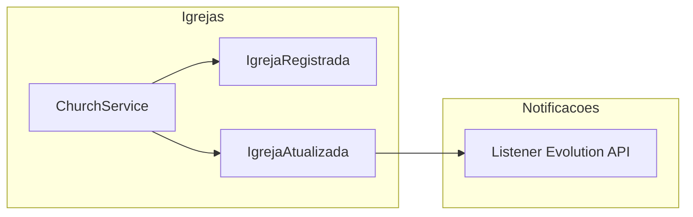

# Plano: Upgrade profundo do módulo Igrejas (ERP JUBAF)

## Estado atual (baseline)

- **Modelos:** [`Church`](Modules/Igrejas/app/Models/Church.php) (`igrejas_churches`), [`JubafSector`](Modules/Igrejas/app/Models/JubafSector.php) (`jubaf_sectors`), relacionamentos com `User` (`church_id`, pivot `user_churches`), sede/congregação (`kind`, `parent_church_id`).
- **RBAC:** [`ChurchPolicy`](Modules/Igrejas/app/Policies/ChurchPolicy.php) + permissões `igrejas.*` em [`RolesPermissionsSeeder`](database/seeders/RolesPermissionsSeeder.php); escopo setorial via [`User::restrictsChurchDirectoryToSector()`](app/Models/User.php) e [`ErpChurchScope`](app/Support/ErpChurchScope.php) (vice-presidentes com `jubaf_sector_id`).
- **Controllers:** Lógica concentrada no trait [`ManagesChurches`](Modules/Igrejas/app/Http/Controllers/Concerns/ManagesChurches.php) (listagem, filtros, CRUD, export).
- **Setores:** Já existe estrutura de “setores” como entidade (`jubaf_sectors`); renomear fisicamente a tabela para `setores` **não é recomendado** sem migração coordenada de FKs em [Financeiro](Modules/Financeiro), [Secretaria](Modules/Secretaria), [Calendario](Modules/Calendario), etc. O plano assume **manter nomes de tabela** e tratar `jubaf_sectors` como a entidade “Setor” na UI e na documentação.
- **Stack:** Laravel `^13`, Tailwind `^4.2`, Flowbite `^4.0.1` em [package.json](package.json) (alinhar documentação a versões reais do lock quando necessário).

## 1. Camada de dados (migrations + modelos)

**Objetivo:** enriquecer `igrejas_churches` sem quebrar chaves estrangeiras existentes (`church_id` em obrigações financeiras, atas, etc.).

| Área                    | Abordagem                                                                                                                                                                                                                                                                                                                                                                                                                                     |
| ----------------------- | --------------------------------------------------------------------------------------------------------------------------------------------------------------------------------------------------------------------------------------------------------------------------------------------------------------------------------------------------------------------------------------------------------------------------------------------- |
| **UUID**                | Nova coluna `uuid` (char 36, único, indexado). Manter `id` bigint como PK. Preencher retroativamente em migration/command.                                                                                                                                                                                                                                                                                                                    |
| **CNPJ / razão social** | Colunas `legal_name` (razão social), `trade_name` (nome fantasia); mapear `name` atual para um deles ou manter `name` como rótulo principal e popular `trade_name` na migração.                                                                                                                                                                                                                                                               |
| **Endereço + CEP**      | Campos estruturados: `postal_code`, `street`, `number`, `complement`, `district`, `city`, `state`, `country` (ou JSON `address_json` se preferir flexibilidade); deprecar gradualmente o campo livre `address` ou mantê-lo sincronizado via serviço.                                                                                                                                                                                          |
| **Status**              | Unificar requisito (Ativa / Inativa / Inadimplente) com o que já existe: `is_active`, `cooperation_status` (`ativa` / `suspensa` / `em_adaptacao`). **Definir mapa explícito** (ex.: novo enum `membership_status` ou `crm_status`: `ativa`, `inativa`, `inadimplente`) + migração de dados a partir de `is_active` + integração futura com Financeiro para `inadimplente`. Documentar semântica para não duplicar “inativa” em três lugares. |
| **Data de fundação**    | Já existe `foundation_date`; apenas validar presença na UI e relatórios.                                                                                                                                                                                                                                                                                                                                                                      |
| **Setor**               | Manter `jubaf_sector_id` obrigatório (ou default) para “toda igreja belongsTo setor”; [`JubafSector`](Modules/Igrejas/app/Models/JubafSector.php) permanece o aggregate de setores (com eventual extensão: tipo geográfico vs administrativo via coluna `kind` em `jubaf_sectors` se necessário).                                                                                                                                             |

**Model `Church`:** manter nome da classe para compatibilidade com dezenas de referências; opcional **alias** `Igreja` (class_alias ou modelo fino) só se o time quiser nomenclatura PT em novos arquivos.

**Traits de integração:**

- `HasCotas` em `Modules/Igrejas/App/Models/Concerns/` (ou `app/Models/Concerns/`): métodos que delegam a [`FinObligation`](Modules/Financeiro/app/Models/FinObligation.php) / queries escopadas por `church_id` (sem acoplar regra de negócio pesada no model além de relações/helpers).
- `HasDocumentos` (ou `HasSecretariaArtifacts`): relação/helper para contar ou listar documentos/atas via módulo Secretaria (interfaces mínimas + placeholders até API estável).

Registrar traits em [`Church`](Modules/Igrejas/app/Models/Church.php) e garantir que não criem N+1 nos perfis (eager loading nos services).

## 2. Service + Repository (SOLID)

**Repository:** `Modules\Igrejas\App\Repositories\ChurchRepository` (nome em código pode ser `IgrejaRepository` se preferir PT, mas **consistente** com o model `Church`).

Responsabilidades sugeridas:

- Consultas reutilizáveis: por setor, ativas, inadimplentes, busca textual, estatísticas agregadas para dashboard.
- Aplicar [`ErpChurchScope::applyToChurchQuery`](app/Support/ErpChurchScope.php) quando o “ator” for utilizador autenticado (evitar duplicar lógica de setor nos controllers).

**Service:** `ChurchService` / `IgrejaService`:

- Transições de status (incl. efeitos colaterais: eventos, notificações).
- Vinculação/desvinculação de pastores e líderes (orquestrar [`ChurchLeadershipSync`](Modules/Igrejas/app/Services/ChurchLeadershipSync.php) e regras de unicidade).
- Criação/atualização chamadas pelos controllers após validação (FormRequest).

**Controllers:** refatorar [`ManagesChurches`](Modules/Igrejas/app/Http/Controllers/Concerns/ManesChurches.php) para delegar persistência e regras ao Service; manter apenas HTTP (request/response, authorize, redirect).

**Form requests:** evoluir [`StoreChurchRequest`](Modules/Igrejas/app/Http/Requests/StoreChurchRequest.php) / [`UpdateChurchRequest`](Modules/Igrejas/app/Http/Requests/UpdateChurchRequest.php):

- Validação de CNPJ (formato + dígitos verificadores — rule custom ou pacote já usado no projeto se existir).
- Regras para novos campos de endereço e status.
- Autorização pode permanecer em `authorize()` chamando Policy ou gate.

**CEP:** serviço dedicado (ex. `CepLookupService` em Igrejas ou `app/Services`) consumindo API pública (ViaCEP); endpoint interno opcional `POST /api/cep` ou Livewire/Alpine chamando rota nomeada; **não** embutir HTTP no FormRequest — apenas validar formato.

## 3. RBAC: Policies, gates e alinhamento ao spec

**Já coberto:** `super-admin` e diretoria em [`JubafRoleRegistry::directorateRoleNames()`](app/Support/JubafRoleRegistry.php) incluem secretários e tesoureiros; escopo setorial para vice-presidentes com `jubaf_sector_id` está em [`ChurchPolicy`](Modules/Igrejas/app/Policies/ChurchPolicy.php) + [`ErpChurchScope`](app/Support/ErpChurchScope.php).

**Ajustes necessários:**

- **Gates explícitos** (opcional mas útil para Blade): ex. `igrejas.view-global`, `igrejas.manage-sector`, `igrejas.manage-own-church`, registrados em [`IgrejasServiceProvider`](Modules/Igrejas/app/Providers/IgrejasServiceProvider.php), mapeando para a mesma lógica da Policy para evitar divergência.
- **Pastor e líder:** hoje [`mayMutateOwnCongregationOnly`](Modules/Igrejas/app/Policies/ChurchPolicy.php) inclui apenas `lider` e `jovens` — **pastor** não está incluído para `update`. O requisito pede `view` + `update` para pastor/líder na própria igreja: **atualizar a Policy** (e permissões Spatie se `igrejas.edit` for exigida para pastores) para permitir `update` ao papel `pastor` quando `userAffiliatedWithChurch` for verdadeiro, mantendo consistência com auditoria.
- **`viewAny` vs listagem:** garantir que diretoria (incl. secretário/tesoureiro) não seja filtrada indevidamente — apenas VPs com setor usam `restrictsChurchDirectoryToSector`.

**Testes:** expandir testes em [`tests/Feature/Modules/IgrejasDiretoriaTest.php`](tests/Feature/Modules/IgrejasDiretoriaTest.php) (ou equivalente) com matriz de roles × setor × `church_id`.

## 4. UI/UX (Blade + Tailwind + Flowbite)

**Dashboard da Diretoria** ([`paineldiretoria/dashboard.blade.php`](Modules/Igrejas/resources/views/paineldiretoria/dashboard.blade.php) + [`DiretoriaIgrejasDashboardController`](Modules/Igrejas/app/Http/Controllers/DiretoriaIgrejasDashboardController.php)):

- Cards de KPIs (total, ativas/inativas, inadimplentes quando status existir, opcional “crescimento” com série histórica se houver dados).
- Tabela principal: evoluir [`paineldiretoria/churches/index.blade.php`](Modules/Igrejas/resources/views/paineldiretoria/churches/index.blade.php) com filtros (setor, status), busca, paginação; **Alpine.js** para debounce de busca e toggles de filtro (sem obrigar Livewire; se preferir Livewire 4, alinhar com dependência em `composer.json` — hoje está em `require-dev`).
- Modais Flowbite para ações rápidas (confirmar mudança de status, atribuir líder) com foco em acessibilidade.

**Perfil CRM (nova rota sugerida):** `diretoria.igrejas.show` (já existe) reestruturado em **abas** Flowbite:

1. **Dados cadastrais** — leitura limpa + botão editar (reutilizar partials de formulário).
2. **Liderança** — listagem de usuários com roles pastor/líder (via `users()` + filtros Spatie ou campos `pastor_user_id` / `unijovem_leader_user_id` + pivot).
3. **Financeiro** — resumo de adimplência: usar `HasCotas` / queries a `FinObligation` + link para módulo Financeiro quando aplicável; estado vazio com mensagem institucional.
4. **Documentos** — placeholder com contagem ou links para Secretaria (filtrado por `church_id`).

Repetir padrão visual com [`paineldiretoria::components.layouts.app`](Modules/PainelDiretoria/resources/views/components/layouts/app.blade.php) e [`subnav`](Modules/Igrejas/resources/views/paineldiretoria/partials/subnav.blade.php).

**Painel do líder:** alinhar [`painellider`](Modules/Igrejas/resources/views/painellider) ao mesmo perfil em abas onde fizer sentido (escopo reduzido pela Policy).

## 5. Eventos e Notificações

**Novos eventos** (namespace `Modules\Igrejas\App\Events`):

- `IgrejaRegistrada` (disparar após `created` no Service ou observer).
- `IgrejaAtualizada` (disparar após `updated` com detecção de mudança relevante de status).

Registrar em [`Modules/Igrejas/app/Providers/EventServiceProvider.php`](Modules/Igrejas/app/Providers/EventServiceProvider.php) ou descoberta automática.

**Listeners** em [Modules/Notificacoes](Modules/Notificacoes):

- `NotificarLideresIgrejaInativa` (ou genérico): ao status passar a inativa/inadimplente, resolver destinatários (usuários da igreja com roles `lider`/`pastor`) e enviar via Evolution API (integração já existente no módulo — localizar serviço de envio e reutilizar).
- **Cuidado:** não registrar dependência circular; usar fila (`ShouldQueue`) se o envio for lento.

**Dispatcher:** preferir disparar a partir do `ChurchService` após transação de BD bem-sucedida.

## 6. Ordem de implementação sugerida

1. Migrations + backfill + ajustes de modelo `Church` / `JubafSector` (sem renomear tabelas).
2. `CepLookupService` + validações nos FormRequests.
3. `ChurchRepository` + `ChurchService`; refatorar `ManagesChurches` para usar o Service.
4. Policy + gates + testes de autorização (incl. pastor).
5. UI: dashboard KPIs + tabela com filtros; depois perfil em abas.
6. Eventos + listeners em Notificacoes + teste de fluxo (status → notificação).

## 7. Riscos e decisões a fechar com o time

- **Nome físico `igrejas` vs `igrejas_churches`:** manter `igrejas_churches` para estabilidade; documentar “Igreja” como domínio de negócio.
- **Inadimplência:** definir se é derivado de Financeiro (fonte de verdade) ou campo manual até integração completa.
- **Livewire vs Alpine:** escolher um padrão para “busca em tempo real” (Alpine + fetch é suficiente para MVP).
