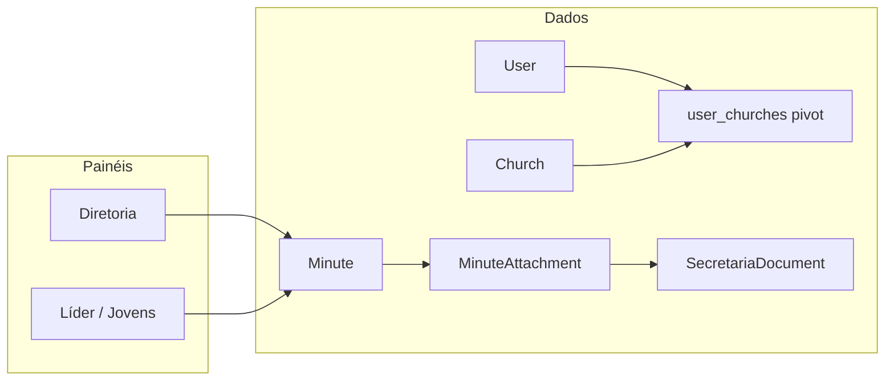

# Upgrade ponta a ponta — Secretaria JUBAF

## Estado atual (resumo)

- **Domínio já existente:** [`Meeting`](c:\laragon\www\JUB\Modules\Secretaria\app\Models\Meeting.php), [`Minute`](c:\laragon\www\JUB\Modules\Secretaria\app\Models\Minute.php) (com `church_id` opcional, fluxo `draft` → `pending_approval` → `approved` → `published` + PDF via [`MinuteController::pdf`](c:\laragon\www\JUB\Modules\Secretaria\app\Http\Controllers\Diretoria\MinuteController.php)), [`Convocation`](c:\laragon\www\JUB\Modules\Secretaria\app\Models\Convocation.php), [`SecretariaDocument`](c:\laragon\www\JUB\Modules\Secretaria\app\Models\SecretariaDocument.php) (arquivo separado com `visibility`).
- **Painéis:** Diretoria em [`Modules/Secretaria/routes/diretoria.php`](c:\laragon\www\JUB\Modules\Secretaria\routes\diretoria.php); leitura Líder/Jovens em [`SecretariaLeituraController`](c:\laragon\www\JUB\Modules\Secretaria\app\Http\Controllers\Operacional\SecretariaLeituraController.php) + [`routes/painel-operacional.php`](c:\laragon\www\JUB\Modules\Secretaria\routes\painel-operacional.php); integração **Notificações** em [`SecretariaNotificationDispatcher`](c:\laragon\www\JUB\Modules\Secretaria\app\Services\SecretariaNotificationDispatcher.php).
- **Permissões:** Spatie em [`RolesPermissionsSeeder`](c:\laragon\www\JUB\database\seeders\RolesPermissionsSeeder.php) — secretários têm Secretaria completa exceto `approve`/`publish` de atas/convocatórias (reservado a quem tem essas permissões, tipicamente presidente/vices); líder/jovens têm só `view` em atas/convocatórias/documentos.
- **Igreja no utilizador:** apenas [`User::$church_id`](c:\laragon\www\JUB\app\Models\User.php); o comentário no seeder e o [PLANOJUBAF](c:\laragon\www\JUB\PLANOJUBAF\Plano1-Estrutura.md) apontam para **supervisão/vínculo com igrejas** ainda incompleto para `pastor` e para cenários multi-igreja.

## Lacunas principais a endereçar

1. **Anexos de atas / documentos anteriores:** `Minute` só tem `body` HTML; não há relação com ficheiros nem “ata anterior” como referência. [`_form.blade.php`](c:\laragon\www\JUB\Modules\Secretaria\resources\views\paineldiretoria\minutes_form.blade.php) usa `meeting_id` como número cru (UX frágil).
2. **Sem filtro territorial no painel operacional:** publicados são listados globalmente; não há `whereIn` por igrejas do utilizador (diferente de [`CongregacaoController`](c:\laragon\www\JUB\Modules\Igrejas\app\Http\Controllers\PainelLider\CongregacaoController.php), que já usa `church_id`).
3. **Uma igreja por utilizador:** impede “perfil completo” com várias congregações para um Líder ou Pastor; [`UserController`](c:\laragon\www\JUB\app\Http\Controllers\Admin\UserController.php) só normaliza um `church_id`.
4. **Integrações declaradas mas não implementadas:** [`Modules/Secretaria/config/config.php`](c:\laragon\www\JUB\Modules\Secretaria\config\config.php) menciona Avisos/Blog/Calendário/Financeiro — hoje só `notificacoes_on_publish`.
5. **UI/executivo:** dashboard diretoria é útil mas pode concentrar **fila de aprovação**, atalhos por papel, e formulários mais ricos (select de reunião, editor, templates).

## Arquitetura proposta (alto nível)

- **Pivot `user_churches`:** `user_id`, `church_id`, opcional `role_on_church` (ex.: `lider`, `pastor`, `unijovem`) para suportar várias igrejas e o caso “pastor com supervisão”.
- **Anexos:** tabela `secretaria_minute_attachments` (ou polimórfica reutilizável) com `minute_id`, caminho/mime/nome, `kind` (`ata_anterior`, `anexo`, `oficio`), `sort_order`; opcionalmente `related_minute_id` para referência explícita a ata anterior **sem duplicar** conteúdo.
- **Templates:** tabela `secretaria_minute_templates` (`slug`, `title`, `body`, `is_active`) + seed com 3–5 modelos (assembleia ordinária, extraordinária, reunião de conselho, ata resumida) consumidos no create/edit da ata.

## Fases de implementação

### Fase 1 — Modelo e políticas (fundação)

- Migrações: `user_churches`; `secretaria_minute_attachments`; `secretaria_minute_templates` (se não preferirem só ficheiros Blade estáticos — DB permite gestão futura no admin).
- **User:** `churches()` `belongsToMany` + manter `church_id` como “igreja principal” para compatibilidade com código existente (ex.: [`CongregacaoController`](c:\laragon\www\JUB\Modules\Igrejas\app\Http\Controllers\PainelLider\CongregacaoController.php)); sincronizar pivot quando `church_id` mudar no admin, ou documentar que a principal deve estar no pivot.
- **Policies:** estender [`MinutePolicy`](c:\laragon\www\JUB\Modules\Secretaria\app\Policies\MinutePolicy.php) / [`SecretariaDocumentPolicy`](c:\laragon\www\JUB\Modules\Secretaria\app\Policies\SecretariaDocumentPolicy.php) para:
  - utilizadores operacionais: ver apenas atas **publicadas** cuja `church_id` é `null` (nivel federação) **ou** está nas igrejas do pivot **ou** igreja principal;
  - documentos: respeitar `visibility` **e** o mesmo critério territorial quando `church_id` estiver preenchido.
- **Admin utilizadores:** em [`UserController`](c:\laragon\www\JUB\app\Http\Controllers\Admin\UserController.php) + views/serviço correspondente, UI multi-select de igrejas para papéis `lider` / `pastor` (e opcionalmente `jovens` se fizer sentido manter uma única igreja “de cadastro”).

### Fase 2 — Secretaria: anexos, templates e UX diretoria

- **MinuteController** (Diretoria + Admin que estende base): validação e persistência de anexos (upload para o mesmo disco que [`DocumentController`](c:\laragon\www\JUB\Modules\Secretaria\app\Http\Controllers\Diretoria\DocumentController.php)), listagem na `show`, inclusão opcional no PDF [`minute-pdf.blade.php`](c:\laragon\www\JUB\Modules\Secretaria\resources\views\components\minute-pdf.blade.php).
- Substituir `meeting_id` numérico no formulário por **select** de reuniões recentes (query com `Meeting::orderByDesc('starts_at')->limit(...)`).
- **Editor:** avaliar componente já usado no projeto (ex.: Trix/Livewire); se não houver, textarea + preview ou integração leve — seguir [tailwindcss-development](c:\laragon\www\JUB.cursor\skills\tailwindcss-development\SKILL.md) e padrões Flowbite das outras vistas do painel.
- **Dashboard diretoria** [`SecretariaDashboardController`](c:\laragon\www\JUB\Modules\Secretaria\app\Http\Controllers\Diretoria\SecretariaDashboardController.php): blocos “Aprovar atas”, “Aprovar convocatórias”, “Reuniões esta semana”, ligações rápidas para presidente/vices conforme `JubafRoleRegistry::directorateExecutiveRoleNames()` em [`config/jubaf_roles.php`](c:\laragon\www\JUB\config\jubaf_roles.php).
- **Subnav / layout:** evoluir [`partials/subnav.blade.php`](c:\laragon\www\JUB\Modules\Secretaria\resources\views\paineldiretoria\partials\subnav.blade.php) e cards do dashboard com hierarquia visual clara (agrupar Reuniões + Atas + Convocatórias + Arquivo).

### Fase 3 — Painéis Líder / Jovens e notificações

- Ajustar queries em [`SecretariaLeituraController`](c:\laragon\www\JUB\Modules\Secretaria\app\Http\Controllers\Operacional\SecretariaLeituraController.php) com scope reutilizável (ex.: `Minute::visibleToUser($user)`).
- **Dispatcher:** em [`SecretariaNotificationDispatcher`](c:\laragon\www\JUB\Modules\Secretaria\app\Services\SecretariaNotificationDispatcher.php), opcionalmente filtrar destinatários `lider` por igreja quando a ata tiver `church_id` (menos ruído).
- Garantir rotas `lideres.secretaria.*` / `jovens.secretaria.*` alinhadas com as novas políticas (403 coerente).

### Fase 4 — Integrações transversais (feature flags em config)

- Estender [`Modules/Secretaria/config/config.php`](c:\laragon\www\JUB\Modules\Secretaria\config\config.php) com flags por módulo, por exemplo:
  - **Calendário:** ao criar/editar `Meeting` com datas, criar/atualizar evento (se existir API interna no módulo Calendario).
  - **Avisos:** post automático ou rascunho ao publicar ata/convocatória (só com permissão e template curto).
  - **Homepage / público:** secção ou link destacado a partir de [`PublicSecretariaController`](c:\laragon\www\JUB\Modules\Secretaria\app\Http\Controllers\PublicSecretariaController.php) (já lista atas públicas).
- Implementar através de **listeners** ou serviço único `SecretariaIntegrationBus` para não acoplar controladores a cada módulo (alinhado a [laravel-best-practices](c:\laragon\www\JUB.cursor\skills\laravel-best-practices\SKILL.md): jobs em fila para I/O externo, transações curtas nos controladores).

### Fase 5 — Polimento e ícones

- Onde houver representação de módulo em menus/heroes, seguir [jubaf-module-icons](c:\laragon\www\JUB.cursor\skills\jubaf-module-icons\SKILL.md) (`x-module-icon` para Secretaria).

## Riscos e decisões

- **Compatibilidade:** manter `church_id` na `users` evita quebrar [`CongregacaoController`](c:\laragon\www\JUB\Modules\Igrejas\app\Http\Controllers\PainelLider\CongregacaoController.php) e queries `where('church_id', ...)` até migrarem tudo para o pivot; após pivot, considerar deprecar gradualmente ou preencher pivot a partir do legado num comando de migração de dados.
- **Pastor vs “Jovens Pastores”:** tratar como papel `pastor` + igrejas no pivot; se no vosso vocabulário for papel distinto, adicionar slug em `jubaf_roles` e permissões espelhadas — isso altera o seeder e deve ser decidido antes da Fase 1.
- **Âmbito:** as integrações da Fase 4 devem ser ativadas uma a uma para não inflar o primeiro PR.

## Ficheiros centrais a tocar (referência)

| Área                | Ficheiros                                                                                                                |
| ------------------- | ------------------------------------------------------------------------------------------------------------------------ |
| Migrações / modelos | `database/migrations/*`, [`User.php`](c:\laragon\www\JUB\app\Models\User.php), `Modules/Secretaria/App/Models/*`         |
| Políticas / queries | `MinutePolicy`, `SecretariaDocumentPolicy`, `SecretariaLeituraController`                                                |
| UI diretoria        | `Modules/Secretaria/resources/views/paineldiretoria/**`, `admin/**`                                                      |
| Admin users         | [`UserController`](c:\laragon\www\JUB\app\Http\Controllers\Admin\UserController.php), `UserService`, views de utilizador |
| Config / hooks      | [`Modules/Secretaria/config/config.php`](c:\laragon\www\JUB\Modules\Secretaria\config\config.php), novos listeners       |
