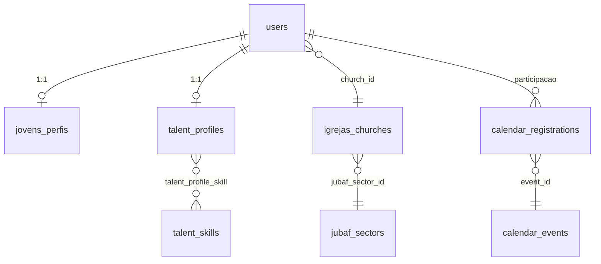

# Plano: Upgrade PainelJovens + integração Talentos (ERP JUBAF)

## Estado atual (âncoras no repositório)

- **Rotas jovens:** [`routes/jovens.php`](c:\laragon\www\JUBAF\routes\jovens.php) — middleware `auth`, `role:jovens`, `jovens.panel`; Talentos montado em `/jovens/talentos/*` via [`Modules/Talentos/routes/talentos-panel.php`](c:\laragon\www\JUBAF\Modules\Talentos\routes\talentos-panel.php).
- **Talentos:** [`TalentProfile`](c:\laragon\www\JUBAF\Modules\Talentos\app\Models\TalentProfile.php) (`user_id`, bio, skills/areas); catálogo [`TalentSkill`](c:\laragon\www\JUBAF\Modules\Talentos\app\Models\TalentSkill.php); pivot `talent_profile_skill` com `level`.
- **Utilizador / igreja:** [`User`](c:\laragon\www\JUBAF\app\Models\User.php) já tem `birth_date`, `church_id`, `jubaf_sector_id`, `photo`, `talentProfile()`. **Não introduzir `igreja_id` em paralelo a `church_id`** — na documentação e no código usar `church_id` (e relação `church()`), alinhado ao domínio existente.
- **Setor geográfico:** [`Church`](c:\laragon\www\JUBAF\Modules\Igrejas\app\Models\Church.php) com `jubaf_sector_id` + campo espelho `sector`; [`JubafSector`](c:\laragon\www\JUBAF\Modules\Igrejas\app\Models\JubafSector.php) para agregações “Norte/Sul/…” sem coordenadas GPS obrigatórias.
- **Calendário:** [`CalendarEvent`](c:\laragon\www\JUBAF\Modules\Calendario\app\Models\CalendarEvent.php) com `is_featured`, `visibility` (incl. `VIS_JOVENS`), `church_id`; participação via [`CalendarRegistration`](c:\laragon\www\JUBAF\Modules\Calendario\app\Models\CalendarRegistration.php) (`user_id`, `event_id`).
- **RBAC:** [`database/seeders/RolesPermissionsSeeder.php`](c:\laragon\www\JUBAF\database\seeders\RolesPermissionsSeeder.php) — roles `jovens`, `lider`, diretoria (`presidente`, `vice-*`, etc.); permissões `talentos.*` e `calendario.*` já existem.
- **Notificações:** [`Modules/Notificacoes/app/Services/NotificacaoService.php`](c:\laragon\www\JUBAF\Modules\Notificacoes\app\Services\NotificacaoService.php) + trait [`SendsNotifications`](c:\laragon\www\JUBAF\Modules\Notificacoes\app\Traits\SendsNotifications.php); não há integração WhatsApp neste módulo hoje — planear **in-app + e-mail** via serviço existente; WhatsApp como extensão futura se houver canal no projeto.

## Decisão de modelagem (evitar duplicação)

| Conceito no requisito          | Implementação recomendada                                                                                                                                                                                                                                                                 |
| ------------------------------ | ----------------------------------------------------------------------------------------------------------------------------------------------------------------------------------------------------------------------------------------------------------------------------------------- |
| Tabela `talentos` (catálogo)   | **Reutilizar** `talent_skills` (e áreas `talent_areas` se fizer sentido). Seed inicial de nomes (Música, Pregação, Fotografia, etc.) em [`TalentosDatabaseSeeder`](c:\laragon\www\JUBAF\Modules\Talentos\database\seeders\TalentosDatabaseSeeder.php) ou novo seeder chamado pelo módulo. |
| Tabela `jovem_talento` (pivot) | **Estender** `talent_profile_skill`: colunas de validação e portfólio (ex.: `validated_at`, `validated_by`, `portfolio_url` ou JSON `links`), em vez de criar um segundo pivot paralelo.                                                                                                  |
| `jovens_perfis`                | **Nova tabela** `jovens_perfis` 1:1 com `users.id` para campos que **não** devem ir para `users` (evitar poluir o núcleo): estado civil, profissão, redes sociais (JSON), eventual `bio_curta` específica do censo. **Não** repetir data de nascimento: usar `users.birth_date`.          |

Se no futuro for obrigatório renomear tabelas para `talentos` / `jovem_talento`, tratar como **migração de renomeação** com downtime planejado — fora do MVP.

## 1. Camada de dados (migrations)

- **PainelJovens:** criar pasta `Modules/PainelJovens/database/migrations/` (o [`PainelJovensServiceProvider`](c:\laragon\www\JUBAF\Modules\PainelJovens\app\Providers\PainelJovensServiceProvider.php) já faz `loadMigrationsFrom` neste caminho).
    - Migration `jovens_perfis`: `user_id` (unique FK), `marital_status`, `profession`, `social_links` (JSON), timestamps; índices para relatórios (ex.: `user_id`).
- **Talentos:** migration em `Modules/Talentos/database/migrations/` para alterar `talent_profile_skill`: adicionar colunas de validação e links; índice composto útil para radar (`talent_skill_id`, validação).

## 2. Models e relações

- Novo model `Modules\PainelJovens\App\Models\JovemPerfil` com `belongsTo(User)` e inverso em `User` (`jovemPerfil()`), sem duplicar `church` (sempre via `User` ou join).
- Atualizar [`TalentProfile`](c:\laragon\www\JUBAF\Modules\Talentos\app\Models\TalentProfile.php) / sync de skills para expor pivot estendido (`withPivot(...)`).
- Opcional: accessor no perfil que expõe “talentos validados” vs “pendentes” para a UI.

## 3. Serviços de negócio

- **`CensoService`** (ex.: `Modules/PainelJovens/app/Services/CensoService.php`):
    - Agregações por `jubaf_sector_id` (via `users.church` → `churches.jubaf_sector_id`): contagem de jovens (role `jovens`), faixas etárias a partir de `users.birth_date`, médias (ex.: idade média por setor).
    - “Talentos mais comuns”: `GROUP BY talent_skill_id` em perfis pesquisáveis e/ou validados (definir regra de negócio única).
- **`BancoTalentosSearchService`** (ou expandir [`DirectoryController`](c:\laragon\www\JUBAF\Modules\Talentos\app\Http\Controllers\Diretoria\DirectoryController.php)): filtros “competência + setor” reutilizando joins `users` ↔ `churches` ↔ `jubaf_sectors`; respeitar [`TalentProfilePolicy`](c:\laragon\www\JUBAF\Modules\Talentos\app\Policies\TalentProfilePolicy.php) e escopo de vice por setor (`User::restrictsChurchDirectoryToSector()`).

## 4. Integração Calendário (histórico e destaque)

- **Histórico de participação:** consultar `calendar_registrations` onde `user_id` = jovem autenticado, com `event` eager-loaded; expor no dashboard ou página “Engajamento” (PainelJovens).
- **Destaque no painel:** query de eventos futuros com `visibility` adequada a jovens, `status` publicado, priorizando `is_featured = true` e opcionalmente filtro regional (metadata/`church_id`/`jubaf_sector_id` conforme regra definida). Injetar dados em [`DashboardController`](c:\laragon\www\JUBAF\Modules\PainelJovens\app\Http\Controllers\DashboardController.php) e [`dashboard.blade.php`](c:\laragon\www\JUBAF\Modules\PainelJovens\resources\views\dashboard.blade.php).

## 5. RBAC (Spatie) e políticas

- Novas permissões sugeridas (nomes alinhados ao padrão `modulo.acao`):
    - `paineljovens.census.view` — diretoria (radar/censo).
    - `paineljovens.talentos.validate` — líder: validar talentos da própria igreja.
    - Opcional: `paineljovens.dashboard.metrics` para métricas locais do líder.
- Atualizar [`RolesPermissionsSeeder`](c:\laragon\www\JUBAF\database\seeders\RolesPermissionsSeeder.php): atribuir a `lider` (validação + métricas locais), a roles de diretoria o censo/radar (ou consolidar em permissões `talentos.*` existentes se preferir menos granularidade — **decisão:** preferir novas permissões para não diluir `talentos.directory.view` para todos os líderes).
- **Policies:** estender [`TalentProfilePolicy`](c:\laragon\www\JUBAF\Modules\Talentos\app\Policies\TalentProfilePolicy.php) ou criar policy específica para “validar talento” garantindo que o líder só altere jovens com `church_id` (ou `affiliatedChurchIds()`) na sua congregação.

## 6. Controllers e rotas

- **Jovens:** estender [`ProfileController`](c:\laragon\www\JUBAF\Modules\PainelJovens\app\Http\Controllers\ProfileController.php) + Form Request para CRUD de `JovemPerfil` (redes sociais, estado civil, profissão). Manter fluxo sensível existente (`DataChangeRequestController`).
- **Líder:** novas rotas em [`routes/lideres.php`](c:\laragon\www\JUBAF\routes\lideres.php) (ou arquivo dedicado `routes/painel-jovens-lider.php` incluído aí): listagem de talentos pendentes por igreja, POST para validar; controlador no módulo PainelJovens ou Talentos (onde já existe domínio de perfil — **recomendação:** Talentos para regras de competência, PainelJovens para layout “juventude” se quiser separação visual).
- **Diretoria:** nova rota sob [`routes/diretoria.php`](c:\laragon\www\JUBAF\routes\diretoria.php) (prefixo existente) para “Radar / Censo”: página que consome `CensoService` + filtros do `BancoTalentosSearchService`. Pode conviver com [`Talentos/routes/diretoria.php`](c:\laragon\www\JUBAF\Modules\Talentos\routes\diretoria.php) como sub-rota `talentos/censo` ou módulo PainelDiretoria se quiser um único hub — **recomendação:** `talentos/censo` + link no subnav do Talentos para consistência.

## 7. UI/UX (Blade, Tailwind v4, Flowbite v4)

- **Mobile-first:** basear em [`resources/views/components/layouts/app.blade.php`](c:\laragon\www\JUBAF\Modules\PainelJovens\resources\views\components\layouts\app.blade.php), sidebar/navbar existentes; cards estilo “app” para hero, badges de talentos (Flowbite Badge + ícones do projeto).
- **Perfil / portfólio:** unificar narrativa: secção “Censo” (dados em `jovens_perfis`) + atalho para [`talentos::paineljovens.inscription`](c:\laragon\www\JUBAF\Modules\Talentos\resources\views\paineljovens\inscription.blade.php) ou incorporar resumo no mesmo ecrã com componentes reutilizáveis.
- **Diretoria — visão censo:** gráficos por setor (barras/“heatmap” de intensidade por setor sem mapa GIS — usar contagens por `jubaf_sector_id`; se mais tarde houver coordenadas nas igrejas, evoluir para mapa). Biblioteca: alinhar ao que já usa o projeto (Livewire/charts ou Chart.js via Vite do módulo).

## 8. Eventos e notificações

- Disparar evento de domínio (ex.: `TalentSkillValidated`) ao gravar `validated_at` no pivot; listener que chama `NotificacaoService::sendToUser` ao jovem, `moduleSource` = `PainelJovens` ou `Talentos`, `panel` = `jovens` quando suportado.
- Documentar no [`docs/erp-events-catalog.md`](c:\laragon\www\JUBAF\docs\erp-events-catalog.md) a nova linha (opcional: evento Calendário “evento destacado criado” se for notificar em massa — avaliar volume).

## 9. Testes

- Feature tests seguindo o padrão de [`tests/Feature/Modules/FinanceCalendarTalentosTest.php`](c:\laragon\www\JUBAF\tests\Feature\Modules\FinanceCalendarTalentosTest.php): jovem atualiza perfil; líder valida talento (403 fora da igreja); diretoria vê censo com permissão.

## Ordem de implementação sugerida

1. Migrations (`jovens_perfis` + pivot) + models + factory mínima.
2. `CensoService` + testes de agregação.
3. Fluxo validação líder + evento + notificação.
4. RBAC + policies + rotas.
5. UI dashboard jovens (destaques calendário + resumo perfil) e telas diretoria/líder.
6. Ajuste seeders e documentação de eventos.
