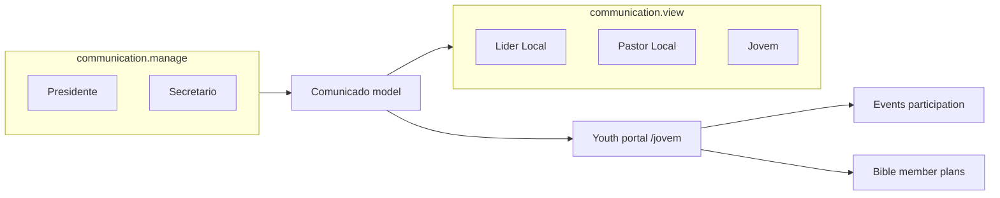

# Plano: módulos Youth e Communication — ponta a ponta

## Diagnóstico do estado atual

| Área                                                                | Situação                                                                                                                                                                                                                                                                                                                                                                                                                                     |
| ------------------------------------------------------------------- | -------------------------------------------------------------------------------------------------------------------------------------------------------------------------------------------------------------------------------------------------------------------------------------------------------------------------------------------------------------------------------------------------------------------------------------------- |
| [Modules/Youth](c:\laragon\www\JUBAF\Modules\Youth)                 | Stub: `YouthController` resource, [routes/web.php](c:\laragon\www\JUBAF\Modules\Youth\routes\web.php) expõe `/youths` com métodos vazios; faltam views `create`/`show`/`edit`.                                                                                                                                                                                                                                                               |
| Portal `/jovem`                                                     | Definido em [bootstrap/app.php](c:\laragon\www\JUBAF\bootstrap\app.php) + [routes/youth.php](c:\laragon\www\JUBAF\routes\youth.php), mas controladores e views estão em **Auth** ([YouthDashboardController](c:\laragon\www\JUBAF\Modules\Auth\app\Http\Controllers\Youth\YouthDashboardController.php), [YouthProfileController](c:\laragon\www\JUBAF\Modules\Auth\app\Http\Controllers\Youth\YouthProfileController.php), `auth::jovem.`). |
| [Modules/Communication](c:\laragon\www\JUBAF\Modules\Communication) | Stub idêntico; sem migrações, modelos nem integração.                                                                                                                                                                                                                                                                                                                                                                                        |
| Permissões                                                          | [JubafRolesAndPermissionsSeeder](c:\laragon\www\JUBAF\Modules\Auth\database\seeders\JubafRolesAndPermissionsSeeder.php) já define `communication.manage` / `communication.view`; **Secretário** só tem `communication.view` — para “comunicados oficiais” convém acrescentar `communication.manage` ao Secretário.                                                                                                                           |
| Referência de módulo “completo”                                     | [Modules/Events](c:\laragon\www\JUBAF\Modules\Events): modelos, policies, requests, views, factories, testes; [routes/web.php](c:\laragon\www\JUBAF\Modules\Events\routes\web.php) vazio e rotas reais em [routes/events.php](c:\laragon\www\JUBAF\routes\events.php) registadas no `bootstrap`.                                                                                                                                             |

Requisitos de negócio (resumo): [PLANOJUBAF/Plano2-Estrutura.md](c:\laragon\www\JUBAF\PLANOJUBAF\Plano2-Estrutura.md) — **Youth**: materiais, comunicados, mural de eventos; **Communication**: e-mails/notificações e apoio a prazos de convocação.

---

## Parte A — Módulo Youth (portal completo e coerente)

### A1. Rotas e alinhamento com Events

- Manter URLs e **nomes de rota** `jovem.` (já usados em [PostLoginRedirect](c:\laragon\www\JUBAF\Modules\Auth\app\Support\PostLoginRedirect.php), testes e navbar) para não quebrar links.
- Em [routes/youth.php](c:\laragon\www\JUBAF\routes\youth.php), apontar para controladores em `Modules\Youth\Http\Controllers\Portal\...` (ou nome equivalente já usado no projeto).
- **Limpar** [Modules/Youth/routes/web.php](c:\laragon\www\JUBAF\Modules\Youth\routes\web.php) como em Events (apenas comentário), para **não** registar `/youths` em duplicado.

### A2. Mover portal de Auth para Youth

- Implementar no Youth:
    - Dashboard (substitui invocável atual): agregar dados reais — últimos **comunicados** visíveis ao utilizador (serviço partilhado ou query ao modelo do Communication), **eventos** abertos relevantes (`Event` com mesma lógica de visibilidade que [EventParticipationController](c:\laragon\www\JUBAF\Modules\Events\app\Http\Controllers\EventParticipationController.php) / policy), atalhos para [planos de leitura](c:\laragon\www\JUBAF\Modules\Bible\routes\web.php) (`member.bible.plans.`) e leitor público da Bíblia se fizer sentido.
    - Perfil: mover views de `auth::jovem.perfil.`_ para `youth::portal.perfil.`_; reutilizar [UpdateSelfProfileRequest](c:\laragon\www\JUBAF\Modules\Auth\app\Http\Requests\Youth\UpdateSelfProfileRequest.php) e modelo/policy `YouthProfile` em Auth (sem duplicar domínio de utilizador).
- Layout: continuar a estender `auth::layouts.panel` **ou** extrair um layout mínimo partilhado — preferir o padrão já usado para não divergir do design system.

### A3. Navegação do portal

- Atualizar `@section('nav-brand')` do dashboard/perfil: ligações para **Comunicados** (lista filtrada com `communication.view`), **Eventos** (`participacao.eventos.` com `@can('events.participate')`), **Bíblia / planos**, **Perfil**, mantendo Tailwind/Flowbite e dark mode como no resto da app.

### A4. Testes e limpeza

- Ajustar [tests/Feature/Auth/AuthPanelsTest.php](c:\laragon\www\JUBAF\tests\Feature\Auth\AuthPanelsTest.php) (ou criar `tests/Feature/Youth/YouthPortalTest.php`) para os novos controladores e conteúdo do dashboard.
- Remover controladores/views órfãos em Auth apenas depois de redirecionar referências (grep por `YouthDashboardController`, `auth::jovem`).

---

## Parte B — Módulo Communication (comunicados oficiais)

### B1. Modelo de dados

- Migração(ões) no módulo, por exemplo:
    - `comunicados` (ou nome alinhado ao domínio em PT nas labels UI): `author_id`, `title`, `body` (texto; HTML só se houver sanitização explícita), `audience` (enum: ex. `todos`, `igrejas`, `papeis`), `church_ids` (JSON nullable), `role_names` (JSON nullable, alinhado a Spatie), `published_at` (nullable até publicar), `is_pinned`, `send_email_on_publish`, `email_dispatched_at` (nullable), timestamps.
    - Opcional: tabela `comunicado_reads` (`comunicado_id`, `user_id`, `read_at`) para “marcar como lido” no mural; ou usar canal `database` do Laravel Notifications — **recomendação**: tabela `notifications` padrão Laravel + notificação `ComunicadoPublicado` para in-app, e e-mail via `mail` no mesmo notification; publicar migração `notifications` se ainda não existir no projeto (grep atual: ausente em `database/migrations`).

### B2. Painel de gestão

- Novo ficheiro de rotas na raiz, ex. [routes/communication.php](c:\laragon\www\JUBAF\routes\communication.php), registado em [bootstrap/app.php](c:\laragon\www\JUBAF\bootstrap\app.php):
    - Prefixo `painel/comunicacao`, nome `painel.comunicacao.`, middleware `auth` + `permission:communication.manage`.
    - CRUD + ação **Publicar** (define `published_at`, dispara job/notificação em fila).
- Form Requests, Policy (`view`, `update`, `delete` para autor + Presidente/Secretário conforme regra), e views Blade com o mesmo padrão visual dos painéis [Events](c:\laragon\www\JUBAF\Modules\Events\resources\views\panel) / [Secretariat](c:\laragon\www\JUBAF\Modules\Secretariat\resources\views).

### B3. Consumo (communication.view)

- Rotas dedicadas, ex. prefixo `comunicados`, nome `comunicados.`, `auth` + `permission:communication.view`:
    - `index` com filtros (lidos/não lidos, pesquisa), `show`.
- Serviço tipo `ComunicadoAudienceResolver` (ou scopes no modelo) que filtra por: `todos`; `church_ids` contém `auth()->user()->church_id`; `role_names` intersecta papéis do utilizador.

### B4. Integração e envio

- **E-mail**: classe `Notification` que implementa `toMail` + `toDatabase`; envio em `ShouldQueue` após publicação quando `send_email_on_publish`.
- **Integração Youth**: dashboard consome os N últimos comunicados visíveis; link “ver todos” para `comunicados.index`.
- **Integração LocalChurch / Pastor**: incluir bloco ou link nos dashboards [lider.dashboard](c:\laragon\www\JUBAF\Modules\LocalChurch\resources\views\lider\dashboard.blade.php) / pastor equivalente para comunicados recentes (mesma query reutilizável).
- **Integração Board / prazos**: fase 1 — documentar e, se já existir fluxo de reuniões, **gancho opcional** (observer ou chamada manual “Criar comunicado a partir da reunião”) sem bloquear o MVP; não obrigar SMS/push no primeiro ciclo (Plano2 menciona — deixar interface/extensão preparada com `channel` futuro ou comentário no README).

### B5. Módulo nwidart

- Esvaziar [Modules/Communication/routes/web.php](c:\laragon\www\JUBAF\Modules\Communication\routes\web.php) (como Events); API em [routes/api.php](c:\laragon\www\JUBAF\Modules\Communication\routes\api.php) só se houver necessidade real — caso contrário comentar/remover resource que aponta para stub.

### B6. Permissões e menu

- Atualizar seeder: Secretário com `communication.manage` (e manter `communication.view`).
- [PostLoginRedirect](c:\laragon\www\JUBAF\Modules\Auth\app\Support\PostLoginRedirect.php): para utilizadores com `communication.manage` e sem painel “mais prioritário”, redirecionar para o dashboard do novo painel (definir prioridade relativamente a secretaria/diretoria — tipicamente Secretário entra na secretaria; Presidente pode ter atalho Comunicação no menu secundário ou item extra no `navbarPanel` se aplicável).

### B7. Testes

- Feature tests: criar rascunho, publicar, utilizador Jovem vê apenas audiências permitidas, outro `church_id` não vê comunicado restrito, `communication.manage` obrigatório no painel, fila de e-mail fake (`Mail::fake` / `Notification::fake`).

---

## Parte C — Documentação na raiz dos módulos

- [Modules/Youth/README.md](c:\laragon\www\JUBAF\Modules\Youth\README.md): objetivo do módulo, rotas `jovem.`, dependências (Auth/YouthProfile, Communication, Events, Bible), permissões relevantes (`events.participate`, `communication.view`), como correr testes que o tocam.
- [Modules/Communication/README.md](c:\laragon\www\JUBAF\Modules\Communication\README.md): modelo de audiência, fluxo publicar → notificação, rotas `painel.comunicacao.`_ e `comunicados.`_, configuração de mail/queue, integrações com Youth e outros painéis.

_(Transversal: entrada em [CHANGLOG.md](c:\laragon\www\JUBAF\CHANGLOG.md) quando a convenção de rotas/módulos mudar.)_

---

## Parte D — Qualidade e convenções

- `vendor/bin/pint --dirty` em ficheiros PHP alterados.
- Ícones de módulo: já existem `youth` e `communication` em [config/module_icons.php](c:\laragon\www\JUBAF\config\module_icons.md); usar `<x-module-icon>` onde a UI representar o módulo (atalhos/painel), conforme [docs/module-icons.md](c:\laragon\www\JUBAF\docs\module-icons.md).
- Garantir `@source` em [resources/css/app.css](c:\laragon\www\JUBAF\resources\css\app.css) se novas classes aparecerem só em paths novos (normalmente `Modules/` já cobre).

---

## Ordem de execução sugerida

1. Communication: migrações, modelo, policy, resolver de audiência, painel + rotas públicas autenticadas, notificações, testes.
2. Youth: esvaziar rotas do módulo, mover portal, enriquecer dashboard com dados Communication + Events + links Bible, testes.
3. Integrações transversais (LocalChurch dashboards, seeder, PostLoginRedirect fino), READMEs, CHANGLOG, Pint.
