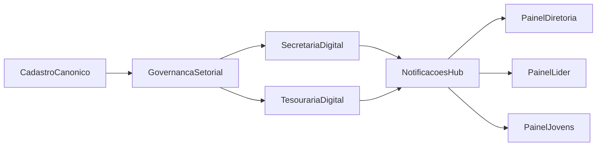

# Plano ERP Eclesiástico JUBAF (Rebuild Planejado)

## Contexto Técnico Validado do Projeto

- Backend atual: `laravel/framework:^12.0` e `php:^8.2` em [`c:/laragon/www/JUBAF/composer.json`](../.cursor/plans/c:/laragon/www/JUBAF/composer.json).
- Modularização atual: `nwidart/laravel-modules:^12.0` em [`c:/laragon/www/JUBAF/composer.json`](../.cursor/plans/c:/laragon/www/JUBAF/composer.json) e configuração em [`c:/laragon/www/JUBAF/config/modules.php`](../.cursor/plans/c:/laragon/www/JUBAF/config/modules.php).
- Frontend atual: `tailwindcss:^4.2.0` + `@tailwindcss/vite:^4.2.0` em [`c:/laragon/www/JUBAF/package.json`](../.cursor/plans/c:/laragon/www/JUBAF/package.json), com plugin ativo em [`c:/laragon/www/JUBAF/vite.config.js`](../.cursor/plans/c:/laragon/www/JUBAF/vite.config.js).
- Bootstrap Laravel 12: roteamento e middleware centralizados em [`c:/laragon/www/JUBAF/bootstrap/app.php`](../.cursor/plans/c:/laragon/www/JUBAF/bootstrap/app.php) (sem dependência de `app/Console/Kernel.php` no estado atual).

## Objetivo Estratégico

Transformar o JUBAF em um ERP eclesiástico integrado para aproximadamente 70 igrejas, priorizando:
- cadastro canônico único;
- setorização por vice-presidência;
- secretaria profissional;
- tesouraria transparente;
- integração entre módulos sem depender obrigatoriamente de serviços externos.

## Restrições Não-Negociáveis (Hospedagem Compartilhada)

- Sem exigir Redis/Horizon/WebSocket externo para funcionamento básico.
- Fila padrão com `database` e fallback síncrono quando necessário.
- Notificações operando por polling quando broadcast em tempo real não estiver disponível.
- Jobs e rotinas críticas executáveis por cron padrão (`schedule:run`) sem infraestrutura dedicada.

## Diagnóstico Atual (baseado no código)

- O projeto possui módulos maduros de funcionalidades (ex.: `Bible`, `Avisos`, `Notificacoes`, `Chat`) e módulos de governança a consolidar (`Igrejas`, `Financeiro`, `Secretaria`, `Permisao`, painéis).
- Boa parte da integração atual ocorre por chamadas diretas e gates `module_enabled`, com poucos fluxos formais de eventos de negócio.
- Painéis (`PainelDiretoria`, `PainelLider`, `PainelJovens`) estão mais como camada de experiência; o fortalecimento deve acontecer no núcleo de dados e regras.
- O arquivo [`c:/laragon/www/JUBAF/update_projeto/1.md`](../.cursor/plans/c:/laragon/www/JUBAF/update_projeto/1.md) traz boas ideias de produto, mas precisa ser filtrado para o cenário real do stack e da hospedagem.

## Arquitetura-Alvo ERP (v2)

## Macroescopo Funcional (ERP JUBAF)

- Cadastro ativo de igrejas, pastores, líderes e jovens com vínculo organizacional.
- Gestão setorial por vice-presidência (igreja vinculada a setor, com visão e ação por escopo).
- Secretaria digital para atas, ofícios, protocolos, acervo e histórico.
- Tesouraria com plano de contas, cotas associativas, prestação de contas e relatórios.
- Agenda institucional conectada com comunicação e notificações.
- Painéis por perfil (Super Admin, Diretoria, Líder, Jovens) com permissões e dados adequados ao nível.

## Roadmap de Rebuild por Fases

## Fase 0 — Blueprint e Governança de Dados

- Definir modelo canônico para `Igreja`, `Setor`, `Pessoa`, `VínculoMinisterial`, `MandatoSetorial`.
- Criar catálogo de origem/destino de dados por módulo para migração sem perda.
- Congelar novos campos duplicados nos módulos até aprovação do modelo canônico.
- Definir estratégia de migração em ondas: `backfill`, validação, corte e limpeza.

Arquivos-base:
- [`c:/laragon/www/JUBAF/Modules/Igrejas`](../.cursor/plans/c:/laragon/www/JUBAF/Modules/Igrejas)
- [`c:/laragon/www/JUBAF/Modules/Permisao`](../.cursor/plans/c:/laragon/www/JUBAF/Modules/Permisao)
- [`c:/laragon/www/JUBAF/database/migrations`](../.cursor/plans/c:/laragon/www/JUBAF/database/migrations)
- [`c:/laragon/www/JUBAF/database/seeders/RolesPermissionsSeeder.php`](../.cursor/plans/c:/laragon/www/JUBAF/database/seeders/RolesPermissionsSeeder.php)

## Fase 1 — Prioridade Definida: Cadastro Base + Setorização

- Unificar cadastro de pessoas (jovens, líderes, pastores, diretoria) e igrejas com referência única.
- Modelar setor administrativo e vínculo igreja-setor.
- Implementar escopo de acesso por perfil:
  - Super Admin: visão total.
  - Diretoria: visão associacional.
  - Vice-presidente: somente setor vinculado.
  - Líder local: somente igreja(s) vinculada(s).
- Garantir filtros em consultas, dashboards e exportações por escopo de autorização.

Pontos críticos:
- [`c:/laragon/www/JUBAF/config/jubaf_roles.php`](../.cursor/plans/c:/laragon/www/JUBAF/config/jubaf_roles.php)
- [`c:/laragon/www/JUBAF/app/Support/JubafRoleRegistry.php`](../.cursor/plans/c:/laragon/www/JUBAF/app/Support/JubafRoleRegistry.php)
- [`c:/laragon/www/JUBAF/routes/diretoria.php`](../.cursor/plans/c:/laragon/www/JUBAF/routes/diretoria.php)
- [`c:/laragon/www/JUBAF/routes/lideres.php`](../.cursor/plans/c:/laragon/www/JUBAF/routes/lideres.php)
- [`c:/laragon/www/JUBAF/routes/jovens.php`](../.cursor/plans/c:/laragon/www/JUBAF/routes/jovens.php)

## Fase 2 — Secretaria Profissional (Ata + Acervo + Protocolo)

- Implementar workflow de documentos: rascunho, revisão, aprovado, publicado, arquivado.
- Atas com protocolo, anexos, histórico de alterações e trilha de ação por usuário.
- Vínculo de ata com calendário/reunião e com atos administrativos.
- Publicação com notificação interna para papéis estratégicos.

Arquivos-alvo:
- [`c:/laragon/www/JUBAF/Modules/Secretaria`](../.cursor/plans/c:/laragon/www/JUBAF/Modules/Secretaria)
- [`c:/laragon/www/JUBAF/Modules/Calendario`](../.cursor/plans/c:/laragon/www/JUBAF/Modules/Calendario)
- [`c:/laragon/www/JUBAF/Modules/Notificacoes`](../.cursor/plans/c:/laragon/www/JUBAF/Modules/Notificacoes)

## Fase 3 — Tesouraria e Transparência Financeira

- Consolidar plano de contas e categorias padronizadas.
- Lançamentos vinculáveis a igreja, setor e documento autorizador (ex.: ata/ofício).
- Gestão de cotas associativas por igreja com status e histórico.
- Painel financeiro da diretoria com visão macro e visão por setor.

Arquivos-alvo:
- [`c:/laragon/www/JUBAF/Modules/Financeiro`](../.cursor/plans/c:/laragon/www/JUBAF/Modules/Financeiro)
- [`c:/laragon/www/JUBAF/Modules/Gateway`](../.cursor/plans/c:/laragon/www/JUBAF/Modules/Gateway)
- [`c:/laragon/www/JUBAF/config/queue.php`](../.cursor/plans/c:/laragon/www/JUBAF/config/queue.php)
- [`c:/laragon/www/JUBAF/routes/console.php`](../.cursor/plans/c:/laragon/www/JUBAF/routes/console.php)

## Fase 4 — Integração Intermódulos por Eventos

- Definir eventos canônicos:
  - `ChurchAssignedToSector`
  - `LeaderAssignedToChurch`
  - `MinutePublished`
  - `FinancialObligationGenerated`
  - `FinancialObligationPaid`
- Criar listeners por módulo para reduzir chamadas diretas e acoplamento.
- Centralizar fan-out de comunicação no módulo `Notificacoes`.

Pontos técnicos a evoluir:
- [`c:/laragon/www/JUBAF/Modules/Admin/app/Events/AdminNavigationBuilding.php`](../.cursor/plans/c:/laragon/www/JUBAF/Modules/Admin/app/Events/AdminNavigationBuilding.php)
- [`c:/laragon/www/JUBAF/Modules/Secretaria/app/Services/SecretariaIntegrationBus.php`](../.cursor/plans/c:/laragon/www/JUBAF/Modules/Secretaria/app/Services/SecretariaIntegrationBus.php)
- [`c:/laragon/www/JUBAF/Modules/Igrejas/app/Services/IgrejasIntegrationBus.php`](../.cursor/plans/c:/laragon/www/JUBAF/Modules/Igrejas/app/Services/IgrejasIntegrationBus.php)

## Fase 5 — UI/UX Profissional com Tailwind CSS v4.2

- Padronizar sistema visual de painéis com componentes reutilizáveis.
- Garantir consistência entre dashboards (Diretoria, Líder, Jovens, Admin).
- Aplicar boas práticas Tailwind v4.2 do projeto:
  - manter classes utilitárias atuais do codebase;
  - evitar utilitários removidos de v3;
  - reforçar responsividade e dark mode onde já houver suporte.

Arquivos-alvo:
- [`c:/laragon/www/JUBAF/Modules/Admin/resources/views`](../.cursor/plans/c:/laragon/www/JUBAF/Modules/Admin/resources/views)
- [`c:/laragon/www/JUBAF/Modules/PainelDiretoria/resources/views`](../.cursor/plans/c:/laragon/www/JUBAF/Modules/PainelDiretoria/resources/views)
- [`c:/laragon/www/JUBAF/Modules/PainelLider/resources/views`](../.cursor/plans/c:/laragon/www/JUBAF/Modules/PainelLider/resources/views)
- [`c:/laragon/www/JUBAF/Modules/PainelJovens/resources/views`](../.cursor/plans/c:/laragon/www/JUBAF/Modules/PainelJovens/resources/views)
- [`c:/laragon/www/JUBAF/resources/css`](../.cursor/plans/c:/laragon/www/JUBAF/resources/css)

## Fase 6 — Operação, Qualidade e Segurança

- Cobrir módulos críticos sem testes com suítes mínimas de regressão.
- Padronizar políticas, validações e autorização por escopo setorial.
- Estabelecer trilha de auditoria para ações sensíveis (secretaria, finanças, permissões).
- Publicar runbook de deploy para hospedagem compartilhada:
  - migrações;
  - cron;
  - fila database;
  - fallback de notificações.

Arquivos-chave:
- [`c:/laragon/www/JUBAF/bootstrap/app.php`](../.cursor/plans/c:/laragon/www/JUBAF/bootstrap/app.php)
- [`c:/laragon/www/JUBAF/routes/channels.php`](../.cursor/plans/c:/laragon/www/JUBAF/routes/channels.php)
- [`c:/laragon/www/JUBAF/app/helpers.php`](../.cursor/plans/c:/laragon/www/JUBAF/app/helpers.php)
- [`c:/laragon/www/JUBAF/.env.example`](../.cursor/plans/c:/laragon/www/JUBAF/.env.example)

## Critérios de Aceite por Fase

- Fase 1: uma igreja e uma pessoa possuem identificador canônico único e escopo de acesso funcionando por perfil.
- Fase 2: ata percorre workflow completo com protocolo e rastreabilidade.
- Fase 3: contribuição/cota de igreja pode ser criada, acompanhada e auditada.
- Fase 4: evento de negócio dispara ação útil em outro módulo sem acoplamento direto em controller.
- Fase 5: painéis principais seguem padrão visual consistente e responsivo.
- Fase 6: testes mínimos verdes e runbook reproduzível em hospedagem compartilhada.

## Entregáveis Finais do Rebuild

- Modelo canônico de dados e plano de migração documentado.
- Matriz RBAC setorial aplicada e validada.
- Secretaria digital integrada a agenda e notificações.
- Tesouraria integrada ao cadastro de igrejas e governança documental.
- Catálogo de eventos/listeners entre módulos com cobertura de testes essenciais.
- Guia operacional para produção sem dependências externas obrigatórias.
